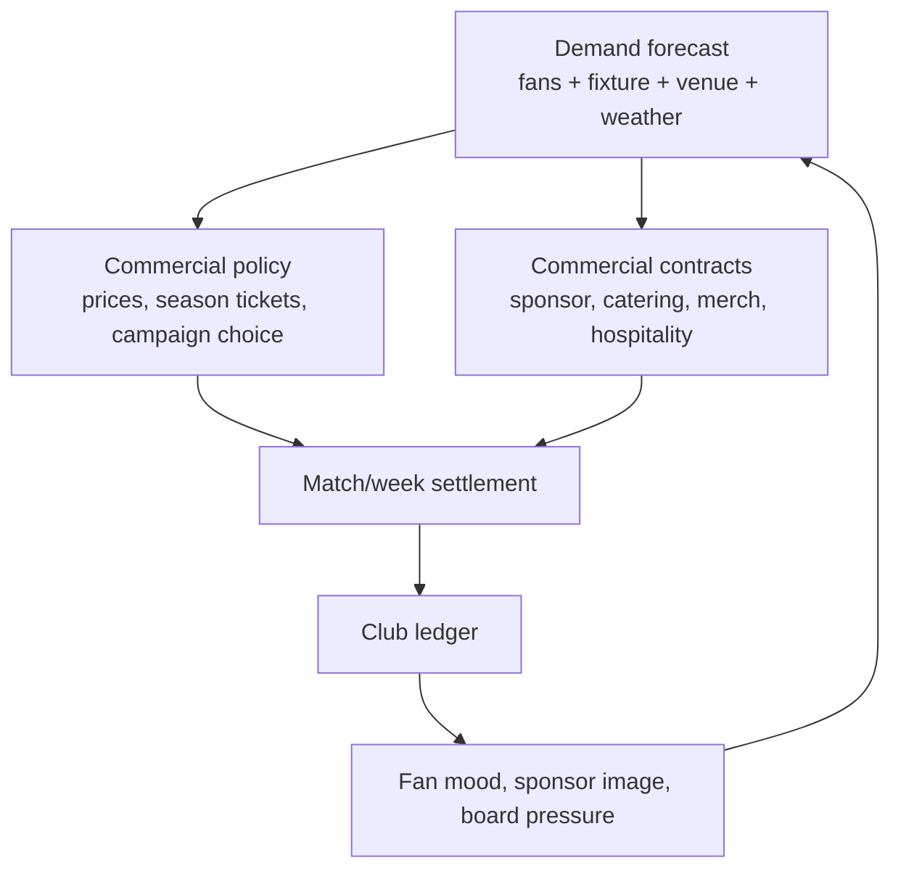

# GD-0022: Economy Commercial Impact and Contracts

## Status

draft

> Draft only. This record captures the FMX-41 commercial economy direction, the
> FMX-42 fan-demand / price-elasticity refinement, the FMX-43 season-ticket
> lifecycle / accrual-accounting refinement and the FMX-44 commercial contract
> lifecycle / breach refinement. It needs Nico approval before implementation
> authority.

## Date

2026-05-28

## Player experience goal

The player should feel that fan culture, opponent appeal, cup runs, stadium
choices, sponsor fit and commercial contracts directly shape club finances. A
new player can make simple choices such as "train, bus or flight for the away
trip"; an expert can inspect the exact assumptions, contract clauses and
ledger effects behind the same decision.

## Decided / strong draft direction

- **Commercial success is causal.** Ticketing, season tickets, catering,
  merchandise, sponsors and fan events are driven by fan segments, fixtures,
  stadium state, rivalry, competition profile and sporting form.
- **Club Management owns settlement.** Other systems expose facts; Club
  Management owns ticketing policy, commercial contracts and ledger posting.
- **Fans are hard economy inputs.** Loyalty, mood, segment mix and volatility
  affect attendance, renewal, per-capita spend, sponsor fit and boycott risk.
- **Ticket demand is latent and segment-specific.** Fan Ecology forecasts latent
  demand before capacity; Club Management applies ticketing policy, seat
  inventory and season-ticket allocation to derive actual attendance and
  settlement.
- **Season tickets are a lifecycle, not a cash button.** They provide early
  cash and demand stability, but create deferred revenue obligations, discount
  future attendance and reduce top-match upside.
- **Top games and rivals matter.** Rivalries, star opponents, table context and
  cup stakes increase demand, premium-price tolerance, away following,
  catering/merch spikes and security cost.
- **Cup games are economy events.** Each cup match can create gate, catering,
  security, travel, prize, media, sponsor-bonus and fixture-congestion effects.
- **Catering and merchandise need contract options.** Own operation, concession,
  revenue share, guarantees, royalties, licences and partner contracts must be
  modelled as explicit choices with duration and clauses.
- **Commercial contracts have lifecycle and breach state.** Sponsorship,
  catering, merchandise, hospitality, supplier and venue-activation deals share
  one lifecycle shell with family-specific schedules, obligations, exclusivity,
  renewal windows and curable/material/critical breach handling.
- **Fan-service campaigns are paid levers.** Away trains, summer parties,
  family days, choreo support and goal-linked beer campaigns cost money and can
  improve loyalty, atmosphere, sponsor activation and demand.
- **Investor is clean SP cash.** A real-money Investor purchase grants a known
  in-game cash amount in singleplayer only. It creates no debt, no owner
  control, no fan penalty and no competitive advantage. It is still visible in
  the ledger and does not alter weekly economics.
- **Realistic Rails.** The sim should be realistic in cause and consequence,
  but fair through forecasts, warnings, presets, recovery options and tunable
  ranges rather than instant hidden failure.
- **One simulation core, three UI depths.** Quick, Standard and Expert expose
  different detail over the same commercial policies and ledger events.

## Commercial loop



## Ticketing design rules

| Decision | Upside | Risk |
|---|---|---|
| Higher season-ticket share | Early cash, loyalty, stable attendance | Lower top-match upside, discount lock-in |
| Full accrual season-ticket accounting | Honest cash/revenue/liability model | More explanation needed for Quick players |
| Instalment or finance-plan offer | Higher accessibility and renewal conversion | Delayed cash or partner fees / receivable risk |
| Seat-release / utilisation rule | Better atmosphere, fairness and single-ticket availability | Trust loss if too punitive |
| More single-ticket inventory | Better top-game yield and dynamic pricing | More volatility in bad years |
| Top-match surcharge | Captures rival/star/cup demand | Fan-trust loss if overused |
| Bounded dynamic pricing | Better revenue capture under high latent demand | Affordability backlash if opaque |
| Family/community pricing | Segment growth and brand trust | Lower short-term yield |
| Premium/hospitality expansion | High per-capita revenue and sponsor value | Ultras/core alienation if it replaces standing culture |

Minimum policy variables:

- `seasonTicketShareTarget`
- `seasonTicketDiscountBand`
- `seasonTicketLifecyclePolicy`
- `seasonTicketAccountingPolicy`
- `seatRelocationPolicy`
- `memberPresalePolicy`
- `waitlistPolicy`
- `paymentPlanPolicy`
- `useItOrReleasePolicy`
- `groupCompensationPolicy`
- `singleTicketPriceBands`
- `topMatchSurchargePolicy`
- `dynamicPricingMode`
- `pricingTransparencyPolicy`
- `seasonTicketProtectionRule`
- `concessionPolicy`
- `awayAllocationPolicy`
- `familyBlockPolicy`
- `officialExchangePolicy`
- `ticketingTrustGuardrail`

## FMX-43 season-ticket lifecycle and accounting rules

Season tickets are planned as campaigns over fan-group cohorts:

```text
cohort =
  fan_segment
  x seat_class
  x product_package
  x payment_plan
  x loyalty_tier
```

The game does **not** simulate individual supporters. Resale, transfer,
compensation and refund behaviour are aggregate policy effects: utilisation
rate, credit liability pool, renewal trust and waitlist pressure.

Draft lifecycle:

1. `planning` - choose share target, seat-class quotas, packages, discount band
   and payment policies.
2. `renewalWindow` - existing cohorts renew or churn from form, trust, price
   and package value.
3. `seatRelocation` - renewed cohorts can move if inventory allows.
4. `memberPresale` - members / loyalty tiers / protected fan groups buy before
   public sale.
5. `waitlistAllocation` - scarcity is converted into offers and unmet-demand
   pressure.
6. `publicSale` - remaining stock reaches weaker-loyalty buyers.
7. `closed` - allocation and accounting schedule freeze before the season.
8. `inSeasonAdjustment` - no-show, seat-release, compensation and cup add-on
   events update utilisation and liabilities.
9. `renewalReview` - eligibility, trust and waitlist state feed the next
   campaign.

Accounting rule:

- cash received before matches improves runway but becomes deferred revenue /
  contract liability until included matches are played;
- internal instalments create receivables and later cash receipts;
- finance-partner plans can create earlier net cash plus a partner fee instead
  of club-owned credit risk;
- each included home match releases its allocated season-ticket revenue to
  recognised matchday revenue;
- cancelled, inaccessible or relocated included matches post aggregate credit
  or refund liabilities according to `groupCompensationPolicy`;
- cup priority / cup auto-charge rights remain a visible hook, but activation
  depth is a Nico decision for the cup-economy beat.

Quick-mode wording must distinguish **cash now** from **revenue earned as
matches are played**. This is a fairness rule: players may use early liquidity,
but they must see the future obligation and lost single-ticket upside.

## Fan segment economy

| Segment | Attendance stability | Spend profile | Commercial risk |
|---|---|---|---|
| Ultras / Hardcore | Very high | Lower per-capita, high atmosphere | Protest, boycott, sanction chain |
| Core | High | Stable ticket/merch spend | Sensitive to identity and pricing |
| Family | Medium | Catering and merch strong | Safety/weather/comfort sensitive |
| Fair Weather | Low | High when winning | Collapses in bad seasons |
| Corporate | Low loyalty, high budget | Hospitality and premium strong | Amenity and brand-safety demands |
| Casual / Event | Very low | Top-match/event spikes | Price and hype sensitive |

The system must support both club archetypes:

- **loyal/traditional:** high base occupancy, stable season tickets, lower price
  elasticity, stronger reaction to identity violations;
- **success/event-led:** high upside in strong seasons, weaker bad-year floor,
  larger top-player/top-game effects.

## FMX-42 fan-demand and price-elasticity rules

The simulation uses one demand core with profile data, not hard-coded country
branches:

- Fan Ecology calculates `latentDemand` by segment before capacity is applied.
- Club Management allocates latent demand into seat-class inventory, season
  tickets, away allocation, single-ticket sales and hospitality.
- Price sensitivity is segment-specific. Casual/fair-weather/family demand is
  more sensitive to total trip cost; ultras/core are less attendance-sensitive
  but more likely to punish perceived identity or fairness breaches.
- `FixtureCommercialProfile` combines opponent draw, rivalry tier, fixture
  stakes, home form, star pull, novelty, kickoff convenience and weather.
- `ticketingTrustState` persists across weeks and seasons. It feeds renewal,
  boycott risk, atmosphere, sponsor fit and press/supporter events.
- Capacity pressure is explicit. A sold-out match can still be a bad long-term
  pricing decision if it displaces loyal segments or damages renewal trust.

Recommended draft stance: category pricing and bounded surcharges are MVP-safe;
opaque full dynamic pricing remains an explicit Nico decision because the
research shows trust and affordability risk.

## Commercial contract families

FMX-44 recommends one shared `CommercialContract` lifecycle shell, not one
state machine per family. Families add schedules and clause packs.

| Family | Contract options | Key clauses |
|---|---|---|
| Sponsorship | Main, sleeve, training kit, stadium/stand naming, digital, local, matchday | cash/recognition cadence, asset inventory, exclusivity, activation obligations, renewal rights, reputation hooks, bonuses, penalties |
| Catering | In-house, concession lease, management fee, revenue share, minimum guarantee plus share, exclusive supplier | fixed fee, share, COGS/staffing, queue/stockout/waste/service SLAs, exclusivity, alcohol/food policy, termination |
| Merchandise | In-house store, licensed partner, kit supplier guarantee, royalty, e-commerce fulfilment, campaign drop | guarantee, royalty/MAG, inventory risk, fulfilment SLA, design window, channel scope, termination |
| Hospitality | Suite leases, lounge packages, corporate events, premium catering | package inventory, service level, minimum spend/headcount, premium quality, sponsor overlap |
| Supplier | Beer, soft drink, food, equipment, POS, energy partner | mandatory supplier, rebate, volume target, equipment support, category carve-outs |
| Venue activation | Away travel, summer party, family day, choreo support, beer-per-goal, fan zone, concert sponsor event | direct cost, sponsor contribution, segment effect, incident risk, fulfilment, cancellation policy |

## FMX-44 commercial contract lifecycle and breach rules

Draft lifecycle:

1. `draft` - terms are assembled from offer/profile data.
2. `offered` - offer is visible and can expire or be withdrawn.
3. `negotiating` - counterparty proposes changes.
4. `active` - signed contract is in force and posts cash/accrual events.
5. `renewalDue` - incumbent right, option or open-market renewal window.
6. `breached` - obligation, service, payment, exclusivity or reputation case is
   open.
7. `suspended` - rights/operation pause after material escalation.
8. `terminated` - early exit by cause, convenience or mutual agreement.
9. `expired` - term ended with no renewal.

Contract value must be explained by more than yearly money:

- asset package and category exclusivity;
- obligations and activation delivery;
- service quality and fulfilment risk;
- cash schedule versus recognition schedule;
- performance bonuses and penalties;
- fan-fit and reputation risk;
- renewal policy and break clauses.

Breach handling uses three game severities:

| Severity | Typical causes | Player-facing result |
|---|---|---|
| Curable | Late report, one missed digital activation, small payment delay, minor stockout. | Cure timer, make-good or small satisfaction hit. |
| Material | Repeated SLA failures, missed guarantee, exclusivity conflict, failed activation. | Penalty, fee reduction, suspended rights, renegotiation, fan/sponsor trust impact. |
| Critical | Fraud/misreporting, regulatory ban, severe safety incident, major scandal, uncured material breach. | Termination for cause, damages/repayment, reputation shock, category cooldown. |

Exclusivity is structured as category × territory × asset × carve-outs. The
game should block, narrow or devalue conflicting offers before signature; an
active violation opens a material breach case.

AI-club behaviour is not part of FMX-44. The contract register may expose
read-only hooks such as `cashUrgency`, `fanFitWeight`, `serviceQualityWeight`
and `renewalBias` for FMX-51.

## Cup and special-fixture settlement

Each fixture receives a commercial profile:

- `fixtureKind`: league, cup, playoff, friendly, continental, final.
- `importanceTier`: routine, high, top, season-decider.
- `rivalryTier`: none, mild, strong, high, volatile.
- `opponentDrawPower`: generated/fictional star and reputation pull.
- `competitionRevenueProfile`: prize, gate split, media, neutral venue,
  replay/extra-time rules, away-travel profile.
- `riskProfile`: security, alcohol, away allocation, potential sanctions.

The settlement produces separate ledger entries for ticket, catering,
hospitality, merchandise, sponsor activation, security/stewarding, travel,
prize/media and fines.

## Investor cash purchase

Investor is a special singleplayer entitlement:

- available only in singleplayer saves;
- grants exact known in-game cash;
- posts `investor_entitlement_cash_grant` to the ledger;
- does not change club ownership, fan trust, debt, board confidence, sponsor
  fit, wage pressure, compliance thresholds or market behaviour;
- cannot appear in multiplayer or competitive shared-state modes;
- requires platform-store, disclosure and consumer-law review before activation.

The design intent is clear: the player may buy time, but not a repaired
business model.

## Quick / Standard / Expert surfaces

| Flow | Quick | Standard | Expert |
|---|---|---|---|
| Away travel | Pick bus/train/flight and see total cost | See segment effects, travel fatigue and sponsor contribution | See capacity, subsidy per fan, security, damage reserve, sensitivity |
| Season tickets | Pick safe/balanced/upside preset; see cash now vs earned later | See share, discount, renewal, waitlist, 13-week cash/deferred schedule | Edit lifecycle windows, cohorts, payment plans, utilisation and recognition schedule |
| Commercial contracts | Pick stable/balanced/upside contract preset; see cash, risk and conflict badge | Compare value, term, exclusivity, obligations, fan fit and 13-week cash/recognition forecast | Inspect lifecycle state, version history, obligations, breach cases, exclusivity graph, renewal calendar and schedules |
| Catering | Pick stable/balanced/upside contract | Compare fixed rent, share, quality and SLA risk | Inspect clauses, COGS, service metrics, cure windows and termination |
| Merch | Pick own/partner campaign | See projected margin, royalty/MAG and stock risk | Edit royalty, guarantee, inventory, fulfilment and true-up schedule |
| Investor | Confirm exact cash amount | See ledger impact and runway change | See no long-term structural change in forecast |

## Acceptance scenarios

```gherkin
Feature: Commercial economy impact

  Scenario: Loyal fans keep attendance high in a bad season
    Given a club has high core and ultras loyalty
    And sporting form is poor
    When attendance is forecast
    Then season-ticket renewal and base attendance remain relatively stable
    And single-ticket top-up demand falls

  Scenario: Fair-weather club earns more from a top match
    Given a club keeps a larger single-ticket inventory
    And a high-rivalry top opponent visits
    When ticketing policy applies a top-match surcharge
    Then single-ticket revenue can exceed the loyal-club baseline
    But future fan-trust risk is evaluated

  Scenario: Sold-out match still carries trust risk
    Given latent demand exceeds stadium capacity
    And the club raises normal single-ticket prices above its profile guardrail
    When matchday settlement runs
    Then actual attendance can remain near capacity
    And revenue can rise
    But ticketing trust and next-season renewal probability fall

  Scenario: Season tickets trade upside for certainty
    Given two clubs have the same stadium capacity
    And one club sells more season tickets at a discount
    When a cup run creates high demand
    Then the high-season-ticket club has more early cash
    And less match-by-match upside

  Scenario: Season-ticket cash is deferred revenue
    Given a club sells season tickets before the first match
    When the campaign closes
    Then cash runway improves
    And deferred revenue increases
    But recognised ticket revenue is released only when included matches are played

  Scenario: Instalments delay cash but not obligation
    Given a club offers internal instalments
    When season-ticket sales are posted
    Then the campaign creates receivables and deferred revenue
    And cash arrives over the instalment schedule

  Scenario: Group compensation avoids individual supporter modelling
    Given an included match becomes inaccessible to a seat-class cohort
    When the club applies its compensation policy
    Then an aggregate credit or refund liability is posted
    And no individual supporter entity is created

  Scenario: Cup progression changes the forecast
    Given a club reaches another cup round
    When the competition profile posts the new fixture
    Then the forecast adds prize, gate, catering, security and travel effects
    And removes those future effects if the club is eliminated

  Scenario: Catering contract changes margin
    Given two clubs have the same attendance
    And one runs catering in-house while the other has a concession lease
    When matchday settlement runs
    Then in-house posts higher possible upside and COGS/staff risk
    And concession posts more predictable fixed income

  Scenario: Sponsor exclusivity conflict is visible before signature
    Given a club has an active beer exclusivity deal
    When a new beverage sponsor offer overlaps the locked category
    Then the commercial contract register flags the conflict
    And the player must block, narrow or devalue the offer before signing

  Scenario: Contract breach has severity and cure rules
    Given a catering operator repeatedly misses queue and stockout targets
    When the breach policy reaches its material threshold
    Then a material breach case opens
    And a penalty or fee reduction posts separately from normal settlement
    And fan-service quality is affected

  Scenario: Renewal policy protects an incumbent
    Given a main sponsor is inside its first-negotiation window
    When a higher-value competing offer arrives
    Then the club must respect the incumbent renewal policy before accepting it

  Scenario: Investor does not rebalance the save
    Given a singleplayer club buys an Investor cash grant
    When the entitlement is confirmed
    Then Club Management posts clean cash to the ledger
    And the wage, debt and forecast rules remain unchanged
    And multiplayer state is unaffected
```

## Open before approval

- Approval of ADR-0058 boundary recommendation.
- Decide whether MVP permits only category pricing plus bounded surcharges, or
  also full dynamic pricing.
- Decide whether Germany-style fan-first guardrails are hard country rules or
  tunable profile defaults.
- Decide how visible `ticketingTrustState` should be in Quick mode.
- Investor activation timing and platform/legal checklist.
- First Top-5 country calibration order.
- Default season-ticket share and discount ranges per profile.
- Default season-ticket lifecycle, share and discount ranges per profile.
- Decide whether waitlist pressure is visible in Quick mode or only Standard /
  Expert.
- Decide whether internal instalment receivable risk is active in MVP or
  deferred behind finance-partner presets.
- Decide how visible cup priority / material-right accounting should be before
  the cup-economy implementation beat.
- First contract presets for catering and merchandise.
- Fan-service event catalog for first playable.
- Guardrails for top-match surcharge and fan-trust damage.
- Accept ADR-0058 Option C after the FMX-44 lifecycle/breach amendment, or
  reopen the Commercial Operations bounded-context option.
- Default stable/balanced/upside presets for each commercial contract family.
- Quick-mode handling of exclusivity conflicts: hard block versus accept with
  warning and value/risk penalty.
- Whether controversial sponsor categories are first-playable content or
  deferred until legal/reputation review.
- Whether minimum guarantees, true-ups and clawbacks are Standard-visible or
  Expert-only.
- Whether auto-renewals require explicit player confirmation.

## Rationale

This design makes money feel like football money: fans, fixtures, rivalries,
stadium quality, contracts, obligations, breach risk and sporting momentum
create finance outcomes. The ledger from GD-0008 remains the accounting truth;
GD-0022 explains the commercial causes that feed it.

## Consequences

Positive:

- Commercial depth becomes systemic instead of flat modifiers.
- Cup runs, rivalries and star opponents become financial events.
- Quick players can still make simple decisions.
- Expert players get the exact levers Nico asked for.
- Investor is clear, clean and isolated from competitive fairness.
- Commercial contracts can be realistic without becoming legal software.

Negative / constraints:

- Requires several cross-domain contracts before implementation.
- More balance-test scenarios are needed than a simple cash model.
- Store and consumer-law compliance is mandatory before Investor activation.
- Commercial contracts can become too broad if ADR-0058 is not enforced.
- Lifecycle and breach state adds balance-test cases for penalties, renewals,
  conflict warnings and fan-fit shocks.

## Supersedes

None. This extends GD-0008 and the FMX-13 economy draft with a commercial impact
layer; it does not approve final constants.
