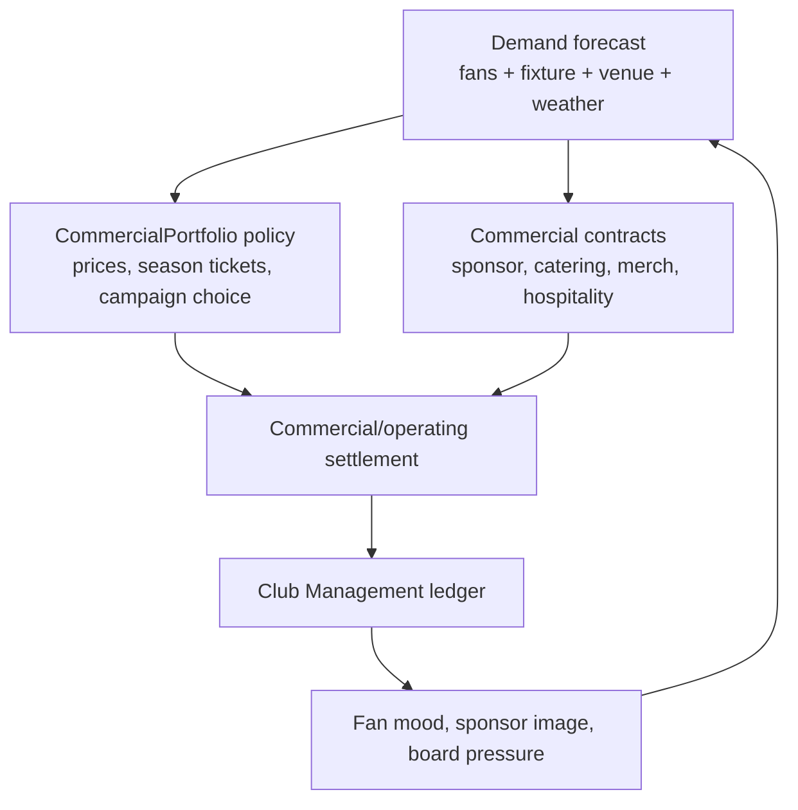

# GD-0022: Economy Commercial Impact and Contracts

## Status

accepted

> Ratified `accepted` 2026-06-08 in the vault-wide ratification sweep
> ([[decision-queue-2026-06-08-ratified|ledger]], PR #153); body previously read `draft`. Body
> status reconciled to the frontmatter SSOT (ADR-0092) on 2026-06-11 (FMX-143).

> **History (pre-ratification banner, demoted 2026-06-11 per ADR-0092 / FMX-143):**
> Draft only. This record captures the FMX-41 commercial economy direction, the
> FMX-42 fan-demand / price-elasticity refinement, the FMX-43 season-ticket
> lifecycle / accrual-accounting refinement, the FMX-44 commercial contract
> lifecycle / breach refinement, the FMX-45 cup/competition revenue profile
> refinement and the FMX-46 matchday operating-cost / risk-cost settlement
> refinement, the FMX-47 catering/merchandise operations refinement and the
> FMX-48 fan-service campaign catalog refinement, the FMX-49 financing
> separation refinement and the FMX-78 fixture/competition profile publication
> contract refinement. It needs Nico approval before implementation authority.

## Date

2026-05-28

## Player experience goal

The player should feel that fan culture, opponent appeal, cup runs, stadium
choices, sponsor fit, high-risk matchdays and commercial contracts directly
shape club finances. A new player can make simple choices such as "train, bus
or flight for the away trip" or "accept the recommended derby security plan";
an expert can inspect the exact assumptions, contract clauses, risk drivers and
ledger effects behind the same decision.

## Decided / strong draft direction

- **Commercial success is causal.** Ticketing, season tickets, catering,
  merchandise, sponsors and fan events are driven by fan segments, fixtures,
  stadium state, rivalry, competition profile and sporting form.
- **CommercialPortfolio owns commercial settlement; Club owns ledger truth.**
  Other systems expose facts; CommercialPortfolio owns ticketing policy,
  commercial contract lifecycle, per-fixture commercial/operating settlement
  and fan-event campaign policy. Club Management remains the sole finance
  ledger writer per ADR-0050.
- **Fans are hard economy inputs.** Loyalty, mood, segment mix and volatility
  affect attendance, renewal, per-capita spend, sponsor fit and boycott risk.
- **Ticket demand is latent and segment-specific.** Audience & Atmosphere
  forecasts latent demand before capacity; CommercialPortfolio applies
  ticketing policy, seat inventory and season-ticket allocation to derive
  actual attendance and settlement.
- **Season tickets are a lifecycle, not a cash button.** They provide early
  cash and demand stability, but create deferred revenue obligations, discount
  future attendance and reduce top-match upside.
- **Top games and rivals matter.** Rivalries, star opponents, table context and
  cup stakes increase demand, premium-price tolerance, away following,
  catering/merch spikes and security cost.
- **Cup games are economy events.** Each competition fixture uses a
  `CompetitionRevenueProfile` to create gate sharing, ticket allocation,
  prize, media/facility, travel, security, sponsor-bonus, merchandise,
  fixture-congestion and forecast effects.
- **Matchday operating costs are profile-driven.** Each home, neutral or
  special fixture can receive a `MatchdayOperatingCostProfile` for stewarding,
  security, policing-style contribution, medical/emergency cover, cleaning,
  waste, energy, temporary staff, officials, pitch recovery, insurance,
  restrictions and sanctions.
- **Risk costs must be fair.** High-risk fixtures, pyro incidents, alcohol
  bans, away-fan restrictions, sector closures and ghost matches are realistic
  consequences, but they require visible risk drivers, warnings and mitigation
  choices before severe costs settle.
- **Cup forecasts are not cash.** Secured cup income, earned receivables and
  expected future-round value are separate. Elimination removes future upside
  and records a forecast shock; it is not a hidden ledger loss unless an
  already-booked receivable is reversed.
- **Catering and merchandise need contract options.** Own operation, concession,
  revenue share, guarantees, royalties, licences and partner contracts must be
  modelled as explicit choices with duration and clauses.
- **Commercial contracts have lifecycle and breach state.** Sponsorship,
  catering, merchandise, hospitality, supplier and venue-activation deals share
  one lifecycle shell with family-specific schedules, obligations, exclusivity,
  renewal windows and curable/material/critical breach handling.
- **Fan-service campaigns are paid levers.** Away travel, family/community
  events, choreo support, supporter dialogue, beverage rewards and digital fan
  challenges cost money and can improve loyalty, atmosphere, sponsor activation
  and demand, but they also carry travel, alcohol, safety, safeguarding,
  low-uptake and spam-fatigue risk.
- **Investor is clean SP cash.** A real-money Investor purchase grants a known
  in-game cash amount in singleplayer only. It creates no debt, no owner
  control, no fan penalty and no competitive advantage. It is still visible in
  the ledger and does not alter weekly economics.
- **Commercial advances are contract facts, not Investor.** Sponsor/media
  advances use CommercialPortfolio cash-vs-revenue schedules and contract
  liabilities, but Club Management owns the liquidity action, financing register,
  runway and insolvency effects.
- **Realistic Rails.** The sim should be realistic in cause and consequence,
  but fair through forecasts, warnings, presets, recovery options and tunable
  ranges rather than instant hidden failure.
- **One simulation core, three UI depths.** Quick, Standard and Expert expose
  different detail over the same commercial policies and ledger events.

## Commercial loop



## Ticketing design rules

| Decision | Upside | Risk |
|---|---|---|
| Higher season-ticket share | Early cash, loyalty, stable attendance | Lower top-match upside, discount lock-in |
| Full accrual season-ticket accounting | Honest cash/revenue/liability model | More explanation needed for Quick players |
| Instalment or finance-plan offer | Higher accessibility and renewal conversion | Delayed cash or partner fees / receivable risk |
| Seat-release / utilisation rule | Better atmosphere, fairness and single-ticket availability | Trust loss if too punitive |
| More single-ticket inventory | Better top-game yield and dynamic pricing | More volatility in bad years |
| Top-match surcharge | Captures rival/star/cup demand | Fan-trust loss if overused |
| Bounded dynamic pricing | Better revenue capture under high latent demand | Affordability backlash if opaque |
| Family/community pricing | Segment growth and brand trust | Lower short-term yield |
| Premium/hospitality expansion | High per-capita revenue and sponsor value | Ultras/core alienation if it replaces standing culture |

Minimum policy variables:

- `seasonTicketShareTarget`
- `seasonTicketDiscountBand`
- `seasonTicketLifecyclePolicy`
- `seasonTicketAccountingPolicy`
- `seatRelocationPolicy`
- `memberPresalePolicy`
- `waitlistPolicy`
- `paymentPlanPolicy`
- `useItOrReleasePolicy`
- `groupCompensationPolicy`
- `singleTicketPriceBands`
- `topMatchSurchargePolicy`
- `dynamicPricingMode`
- `pricingTransparencyPolicy`
- `seasonTicketProtectionRule`
- `concessionPolicy`
- `awayAllocationPolicy`
- `familyBlockPolicy`
- `officialExchangePolicy`
- `ticketingTrustGuardrail`

## FMX-43 season-ticket lifecycle and accounting rules

Season tickets are planned as campaigns over fan-group cohorts:

```text
cohort =
  fan_segment
  x seat_class
  x product_package
  x payment_plan
  x loyalty_tier
```

The game does **not** simulate individual supporters. Resale, transfer,
compensation and refund behaviour are aggregate policy effects: utilisation
rate, credit liability pool, renewal trust and waitlist pressure.

Draft lifecycle:

1. `planning` - choose share target, seat-class quotas, packages, discount band
   and payment policies.
2. `renewalWindow` - existing cohorts renew or churn from form, trust, price
   and package value.
3. `seatRelocation` - renewed cohorts can move if inventory allows.
4. `memberPresale` - members / loyalty tiers / protected fan groups buy before
   public sale.
5. `waitlistAllocation` - scarcity is converted into offers and unmet-demand
   pressure.
6. `publicSale` - remaining stock reaches weaker-loyalty buyers.
7. `closed` - allocation and accounting schedule freeze before the season.
8. `inSeasonAdjustment` - no-show, seat-release, compensation and cup add-on
   events update utilisation and liabilities.
9. `renewalReview` - eligibility, trust and waitlist state feed the next
   campaign.

Accounting rule:

- cash received before matches improves runway but becomes deferred revenue /
  contract liability until included matches are played;
- internal instalments create receivables and later cash receipts;
- finance-partner plans can create earlier net cash plus a partner fee instead
  of club-owned credit risk;
- each included home match releases its allocated season-ticket revenue to
  recognised matchday revenue;
- cancelled, inaccessible or relocated included matches post aggregate credit
  or refund liabilities according to `groupCompensationPolicy`;
- cup priority / cup auto-charge rights remain a visible hook. FMX-45 keeps the
  hook explicit but does not define full material-right, refund or liability
  rules; those remain a follow-up to the FMX-43 season-ticket decision.

Quick-mode wording must distinguish **cash now** from **revenue earned as
matches are played**. This is a fairness rule: players may use early liquidity,
but they must see the future obligation and lost single-ticket upside.

## Fan segment economy

| Segment | Attendance stability | Spend profile | Commercial risk |
|---|---|---|---|
| Ultras / Hardcore | Very high | Lower per-capita, high atmosphere | Protest, boycott, sanction chain |
| Core | High | Stable ticket/merch spend | Sensitive to identity and pricing |
| Family | Medium | Catering and merch strong | Safety/weather/comfort sensitive |
| Fair Weather | Low | High when winning | Collapses in bad seasons |
| Corporate | Low loyalty, high budget | Hospitality and premium strong | Amenity and brand-safety demands |
| Casual / Event | Very low | Top-match/event spikes | Price and hype sensitive |

The system must support both club archetypes:

- **loyal/traditional:** high base occupancy, stable season tickets, lower price
  elasticity, stronger reaction to identity violations;
- **success/event-led:** high upside in strong seasons, weaker bad-year floor,
  larger top-player/top-game effects.

## FMX-42 fan-demand and price-elasticity rules

The simulation uses one demand core with profile data, not hard-coded country
branches:

- Audience & Atmosphere calculates `latentDemand` by segment before capacity is
  applied.
- CommercialPortfolio allocates latent demand into seat-class inventory,
  season tickets, away allocation, single-ticket sales and hospitality.
- Price sensitivity is segment-specific. Casual/fair-weather/family demand is
  more sensitive to total trip cost; ultras/core are less attendance-sensitive
  but more likely to punish perceived identity or fairness breaches.
- League-owned `FixtureCommercialProfile` carries stable fixture and competition
  commercial facts such as stage, round, tie shape, organizer, venue
  responsibility, gate/ticket rule slices and prize/media triggers.
  CommercialPortfolio combines it with Rivalry, Audience & Atmosphere, Stadium
  Operations, Regulations and weather/calendar facts to explain opponent draw,
  rivalry, form, star pull, novelty, kickoff convenience, risk and weather to
  the player.
- `ticketingTrustState` persists across weeks and seasons. It feeds renewal,
  boycott risk, atmosphere, sponsor fit and press/supporter events.
- Capacity pressure is explicit. A sold-out match can still be a bad long-term
  pricing decision if it displaces loyal segments or damages renewal trust.

Recommended draft stance: category pricing and bounded surcharges are MVP-safe;
opaque full dynamic pricing remains an explicit Nico decision because the
research shows trust and affordability risk.

## Commercial contract families

FMX-44 recommends one shared `CommercialContract` lifecycle shell, not one
state machine per family. Families add schedules and clause packs.

| Family | Contract options | Key clauses |
|---|---|---|
| Sponsorship | Main, sleeve, training kit, stadium/stand naming, digital, local, matchday | cash/recognition cadence, asset inventory, exclusivity, activation obligations, renewal rights, reputation hooks, bonuses, penalties |
| Catering | In-house, concession lease, management fee, revenue share, minimum guarantee plus share, exclusive supplier | fixed fee, share, COGS/staffing, queue/stockout/waste/service SLAs, exclusivity, alcohol/food policy, termination |
| Merchandise | In-house store, licensed partner, kit supplier guarantee, royalty, e-commerce fulfilment, campaign drop | guarantee, royalty/MAG, inventory risk, fulfilment SLA, design window, channel scope, termination |
| Hospitality | Suite leases, lounge packages, corporate events, premium catering | package inventory, service level, minimum spend/headcount, premium quality, sponsor overlap |
| Supplier | Beer, soft drink, food, equipment, POS, energy partner | mandatory supplier, rebate, volume target, equipment support, category carve-outs |
| Venue activation | Away travel, summer party, family day, choreo support, beer-per-goal, fan zone, concert sponsor event | direct cost, sponsor contribution, segment effect, incident risk, fulfilment, cancellation policy |

## FMX-44 commercial contract lifecycle and breach rules

Draft lifecycle:

1. `draft` - terms are assembled from offer/profile data.
2. `offered` - offer is visible and can expire or be withdrawn.
3. `negotiating` - counterparty proposes changes.
4. `active` - signed contract is in force and posts cash/accrual events.
5. `renewalDue` - incumbent right, option or open-market renewal window.
6. `breached` - obligation, service, payment, exclusivity or reputation case is
   open.
7. `suspended` - rights/operation pause after material escalation.
8. `terminated` - early exit by cause, convenience or mutual agreement.
9. `expired` - term ended with no renewal.

Contract value must be explained by more than yearly money:

- asset package and category exclusivity;
- obligations and activation delivery;
- service quality and fulfilment risk;
- cash schedule versus recognition schedule;
- performance bonuses and penalties;
- fan-fit and reputation risk;
- renewal policy and break clauses.

Breach handling uses three game severities:

| Severity | Typical causes | Player-facing result |
|---|---|---|
| Curable | Late report, one missed digital activation, small payment delay, minor stockout. | Cure timer, make-good or small satisfaction hit. |
| Material | Repeated SLA failures, missed guarantee, exclusivity conflict, failed activation. | Penalty, fee reduction, suspended rights, renegotiation, fan/sponsor trust impact. |
| Critical | Fraud/misreporting, regulatory ban, severe safety incident, major scandal, uncured material breach. | Termination for cause, damages/repayment, reputation shock, category cooldown. |

Exclusivity is structured as category × territory × asset × carve-outs. The
game should block, narrow or devalue conflicting offers before signature; an
active violation opens a material breach case.

AI-club behaviour is not part of FMX-44. The contract register may expose
read-only hooks such as `cashUrgency`, `fanFitWeight`, `serviceQualityWeight`
and `renewalBias` for FMX-51. **FMX-51 now consumes these hooks** — Tier 0 AI
clubs make active commercial choices through them while Tier 1+ receive banded
profile outcomes; see [[GD-0023-ai-club-economy-behaviour]] and
[[../60-Research/ai-club-economy-behaviour-2026-06-01]].

## FMX-47 catering and merchandise operations depth

FMX-47 turns catering and merchandise from flat revenue percentages into
operations the player can steer. The core decision is an **operating model**
that trades control + upside + risk against certainty + low effort + capped take
(the commercial analogue of the FMX-43 season-ticket upfront-vs-upside dial).
Source: [[../60-Research/catering-and-merchandise-operations-2026-06-01]]. All
numbers are calibration ranges.

- **Operating-model dial.** Catering: in-house (keep gross, bear COGS + labour +
  waste), concession lease (operator bears all, club gets rent ± share),
  management fee (keep gross **and** bear volume/inventory risk, pay fee),
  revenue-share (operator bears cost, club gets % of gross), MAG + share
  (`max(MAG, share)`). Merchandise: own store + e-commerce (club bears
  inventory/fulfilment), licensed partner / wholesale, kit-supplier guarantee,
  pure licensing/royalty.
- **Revenue is operations-capped.** Catering = `attendance × per-capita`, where
  per-capita rises with dwell time, product quality, throughput and segment mix,
  and is **capped** by service capacity (queue/throughput) and by stockouts (an
  item's sales stop at zero once sold out; unmet demand is lost revenue + a fan
  satisfaction hit, not silently absorbed).
- **Cost and inventory are explicit.** The ledger separates revenue, COGS,
  labour/opex, royalty/MAG true-up, guarantee shortfall, waste/spoilage
  (catering ~3-5% of food COGS normal) and stock markdown/write-down
  (merch season-end 30-70%, e-commerce returns ~15-25%). Over-ordering wastes;
  under-ordering loses sales — the stockout-vs-overstock tension.
- **Merchandise demand spikes.** Kit launch (~3-5×), icon signing (~1.3-1.5×),
  cup-final run (~1.1-1.3×, more if won), promotion/trophy lift — applied as a
  forecast multiplier on a planned stock buy, with cup spikes linked to the
  FMX-45 `CompetitionRevenueProfile` merch band.
- **Service quality and alcohol policy are levers.** Queue, stockout and quality
  feed Audience & Atmosphere satisfaction / repeat attendance / NPS and sponsor
  fit. Alcohol policy is an in-bowl / concourse-only / near-ban dial with a
  revenue↔safety trade-off (country-profile driven, FMX-53). Supplier
  pouring-rights/exclusivity reuse the category × territory × asset × carve-out
  exclusivity graph and constrain an outsourced operator's sourcing.

Breach grading is unchanged from FMX-44: a repeated catering queue/stockout SLA
failure escalates curable → material (service credits, cure period, replace-
operator board prompt); a food-safety/hygiene/alcohol-law incident is critical.

Catering/merch operations are owned inside CommercialPortfolio; Club Management
remains sole ledger writer (ADR-0050/0061). Stadium Operations supplies
throughput/dwell; Audience & Atmosphere supplies demand and consumes service
quality. No boundary changes in this beat.

## FMX-48 fan-service campaign catalog

FMX-48 turns the old "fan event" examples into a bounded commercial campaign
surface. Source:
[[../60-Research/fan-service-campaign-catalog-and-effects-2026-06-01]]. The
campaign spends money, sponsor inventory or operational capacity now to move
future fan trust, atmosphere, demand and sponsor fit. It is **not** a separate
event-management game.

`FanEventCampaign` lifecycle:

```text
draft -> scheduled -> active -> settled -> reviewed
                 scheduled -> cancelled
                 active -> cancelled
                 active -> breached -> settled
```

First catalog candidates:

| Campaign kind | Primary design use | Main risk |
|---|---|---|
| `away-train` | High-capacity away support and ultras/core loyalty. | Disruption, station transfer, damage reserve, policing/refund. |
| `bus-subsidy` | Lower-cost domestic away support for core/family fans. | Delay, comfort, low uptake, route incident. |
| `flight-subsidy` | Distant cup/continental support and corporate travel hook. | High cost, cancellation, ESG/reputation. |
| `family-day` | Family loyalty, kids/youth pipeline, safer low-demand fixture. | Weather, safeguarding, low short-term yield. |
| `summer-party` / `fan-festival` | Local brand, sponsor impressions, season-ticket push. | Weather cancellation, crowd flow, cost overrun. |
| `community-ticket-day` | Utilisation, goodwill, local-group conversion. | No-show, resale/misuse, lower yield. |
| `choreo-support` | Derby/cup atmosphere and ultras/core identity. | Prohibited material, autonomy tension, sanction risk. |
| `supporter-dialogue` | Trust repair, protest prevention and risk acceptance. | Broken promises, low credibility, polarised groups. |
| `beer-per-goal` / beverage reward | Sponsor buzz, adult/core/casual match emotion and catering lift. | Alcohol law, public order, family/health backlash. |
| `digital-fan-challenge` | Casual/remote engagement, first-party data and social reach. | Privacy, IP/moderation and spam fatigue. |

Minimum campaign fields:

- `campaignKind`, `lifecycleState`, `fixtureId` / `seasonId`;
- `targetSegments`, `capacity`, `eligibilityPolicy`;
- `budgetMinor`, `sponsorContribution`, `fulfilmentModel`;
- `riskFlags`, `regulatoryProfile`, `cooldownPolicy`;
- `expectedEffects`, `kpiTargets`, `makeGoodPolicy`, `settlementPolicy`;
- `provenance` linking fixture, venue, sponsor, fan and rule facts.

Settlement events that must be representable:

- `FanEventCampaignScheduled`
- `FanEventCampaignCostCommitted`
- `FanEventSponsorContributionRecognised`
- `FanEventCampaignCancelled`
- `FanEventMakeGoodGranted`
- `FanEventCampaignSettled`
- `FanEventLowUptakeRecorded`
- `FanEventSegmentEffectPublished`
- `AwayTravelSubsidySettled`
- `ChoreoSupportSettled`
- `BeverageRewardCampaignSettled`
- `CommunityTicketBlockSettled`
- `FanEventCooldownApplied`

Ownership stays unchanged: CommercialPortfolio owns campaign policy,
contract/sponsor obligations, settlement and cooldowns; Audience & Atmosphere
owns mood, trust, atmosphere and demand effects; Stadium Operations supplies
venue capacity, crowd-flow, temporary-structure and fan-zone facts; Regulations
gates alcohol, travel, safety, safeguarding and digital/UGC constraints; Club
Management posts ledger entries only after settlement.

Fairness rules:

- travel campaigns show capacity, disruption/refund and damage-reserve risk
  before scheduling;
- alcohol campaigns are country-profile gated and must support non-alcoholic /
  soft-drink variants;
- child/family events model safeguarding/privacy as risk complexity, not
  personal child data;
- sponsor-heavy or repeated campaigns need cooldowns so raw impressions cannot
  hide fan spam fatigue;
- SLO/supporter dialogue helps choreo and risk acceptance but does not let the
  club command supporter groups.

## Cup and special-fixture settlement

Each fixture receives a commercial profile:

- `fixtureKind`: league, cup, playoff, friendly, continental, final.
- `fixtureSettlementKind`: home tie, away tie, replay, two-leg tie, neutral
  semi/final or league phase.
- `importanceTier`: routine, high, top, season-decider.
- `rivalryTier`: none, mild, strong, high, volatile.
- `opponentDrawPower`: generated/fictional star and reputation pull.
- `competitionRevenueProfile`: prize schedule, gate-sharing rule, ticket
  allocation, media/facility cadence, neutral venue, replay/two-leg rules,
  away/neutral travel, security, solidarity, fixture congestion and forecast
  policy.
- `matchdayOperatingCostProfile`: stewarding, security, policing-style
  contribution, medical/emergency, cleaning/waste, energy, temporary staff,
  officials, pitch recovery, insurance/compliance, damage reserve,
  restrictions and sanction exposure.
- `riskProfile`: security, alcohol, away allocation, potential sanctions,
  sector closures and ghost-match exposure.

FMX-45 defines six IP-clean draft preset families:

| Preset family | Intended feel |
|---|---|
| `central-round-domestic-cup` | Round prizes, TV/live-game bonus, no replay, neutral final, strong home-tie value. |
| `shared-gate-underdog-cup` | Prize ladder, net-gate sharing, facility fees, configurable replays and neutral semi/final. |
| `federation-hosting-cup` | Lower-tier hosting advantage, federation aid, no-replay default and late two-leg option. |
| `seeded-elite-entry-cup` | Top-tier-weighted cup, elite later entry, central media band and neutral final. |
| `solidarity-amateur-cup` | Deep early rounds, lower-tier support, travel/referee support and grassroots windfall. |
| `continental-value-pillar-cup` | Equal share, performance, ranking/progression, value/legacy and solidarity pools. |

The settlement produces separate facts for ticket, catering, hospitality,
merchandise, sponsor activation, security/stewarding, travel, prize, media,
neutral allocation, fines and forecast shocks.

Cup value is displayed in layers:

- hard cash already received;
- guaranteed receivables already earned;
- non-spendable future cup EV;
- fan/board/sponsor/reputation and congestion pressure.

Quick mode shows secured cup income and expected upside as bands. Standard
shows per-fixture revenue/cost breakdown. Expert shows probability source,
round-by-round EV, gate-share formula, delayed cash and elimination shock.

## Matchday operating-cost settlement

FMX-46 turns matchday cost from a flat subtraction into a profile-driven
settlement. The same profile powers normal home matches, derbies, domestic cup
ties, neutral finals, restricted matches and ghost matches.

`MatchdayOperatingCostProfile` has six risk tiers:

| Tier | Meaning | Typical effect |
|---|---|---|
| `routine` | Normal match with no special public-order signal. | Baseline stewarding, security, medical, cleaning, energy and pitch costs. |
| `guarded` | Attendance, away demand, kickoff or weather needs attention. | Small steward/security uplift and a visible mitigation card. |
| `elevated` | Rivalry, cup stakes, incident memory or away-travel pressure. | Security upgrade recommended; alcohol, away allocation and damage reserve reviewed. |
| `highRisk` | High/volatile rivalry or regulator/police classification. | Strong security/stewarding/policing uplift and possible fan separation controls. |
| `restricted` | Rule or mitigation limits normal attendance or sales. | Alcohol ban, away cap/ban, sector closure or special entry controls. |
| `closedDoor` | Ghost match / behind-closed-doors sanction. | Attendance income is removed while required operating costs remain. |

Minimum cost families:

- stewarding and crowd management;
- private security, searches, segregation and surveillance;
- policing-style contribution where the country/profile makes it chargeable;
- medical, emergency, heat/water and first-aid cover;
- cleaning, waste and sanitation;
- energy, water, floodlight, heating/cooling and technical systems;
- temporary staff and contractors for turnstiles, retail, catering,
  hospitality and fan zones;
- match officials / competition operations where the profile assigns the cost;
- pitch recovery and groundskeeping after weather, dense fixtures or non-
  matchday events;
- insurance, safety certification and compliance overhead allocation;
- damage reserve, fines, sector closures, away-fan restrictions, alcohol bans
  and ghost-match effects.

Inputs stay with their owning domains:

- Rivalry System publishes rivalry tier and fan-incident pressure.
- Audience & Atmosphere publishes atmosphere, trust and fan-incident facts.
- Stadium Operations publishes capacity, open sectors, ingress/egress, pitch
  condition, technical systems and venue cost bands.
- Regulations & Compliance publishes alcohol, away-fan, closure, ghost-match,
  safety-staffing and sanction constraints.
- League / Competition publishes fixture and competition profile data.
- Matchday Event Engine resolves weather, pyro, medical, infrastructure and
  pitch incidents.
- CommercialPortfolio applies ticketing, contracts, fan-event campaigns and
  mitigation choices, then emits settlement events to Club Management.

Settlement events that must be representable:

- `MatchdayOperatingCostForecasted`
- `MatchdayStewardingCostPosted`
- `MatchdaySecurityCostPosted`
- `MatchdayPoliceContributionPosted`
- `MatchdayMedicalEmergencyCostPosted`
- `MatchdayCleaningWasteCostPosted`
- `MatchdayEnergyCostPosted`
- `MatchdayTemporaryStaffCostPosted`
- `MatchdayOfficialsCostPosted`
- `PitchRecoveryCostPosted`
- `MatchdayInsuranceComplianceCostAllocated`
- `MatchdayDamageReserveAdjusted`
- `MatchdaySanctionFinePosted`
- `SectorClosureRevenueImpactRecorded`
- `GhostMatchSettlementRecorded`
- `AwayFanRestrictionApplied`
- `AlcoholRestrictionApplied`
- `RiskTierReclassified`
- `MitigationActionSettled`

Fairness rules:

- severe incidents need visible pre-match risk drivers or incident memory;
- mitigation choices reduce probability or severity but cost money or revenue;
- restrictions lower risk while reducing sales, atmosphere or commercial
  upside;
- a sector closure reduces sellable capacity but does not erase fixed venue
  and required safety costs;
- a ghost match removes attendance income but still posts required stadium,
  security, medical, energy and competition-operation costs.

## Investor cash purchase

Investor is a special singleplayer entitlement:

- available only in singleplayer saves;
- grants exact known in-game cash;
- posts `investor_entitlement_cash_grant` to the ledger;
- does not change club ownership, fan trust, debt, board confidence, sponsor
  fit, wage pressure, compliance thresholds or market behaviour;
- cannot appear in multiplayer or competitive shared-state modes;
- does not create any path from a singleplayer, hotseat, local or imported save
  into multiplayer;
- remains account-visible for payment/audit history, but the cash/time-saving
  payload is usable only in isolated singleplayer saves;
- requires platform-store, disclosure and consumer-law review before activation.

The design intent is clear: the player may buy time, but not a repaired
business model.

Acceptance scenario: given an account has a singleplayer Investor grant, when
the player creates or joins an online MP league with friends, the MP server
creates fresh MP state and receives no singleplayer cash, roster, player,
standing, fixture, ledger or entitlement payload.

## FMX-49 commercial financing boundary

FMX-49 adds in-world financing without moving commercial ownership:

- CommercialPortfolio owns commercial contract amendments, receivable schedules,
  recognition schedules, contract liabilities, related-party flags and fair-value
  assessments.
- Club Management owns `FinancingFacility`, `CashflowRunwayForecast`, overdue
  payables, covenant state, board support, emergency-sale mandate and ledger
  posting.
- Sponsor/media advances are represented as a hybrid: CommercialPortfolio
  publishes `CommercialAdvanceEligibilityPublished` and schedule facts; Club
  Management accepts or rejects the financing action and posts the cash/liability
  effects.
- Receivables factoring can use commercial or transfer receivables, but the
  factoring action is Club Management because it changes liquidity, debt and
  insolvency state.
- Board support is fictional in-world finance only. It may be an equity-like
  rescue grant or a shareholder loan; it is never the real-money Investor.

CommercialPortfolio must expose enough facts for Club Management to avoid
guessing:

| Fact | Meaning |
|---|---|
| `CommercialReceivableSchedulePublished` | Due dates, amounts, counterparty, certainty band and receivable kind. |
| `CommercialAdvanceEligibilityPublished` | Which sponsor/media cash flows may be advanced, discount/fee band and future-cash consequence. |
| `CommercialContractLiabilityPublished` | Cash received before performance obligations are fulfilled. |
| `CommercialFairValueAssessed` | Related-party/fair-value result used by Regulations and Club Management. |

FMX-50 specifies the compliance + entitlement boundary behind this rule
(proposed [[../10-Architecture/09-Decisions/ADR-0063-investor-entitlement-and-payment-boundary]],
research [[../60-Research/investor-compliance-and-entitlement-boundary-2026-06-01]]):

- **Billing** runs behind a `PaymentProviderPort` — Apple StoreKit 2 / Google
  Play **consumable IAP** in the app builds, a web PSP / Merchant-of-Record in the
  PWA. Entitlements bind to the **account, not the save**.
- **Exactly-once grant**: server-authoritative, idempotent by provider
  transaction id, state machine `created → paid → entitled → (refunded | revoked)`;
  one ledger fact via ADR-0050.
- **Refund/revocation** (Apple ASSN / Google void) reconciles the entitlement
  without changing simulation rules or multiplayer.
- **Age rating**: plain "In-Game Purchases" descriptor — never "Includes Random
  Items" (no loot box, ever).
- **Consumer law**: pay-obligation button ("Zahlungspflichtig bestellen") +
  VAT-inclusive price, immediate-delivery withdrawal-right waiver with consent +
  durable confirmation, real-money price shown beside the cash amount, no dark
  patterns.

Final payment vendor (Merchant-of-Record vs Stripe-direct), the
refunded-already-spent-cash policy, age-gate strictness and activation timing are
HITL/legal gates, not decided in this beat.

## Quick / Standard / Expert surfaces

| Flow | Quick | Standard | Expert |
|---|---|---|---|
| Away travel | Pick bus/train/flight and see total cost | See segment effects, travel fatigue and sponsor contribution | See capacity, subsidy per fan, security, damage reserve, sensitivity |
| Season tickets | Pick safe/balanced/upside preset; see cash now vs earned later | See share, discount, renewal, waitlist, 13-week cash/deferred schedule | Edit lifecycle windows, cohorts, payment plans, utilisation and recognition schedule |
| Commercial contracts | Pick stable/balanced/upside contract preset; see cash, risk and conflict badge | Compare value, term, exclusivity, obligations, fan fit and 13-week cash/recognition forecast | Inspect lifecycle state, version history, obligations, breach cases, exclusivity graph, renewal calendar and schedules |
| Catering | Pick stable/balanced/upside contract | Compare fixed rent, share, quality and SLA risk | Inspect clauses, COGS, service metrics, cure windows and termination |
| Merch | Pick own/partner campaign | See projected margin, royalty/MAG and stock risk | Edit royalty, guarantee, inventory, fulfilment and true-up schedule |
| Cup revenue | See secured income, earned receivables and future upside band | See prize, gate share, media, travel, security, sponsor and merch breakdown | Inspect round EV, probabilities, gate formula, payment timing, congestion sensitivity and elimination shock |
| Matchday operating cost | See risk badge, total cost band and recommended mitigation | See staffing/security, venue/facility and restriction/sanction breakdown | Inspect profile modifiers, formulas, source provenance, incident memory and event settlement |
| Fan-service campaign | Pick a recommended campaign and see cost, sponsor help, fan effect band and one risk badge | Compare campaign type, target segments, capacity, uptake forecast, risk/cooldown and settlement timing | Inspect lifecycle, eligibility, SLO/security approvals, KPI targets, make-good, cooldown and provenance |
| Investor | Confirm exact cash amount | See ledger impact and runway change | See no long-term structural change in forecast |

## Acceptance scenarios

```gherkin
Feature: Commercial economy impact

  Scenario: Loyal fans keep attendance high in a bad season
    Given a club has high core and ultras loyalty
    And sporting form is poor
    When attendance is forecast
    Then season-ticket renewal and base attendance remain relatively stable
    And single-ticket top-up demand falls

  Scenario: Fair-weather club earns more from a top match
    Given a club keeps a larger single-ticket inventory
    And a high-rivalry top opponent visits
    When ticketing policy applies a top-match surcharge
    Then single-ticket revenue can exceed the loyal-club baseline
    But future fan-trust risk is evaluated

  Scenario: Sold-out match still carries trust risk
    Given latent demand exceeds stadium capacity
    And the club raises normal single-ticket prices above its profile guardrail
    When matchday settlement runs
    Then actual attendance can remain near capacity
    And revenue can rise
    But ticketing trust and next-season renewal probability fall

  Scenario: Season tickets trade upside for certainty
    Given two clubs have the same stadium capacity
    And one club sells more season tickets at a discount
    When a cup run creates high demand
    Then the high-season-ticket club has more early cash
    And less match-by-match upside

  Scenario: Season-ticket cash is deferred revenue
    Given a club sells season tickets before the first match
    When the campaign closes
    Then cash runway improves
    And deferred revenue increases
    But recognised ticket revenue is released only when included matches are played

  Scenario: Instalments delay cash but not obligation
    Given a club offers internal instalments
    When season-ticket sales are posted
    Then the campaign creates receivables and deferred revenue
    And cash arrives over the instalment schedule

  Scenario: Group compensation avoids individual supporter modelling
    Given an included match becomes inaccessible to a seat-class cohort
    When the club applies its compensation policy
    Then an aggregate credit or refund liability is posted
    And no individual supporter entity is created

  Scenario: Home cup tie settles as a full economy event
    Given a club reaches another cup round
    And the next fixture is a home tie against a high-draw opponent
    When the competition revenue profile posts the fixture
    Then the forecast adds prize, gate, catering, merchandise, security and sponsor effects
    And cash, receivable and future EV are shown separately

  Scenario: Away cup tie uses gate-share and travel rules
    Given a club is drawn away in a shared-gate cup profile
    When the tie is settled
    Then travel and accommodation costs post
    And any gate-share or facility-fee income follows the competition profile

  Scenario: Neutral final separates central and club settlement
    Given a club reaches a neutral final
    When final settlement runs
    Then ticket allocation, central prize, sponsor bonus, merchandise spike and travel are separate facts
    And home-match assumptions are not reused

  Scenario: Early cup exit removes upside, not bank balance
    Given a club has future cup EV but no earned receivable
    When the club is eliminated
    Then future cup upside is removed from the forecast
    And no cash ledger loss is posted

  Scenario: Fixture congestion is visible as risk
    Given cup progression creates a midweek fixture cluster
    When the forecast updates
    Then travel and congestion risk are visible
    And fatigue or injury outcomes remain owned by the sporting systems

  Scenario: Derby high-risk match exposes mitigation before settlement
    Given a high-rivalry home fixture
    And recent fan-incident memory
    When CommercialPortfolio creates the matchday operating-cost profile
    Then the fixture is classified as highRisk
    And Quick mode shows the expected cost band and recommended mitigation
    And Expert mode shows rivalry, away allocation, kickoff and incident-memory drivers

  Scenario: Alcohol restriction trades revenue for safety
    Given an elevated-risk match with strong catering demand
    When the club accepts an alcohol restriction
    Then catering upside is reduced
    And security incident probability and sanction exposure are reduced
    And both effects are visible before matchday settlement

  Scenario: Sector closure keeps fixed operating costs
    Given a prior security incident caused a sector closure
    When the next home match is forecast
    Then available capacity and matchday revenue fall
    And fixed venue, medical and required security costs remain

  Scenario: Ghost match removes attendance income but not all costs
    Given a behind-closed-doors sanction
    When matchday settlement runs
    Then ticket and most retail income are zero
    And required stadium, security, medical, energy and competition-operation costs still post

  Scenario: Catering contract changes margin
    Given two clubs have the same attendance
    And one runs catering in-house while the other has a concession lease
    When matchday settlement runs
    Then in-house posts higher possible upside and COGS/staff risk
    And concession posts more predictable fixed income

  Scenario: Sponsor exclusivity conflict is visible before signature
    Given a club has an active beer exclusivity deal
    When a new beverage sponsor offer overlaps the locked category
    Then the commercial contract register flags the conflict
    And the player must block, narrow or devalue the offer before signing

  Scenario: Contract breach has severity and cure rules
    Given a catering operator repeatedly misses queue and stockout targets
    When the breach policy reaches its material threshold
    Then a material breach case opens
    And a penalty or fee reduction posts separately from normal settlement
    And fan-service quality is affected

  Scenario: Renewal policy protects an incumbent
    Given a main sponsor is inside its first-negotiation window
    When a higher-value competing offer arrives
    Then the club must respect the incumbent renewal policy before accepting it

  Scenario: Subsidised away train improves away support
    Given a high-rivalry away fixture
    And the club schedules an away-train campaign with enough capacity
    When the campaign settles without disruption
    Then Club Management posts travel subsidy and damage reserve outcomes
    And Audience & Atmosphere receives improved core and ultras trust
    And away atmosphere increases for the fixture

  Scenario: Family day trades yield for long-term loyalty
    Given a low-demand home fixture
    When the club schedules a family day with community ticket blocks
    Then ticket yield is reduced
    And Family segment mood, future demand and sponsor community fit improve
    And low uptake is recorded if group attendance misses the forecast

  Scenario: Beverage campaign follows the country profile
    Given a club in a strict alcohol-profile country
    When a beverage sponsor proposes beer-per-goal
    Then CommercialPortfolio offers a non-alcoholic or off-site variant
    And the risk card shows alcohol, family-fit and public-order constraints

  Scenario: Choreo support uses SLO-mediated approval
    Given a derby fixture with high atmosphere potential
    And the club funds a choreo-support campaign
    When SLO dialogue and material approval succeed
    Then atmosphere and ultras/core trust improve
    And sanction probability is lower than an unmanaged display

  Scenario: Failed fan festival creates make-good
    Given a sponsor-funded fan festival has a participation target
    And bad weather reduces attendance below the agreed threshold
    When settlement runs
    Then CommercialPortfolio records low uptake
    And a make-good or future sponsor slot is scheduled
    And fan sentiment depends on communication and compensation quality

  Scenario: Investor does not rebalance the save
    Given a singleplayer club buys an Investor cash grant
    When the entitlement is confirmed
    Then Club Management posts clean cash to the ledger
    And the wage, debt and forecast rules remain unchanged
    And multiplayer state is unaffected

  Scenario: Sponsor advance is financing, not earned revenue
    Given CommercialPortfolio has an eligible sponsor contract schedule
    When Club Management accepts a sponsor advance
    Then cash runway improves
    And CommercialPortfolio keeps the contract liability and recognition schedule
    And the Investor entitlement path is not used

  Scenario: Commercial receivable factoring affects the Club finance register
    Given CommercialPortfolio publishes a sponsor receivable schedule
    When Club Management factors the receivable
    Then the financing facility register records true-sale or secured-borrowing treatment
    And future commercial cash availability is reduced
```

## Open before approval

- Approval of ADR-0058 boundary recommendation.
- Decide whether MVP permits only category pricing plus bounded surcharges, or
  also full dynamic pricing.
- Decide whether Germany-style fan-first guardrails are hard country rules or
  tunable profile defaults.
- Decide how visible `ticketingTrustState` should be in Quick mode.
- Investor activation timing and platform/legal checklist (FMX-50: payment vendor
  MoR-vs-direct, refunded-already-spent-cash policy, age-gate strictness, web-path
  availability — all HITL/legal gates per proposed ADR-0063).
- First Top-5 country calibration order.
- Default season-ticket share and discount ranges per profile.
- Default season-ticket lifecycle, share and discount ranges per profile.
- Decide whether waitlist pressure is visible in Quick mode or only Standard /
  Expert.
- Decide whether internal instalment receivable risk is active in MVP or
  deferred behind finance-partner presets.
- Final cup-revenue calibration values per profile family.
- Decide whether Quick-mode board budgets may spend any fraction of expected
  cup EV.
- Decide whether replay support is active in first playable or kept as
  profile-data-only.
- Decide the full material-right/refund/liability model for season-ticket cup
  priority after FMX-43.
- Retry Italy official regulation PDF extraction before Italy-specific
  constants are frozen.
- Final matchday operating-cost ranges per country, tier and stadium scale.
- Decide whether Quick mode may auto-apply recommended low-cost mitigations or
  must always ask.
- Decide how much policing/public-order cost is player-controllable versus
  regulator-imposed per country profile.
- Decide whether severe supporter incidents are enabled in first playable or
  staged behind difficulty / realism settings.
- First contract presets for catering and merchandise.
- First-playable fan-service campaign catalog: minimum eight types or full ten.
- Quick-mode fan-service abstraction: one recommended campaign card per period
  or visible campaign board from the start.
- Beer/alcohol wording: explicit beer/alcohol campaigns or generic beverage /
  non-alcoholic abstraction.
- Default fan-service cooldown hardness and anti-spam thresholds.
- Whether SLO quality is an active staff modifier in MVP or a future hook owned
  by Staff Operations / Audience & Atmosphere.
- Whether travel disruption, refund and damage-reserve rules are active in MVP
  or profile-data-only until matchday operations are playtested.
- Whether sponsor KPI make-goods are Standard-visible or Expert-only.
- Whether sponsor/media advances are active in first playable beyond sponsor
  advances, or media advances stay profile-data-only until competition cadences
  are calibrated.
- Whether supplier arrears are ever a player-facing deferral choice or only a
  crisis consequence after missed payment.
- Guardrails for top-match surcharge and fan-trust damage.
- Accept ADR-0058 Option C after the FMX-44 lifecycle/breach amendment, or
  reopen the Commercial Operations bounded-context option.
- Default stable/balanced/upside presets for each commercial contract family.
- Quick-mode handling of exclusivity conflicts: hard block versus accept with
  warning and value/risk penalty.
- Whether controversial sponsor categories are first-playable content or
  deferred until legal/reputation review.
- Whether minimum guarantees, true-ups and clawbacks are Standard-visible or
  Expert-only.
- Whether auto-renewals require explicit player confirmation.

## Rationale

This design makes money feel like football money: fans, fixtures, rivalries,
stadium quality, contracts, obligations, breach risk and sporting momentum
create finance outcomes. The ledger from GD-0008 remains the accounting truth;
GD-0022 explains the commercial causes that feed it.

## Consequences

Positive:

- Commercial depth becomes systemic instead of flat modifiers.
- Cup runs, rivalries and star opponents become financial events.
- Quick players can still make simple decisions.
- Expert players get the exact levers Nico asked for.
- Investor is clear, clean and isolated from competitive fairness.
- Commercial contracts can be realistic without becoming legal software.

Negative / constraints:

- Requires several cross-domain contracts before implementation.
- More balance-test scenarios are needed than a simple cash model.
- Store and consumer-law compliance is mandatory before Investor activation.
- Commercial contracts can become too broad if ADR-0058 is not enforced.
- Lifecycle and breach state adds balance-test cases for penalties, renewals,
  conflict warnings and fan-fit shocks.

## Supersedes

None. This extends GD-0008 and the FMX-13 economy draft with a commercial impact
layer; it does not approve final constants.

## Related

- Research: [[../60-Research/club-economy-impact-map-and-commercial-contracts-2026-05-28]] ·
  [[../60-Research/fan-demand-price-elasticity-2026-05-28]] ·
  [[../60-Research/season-ticket-lifecycle-and-accounting-2026-05-28]] ·
  [[../60-Research/commercial-contract-lifecycle-and-breach-model-2026-05-28]] ·
  [[../60-Research/cup-and-competition-revenue-profiles-2026-05-28]] ·
  [[../60-Research/matchday-operating-costs-and-risk-cost-settlement-2026-05-29]] ·
  [[../60-Research/catering-and-merchandise-operations-2026-06-01]] ·
  [[../60-Research/fan-service-campaign-catalog-and-effects-2026-06-01]] ·
  [[../60-Research/club-financing-tools-2026-06-01]]
- Game design: [[GD-0008-finance-economy]] · [[economy-system]] ·
  [[audience-and-atmosphere]] · [[regulations-and-compliance]]
- Architecture: [[../10-Architecture/09-Decisions/ADR-0050-club-economy-accounting-ledger]] ·
  [[../10-Architecture/09-Decisions/ADR-0058-club-economy-commercial-impact-boundary]]
- Implementation: [[../30-Implementation/club-economy-commercial-contracts]]
