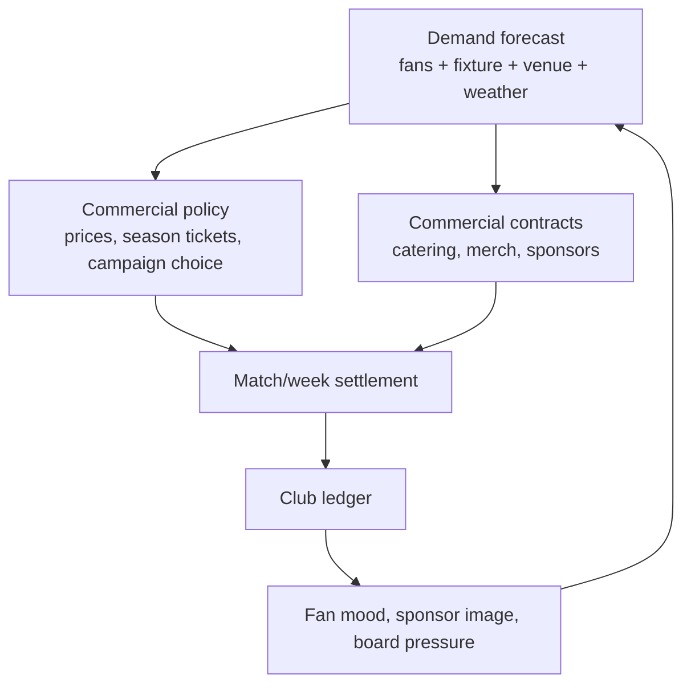

# GD-0022: Economy Commercial Impact and Contracts

## Status

draft

> Draft only. This record captures the FMX-41 commercial economy direction and
> needs Nico approval before implementation authority.

## Date

2026-05-28

## Player experience goal

The player should feel that fan culture, opponent appeal, cup runs, stadium
choices, sponsor fit and commercial contracts directly shape club finances. A
new player can make simple choices such as "train, bus or flight for the away
trip"; an expert can inspect the exact assumptions, contract clauses and
ledger effects behind the same decision.

## Decided / strong draft direction

- **Commercial success is causal.** Ticketing, season tickets, catering,
  merchandise, sponsors and fan events are driven by fan segments, fixtures,
  stadium state, rivalry, competition profile and sporting form.
- **Club Management owns settlement.** Other systems expose facts; Club
  Management owns ticketing policy, commercial contracts and ledger posting.
- **Fans are hard economy inputs.** Loyalty, mood, segment mix and volatility
  affect attendance, renewal, per-capita spend, sponsor fit and boycott risk.
- **Season tickets are a trade-off.** They provide early cash and demand
  stability, but discount future attendance and reduce top-match upside.
- **Top games and rivals matter.** Rivalries, star opponents, table context and
  cup stakes increase demand, premium-price tolerance, away following,
  catering/merch spikes and security cost.
- **Cup games are economy events.** Each cup match can create gate, catering,
  security, travel, prize, media, sponsor-bonus and fixture-congestion effects.
- **Catering and merchandise need contract options.** Own operation, concession,
  revenue share, guarantees, royalties, licences and partner contracts must be
  modelled as explicit choices with duration and clauses.
- **Fan-service campaigns are paid levers.** Away trains, summer parties,
  family days, choreo support and goal-linked beer campaigns cost money and can
  improve loyalty, atmosphere, sponsor activation and demand.
- **Investor is clean SP cash.** A real-money Investor purchase grants a known
  in-game cash amount in singleplayer only. It creates no debt, no owner
  control, no fan penalty and no competitive advantage. It is still visible in
  the ledger and does not alter weekly economics.
- **Realistic Rails.** The sim should be realistic in cause and consequence,
  but fair through forecasts, warnings, presets, recovery options and tunable
  ranges rather than instant hidden failure.
- **One simulation core, three UI depths.** Quick, Standard and Expert expose
  different detail over the same commercial policies and ledger events.

## Commercial loop



## Ticketing design rules

| Decision | Upside | Risk |
|---|---|---|
| Higher season-ticket share | Early cash, loyalty, stable attendance | Lower top-match upside, discount lock-in |
| More single-ticket inventory | Better top-game yield and dynamic pricing | More volatility in bad years |
| Top-match surcharge | Captures rival/star/cup demand | Fan-trust loss if overused |
| Family/community pricing | Segment growth and brand trust | Lower short-term yield |
| Premium/hospitality expansion | High per-capita revenue and sponsor value | Ultras/core alienation if it replaces standing culture |

Minimum policy variables:

- `seasonTicketShareTarget`
- `seasonTicketDiscountBand`
- `singleTicketPriceBands`
- `topMatchSurchargePolicy`
- `concessionPolicy`
- `awayAllocationPolicy`
- `familyBlockPolicy`
- `secondaryMarketPolicy`

## Fan segment economy

| Segment | Attendance stability | Spend profile | Commercial risk |
|---|---|---|---|
| Ultras / Hardcore | Very high | Lower per-capita, high atmosphere | Protest, boycott, sanction chain |
| Core | High | Stable ticket/merch spend | Sensitive to identity and pricing |
| Family | Medium | Catering and merch strong | Safety/weather/comfort sensitive |
| Fair Weather | Low | High when winning | Collapses in bad seasons |
| Corporate | Low loyalty, high budget | Hospitality and premium strong | Amenity and brand-safety demands |
| Casual / Event | Very low | Top-match/event spikes | Price and hype sensitive |

The system must support both club archetypes:

- **loyal/traditional:** high base occupancy, stable season tickets, lower price
  elasticity, stronger reaction to identity violations;
- **success/event-led:** high upside in strong seasons, weaker bad-year floor,
  larger top-player/top-game effects.

## Commercial contract families

| Family | Contract options | Key clauses |
|---|---|---|
| Catering | In-house, concession lease, revenue share, minimum guarantee plus share, exclusive supplier | term, fixed fee, revenue share, COGS, staffing, service quality, exclusivity, alcohol policy |
| Merchandise | In-house store, licensed partner, kit supplier guarantee, royalty, e-commerce fulfilment, campaign drop | guarantee, royalty, inventory risk, fulfilment SLA, design window, termination |
| Sponsorship | Main, secondary, infrastructure, matchday, digital, local | cash cadence, asset inventory, exclusivity, side conditions, bonuses, penalties |
| Fan events | Away travel, summer party, family day, choreo support, beer-per-goal | direct cost, sponsor contribution, segment effect, incident risk, fulfilment |

## Cup and special-fixture settlement

Each fixture receives a commercial profile:

- `fixtureKind`: league, cup, playoff, friendly, continental, final.
- `importanceTier`: routine, high, top, season-decider.
- `rivalryTier`: none, mild, strong, high, volatile.
- `opponentDrawPower`: generated/fictional star and reputation pull.
- `competitionRevenueProfile`: prize, gate split, media, neutral venue,
  replay/extra-time rules, away-travel profile.
- `riskProfile`: security, alcohol, away allocation, potential sanctions.

The settlement produces separate ledger entries for ticket, catering,
hospitality, merchandise, sponsor activation, security/stewarding, travel,
prize/media and fines.

## Investor cash purchase

Investor is a special singleplayer entitlement:

- available only in singleplayer saves;
- grants exact known in-game cash;
- posts `investor_entitlement_cash_grant` to the ledger;
- does not change club ownership, fan trust, debt, board confidence, sponsor
  fit, wage pressure, compliance thresholds or market behaviour;
- cannot appear in multiplayer or competitive shared-state modes;
- requires platform-store, disclosure and consumer-law review before activation.

The design intent is clear: the player may buy time, but not a repaired
business model.

## Quick / Standard / Expert surfaces

| Flow | Quick | Standard | Expert |
|---|---|---|---|
| Away travel | Pick bus/train/flight and see total cost | See segment effects, travel fatigue and sponsor contribution | See capacity, subsidy per fan, security, damage reserve, sensitivity |
| Season tickets | Pick safe/balanced/upside preset | See share, discount, renewal forecast | Edit price bands, segment elasticity, opportunity cost |
| Catering | Pick stable/balanced/upside contract | Compare fixed rent, share, quality | Inspect clauses, COGS, service metrics, termination |
| Merch | Pick own/partner campaign | See projected margin and stock risk | Edit royalty, guarantee, inventory, fulfilment |
| Investor | Confirm exact cash amount | See ledger impact and runway change | See no long-term structural change in forecast |

## Acceptance scenarios

```gherkin
Feature: Commercial economy impact

  Scenario: Loyal fans keep attendance high in a bad season
    Given a club has high core and ultras loyalty
    And sporting form is poor
    When attendance is forecast
    Then season-ticket renewal and base attendance remain relatively stable
    And single-ticket top-up demand falls

  Scenario: Fair-weather club earns more from a top match
    Given a club keeps a larger single-ticket inventory
    And a high-rivalry top opponent visits
    When ticketing policy applies a top-match surcharge
    Then single-ticket revenue can exceed the loyal-club baseline
    But future fan-trust risk is evaluated

  Scenario: Season tickets trade upside for certainty
    Given two clubs have the same stadium capacity
    And one club sells more season tickets at a discount
    When a cup run creates high demand
    Then the high-season-ticket club has more early cash
    And less match-by-match upside

  Scenario: Cup progression changes the forecast
    Given a club reaches another cup round
    When the competition profile posts the new fixture
    Then the forecast adds prize, gate, catering, security and travel effects
    And removes those future effects if the club is eliminated

  Scenario: Catering contract changes margin
    Given two clubs have the same attendance
    And one runs catering in-house while the other has a concession lease
    When matchday settlement runs
    Then in-house posts higher possible upside and COGS/staff risk
    And concession posts more predictable fixed income

  Scenario: Investor does not rebalance the save
    Given a singleplayer club buys an Investor cash grant
    When the entitlement is confirmed
    Then Club Management posts clean cash to the ledger
    And the wage, debt and forecast rules remain unchanged
    And multiplayer state is unaffected
```

## Open before approval

- Approval of ADR-0058 boundary recommendation.
- Investor activation timing and platform/legal checklist.
- First Top-5 country calibration order.
- Default season-ticket share and discount ranges per profile.
- First contract presets for catering and merchandise.
- Fan-service event catalog for first playable.
- Guardrails for top-match surcharge and fan-trust damage.

## Rationale

This design makes money feel like football money: fans, fixtures, rivalries,
stadium quality, contracts and sporting momentum create finance outcomes. The
ledger from GD-0008 remains the accounting truth; GD-0022 explains the
commercial causes that feed it.

## Consequences

Positive:

- Commercial depth becomes systemic instead of flat modifiers.
- Cup runs, rivalries and star opponents become financial events.
- Quick players can still make simple decisions.
- Expert players get the exact levers Nico asked for.
- Investor is clear, clean and isolated from competitive fairness.

Negative / constraints:

- Requires several cross-domain contracts before implementation.
- More balance-test scenarios are needed than a simple cash model.
- Store and consumer-law compliance is mandatory before Investor activation.
- Commercial contracts can become too broad if ADR-0058 is not enforced.

## Supersedes

None. This extends GD-0008 and the FMX-13 economy draft with a commercial impact
layer; it does not approve final constants.
