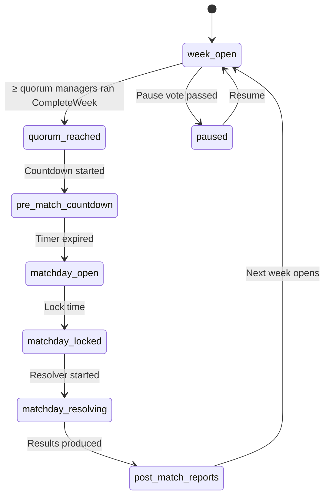
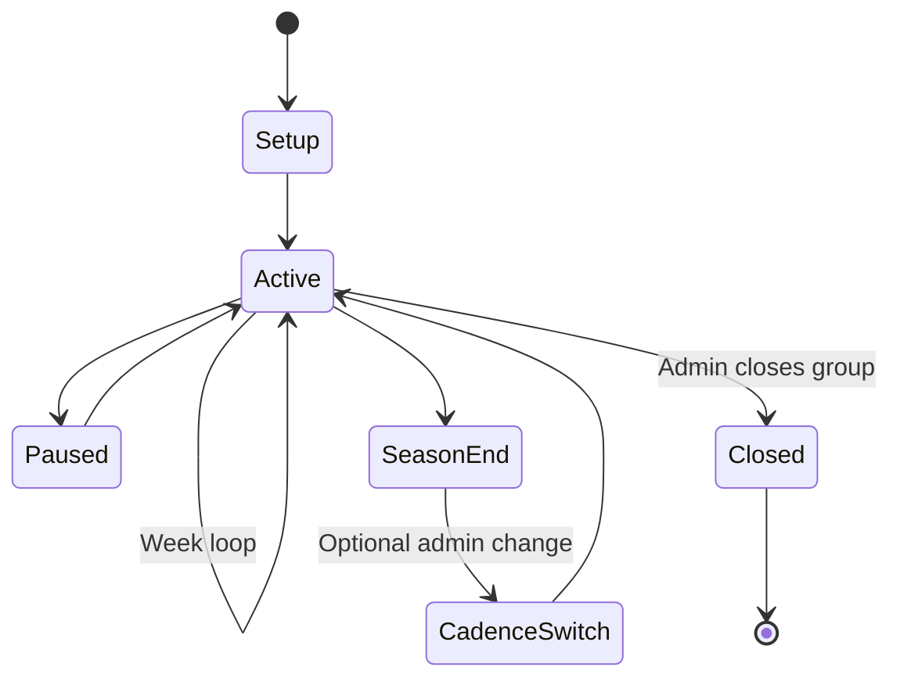

# Async Multiplayer - Private Group with Two Cadence Models

> **Status note (2026-06-11, FMX-143):** This system/mode note is `status: draft` — it was
> reopened 2026-05-27 and was **not** among the 133 decisions ratified in the 2026-06-08
> sweep (#153). "Approved" wording below is **pre-reopen history**, not a current status
> claim; the product rules described here await individual re-approval (decided by Nico,
> 2026-06-11: keep `draft`, re-approval is a later HITL pass — see
> [[../40-Execution/ratification-status-inventory-2026-06-11|status inventory]]). Frontmatter
> is the status SSOT per
> [[../10-Architecture/09-Decisions/ADR-0092-vault-governance-status-ssot-and-reference-integrity-sweep|ADR-0092]].
> The ratified GDDR layer ([[README|Game Design Hub]]) may cover the same system — the GDDR
> is then the binding record.

The flagship multiplayer mode. Invite-only friend groups, server-paced,
with **two configurable cadence models** (Fixed and Dynamic) sharing one
core. Approved at the product level; tuning remains `draft`.

FMX-189 clarifies the creation boundary: private async groups start from
server-owned MP setup state. Singleplayer, hotseat, local or imported saves
cannot be used to seed or join this mode.

## 1. Approved product rules

> **R1**. A private async group is invite-only.
>
> **R2**. The group is locked at creation to either Create-a-Club or
> Manage-a-Club mode - never mixed.
>
> **R3**. The group is server-paced. No player blocks the whole group.
>
> **R4**. Two cadence rule sets are available: **Fixed** (default) and
> **Dynamic**. Switching is allowed **only at season boundary**.
>
> **R5**. Inactivity falls back to defaults or assistant logic - never to
> "stop the world".

## 2. Group creation

At group creation the admin picks:

- **Name + invite list**.
- **Content mode**: Create-a-Club | Manage-a-Club.
- **League structure**: tiers, promotion, cup competitions.
- **Cadence**: Fixed | Dynamic.
- **Cadence parameters** (see §4).
- **Watch-party permissions**.
- **Pause-vote quorum**.

The admin does not upload or promote a singleplayer/hotseat save. All clubs,
fixtures, economy, rosters and entitlement-relevant state in the group are
created or assigned through the MP server flow.

## 3. Cadence model A: Fixed

Hard match-days, hard deadlines.

| Day | Activity |
|---|---|
| Mon-Fri | Async management phase |
| Fri evening | Transfer + contract + line-up deadline |
| Sat | Match-day simulation |
| Sun | Review, fans, media, injuries |

Variants:

- One match-day per week (default).
- Two match-days (Wed + Sat) for higher tempo.

## 4. Cadence model B: Dynamic

Match-day opens when a configurable quorum of managers has closed their
week.

State machine implementation: [[../10-Architecture/state-machines/league-week]].

### Configurable parameters

| Setting | Options | Default |
|---|---|---|
| Quorum | 50 / 66 / 70 / 80 / 100 % | 66 % |
| Countdown after quorum | 6 / 12 / 24 / 36 h | 24 h |
| Max week length | 2 / 3 / 5 / 7 days | 5 days |
| Auto-resolve on inactivity | Last tactic / Assistant / Minimal default | Last tactic |
| Pause vote quorum | 50 / 66 / 80 % / admin override | 66 % |

### Mandatory safety nets

- Maximum week length forces auto-resolve.
- Inactivity fall-backs (last tactic, assistant, minimal default).
- Visible reminders + countdown UI.

## 5. Pause by majority

Any member can start a pause vote. Options:

- Pause 1 week.
- Pause 2 weeks.
- Pause until date X.

Quorum gated (see §4 setting). On success, league enters `paused`, freezing
countdowns and auto-resolve jobs. Admin override is allowed but the group
quorum is the default mechanism.

## 6. Interaction tiers in async groups

Three tiers of player-player interaction:

| Tier | Examples |
|---|---|
| Pure async | Own training, scouting, sponsoring, stadium build, finance, tactic prep |
| Deadline-based | Transfer offers between humans, free-agent competition, sponsor draft, league-rule votes |
| Synchronous (optional / rare) | Direct negotiations, human-vs-human live coaching, watch parties, conference mode |

Pure-async stays local. Deadline-based actions get **explicit fall-backs**
(see [[transfer-negotiations-p2p]] and §7). Live moments are optional via
watch parties ([[watch-party-and-conference]]).

## 6.1 Match Authority and Depth

All async multiplayer match results are server-authoritative per
[[../10-Architecture/09-Decisions/ADR-0011-server-authoritative-multiplayer]].
Local devices may prepare tactics, lineups, substitutions plans and preview
likely outcomes, but those previews are non-binding.

Match-depth policy:

| Fixture | Profile | Storage |
|---|---|---|
| Human-vs-human | `competitive-full` | Full event log + seed + summary |
| Human-vs-AI | `competitive-full` | Full event log + seed + summary |
| Watched AI-vs-AI / title decider | `background-detailed` or promoted to `competitive-full` | Seed + summary, full log on demand |
| Ordinary AI-vs-AI | `background-fast` or `background-detailed` | Seed + lineups + tactics + summary |

Fixed cadence benefits from this model because the server can batch work during
the matchday window. Dynamic cadence uses the same profiles once quorum and
countdown reach `matchday_locked`.

## 7. Inactivity policy

When a manager doesn't act before a deadline:

| Action type | Fall-back |
|---|---|
| Close week | Last week's tactic + assistant fills training |
| Transfer offer (incoming) | Expires; agent registers interest for escalation |
| Transfer offer (own outgoing) | Submitted as last drafted version or cancelled |
| Free-agent competition | Forfeit |
| Vote | Counted as abstention |
| Match-day line-up | Last valid line-up |

Repeated inactivity over multiple weeks triggers a group event ("Manager
on hiatus") so the group can vote on holding / replacing / pausing.

## 8. Notifications

Three classes (from [[../60-Research/async-multiplayer-research]] §7):

- **Transactional**: transfer offer received, deadline closing, quorum
  reached.
- **Realtime**: watch-party starting, match-day open, counter-offer
  arrived.
- **Digest**: weekly summary, post-match recap, group status.

Per-user channel preferences, rate-limited, escalation in-app → reminder →
optional mail / Discord webhook.

Architecture binding: [[../10-Architecture/09-Decisions/ADR-0043-notification-and-messaging-platform]]
and [[../30-Implementation/notification-messaging-platform]]. This narrows the
above product shorthand: escalation is in-app first, then reminders and optional
transactional email where the category allows it. User-facing Discord/webhooks
are post-MVP opt-in integrations, not default notification channels.

## 9. Admin powers

- Cadence change (season boundary only).
- Cadence parameters tweak (season boundary only).
- Member add / remove.
- Pause / resume override.
- Force-close week (emergency only, surfaced as group notice).

## 10. Group lifecycle

## 11. Group + mode interaction

| Group mode | Run end semantics |
|---|---|
| Create-a-Club | If a manager's run ends, they restart next season in a lower league; an AI club fills the empty slot meanwhile |
| Manage-a-Club | If a manager is sacked, they apply to a new club inside the league; if no fit, they sit out for a season |

## 12. UI tier interactions

| Tier | Async-specific surface |
|---|---|
| Quick | "Group calendar" with 1-2 actionable cards per week |
| Standard | Group dashboard: weeks status, deadlines, transfer activity |
| Expert | Full league state, all timers, member activity timeline |

## 13. Open tuning questions

- Match-day duration in Fixed cadence - typically a full day (00:00-23:59
  local) so human-vs-human matches can be played at convenience.
- Should the cadence picker explain the trade-offs in plain copy? Yes -
  inline help with tone aligned to [[../95-Archive/gap-reports/research-wave-2-gaps]] R2-10.
- Can a group migrate between Fixed and Dynamic mid-season as an
  emergency? No - only at season boundary. Emergency = admin force-close +
  next-season switch.
