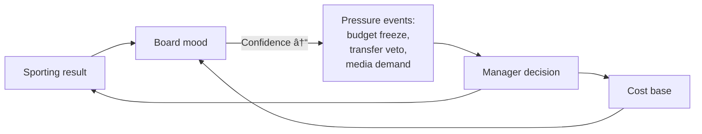

---
title: Club DNA and Governance
status: draft
tags: [game-design, club, governance, identity]
created: 2026-05-16
updated: 2026-05-16
type: game-design
binding: false
related: [[README]], [[../60-Research/systems-design-synthesis]], [[mode-manage-a-club-career]]
---

# Club DNA and Governance

Every club has a measurable identity that shapes how the board, fans and
sponsors interpret the same management decisions. Two managers can produce
the same results at two different clubs and be judged completely
differently. This is the design choice that prevents "every club is the
same once you remove the kits".

## 1. Club DNA parameters

Each club has seven persistent DNA parameters. They change slowly (over
seasons, after big events) but never per-week:

| Parameter | Range | In-game effect |
|---|---|---|
| `club_size` | 1-10 | Higher → bigger table / transfer / squad-depth expectations |
| `tradition` | 1-10 | Higher → fans react harder to style-breaks, selling icons, sponsor switches |
| `region_score` | derived | Sponsor potential, attendance base, talent pool |
| `board_profile` | enum | Cautious / Aggressive / Youth-focused / Profit-driven / Owner-vanity |
| `philosophy` | enum | Pressing / Possession / Counter / Youth / Selling club / Defensive |
| `debt_position` | derived | Liquidity pressure, credit cost, transfer cap |
| `brand_strength` | 1-10 | Merch turnover, sponsor tier, international reach |

`region_score` and `debt_position` are computed; the other five are
authored / scenario-set / generated and can drift over a manager's tenure.

## 2. Board governance system

The board is not a popup. It evaluates the manager monthly on eight KPIs:

| KPI | What it measures |
|---|---|
| Table goal | Position vs season target |
| Budget discipline | Wage budget + transfer budget compliance |
| Wage ratio | Total wages / revenue |
| Youth minutes | Minutes for U-21 home-grown players |
| Transfer P&L | Net transfer balance + book value impact |
| Environment mood | Fans + media + sponsor satisfaction composite |
| Stadium utilisation | Average attendance / capacity |
| Media image | Press-conference + result narrative score |

KPIs combine into **Board Confidence** (0-100). See split confidence in
[[mode-manage-a-club-career]].

## 3. Pressure loop

The cycle is *deliberately* non-linear. Sporting failure on a high cost
base is much riskier than 10th place on a lean squad with positive
cash-flow.

## 4. Expectation profile per club

Different DNA → different acceptable performance bands. A tradition club
with high `tradition` and modest `club_size` accepts 8th place if youth
minutes are high and identity intact. A sugar-daddy owner-vanity club with
high `club_size` and low `tradition` does not.

| DNA archetype | Acceptable | Unacceptable |
|---|---|---|
| Tradition village club | Mid-table + youth investment | Selling icons, defensive identity break |
| Investor club | Title / top-3 / European cup | Mid-table without spend |
| Selling club | Top-half + healthy transfer P&L | Top-3 with bleeding finances |
| Mass-market global brand | Trophies + brand expansion | Local-only focus, anti-sponsor stance |

This table drives the per-club weighting of Board Confidence + Supporter
Confidence in [[mode-manage-a-club-career]].

## 5. DNA drift

DNA evolves slowly:

- `tradition` drifts down on each season of heavy commercialisation.
- `brand_strength` drifts up on continental success and global star
  signings.
- `debt_position` rebases on financial reporting.
- `philosophy` can be retargeted by a board decision (multi-season project).

DNA never resets in career mode; only in roguelite mode the club ends and
a new one starts.

## 6. Roguelite implications

In [[mode-create-a-club-roguelite]] the player chooses DNA at run creation
(within unlock constraints from prior runs). DNA cannot be changed mid-run
- making the wrong DNA pick is part of the run.

## 7. Future-scope notes (classified future-scope)

- Should DNA values be visible to the player as numbers, or as descriptive
  badges? Recommendation: badges by default; expert tier shows numbers.
- Can sponsors influence `tradition` drift? Currently modelled as a side
  effect of accepting certain sponsor categories.
- How does community editor handle DNA? See
  [[community-editor-and-datasets]]; DNA is part of the override pack
  schema.
