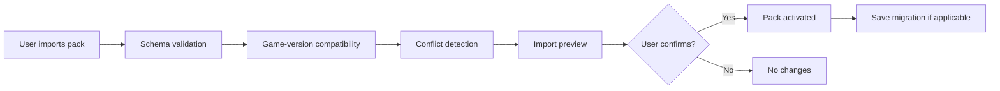

# Community Editor and Dataset Override Packs

The base game ships with a fictional, IP-clean universe per
[[../60-Research/ip-and-licensing]] and
[[../10-Architecture/09-Decisions/ADR-0007-naming-schema]]. The
community-editor system lets users **override** master data with their
own dataset packs without breaking versioning or saves.

## 1. Product rule

> **Datasets are versioned override packs with manifests + schema
> validation + stable IDs. The base dataset is never rewritten by users -
> packs are layered on top.**

## 2. Pack types

| Type | Purpose | Example |
|---|---|---|
| **Core dataset** | Official IP-clean fictional universe | Ships with the game |
| **Override pack** | Replaces names, colours, logos, competitions, rivalries, squads | "real-look" community packs |
| **Expansion pack** | Adds countries / leagues / clubs not in core | Lower-tier amateur leagues, women's leagues |
| **Scenario pack** | Alternative start years, historical worlds, fantasy | "1990 start", "World War scenario" |

Packs are stacked in priority order. Conflicts are surfaced in the import
preview (see §5).

## 3. Manifest schema

Each pack has a manifest:

```yaml
pack:
  id: my-pack-id
  name: "My Pack"
  version: 1.4.2
  author: "Pack Author"
  game_version_min: 0.4.0
  game_version_max: 0.x.x
  pack_type: override   # override | expansion | scenario
  depends_on:
    - core@1.0.0
  replaces:             # which entities this pack overrides
    - clubs
    - players
  adds:                 # additional entities (expansion / scenario)
    - leagues
  priority: 100
  ip_disclaimer: required
```

Stable IDs are the primary keys, not names. Renaming a player keeps the
ID; renaming a club preserves history.

## 4. Validation pipeline



Validation rules:

- Schema must match the game's data-model schema (per ADR-0004).
- All required fields present.
- Stable IDs resolve (entities being replaced must exist; entities being
  added don't conflict).
- IP disclaimer accepted (legal hand-off to user).

## 5. Conflict detection

If two packs both replace the same entity, the higher-priority pack wins.
The preview shows:

- Entities replaced.
- Entities added.
- Entities in conflict (with priority winner).
- Game-version flags (incompatible packs are blocked).

## 6. Save compatibility

A save records which packs were active when created. On save load:

- If all packs available + same version → load.
- If pack missing → user offered "load without pack" (entities revert to
  core/base) or "abort".
- If pack version newer → migration check (per pack's `migrations.yaml`).
- If pack version older → block; user must reinstall correct version.

## 7. Editor UI

The in-game editor lets users:

- Create a pack from scratch.
- Fork an existing pack.
- Edit clubs, players, leagues, competitions.
- Set logos / colours / kit patterns.
- Export pack as a single file.
- Import a pack file.
- See validation results inline.

## 8. IP boundaries

The editor's input forms remind the user:

- **You** are responsible for any real-world data you enter.
- The game ships fictional names; using real ones is your choice.
- We do not distribute community packs that include real-world data.

This is consistent with [[../60-Research/ip-and-licensing]] §IP hard
stops.

FMX-54 adds privacy and persona-content validation to the same boundary:

- Local imports should show an explicit IP/privacy warning before activation.
- Schema validation should block or flag real private-person data, doxxing
  content, real supporter membership lists, real social handles, real fan-group
  names, real chants/slogans, real-person AI impersonation and
  special-category-like fan fields.
- Fan groups, fan reps, journalists, media outlets, sponsors and venues in packs
  must satisfy the same ADR-0007/GD-0015 naming policy as shipped data.
- The game must not treat imported fan-persona data as permission to profile
  the player/user account.

## 9. Distribution

Packs are *not* hosted by us at MVP. Users share them peer-to-peer (file
upload, forums). The game supports local file import only - no built-in
marketplace. This protects us from hosting potentially infringing material and
keeps DSA/UGC platform operations out of the current scope.

Hosted pack distribution, pack discovery or marketplace functionality is a
future legal/product gate. Before that ships, the documentation must define:

- DSA notice-and-action intake, complaint/appeal handling, moderation logs,
  repeat-abuse policy, takedown and revocation workflow;
- uploader/creator provenance metadata and retention;
- AI-generated content transparency labels where applicable;
- Privacy Notice, RoPA, DSAR/export and deletion handling for hosted UGC,
  moderation data and uploader identities.

## 10. UI tiers

| Tier | Editor surface |
|---|---|
| Quick | One toggle: "Use community pack? Yes / No" + file picker |
| Standard | Pack list, active/inactive toggles, conflict preview |
| Expert | Full editor with per-entity diff, manifest authoring, schema validator |

## 11. Future-scope notes (classified future-scope)

- Should the editor support partial-overlay scenario packs (e.g. "alternate
  champion 2017" without changing players)? Yes - via scenario packs that
  only override historical outcomes.
- Save-format version migration for community packs - migrations live
  inside the pack file; the game runs them after schema-validating the
  pack.
- League editor depth: at MVP, structure editor (tiers, promotion rules,
  fixture format) is in scope; per-team historical results editor is
  Phase 2.
