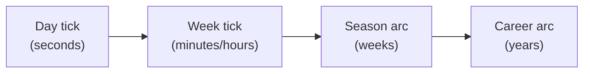
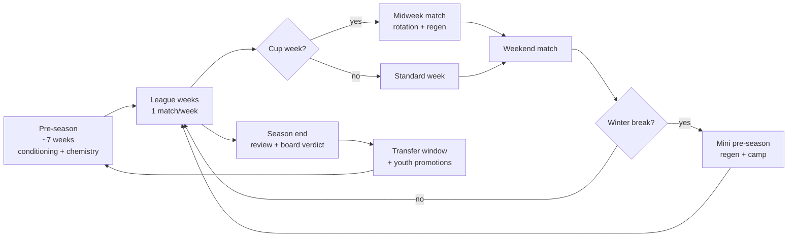
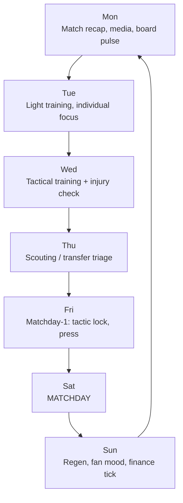
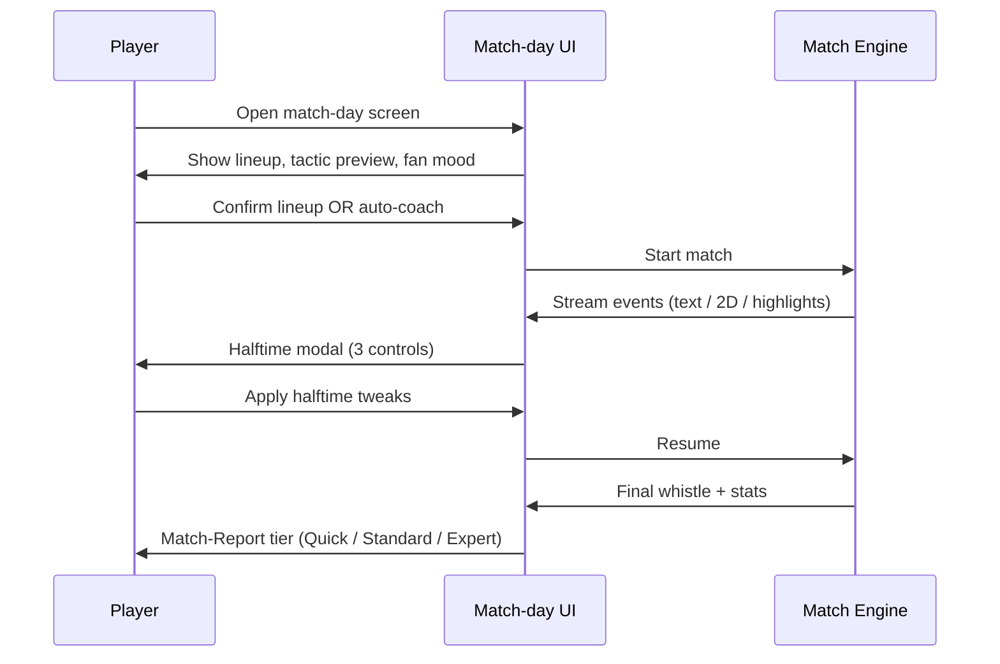

# Core Loop - Season Arc and Weekly Heartbeat

> **REOPENED on 2026-05-27:** This game-design note is `draft` again. Any `approved`, `binding`, or `locked` wording below is historical pre-reopen context until Nico re-approves it.

The single most important game-design decision: how often the player taps,
what they tap on, and what happens between taps. Everything else - economy,
tactics, fans, transfers - rides on the loop.

MVP sequencing note: the loop first ships through
[[mode-create-a-club-roguelite]]. [[mode-manage-a-club-career]] uses the same
loop when it becomes playable post-MVP.

## 1. Three nested loops

| Loop | Cadence | Player verb | Stakes |
|---|---|---|---|
| **Day tick** | One real-life button press, instant | Advance, edit, accept | A training, a media reply, an inbox card |
| **Week tick** | 5-25 min of real time | Plan, simulate, react | One match, one cycle of training + scouting + transfers |
| **Season arc** | 20-30 weeks at game cadence | Compete, develop, position | Promotion / relegation, board verdict, transfers |
| **Career arc** | Many seasons | Strategise, evolve | Reputation, manager talent tree, legacy |

## 2. Season arc

Source pattern: [[../60-Research/anstoss-series-deep-dive]] §4 (Anstoss
7-week pre-season + winter break) consolidated with FM weekly model.

## 3. Standard league week

## 4. Day-tick model

Each day tick is one explicit "advance" verb on the UI. The day produces:

- 0..N inbox cards (board, sponsor, media, scout, fans, staff).
- Auto-applied training (if not edited).
- Auto-applied schedule actions (if not edited).
- A match if the day is match-day.

The player **always** has a "next" verb on screen. They never wonder what to
click. This is the Anstoss "office-as-cockpit" pattern made mobile.

## 5. Skip rule

Days the player does not customise fast-forward through:

- Recovery days.
- Light training days.
- Pure off-days.
- Empty inbox days.

Days the player **must** see:

- Match-day.
- Match-day −1 (tactic lock).
- Inbox with priority cards (board demand, sponsor decision, injury).

This is how a 5-min/week casual session and a 25-min/week power session
share the same engine but produce different click depth.

## 6. Match-day choreography

Reports vary by user UI tier - see [[progressive-disclosure-ui]].

## 7. Season-end gate

The season-end "gate" (board verdict + transfer window + youth promotions)
is the only mandatory full-detail event in a season. Cannot be skipped, can
be paused. Outcomes:

- Manager stays / is sacked / is offered new role (career mode).
- Manager run continues / ends (roguelite mode).
- Board sets new expectation profile.
- Transfer budget + wage budget set.

Detail per mode: [[mode-manage-a-club-career]] / [[mode-create-a-club-roguelite]].

## 8. Async cadence overrides

In an async private group ([[async-multiplayer-private-group]]) the day-tick
loop is driven by the group rule set:

- **Fixed Cadence**: match-day is on a real-life calendar day.
- **Dynamic Cadence**: match-day opens when a quorum of managers has marked
  their week complete.

In both, the **week structure** above is the same; only what triggers the
match-day differs.

## 9. Future-scope notes (classified future-scope)

- How long is a "default" Quick-tier session? Target ≤ 5 min for a normal
  week, ≤ 15 min for a match-day with halftime tweaks.
- Should the season length be configurable per scenario pack
  ([[community-editor-and-datasets]])? Recommendation: yes, with a sensible
  default per league.
- Should the day tick be visualised as a calendar or as an "office clock"
  (Anstoss feel)? Both - calendar view is primary; office vignette is the
  flavour layer.
## Related

- [[README]]
- [[GD-0017-mvp-scope-and-mode-sequencing]]
- [[../60-Research/anstoss-series-deep-dive]]
- [[../60-Research/systems-design-synthesis]]
- [[mode-create-a-club-roguelite]]
- [[mode-manage-a-club-career]]
