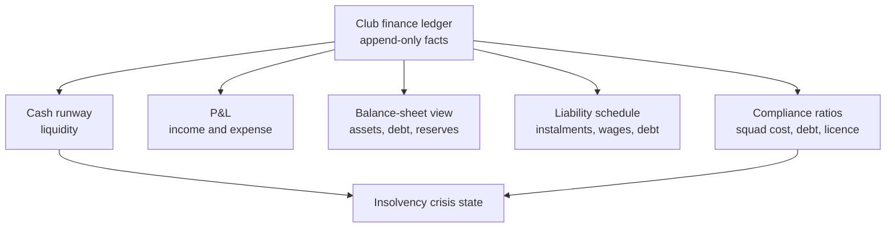
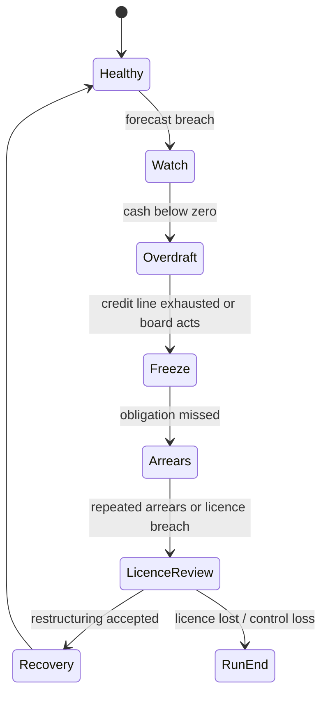

# Economy System - Weekly Ledger, Accounting and Club Risk

The economy is a **weekly ledger and accounting simulator**. The player sees
simple risk surfaces first, but the simulation tracks cash timing, accounting
result, liabilities and compliance separately.

## 1. Canonical model

The ledger is owned by Club Management. Other systems contribute facts through
contracts; they do not write finance state directly.

## 2. Weekly tick

Each in-game week:

1. Recurring obligations are posted: wages, staff, facility upkeep, debt,
   scheduled transfer instalments, insurance and levies.
2. Event-based entries are posted: matchday revenue/cost, sponsor payments,
   merchandise spikes, prize payments, facility commitments, fines.
3. Accounting projections update.
4. Thresholds are evaluated.
5. Warnings, board pressure and insolvency-stage changes emit structured facts.

Monthly and season screens aggregate the weekly facts; they are not separate
sources of truth.

## 3. Account layers

| Layer | Purpose | Example decisions |
|---|---|---|
| Cash | Can the club pay this week? | Sell player, defer project, take overdraft. |
| Operating P&L | Is the club structurally profitable? | Cut wages, raise prices, grow sponsors. |
| Transfer budget | Board-approved spending envelope. | Spend now or preserve liquidity. |
| Wage budget | Weekly squad/staff wage ceiling. | Renegotiate, release, add relegation clauses. |
| Debt | Loans, overdraft, instalments, interest. | Refinance, repay early, accept risk. |
| Reserves | Risk buffer and restricted funds. | Hold cash or invest in infrastructure. |
| Assets | Squad book value, stadium/campus value. | Develop youth, amortise fees, renovate. |

Important rule: **budget is permission, not cash**.

## 4. Revenue taxonomy

| Source | Primary drivers | Timing |
|---|---|---|
| Ticketing | Segment latent demand, league, opponent, table, price, weather, fan loyalty, ticketing trust, season-ticket campaign lifecycle | Matchday / season-ticket pre-sale cash, with accrual recognition as matches are played |
| Catering | Attendance, dwell time, fan mix, risk policy, catering contract model and service quality | Matchday + venue events, with contract cash/recognition schedule |
| Hospitality | Corporate demand, premium capacity, sponsor portfolio, hospitality contract terms | Matchday / contract |
| Merchandise | Brand, stars, success, campaigns, merch contract and fulfilment quality | Seasonal spikes, royalties/MAG/true-up schedule |
| Sponsoring | Reach, image, fan fit, assets, league, exclusivity and activation delivery | Contract cadence with cash and recognition schedule |
| Media rights | Country profile, league tier, table | Profile-specific lump/periodic |
| Transfers | Player value, contract, buyer pressure | Upfront + instalments |
| Prizes | Cup, promotion, title, continental progress | Competition-specific cash, receivable and future-EV profiles |
| Venue events | Stadium flexibility, calendar, location | Event boundary |
| Academy/funding | Country profile, youth setup | Annual / seasonal |

## 5. Cost taxonomy

- Player and staff wages.
- Signing fees, loyalty bonuses, agent fees.
- Transfer amortisation and instalments.
- Matchday stewarding, security, policing-style contribution, medical,
  emergency services, cleaning, waste, energy, temporary staff and officials.
- Stadium energy, pitch recovery, maintenance, insurance and safety /
  compliance overhead.
- Travel and accommodation.
- Academy, scouting, medicine and training operations.
- Debt service and overdraft interest.
- League/federation levy, fines and licence penalties.
- Facility build cost and renovation cost.

## 6. Full accounting surfaces

| View | Purpose |
|---|---|
| Cashflow statement | What cash moved this week/month/season. |
| P&L | Recognised revenue and cost by period. |
| Balance-sheet view | Cash, debt, assets, reserves and obligations. |
| Amortisation schedule | Transfer fee recognition over contract length. |
| Liability schedule | Future cash obligations and due dates. |
| Receivable schedule | Future incoming cash and risk. |
| Compliance view | Squad cost, debt, runway and licence readiness. |

Expert players can inspect these. Quick players see only the decision impact:
runway, risk card, next best actions.

## 7. KPIs

| KPI | Meaning |
|---|---|
| Cash runway | Weeks the club survives at current forecast. |
| Wage ratio | Wages over recognised revenue. |
| Squad cost ratio | Wages + transfer amortisation + agent/transaction cost over revenue. |
| Debt ratio | Debt and obligations over annual revenue. |
| Matchday dependency | Share of income tied to home fixtures. |
| Sponsor dependency | Share of income tied to sponsor portfolio. |
| Transfer dependency | Reliance on player sales to stay liquid. |
| Reserve coverage | Reserve over next-N-week fixed obligations. |
| Compliance readiness | Pass/fail/at-risk per country and tier profile. |

## 8. Staged insolvency

Run end is not instant. The drama is the recovery window:

- sell a player;
- cut wages;
- renegotiate debt;
- accept sponsor advance;
- defer facility work;
- accept board restrictions;
- in future-scope SP only, consider an Investor rescue event.

## 9. Country economy profiles

Country profiles define data, not code branches:

| Profile | Draft coverage |
|---|---|
| Germany | Deep professional-to-amateur boundary, licence/compliance and lower-tier matchday relevance. |
| England | Pyramid/ground-grade profile plus parachute-payment style relegation smoothing. |
| France | Top-tier licence, sustainability and economic stability profile. |
| Italy | Top-tier licence/stadium obligations and amortisation/compliance defaults. |
| Spain | Top-tier licence and media/commercial profile; lower tiers abstract initially. |
| Abstract | Generic generated-country profile and community-pack fallback. |

Each profile owns payment cadence, league levies, media distribution style,
parachute/solidarity rules, licence checks, tax/fee assumptions and calibration
ranges.

## 10. Roguelite implications

The death spiral runs through this system:

1. Over-aggressive wage / transfer spending creates fixed obligations.
2. Sporting failure reduces attendance, sponsor confidence and prize odds.
3. Cash runway falls.
4. Board freezes discretionary spend.
5. Forced sales hurt squad strength and fan trust.
6. Arrears trigger licence review.
7. Licence loss, forced dissolution or control loss ends the run.

Good play is not hoarding cash forever. It is managing risk while still
investing enough to grow.

## 11. UI tiers

| Tier | Surface |
|---|---|
| Quick | Runway badge, weekly cash delta, one to three action cards. |
| Standard | KPI dashboard, 13-week forecast, upcoming obligations and risk explanations. |
| Expert | Statements, amortisation, liability schedule, country profile, sensitivity analysis. |

## 12. Calibration rules

- Store ranges, formulas and profile multipliers in data.
- Do not hard-code final economy constants in docs before balance evidence.
- Long-save balance tests must track wage inflation, debt growth, insolvency
  frequency, runaway cash and promotion/relegation shocks.
- Real external numbers calibrate scale only; shipped content stays IP-clean and
  fictional.

## 13. Commercial impact graph

FMX-41 extends the weekly ledger with a named commercial cause layer. The ledger
still owns the money, but the causes come from contracts and public read models:

| Cause | Source | Ledger effect |
|---|---|---|
| Season-ticket campaign | Ticketing policy + fan renewal forecast + stadium seat-class inventory | Early cash or receivables, deferred revenue/accrual, reduced single-ticket inventory |
| Single-ticket sales | Fixture commercial profile + price policy | Matchday ticket cash and top-match surcharge effect |
| Catering | Stadium throughput + catering contract lifecycle + service levels | In-house revenue/COGS/staff or concession/rent/share income, penalties for SLA breach |
| Merchandise | Fan demand + merch contract lifecycle + star/cup/rivalry signals | Retail cash, royalty/MAG true-up, inventory cost, campaign profit/loss, fulfilment penalties |
| Sponsorship | Sponsor portfolio + commercial contract lifecycle | Upfront cash, periodic accrual, bonuses, penalties, make-goods and termination effects |
| Cup progression | Competition revenue profile | Prize/media/gate-share/travel/security entries plus receivables, future EV and elimination-shock read models |
| Matchday operating profile | Fixture risk + Stadium Operations + Rivalry + Audience & Atmosphere + Regulations | Stewarding/security/policing-style/medical/cleaning/energy/staff/pitch/insurance/sanction costs plus restrictions and risk-tier feedback |
| Fan-service campaign | Fan event policy | Direct costs, sponsor contributions, loyalty/demand effects |
| Investor entitlement | Singleplayer payment entitlement | Clean cash grant, no other state change |

FMX-42 refines the fan-demand cause layer: ticket price acts on latent demand
by segment before capacity is allocated. Capacity pressure, ticketing trust,
fixture attractiveness and season-ticket protection explain why a full stadium
can still hide long-term commercial damage.

FMX-43 refines the season-ticket layer: Club Management must distinguish cash
receipt, internal instalment receivables, finance-partner fees, deferred
revenue, match-by-match recognition and aggregate credit/refund liabilities.
No-show, release, transfer and compensation rules operate on fan-group cohorts,
not individual supporters. A Quick player sees "cash now versus revenue earned
later"; Standard and Expert expose the schedule.

FMX-44 refines the commercial-contract layer: sponsorship, catering,
merchandise, hospitality, supplier and venue-activation contracts share one
lifecycle shell with family-specific schedules. The ledger must separate cash
timing from recognition, and must post penalties, rebates, damages, make-goods,
true-ups and termination payments as separate facts. Breaches are
curable/material/critical; exclusivity conflicts are category/territory/asset
overlaps, not prose notes. Quick mode sees cash/risk/conflict badges, while
Expert mode can inspect the contract register, obligation log, breach cases,
renewal calendar and exclusivity graph.

FMX-45 refines the competition-revenue layer: domestic and continental cups are
profile-driven settlement events. A `CompetitionRevenueProfile` separates prize
schedule, gate sharing, ticket allocation, media/facility cadence, travel,
security, neutral venue rules, replay/two-leg rules, sponsor triggers,
merchandise spikes, fixture-congestion hooks and forecast policy. The ledger
posts hard cash, receivables and costs; future cup EV remains a non-spendable
forecast. Elimination removes future upside and records a forecast shock rather
than a hidden cash loss.

FMX-46 refines the matchday operating-cost layer: every relevant fixture can
receive a `MatchdayOperatingCostProfile` with stewarding, security,
policing-style contribution, medical/emergency cover, cleaning/waste, energy,
temporary staff, officials, pitch recovery, insurance/compliance, damage
reserve and restriction/sanction effects. Risk tiers (`routine`, `guarded`,
`elevated`, `highRisk`, `restricted`, `closedDoor`) are visible before the
match. Mitigation can reduce probability or severity, but costs money or
revenue; sector closures and ghost matches remove attendance income while
preserving required operating costs.

The same settlement supports Quick / Standard / Expert:

- Quick: total cost/revenue and recommended action.
- Standard: driver breakdown and 13-week forecast.
- Expert: contract clauses, ranges, schedules and sensitivity analysis.

## 14. Season-ticket accrual

Season tickets are not treated as one-time income. At sale or renewal time the
club may receive cash, apply account credit or create a receivable; the same
campaign also creates a future obligation for included home matches.

Minimum ledger distinction:

- cash receipt / receivable improves liquidity and runway;
- deferred revenue is a liability until included matches are played;
- recognised ticket revenue is released match by match;
- exchange, inaccessible-match compensation and carried credits sit in a
  credit/refund liability pool;
- payment plans alter cash timing and risk, not the underlying match-access
  obligation.

This keeps the game fair: selling many season tickets can save a short-term
cash crisis, but it cannot magically repair a bad operating model and it limits
future top-match upside.

## 15. Investor grant

Investor is a singleplayer-only cash entitlement if activated. It posts cash to
the ledger with clear provenance and has no gameplay penalty:

- no owner-control change;
- no debt;
- no fan or sponsor backlash;
- no multiplayer effect;
- no change to wage, debt, compliance or demand formulas.

It buys liquidity only. A club with a negative weekly operating loop will still
burn through the grant.

## 16. Future-scope notes

- Manual accounting controls: not planned.
- Deep tax modelling: only if it creates player-facing decisions.
- Full country-specific lower-tier profiles: add after the initial Top-5 +
  abstract baseline proves useful.

## Related

- Decision records: [[GD-0008-finance-economy]] ·
  [[GD-0022-economy-commercial-impact-and-contracts]]
- Research: [[../60-Research/club-economy-blueprint-2026-05-27]] ·
  [[../60-Research/club-economy-impact-map-and-commercial-contracts-2026-05-28]] ·
  [[../60-Research/fan-demand-price-elasticity-2026-05-28]] ·
  [[../60-Research/season-ticket-lifecycle-and-accounting-2026-05-28]] ·
  [[../60-Research/commercial-contract-lifecycle-and-breach-model-2026-05-28]] ·
  [[../60-Research/cup-and-competition-revenue-profiles-2026-05-28]]
- Feature: [[../20-Features/feature-club-economy-mvp-pillar]]
- Architecture: [[../10-Architecture/09-Decisions/ADR-0050-club-economy-accounting-ledger]] ·
  [[../10-Architecture/09-Decisions/ADR-0058-club-economy-commercial-impact-boundary]]
- Linked systems: [[sponsorship-portfolio]] · [[stadium-and-campus]] ·
  [[audience-and-atmosphere]] · [[transfer-market-and-contracts]] ·
  [[mode-create-a-club-roguelite]]
