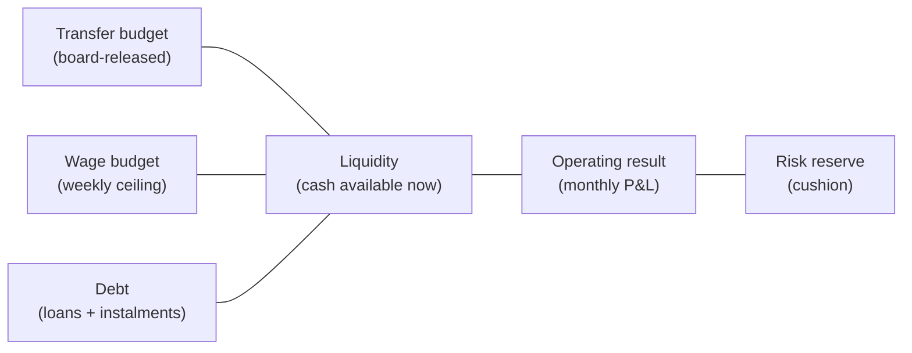

# Economy System - Cash-flow, Budgets and KPIs

The economy is a **monthly cash-flow simulator**, not a single bank balance.
A club can look healthy in P&L and still fail short-term if instalments,
wages, building projects and credit duties stack up unhelpfully. This is
where the roguelite "death spiral" originates.

## 1. Six account layers

| Account | Purpose | Action levers |
|---|---|---|
| Liquidity | Immediate cash | Loan draw, transfer sale, sponsor advance |
| Operating result | Monthly P&L | Ticket price, wage adjust, sponsor terms |
| Transfer budget | Board investment cap | Negotiate with board, sell to raise |
| Wage budget | Weekly wage ceiling | Wage policy, squad trimming |
| Debt | Loans + instalments + interest | Refinancing, early repayment |
| Risk reserve | Unallocated cushion | Set aside in good months |

Important rule: **Transfer budget ≠ cash.** The board may release a budget
that the club can only spend if liquidity allows or extra credit is taken.
Transfer packages therefore affect both immediate liquidity and future
liabilities: instalments, bonuses, wage subsidies and sell-on obligations must
flow into cash-flow projections.

## 2. Revenue taxonomy

| Source | Primary drivers | Secondary drivers |
|---|---|---|
| Ticketing | League, opponent, table, price tiers | Weather, kickoff time, form, rivalry |
| Season tickets | Bonding, price strategy | Comfort, queueing, expectation profile |
| Catering | Dwell time, fan zones, stand density | Quality, family share, weather |
| Hospitality / VIP | Business demand, premium plates | Sponsor portfolio, stadium quality |
| Merchandise | Brand strength, stars, success | Fan identification, campaigns |
| Sponsoring | Reach, utilisation, image | Fan profile, hospitality, naming potential |
| Media rights | League tier, table | TV pool, cup runs |
| Transfers | Talent development, contract length | Market activity, agents, timing |
| Events / tours | Stadium flex, free days | Location, logistics, noise rules |
| Stadium attractions | Anstoss-style on-grounds revenue | See [[stadium-and-campus]] |

## 3. Cost taxonomy

- Player wages.
- Staff wages.
- Bonuses (appearance, match-win, qualification).
- Transfer amortisation + instalments.
- Stadium operation + maintenance.
- Academy + scouting network.
- Medicine + sport science.
- Travel.
- Debt service.
- Match-day security + operations.
- Insurance.

## 4. KPIs that drive management style

Instead of "balance: green/red" the UI surfaces 8 KPIs:

| KPI | Healthy range (mid club) | Levers |
|---|---|---|
| Wage ratio (wages / revenue) | 50-65 % | Wage policy, squad trim, revenue grow |
| Transfer ratio (net spend / revenue) | < 25 % | Buying / selling balance |
| Match-day dependency | 25-40 % | Stadium attractions, hospitality |
| Sponsor dependency | 20-35 % | Diversify portfolio |
| Merch per fan | derived | Brand campaigns, store layout |
| Hospitality utilisation | > 80 % at top end | Suite upgrades, business outreach |
| Home-grown share | > 25 % desired | Academy, philosophy |
| Squad value vs book value | > 1.0 | Smart recruitment, dev |

A small club can be sustainable by developing + selling. A big club can be
fragile despite high turnover if wages and debt outrun revenue.

## 5. Financial Fair Play / sanctions

Two budget breaches across two seasons trigger:

- Transfer ban (single window).
- Wage cap reduction.
- Fines.
- Continental competition exclusion.

In [[mode-create-a-club-roguelite]] persistent breaches → loss of control →
run ends.

## 6. Roguelite implications

The roguelite "death spiral" runs *through* this system:

1. Bad scouting → bad signings on big wages.
2. Wage ratio breaches > 75 % → sponsor concern.
3. Operating result negative → cash reserve drains.
4. Risk reserve empty → forced sales at discount.
5. Sales hurt squad strength → bad results.
6. Bad results → board demand cost cuts + sponsor withdrawal.
7. Insolvency → run ends.

The drama is built into the cascade.

## 7. Transfer-Market Finance Rules

Transfer finance uses the model in [[transfer-market-and-contracts]]:

- `cashEquivalent` compares complex offers, but accounting still stores each
  component separately.
- Upfront fees reduce liquidity immediately.
- Instalments become dated liabilities.
- Performance bonuses are probability-weighted for planning and become hard
  liabilities when triggered.
- Sell-on / profit-share clauses reduce expected net proceeds on future sales.
- Loan wage-share and wage-contribution terms affect monthly wage outflow.
- Forced sales can repair liquidity, but they damage squad value, fan sentiment
  and board trust unless the context clearly justifies them.

Board / owner pressure can set transfer directives:

- raise cash by selling one high-value player;
- cut wage ratio by moving top earners;
- protect academy assets unless an offer includes sell-on / buy-back upside;
- block long instalment chains when liquidity is urgent.

## 8. UI surfaces

Per progressive disclosure ([[progressive-disclosure-ui]]):

- **Quick**: "Bank: green / amber / red" badge, 3 actionable cards.
- **Standard**: KPI summary screen with the 8 KPIs.
- **Expert**: Full P&L, cash-flow projection, contract liability schedule.

## 9. Future-scope notes (classified future-scope)

- Should currency be fictional (e.g. "credits") or per-country real
  currency in fictional clubs? Recommendation: per-country fictional
  currency (€/£/etc.) for realism without licensing.
- Inflation: do prices drift per season? Yes - modest 1-3 % per season to
  push the player to grow revenue with the squad.
- Owner injection: should a sugar-daddy owner be able to clear debt? Yes,
  but it has DNA cost (`tradition ↓`, `brand_strength ↑`).
