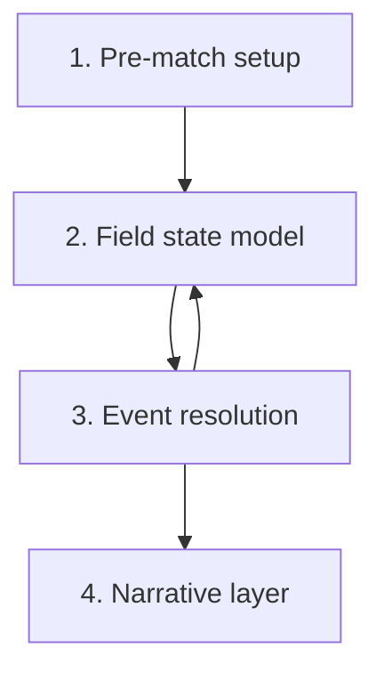

# Match Engine - 2D Event-based Specification

The match engine is **event-based, not frame-by-frame**. Pre-match setup
creates the starting probability space; in-engine events are resolved through
Markov transitions plus attribute contests; substitutions and tactic changes
recompute only the future from deterministic intervention points. This is the
FM / Football-Chairman lineage applied to a fictional 2D offline-first PWA.

> This note is the game-design specification. Architecture choices live in
> [[../10-Architecture/09-Decisions/ADR-0003-match-engine]] and the
> research depth lives in [[../60-Research/match-engine-simulation-model]].

## 0. Approved Gameplay Rules

- **Simulation first, presentation second.** Text commentary, 2D Canvas,
  watch-party feed and post-match reports all consume the same event/spatial
  outputs.
- **One match semantics, multiple depth profiles.** Human-relevant matches are
  deep; background fixtures are cheaper, but they still use compatible inputs
  and deterministic seeds.
- **Interactive matches stay interruptible.** The engine can buffer ahead, but
  player interventions must affect the remaining match.
- **No long-loading-screen design.** The player should enter matchday quickly;
  background fixtures run in batches and the active match can stream/buffer
  event chunks.
- **Multiplayer truth is server-authoritative.** Local multiplayer previews are
  non-binding; final async MP results come from the server Match Worker.

## 1. Four engine layers



### 1.1 Pre-match setup

Inputs:

- Team strength (per-position aggregates).
- Form.
- Morale.
- Home advantage (from [[fan-ecology]]).
- Tactical fit (per-player role match).
- Fatigue (from [[training-load-and-medicine]]).
- Weather.
- Referee profile.
- Stadium/fan atmosphere from [[fan-ecology]].
- Match context: rivalry, table pressure, cup knockout, home/away travel and
  competitive importance.

Output: frozen `PreMatchSetup`, initial field state and match RNG stream
seeds. Tactical changes later update team influence maps but never rewrite
past events.

### 1.2 Field state model

Tracks at each tick:

- Ball zone (1 of 18 grid zones).
- Team shape.
- Pressing pressure per zone.
- Numerical advantage per zone.
- Rest-defence quality.
- Set-piece state (open play / dead ball pending).
- Momentum/pressure state derived from recent events, crowd atmosphere and
  score context. Momentum adjusts risk and morale modifiers; it is not a
  hidden rubber-band that overrides attributes.

### 1.3 Event resolution

A match is a stream of events. Each event is generated from current field
state and resolved by attribute math + RNG:

| Event | Resolution drivers |
|---|---|
| Pass | Passing + decisions + pressure + receiver positioning |
| Dribble | Dribbling + balance + agility + defender tackling + zone congestion |
| Pressing duel | Aggression + anticipation + stamina + opponent technique |
| Aerial duel | Heading + jumping + bravery + position |
| Shot | Finishing + composure + opponent positioning + GK reflexes |
| Rebound | Anticipation + positioning + pace |
| Foul | Aggression + concentration + ref-bias + zone |
| Set piece | Set-piece-attribute math per [[set-pieces]] §3 |

### 1.4 Narrative layer

Produced per event:

- Text commentary line.
- 2D position update (player + ball coordinates).
- Stats overlay update (possession, shots, duels).
- Momentum indicator update.

Different UI tiers consume different volumes of this output.

## 2. Match cycle (per tick)

```text
loop while match.running:
  zone = field_state.ball_zone
  controlling_team = decide_control(zone, field_state)
  intended_action = controlling_team.role_priority[zone]
  risk = risk_profile(intended_action, role, tactic)
  defender_response = defending_team.react(zone, risk)
  outcome = resolve(intended_action, defender_response, attributes, rng)
  field_state.update(outcome)
  narrative.emit(outcome)
  if outcome.is_set_piece: handle_set_piece()
```

## 3. Tactical familiarity multiplier

`team_shape_correctness = base * tactical_familiarity / 100`

A 100 % familiarity team executes its tactic exactly. A 60 % familiarity
team makes positional errors that the engine surfaces as ball losses,
mis-pressing and out-of-position events.

## 4. Re-computation on intervention

When the player:

- Makes a substitution.
- Switches tactic / formation.
- Changes mentality.
- Issues a shout.

…the engine queues the intervention and applies it at the next deterministic
intervention point:

- immediate dead-ball events;
- halftime;
- injury stoppages;
- red/yellow-card stoppages;
- substitutions;
- stable phase transitions such as build-up → final third or turnover.

The engine refreshes team influence, tactical context and future transition
weights from that point onward. Past events are immutable.

## 5. Event taxonomy (per-event log)

Each event is persisted as:

```text
{
  tick: int,
  type: enum (pass | dribble | duel | aerial | shot | rebound | foul |
              throw_in | corner | free_kick | offside | injury | sub |
              card | goal | half_time | full_time),
  actor_player_id: int,
  passive_player_id: int?,
  zone: int,
  outcome: enum (success | fail | foul_against | foul_for | goal | …),
  modifiers: { fatigue, morale, atmosphere, tactical_familiarity, … }
}
```

Stored on the match record. Consumed by:

- The narrative layer at match time.
- The watch-party / conference snapshot stream
  ([[watch-party-and-conference]]).
- Post-match reports at any UI tier.
- Replay viewer.

## 6. Useful match statistics (not data trash)

Surfaced in match reports:

- Zone entries.
- Ball wins in final third.
- Pressing resistance.
- Open-play vs set-piece chances.
- Cross quality.
- Rest-defence errors.
- Fatigue progression.
- Per-role impact on progression.

These feed back into [[training-load-and-medicine]] and
[[scouting-and-recruitment]].

## 6.1 Engine Output Layers

The engine emits four layered outputs. UI tiers decide how much is surfaced,
but the data model stays consistent.

| Layer | Purpose | Examples |
|---|---|---|
| Result | Tables, progression, injuries and rewards | Score, scorers, cards, injuries, ratings, fatigue deltas |
| Event | Commentary, replay, stats and audit | Passes, shots, duels, fouls, set pieces, subs, tactical changes |
| Spatial | 2D Canvas, heatmaps and tactical analysis | Start/end coordinates, zone samples, team shape snapshots, average positions |
| Analytics | Reports and assistant insight | xG, possession, pass maps, shot maps, pressing wins, running distance, zone control |

Pass maps and shot maps can come directly from event coordinates. Heatmaps,
average positions and running-distance estimates require lightweight spatial
sampling; they must not be invented from final stats only.

## 6.2 Match Quality Profiles

Match quality profile is separate from UI tier and device tier.

| Profile | Used for | Gameplay output |
|---|---|---|
| `competitive-full` | Human-vs-human, human-vs-AI, watch-party fixtures, title/cup deciders | Full event log, spatial samples, intervention support, full analytics |
| `interactive-standard` | Active singleplayer match on Standard/Premium devices | Full event log, reduced spatial sample rate, full core stats |
| `background-detailed` | Important AI fixtures in active leagues | Summary plus selected event/key-stat data; replay can re-sim on demand |
| `background-fast` | Rest-world fixtures and long-term world simulation | Result, injuries, form, table, reputation and economy effects only |

Examples:

- A user's cup final in async MP is `competitive-full`.
- A normal singleplayer league match defaults to `interactive-standard`, upgraded
  to `competitive-full` if the device and user settings allow.
- A rival title decider in the same league is `background-detailed` unless the
  user opens it as a watched match.
- Far-away leagues in a Large world use `background-fast`.

## 7. UI tiers for match presentation

| Tier | What is shown |
|---|---|
| Quick | Text ticker + key events + final stats overlay |
| Standard | Text ticker + 2D top-down view + halftime + per-player ratings |
| Expert | Full 2D + heat-maps + pass network + zone control + event log |

Interactive or authoritative browser 3D match view is **out of scope**
(permanent product decision, 2026-05-17 per gap D9; refined 2026-05-22 by
[[../10-Architecture/09-Decisions/ADR-0041-presentation-renderer-strategy]]).
The two supported match render modes are **Text & Stats** (first-class, default
on Floor tier) and **2D canvas** (primary, default on Standard / Premium). See
[[../60-Research/performance-budgets]] §6 for the full render-mode policy.

Curated 3D presentation scenes, if added post-MVP, are not a match render mode:
they consume committed event logs or career facts, have 2D/still/text
fallbacks, and never compute outcomes or expose hidden data. Examples are a
trophy lift, walk-in, celebration or selected highlight beat. See
[[../60-Research/presentation-renderer-strategy]].

## 7.1 Matchday Pacing

The player experience should avoid "calculate everything, then wait" pacing.

- The matchday route opens immediately with fixture context, lineups and
  readiness state.
- The active human match can stream/buffer event chunks while the UI plays Text
  & Stats or 2D Canvas.
- Background matches run in priority order: human fixtures, watched fixtures,
  active league, rivals, rest-world.
- If a device is Floor tier, the active match uses Text & Stats and background
  profiles downgrade before the UI blocks.

## 8. Determinism contract

The match engine is deterministic given:

- A seed (per match).
- The frozen team + tactic + state at kick-off.
- Player intervention events in order.
- Engine version and dataset pack version.

This guarantees replay across saves and is required for the watch-party
spectator stream. See [[../60-Research/determinism-and-replay]].

## 8.1 Authority Matrix

| Mode | Final authority | Local role |
|---|---|---|
| Singleplayer | Client save | Full local simulation |
| Hotseat | Client save | Full local simulation |
| Async multiplayer preparation | Server after sync | Drafts, previews, queued commands |
| Async multiplayer match result | Server Match Worker | Non-binding preview only |
| Watch-party replay | Server event/replay stream | Local rendering/cache only |

## 9. Performance budget

Targets (from [[../60-Research/match-engine-simulation-model]] and
[[../60-Research/performance-budgets]]):

- ≤ 50 ms per full match on a 2022 mid-range Android in a Web Worker.
- ≤ 30 ms per AI-vs-AI batch match when no narrative/full event log is emitted.
- ≤ 1 MB memory per simulated match.

Implications:

- No DOM access in the worker (per [[../10-Architecture/09-Decisions/ADR-0003-match-engine]]).
- Match events are streamed in batches, not per-event.
- Narrative layer runs on the main thread off the event stream.
- Hundreds of fixtures must be assigned quality profiles; they must never all
  default to `competitive-full`.

## 10. Open questions

- Tuning values for quality-profile downgrades by world size and device tier.
- Minimum spatial sample rate per profile for credible heatmaps and running
  distance.
- Which `background-detailed` AI fixtures should keep selected events by default
  instead of seed-only summaries.
