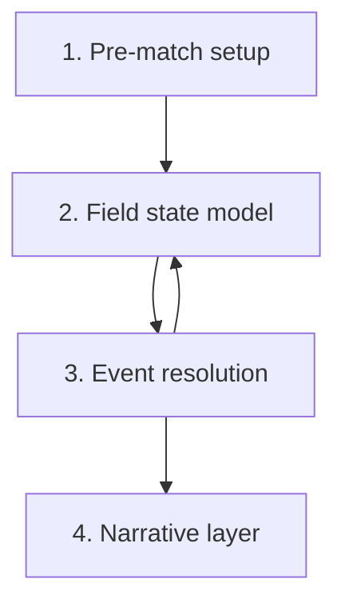

# Match Engine - Swappable Spatial-Event Specification

> **RATIFIED on 2026-06-19.** Nico approved the linked FMX decision
> queue via `APPROVE ALL RECOMMENDED`; this game-design record is now
> binding according to its approved scope.


> **Status note (2026-06-11, FMX-143):** This system/mode note is `status: draft` — it was
> reopened 2026-05-27 and was **not** among the 133 decisions ratified in the 2026-06-08
> sweep (#153). "Approved" wording below is **pre-reopen history**, not a current status
> claim; the product rules described here await individual re-approval (decided by Nico,
> 2026-06-11: keep `draft`, re-approval is a later HITL pass — see
> [[../40-Execution/ratification-status-inventory-2026-06-11|status inventory]]). Frontmatter
> is the status SSOT per
> [[../10-Architecture/09-Decisions/ADR-0092-vault-governance-status-ssot-and-reference-integrity-sweep|ADR-0092]].
> The ratified GDDR layer ([[README|Game Design Hub]]) may cover the same system — the GDDR
> is then the binding record.

> **FMX-133 proposal note (2026-06-13):** [[GD-0042-match-engine-core-model-and-calibration]]
> proposes the concrete core model for action utility, xG/EPV, attribute math,
> statistical envelopes, quality-profile spatial density and calibration harness.
> It is `draft` / binding after Nico approved it on 2026-06-19
> [[../40-Execution/fmx-133-match-engine-core-model-decision-queue-2026-06-13|the FMX-133 decision queue]].

The target match engine is **spatial-event, not outcome-first and not a
frame-by-frame renderer**. Events are resolved from a meaningful 2D pitch state:
roles, zones/coordinates, pressure, compactness, tactics, fatigue, xG/EPV and
attributes. The 2D view, ticker, reports and replay consume committed event and
spatial outputs; they never invent match causality.

> This note is the game-design specification. Architecture choices live in
> [[../10-Architecture/09-Decisions/ADR-0049-swappable-spatial-event-match-engine]]
> and the research depth lives in
> [[../60-Research/swappable-spatial-event-match-engine-2026-05-27]] plus
> [[../60-Research/match-engine-simulation-model]].

## 0. Approved Gameplay Rules

- **Simulation first, presentation second.** Text commentary, 2D Canvas,
  watch-party feed and post-match reports all consume the same event/spatial
  outputs.
- **Engine implementation is replaceable.** Gameplay consumes `MatchEventLog`,
  `SpatialSample`, `MatchSummary` and capability metadata; it must not rely on a
  concrete TypeScript, Rust or WASM implementation.
- **Spatial-event is the realism target.** Outcome-first simulation is allowed
  only for low-importance background-fast paths and must stay compatible with
  the richer profiles' aggregate distributions.
- **Star players must be visible.** Elite players influence involvement,
  action choice, action success and key-event tagging, not only final ratings.
- **One match semantics, multiple depth profiles.** Human-relevant matches are
  deep; background fixtures are cheaper, but they still use compatible inputs
  and deterministic seeds.
- **Interactive matches stay interruptible.** The engine can buffer ahead, but
  player interventions must affect the remaining match.
- **No long-loading-screen design.** The player should enter matchday quickly;
  background fixtures run in batches and the active match can stream/buffer
  event chunks.
- **Canonical truth is server-authoritative for MVP planning.** Local previews,
  future what-if tools and possible future offline singleplayer adapters are
  non-binding unless a later ADR/GDDR explicitly grants local authority.

## 1. Four engine layers



### 1.1 Pre-match setup

Inputs:

- Team strength (per-position aggregates).
- Form.
- Morale.
- Home advantage (from [[fan-ecology]]).
- Tactical fit (per-player role match).
- Fatigue (from [[training-load-and-medicine]]).
- Weather.
- Referee profile.
- Stadium/fan atmosphere from [[fan-ecology]].
- Match context: rivalry, table pressure, cup knockout, home/away travel and
  competitive importance.

Output: frozen `PreMatchSetup`, initial field state and match RNG stream
seeds. Tactical changes later update team influence maps but never rewrite
past events.

### 1.2 Spatial field state model

Tracks at each tick:

- Ball zone and normalized pitch coordinates.
- Player role positions and approximate velocity.
- Team shape, line height, width and compactness.
- Pressing pressure per zone.
- Numerical advantage per zone.
- Pitch/zone control and progression value.
- Rest-defence quality.
- Set-piece state (open play / dead ball pending).
- Momentum/pressure state derived from recent events, crowd atmosphere and
  score context. Momentum adjusts risk and morale modifiers; it is not a
  hidden rubber-band that overrides attributes.

### 1.3 Event resolution

A match is a stream of events. Each event is generated from current spatial
field state and resolved by utility/action selection plus attribute math + RNG:

| Event | Resolution drivers |
|---|---|
| Pass | Passing + decisions + pressure + receiver positioning |
| Dribble | Dribbling + balance + agility + defender tackling + zone congestion |
| Pressing duel | Aggression + anticipation + stamina + opponent technique |
| Aerial duel | Heading + jumping + bravery + position |
| Shot | Finishing + composure + opponent positioning + GK reflexes |
| Rebound | Anticipation + positioning + pace |
| Foul | Aggression + concentration + ref-bias + zone |
| Set piece | Set-piece-attribute math per [[set-pieces]] §3 |

The action utility layer must expose tactical causality:

- high press increases defensive pressure and turnover attempts but creates
  space behind;
- low block improves compactness and box protection but reduces high recoveries;
- direct play increases long progressive pass attempts and second-ball duels;
- short build-up increases local passing actions and pressure-resistance tests;
- star-focal play biases candidate actions toward the focal player within
  tactical and positional plausibility.

### 1.3.1 Accepted FMX-133 action utility model

Pending [[GD-0042-match-engine-core-model-and-calibration|GD-0042]] approval,
`choose_action` is proposed as a deterministic utility selection over plausible
candidate actions:

```text
utility(action) =
  sum(outcome_probability(action, state, actor, opponent) *
      possession_value(resulting_state(outcome)))
  + tactical_style_bias
  + player_trait_bias
  - risk_penalty
  - fatigue_or_pressure_penalty
```

Candidate generation stays tactical and spatial:

- actions must be plausible for the ball zone, role, phase, player traits and
  current tactic;
- possession value is an xT/EPV-style grid over ball zone, pressure, pitch
  control and score context;
- xG is used only for shot probability, not for all non-shot action utility;
- Decisions, Composure and tactical familiarity control bounded rationality:
  high-quality players more often choose the best action, while lower-quality or
  pressured players may choose a near-best plausible action;
- the committed event records compact reason codes such as
  `tactic:direct_play_bias`, `state:high_epv_gain`,
  `attribute:passing_advantage`, `pressure:forced_clearance` and
  `fatigue:late_match_degradation`.

### 1.3.2 Proposed attribute probability surfaces

The exact coefficients are calibration data, but the proposed v1 surfaces are:

| Action | Probability surface inputs |
|---|---|
| Pass | Passing, Technique, Vision, Decisions, distance, lane congestion, receiver separation, pressure, fatigue, opponent Positioning/Anticipation |
| Dribble | Dribbling, Technique, Balance, Agility, Acceleration, Flair, pressure count, zone congestion, defender Tackling/Positioning/Strength |
| Press/duel | Work Rate, Aggression, Anticipation, Stamina, Bravery, support distance, opponent Technique/Composure |
| Aerial | Heading, Jumping, Strength, Bravery, Positioning, delivery quality, opponent contest score |
| Shot | xG features plus Finishing, Technique, Composure, weak foot, pressure, keeper position/reflexes, fatigue |
| Foul/card | Aggression, tackling risk, fatigue, frustration, ref profile, tackle angle, tactical-foul context |

### 1.4 Narrative layer

Produced per event:

- Text commentary line.
- Optional LLM-enhanced key-event wording after the event is committed.
- 2D position update (player + ball coordinates).
- Stats overlay update (possession, shots, duels).
- Momentum indicator update.

Different UI tiers consume different volumes of this output. LLM text is
cosmetic and may never alter the event, stat, replay or downstream state.

## 2. Match cycle (per tick)

```text
loop while match.running:
  spatial_state = observe_pitch_state()
  candidates = propose_actions(spatial_state, tactics, roles)
  utilities = score_actions(candidates, possession_value, tactics, traits, risk)
  intended_action = choose_action(utilities, decisions, composure, tactical_familiarity, rng)
  defender_response = defending_team.react(spatial_state, intended_action)
  outcome = resolve(intended_action, defender_response, attributes, pressure, rng)
  field_state.update(outcome)
  event_log.append(outcome)
  spatial_samples.append(sample(field_state))
  narrative.emit(outcome)
  if outcome.is_set_piece: handle_set_piece()
```

## 3. Tactical familiarity multiplier

`team_shape_correctness = base * tactical_familiarity / 100`

A 100 % familiarity team executes its tactic exactly. A 60 % familiarity
team makes positional errors that the engine surfaces as ball losses,
mis-pressing and out-of-position events.

## 4. Re-computation on intervention

When the player:

- Makes a substitution.
- Switches tactic / formation.
- Changes mentality.
- Issues a shout.

…the engine queues the intervention and applies it at the next deterministic
intervention point:

- immediate dead-ball events;
- halftime;
- injury stoppages;
- red/yellow-card stoppages;
- substitutions;
- stable phase transitions such as build-up → final third or turnover.

The engine refreshes team influence, tactical context and future transition
weights from that point onward. Past events are immutable.

## 5. Event taxonomy (per-event log)

Each event is persisted as:

```text
{
  tick: int,
  type: enum (pass | dribble | duel | aerial | shot | rebound | foul |
              throw_in | corner | free_kick | offside | injury | sub |
              card | goal | half_time | full_time),
  actor_player_id: int,
  passive_player_id: int?,
  zone: int,
  outcome: enum (success | fail | foul_against | foul_for | goal | …),
  modifiers: { fatigue, morale, atmosphere, tactical_familiarity, … }
}
```

Stored on the match record. Consumed by:

- The narrative layer at match time.
- The watch-party / conference snapshot stream
  ([[watch-party-and-conference]]).
- Post-match reports at any UI tier.
- Replay viewer.

## 6. Useful match statistics (not data trash)

Surfaced in match reports:

- Zone entries.
- Ball wins in final third.
- Pressing resistance.
- Open-play vs set-piece chances.
- Cross quality.
- Rest-defence errors.
- Fatigue progression.
- Per-role impact on progression.

These feed back into [[training-load-and-medicine]] and
[[scouting-and-recruitment]].

## 6.1 Engine Output Layers

The engine emits four layered outputs. UI tiers decide how much is surfaced,
but the data model stays consistent.

| Layer | Purpose | Examples |
|---|---|---|
| Result | Tables, progression, injuries and rewards | Score, scorers, cards, injuries, ratings, fatigue deltas |
| Event | Commentary, replay, stats and audit | Passes, shots, duels, fouls, set pieces, subs, tactical changes |
| Spatial | 2D Canvas, heatmaps and tactical analysis | Start/end coordinates, zone samples, team shape snapshots, average positions |
| Analytics | Reports and assistant insight | xG, possession, pass maps, shot maps, pressing wins, running distance, zone control |

Pass maps, shot maps and 2D playback come directly from event coordinates and
spatial samples. Heatmaps, average positions and running-distance estimates
require lightweight spatial sampling; they must not be invented from final stats
only.

## 6.2 Match Quality Profiles

Match quality profile is separate from UI tier and device tier.

| Profile | Used for | Gameplay output |
|---|---|---|
| `competitive-full` | Human-vs-human, human-vs-AI, watch-party fixtures, title/cup deciders | Full event log, spatial samples, intervention support, full analytics |
| `interactive-standard` | Active singleplayer match on Standard/Premium devices | Full event log, reduced spatial sample rate, full core stats |
| `background-detailed` | Important AI fixtures in active leagues | Summary plus selected event/key-stat data; replay can re-sim on demand |
| `background-fast` | Rest-world fixtures and long-term world simulation | Result, injuries, form, table, reputation and economy effects only |

Accepted FMX-133 spatial density (pending GD-0042 approval):

| Profile | Spatial/event density |
|---|---|
| `competitive-full` | Full event log, event anchors, 1 Hz state samples, phase-boundary samples, intervention support and byte-exact replay. |
| `interactive-standard` | Full event log, event anchors, 0.33 Hz state samples, phase-boundary samples and byte-exact replay with less heatmap precision. |
| `background-detailed` | Summary plus selected key events/stats and seed/parameter provenance; not renderable by default. |
| `background-fast` | Outcome/stat summary only; no renderable event/spatial source; aggregate compatibility required. |

Examples:

- A user's cup final in async MP is `competitive-full`.
- A normal singleplayer league match defaults to `interactive-standard`, upgraded
  to `competitive-full` if the device and user settings allow.
- A rival title decider in the same league is `background-detailed` unless the
  user opens it as a watched match.
- Far-away leagues in a Large world use `background-fast`.

## 7. UI tiers for match presentation

| Tier | What is shown |
|---|---|
| Quick | Text ticker + key events + final stats overlay |
| Standard | Text ticker + 2D top-down view + halftime + per-player ratings |
| Expert | Full 2D + heat-maps + pass network + zone control + event log |

Interactive or authoritative browser 3D match view is **out of scope**
(permanent product decision, 2026-05-17 per gap D9; refined 2026-05-22 by
[[../10-Architecture/09-Decisions/ADR-0041-presentation-renderer-strategy]]).
The two supported match render modes are **Text & Stats** (first-class, default
on Floor tier) and **2D canvas** (primary, default on Standard / Premium). See
[[../60-Research/performance-budgets]] §6 for the full render-mode policy.

Curated 3D presentation scenes, if added post-MVP, are not a match render mode:
they consume committed event logs or career facts, have 2D/still/text
fallbacks, and never compute outcomes or expose hidden data. Examples are a
trophy lift, walk-in, celebration or selected highlight beat. See
[[../60-Research/presentation-renderer-strategy]].

## 7.1 Matchday Pacing

The player experience should avoid "calculate everything, then wait" pacing.

- The matchday route opens immediately with fixture context, lineups and
  readiness state.
- The active human match can stream/buffer event chunks while the UI plays Text
  & Stats or 2D Canvas.
- Background matches run in priority order: human fixtures, watched fixtures,
  active league, rivals, rest-world.
- If a device is Floor tier, the active match uses Text & Stats and background
  profiles downgrade before the UI blocks.

## 8. Determinism contract

The match engine is deterministic given:

- A seed (per match).
- The frozen team + tactic + state at kick-off.
- Player intervention events in order.
- Engine version and dataset pack version.

This guarantees replay across saves and is required for the watch-party
spectator stream. See [[../60-Research/determinism-and-replay]].

## 8.1 Authority Matrix

| Mode | Final authority | Local role |
|---|---|---|
| MVP singleplayer / roguelite | Server-confirmed canonical state | Drafts, previews, cache and non-binding what-if only |
| Future selective offline singleplayer | Future ADR/GDDR required | Possible local adapter behind the same port |
| Hotseat | Future ADR/GDDR required | Local simulation only after explicit authority decision |
| Async multiplayer preparation | Server after sync | Drafts, previews, queued commands |
| Async multiplayer match result | Server Match Worker | Non-binding preview only |
| Watch-party replay | Server event/replay stream | Local rendering/cache only |

## 9. Performance budget

Targets (from [[../60-Research/match-engine-simulation-model]] and
[[../60-Research/performance-budgets]]):

- p95 budget is set per runtime spike and quality profile; old 50 ms Web Worker
  target is historical context, not the runtime choice.
- ≤ 30 ms per AI-vs-AI batch match remains an aspirational reference when no
  narrative/full event log is emitted.
- ≤ 1 MB memory per simulated match.

Implications:

- No DOM, renderer, LLM, DB or UI access in the engine implementation.
- Match events are streamed in batches, not per-event.
- Narrative layer runs on the main thread off the event stream.
- Hundreds of fixtures must be assigned quality profiles; they must never all
  default to `competitive-full`.

## 10. Future-scope notes (classified future-scope)

- Tuning values for quality-profile downgrades by world size and device tier.
- Which `background-detailed` AI fixtures should keep selected events by default
  instead of seed-only summaries.

FMX-133 proposes to remove "minimum spatial sample rate per profile" from
future-scope by adopting the density table in §6.2 via GD-0042. Until Nico
approves GD-0042, the table remains planning guidance only.

## 11. Proposed calibration harness (FMX-133)

Pending GD-0042 approval, the match engine must be calibrated by:

- golden replay fixtures for `competitive-full` and `interactive-standard`;
- 256-seed PR smoke sweeps over named scenarios once implementation exists;
- 1,000+ seed core sweeps for goals, shots, xG, possession, PPDA, cards and
  injuries;
- 10,000+ seed release calibration soaks before changing model versions;
- background-fast compatibility sweeps against the `competitive-full` reference
  distribution;
- statistical checks using chi-square, Kolmogorov-Smirnov or Anderson-Darling
  where appropriate, plus bootstrap confidence intervals for key means and
  quantiles.

Exact constants and tolerances remain calibration data, but the harness shape is
part of the proposed game-design contract.
