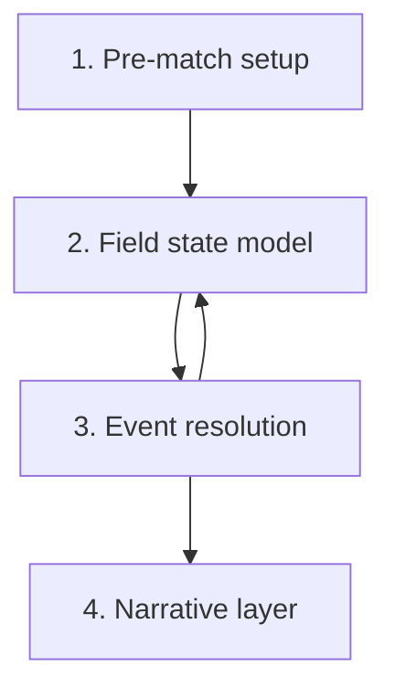

# Match Engine - 2D Event-based Specification

The match engine is **event-based, not frame-by-frame**. Pre-computation
produces a probability distribution for the result; in-engine events are
attribute comparisons with randomness; substitutions and tactic changes
trigger re-computation of the rest of the match. This is the FM /
Football-Chairman lineage applied to a fictional 2D PWA.

> This note is the game-design specification. Architecture choices live in
> [[../10-Architecture/09-Decisions/ADR-0003-match-engine]] and the
> research depth lives in [[../60-Research/research-wave-2-gaps]] R2-01.

## 1. Four engine layers



### 1.1 Pre-match setup

Inputs:

- Team strength (per-position aggregates).
- Form.
- Morale.
- Home advantage (from [[fan-ecology]]).
- Tactical fit (per-player role match).
- Fatigue (from [[training-load-and-medicine]]).
- Weather.
- Referee profile.

Output: an initial probability distribution + a seed for the match RNG
stream.

### 1.2 Field state model

Tracks at each tick:

- Ball zone (1 of 18 grid zones).
- Team shape.
- Pressing pressure per zone.
- Numerical advantage per zone.
- Rest-defence quality.
- Set-piece state (open play / dead ball pending).

### 1.3 Event resolution

A match is a stream of events. Each event is generated from current field
state and resolved by attribute math + RNG:

| Event | Resolution drivers |
|---|---|
| Pass | Passing + decisions + pressure + receiver positioning |
| Dribble | Dribbling + balance + agility + defender tackling + zone congestion |
| Pressing duel | Aggression + anticipation + stamina + opponent technique |
| Aerial duel | Heading + jumping + bravery + position |
| Shot | Finishing + composure + opponent positioning + GK reflexes |
| Rebound | Anticipation + positioning + pace |
| Foul | Aggression + concentration + ref-bias + zone |
| Set piece | Set-piece-attribute math per [[set-pieces]] §3 |

### 1.4 Narrative layer

Produced per event:

- Text commentary line.
- 2D position update (player + ball coordinates).
- Stats overlay update (possession, shots, duels).
- Momentum indicator update.

Different UI tiers consume different volumes of this output.

## 2. Match cycle (per tick)

```text
loop while match.running:
  zone = field_state.ball_zone
  controlling_team = decide_control(zone, field_state)
  intended_action = controlling_team.role_priority[zone]
  risk = risk_profile(intended_action, role, tactic)
  defender_response = defending_team.react(zone, risk)
  outcome = resolve(intended_action, defender_response, attributes, rng)
  field_state.update(outcome)
  narrative.emit(outcome)
  if outcome.is_set_piece: handle_set_piece()
```

## 3. Tactical familiarity multiplier

`team_shape_correctness = base * tactical_familiarity / 100`

A 100 % familiarity team executes its tactic exactly. A 60 % familiarity
team makes positional errors that the engine surfaces as ball losses,
mis-pressing and out-of-position events.

## 4. Re-computation on intervention

When the player:

- Makes a substitution.
- Switches tactic / formation.
- Changes mentality.
- Issues a shout.

…the engine refreshes the probability distribution for the rest of the
match. Past events are not changed.

## 5. Event taxonomy (per-event log)

Each event is persisted as:

```text
{
  tick: int,
  type: enum (pass | dribble | duel | aerial | shot | rebound | foul |
              throw_in | corner | free_kick | offside | injury | sub |
              card | goal | half_time | full_time),
  actor_player_id: int,
  passive_player_id: int?,
  zone: int,
  outcome: enum (success | fail | foul_against | foul_for | goal | …),
  modifiers: { fatigue, morale, atmosphere, tactical_familiarity, … }
}
```

Stored on the match record. Consumed by:

- The narrative layer at match time.
- The watch-party / conference snapshot stream
  ([[watch-party-and-conference]]).
- Post-match reports at any UI tier.
- Replay viewer.

## 6. Useful match statistics (not data trash)

Surfaced in match reports:

- Zone entries.
- Ball wins in final third.
- Pressing resistance.
- Open-play vs set-piece chances.
- Cross quality.
- Rest-defence errors.
- Fatigue progression.
- Per-role impact on progression.

These feed back into [[training-load-and-medicine]] and
[[scouting-and-recruitment]].

## 7. UI tiers for match presentation

| Tier | What is shown |
|---|---|
| Quick | Text ticker + key events + final stats overlay |
| Standard | Text ticker + 2D top-down view + halftime + per-player ratings |
| Expert | Full 2D + heat-maps + pass network + zone control + event log |

3D match view is **out of scope** (permanent product decision, 2026-05-17 per gap D9). The two supported match render modes are **Text & Stats** (first-class, default on Floor tier) and **2D canvas** (primary, default on Standard / Premium). See [[../60-Research/performance-budgets]] §6 for the full render-mode policy.

## 8. Determinism contract

The match engine is deterministic given:

- A seed (per match).
- The frozen team + tactic + state at kick-off.
- Player intervention events in order.

This guarantees replay across saves and is required for the watch-party
spectator stream. See [[../60-Research/research-wave-2-gaps]] R2-08.

## 9. Performance budget

Targets (from [[../60-Research/research-wave-2-gaps]] R2-09):

- ≤ 50 ms per full match on a 2022 mid-range Android in a Web Worker.
- ≤ 5 ms per AI-only match in batch background ticks.
- ≤ 1 MB memory per simulated match.

Implications:

- No DOM access in the worker (per [[../10-Architecture/09-Decisions/ADR-0003-match-engine]]).
- Match events are streamed in batches, not per-event.
- Narrative layer runs on the main thread off the event stream.

## 10. Open questions

- Granularity of zones: 6 / 12 / 18 / 24? Recommendation: 18 (3 vertical
  × 6 horizontal) - enough for tactical fidelity, light enough for budget.
- Tick rate: per-event (variable) or per-second? Per-event with virtual
  minute clock.
- AI manager substitutions: in scope at MVP - opponent reacts to score +
  fatigue + tactical change.
