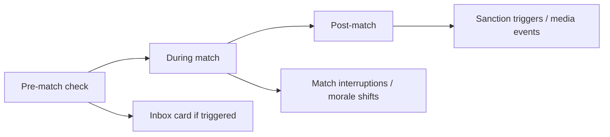

# Match-day Event Engine - Rule-based Trigger / Probability / Effect / Prevention

> **REOPENED on 2026-05-27:** This game-design note is `draft` again. Any `approved`, `binding`, or `locked` wording below is historical pre-reopen context until Nico re-approves it.

> Approved by the systemic events / player lifecycle pass (2026-05-17).
> Match-day events are part of the wider systemic event architecture, but
> their rules remain owned by the relevant domains.

Match-day events ("the beer line froze", "a fan collapsed", "the catering
ran out") are **rule-based and deterministic given the same inputs + seed**.
Each event has a trigger, a conditional probability, an effect and a
prevention path. The point is to turn flavour into management.

## 1. Product rule

> **Every match-day event is defined by four fields: Trigger,
> Probability, Effect, Prevention. The Match-day Event Engine evaluates
> the active rule set before, during and after each match.**

The wider `WorldEventDirector` may schedule the match-day evaluation window,
but it does not own these rules or their state changes.

## 2. Event categories

| Category | Examples |
|---|---|
| **Weather** | Heat, frost, heavy rain, storm |
| **Infrastructure** | Frozen beer line, floodlight fault, turnstile outage, pitch problems |
| **Medical** | Fan collapses, paramedic call, match interruption |
| **Security** | Pyro, fan march, block clash, projectiles |
| **Catering** | Water demand spike, beer drop, sausages sold out |
| **Media / PR** | Protest banner, record attendance, boycott, choreo |

## 3. Event schema

```yaml
event:
  id: frozen_beer_line
  category: infrastructure
  trigger:
    - temperature_max_c: 0
    - maintenance_score_lte: 4
    - infra_age_years_gte: 8
  probability_pct: 35    # given trigger
  effect:
    beer_revenue_pct: -80
    fan_mood_ultras: -3
    fan_mood_casual: -2
    hospitality_complaint: 1
  prevention:
    - winterising_module: yes  # built in stadium
    - mobile_bars_available: yes
    - maintenance_score_gte: 7
  ui_card:
    title: "Frozen beer line"
    body: "The cold snap froze the main line. Expect a quiet third stand."
```

The engine reads this declarative schema; no per-event code is needed.

## 4. Trigger examples (verbatim from research)

### 4.1 Frozen beer line

| Field | Value |
|---|---|
| Trigger | Temperature < 0 °C, ageing infrastructure, low maintenance |
| Effect | Beer revenue -80 %, fan frustration +, hospitality - |
| Prevention | Winterising, maintenance, mobile bars |

### 4.2 Heatwave + water boom

| Field | Value |
|---|---|
| Trigger | 38-40 °C, sold-out stadium, low shade |
| Effect | Multiple medical incidents, match interruption, reputation damage, extra cost |
| Prevention | Water stations, shade, medical upgrade |

### 4.3 Pyro incident

| Field | Value |
|---|---|
| Trigger | High `rivalry_score`, recent fan-incident memory, low security upgrade |
| Effect | Fine, partial sector closure (next match), media event |
| Prevention | Security budget, fan dialogue project, ticket policy |

### 4.4 Floodlight outage

| Field | Value |
|---|---|
| Trigger | Old electricals, low maintenance, evening match |
| Effect | Match delay, reputation hit, possible replay |
| Prevention | Maintenance budget, electrical retrofit |

### 4.5 Pitch quality break

| Field | Value |
|---|---|
| Trigger | Heavy rain previous week + no undersoil + low groundskeeper budget |
| Effect | Tactical familiarity penalty for both teams (mud), injury risk + |
| Prevention | Undersoil heating, drainage upgrade, groundskeeper budget |

## 5. Engine evaluation phases



| Phase | Event types most likely |
|---|---|
| Pre-match | Weather, catering supply, infrastructure |
| Live | Medical, security, pitch |
| Post-match | Media, sanctions, fan-segment movement |

## 6. Sanction chain

Match-day security events feed into the **sanction chain** (sourced from
[[../60-Research/fan-culture-segmentation-research]] §6):

1. Fine.
2. Partial sector closure.
3. Visiting-fan restriction.
4. Alcohol ban / light beer only.
5. Partial ghost match.
6. Full ghost match.
7. Elevated risk classification for follow-up matches.

`SanctionService` (architecture: [[../10-Architecture/bounded-context-map]])
manages this chain.

## 7. Mechanical integration

Events feed into other systems, not just inbox cards:

- Catering & infrastructure events ←” [[economy-system]] revenue and KPIs.
- Security events ←” [[regulations-and-compliance]] sanction chain.
- Medical events ←” [[training-load-and-medicine]] injury record.
- Fan events ←” [[fan-ecology]] segment mood.
- Media events ←” [[club-dna-and-governance]] media image.
- Pitch and venue conflicts ←” [[stadium-and-campus]] venue calendar,
  pitch wear and setup/teardown windows.

Domain ownership:

| Event source | Owner |
|---|---|
| Stadium, catering, sponsor and fan effects | Club Management |
| Fixture phase and match interruption facts | Match + League Orchestration |
| Injuries/availability | Squad & Player after Match/Training facts |
| Sanctions | Regulations/compliance policy under Club/League |
| User-facing cards | Notification/Narrative projection |

## 8. UI tiers

| Tier | Event surface |
|---|---|
| Quick | Top 1-2 events as cards with one preventive action |
| Standard | Per-match event log + suggested preventive investments |
| Expert | Full rule view: triggers, probabilities, effects, prevention coverage |

## 9. Authoring

Events live in `packages/game-data/events/` as YAML files. Community
packs ([[community-editor-and-datasets]]) can add or override events with
a manifest declaring their replacement scope.

Authoring rules:

- event IDs are stable;
- triggers must name their required state inputs;
- probability is conditional on eligibility, not global randomness;
- every effect names the owning context;
- every prevention action must be surfaced as a management decision,
  facility upgrade or policy;
- narrative copy references [[../60-Research/narrative-content-pipeline]]
  event families and never creates facts not present in the event payload.

## 10. Future-scope notes (classified future-scope)

- Recurring multi-match events (e.g. pyro investigation across 3 matches)
  - modelled as a parent event that spawns child events per match.
- Per-region weather patterns - hooked into `region_score` from
  [[club-dna-and-governance]].
- Counter-event prevention (e.g. "we tested the floodlight last week" auto
  -prevents floodlight outage for X matches) - yes, as a side effect of
  the prevention action itself.
## Related

- [[README]]
- [[../60-Research/raw-perplexity/raw-environment-events]]
- [[../60-Research/systemic-events-player-development-venue-ops]]
- [[../10-Architecture/09-Decisions/ADR-0018-systemic-events-and-player-lifecycle]]
- [[fan-ecology]]
- [[rivalry-system]]
- [[stadium-and-campus]]
- [[regulations-and-compliance]]
