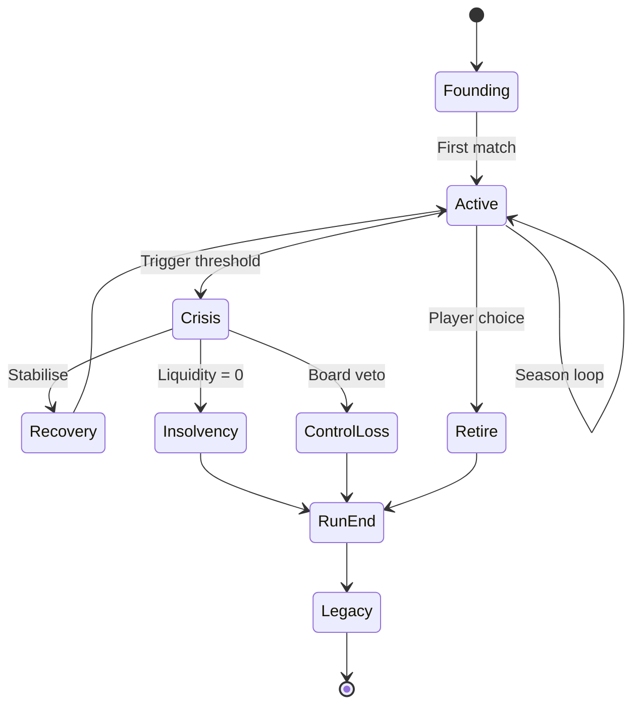

# Mode - Create a Club Roguelite

> **Status note (2026-06-11, FMX-143):** This system/mode note is `status: draft` — it was
> reopened 2026-05-27 and was **not** among the 133 decisions ratified in the 2026-06-08
> sweep (#153). "Approved" wording below is **pre-reopen history**, not a current status
> claim; the product rules described here await individual re-approval (decided by Nico,
> 2026-06-11: keep `draft`, re-approval is a later HITL pass — see
> [[../40-Execution/ratification-status-inventory-2026-06-11|status inventory]]). Frontmatter
> is the status SSOT per
> [[../10-Architecture/09-Decisions/ADR-0092-vault-governance-status-ssot-and-reference-integrity-sweep|ADR-0092]].
> The ratified GDDR layer ([[README|Game Design Hub]]) may cover the same system — the GDDR
> is then the binding record.

The signature mode of Klubhaus Elf. Permadeath on insolvency, but each
run leaves *legacy* that makes the next run *different* (not easier).
This note is **approved** at the level of the product rule. Sub-mechanic
tuning remains `draft` and lives in linked notes.

## 1. Approved product rule

> **A roguelite run is a single career-and-club lifecycle. Insolvency,
> control loss, forced dissolution and deliberate retirement all end the
> run. Persistence between runs is small, optional, structural - never raw
> power.**

This rule is binding for implementation. Detailed tuning is in
[[economy-system]] §6 and [[club-dna-and-governance]].

## 1.1 MVP-first slice

Per [[GD-0017-mvp-scope-and-mode-sequencing]] and [[../00-Index/MVP-Scope]],
Create-a-Club Roguelite is the active MVP first playable.

MVP includes:

- fast fictional club setup;
- starter region/country, colours and crest;
- first Home dashboard/feed-card;
- starter tactic choice;
- first match and report;
- economy-pillar foundation: opening cash state, weekly ledger, runway/risk
  feedback and staged crisis recovery; and
- manager-archetype hooks: run-end facts, coarse style signals and post-run
  reflection scaffolding; and
- server-confirmed progression with local drafts/caches only.

Deep legacy carries, advanced meta-progression, multi-run narrative echoes and
full local-authoritative offline play are future phases. The MVP captures enough
facts to enable them later; it does not promise final perks, thresholds or a
fixed archetype taxonomy.

## 2. Run lifecycle

## 3. Founding choices

At run start the player chooses:

- **Country + region**.
- **Club name + colours + crest** (procedurally suggested + editable).
- **Stadium location** (small pitch + 1-5 k capacity).
- **Club DNA** within unlocks (see §5).
- **Starting league tier** (typically bottom tier of chosen country).
- **Manager profile** (slowly improving across runs via talent tree).
- **Optional starting modifier** (one unlocked carry slot).

## 4. End conditions

A run ends when **any** of these occur:

| End condition | Trigger |
|---|---|
| Insolvency | [[economy-system]] staged crisis reaches licence loss / run-end state |
| Control loss | Board veto for N consecutive failed seasons |
| Forced dissolution | League expulsion (compliance failure post grace period) |
| Deliberate retirement | Player chooses to retire |
| Achievement run | Optional special goal (e.g. promote 4 tiers in 10 years) |

After end, the run enters Legacy and contributes to meta-progression.

## 5. Legacy systems (carries)

Persisted between runs:

| Carry type | Mechanic | Limits |
|---|---|---|
| **Option unlocks** | New club founding profiles, sponsor archetypes, youth philosophies | Unlocked by reaching milestones (e.g. promote 2 tiers, win cup) |
| **Soft carries** | Scout contact, small credit bonus, cheaper plot, slight starting reputation | 1 slot at start; more slots earned by run length |
| **Manager talent tree** | Permanent manager-attribute upgrades (e.g. press, scout, training) | Tree-shaped; respec available |
| **Narrative legacy** | Former runs + players appear in the universe | Read-only history |
| **Cosmetic identity** | Crests, colour palettes, kit patterns | Unlock-and-keep |

### Carry budget rule

A new run starts with **1 carry slot** by default. Slot count grows with
*total run length across all prior runs*, not with successes alone. This
rewards perseverance without rewarding gaming the failure state.

### 5.1 Manager-archetype hooks (FMX-16 draft)

Detailed design: [[GD-0019-manager-archetype-roguelite-progression]].

The Roguelite mode should emit enough end-of-run information for future
Manager & Legacy progression without locking final taxonomy or balance during
MVP:

- run end records why the run ended, how long it lasted and which crisis/recovery
  path occurred;
- Club Economy, Match, Transfer, Squad & Player and Training contribute coarse
  summaries through public contracts;
- the post-run reflection can explain observed style signals, but does not show
  grind checklists or final perk thresholds;
- named archetypes remain provisional until playtests show stable recurring
  player styles.

Playtests may change signal weights, labels, thresholds and UI emphasis. Changes
to MVP scope, domain ownership or cross-save determinism require a new Nico
decision.

## 6. What is NOT carried

- Squad value.
- Stadium build-out.
- Sponsor contracts.
- Cash balance.
- League reputation.
- Squad attribute floors / ceilings.

These all reset. The point of the run is to build them again.

## 7. Staged tutorial via meta-progression

Complexity unlocks across runs:

| Run | Complexity available |
|---|---|
| 1 | Basic finance, simple tactics, single league |
| 2-3 | Sponsoring portfolio, transfer market, fan segments |
| 4-5 | Manager talent tree branches, fan zone build-out |
| 6+ | Set pieces, advanced tactic editor, full attribute scale, all sponsor side-conditions |

This is the Roguelite "staged tutorial" pattern from
[[../60-Research/mode-design-research]] §3.

## 8. Death-spiral drama

Detailed in [[economy-system]] §6. Summary:

1. Bad scouting → bad signings on wages and future instalments.
2. Wage / squad-cost ratio breach → board and sponsor concern.
3. Operating result negative → cash runway drains.
4. Forecast breach → crisis warning and board pressure.
5. Freeze / arrears → forced sales, sponsor penalties, fan anger.
6. Sales hurt squad → bad results and weaker future cashflow.
7. Licence loss, forced dissolution or control loss → run ends.

Each step is reversible until the previous one *closes*. The player can
fight back at any point, but the system has momentum.

## 9. UI tier interactions

| Tier | Roguelite-specific surface |
|---|---|
| Quick | Health gauges (cash, mood, results); "danger of insolvency" warning early |
| Standard | Crisis dashboard with explicit reversal levers |
| Expert | Cash-flow projection 12 months ahead; all KPI early warnings |

## 10. Roguelite in async groups

When a private async group runs Create-a-Club mode
([[async-multiplayer-private-group]]):

- Each manager's run is independent.
- If a manager's run ends mid-season, they continue with a **fresh** club
  in a lower league for the next season - so the group's pyramid stays
  populated.
- Mid-season insolvency: the league auto-promotes a replacement
  procedural club to keep the bracket complete; the human re-enters next
  season.

## 11. Open tuning questions

- N (consecutive months at liquidity ≤ 0) - tentative 2 months.
- Board-veto-fail seasons - tentative 2 in a row.
- Carry slot growth function - linear vs logarithmic. Current intent: 1
  slot per ~50 in-game seasons summed across runs.
- Should achievements unlock kit patterns visible to other players in
  async groups? Yes - lightly badged.
- Manager-archetype taxonomy and thresholds - intentionally not locked before
  playtests; use style signals first, names later.
