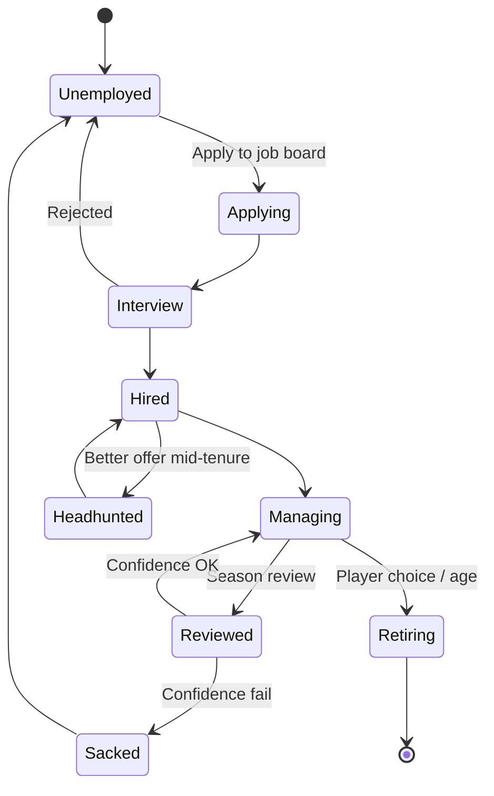
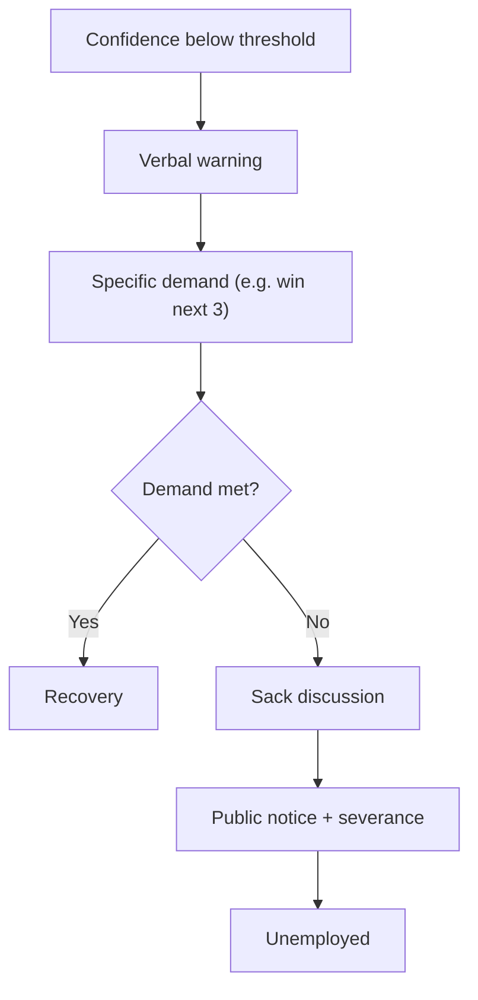

# Mode - Manage a Club Career

> **Status note (2026-06-11, FMX-143):** This system/mode note is `status: draft` — it was
> reopened 2026-05-27 and was **not** among the 133 decisions ratified in the 2026-06-08
> sweep (#153). "Approved" wording below is **pre-reopen history**, not a current status
> claim; the product rules described here await individual re-approval (decided by Nico,
> 2026-06-11: keep `draft`, re-approval is a later HITL pass — see
> [[../40-Execution/ratification-status-inventory-2026-06-11|status inventory]]). Frontmatter
> is the status SSOT per
> [[../10-Architecture/09-Decisions/ADR-0092-vault-governance-status-ssot-and-reference-integrity-sweep|ADR-0092]].
> The ratified GDDR layer ([[README|Game Design Hub]]) may cover the same system — the GDDR
> is then the binding record.

The classical mode: apply for a job, take over an existing club, can be
sacked. The Anstoss-2 "real manager career" pattern with FM-style split
confidence. Approved at the level of the product rule and the split
confidence model; sub-tuning remains `draft`.

## 1. Approved product rule

> **The player applies to coach an existing club. Performance is judged by
> a split confidence model: Board Confidence + Supporter Confidence, both
> decomposed into sub-areas, weighted by the club's Expectation Profile.
> Sacking is possible. Career arc spans many clubs.**

## 1.1 Post-MVP sequencing

Manage-a-Club Career is first-class long-term scope, but it is **not playable
in the MVP**. Per [[GD-0017-mvp-scope-and-mode-sequencing]], the MVP shows it as
a visible "comes later" mode tile while [[mode-create-a-club-roguelite]] is the
active first playable.

Career must reuse the same simulation core, contracts, IP-clean data, match
engine, Impact Lens, finance and squad systems so adding it later is a mode-rule
extension rather than a second product.

## 2. Career flow

## 3. Job market

A persistent job board lists openings across the world. Each entry shows:

- Club + league.
- Expectation Profile.
- Budget hints.
- Squad summary.
- Salary range.
- Why the role is open (sacking, retirement, expansion).

Manager reputation gates which jobs even show up. Reputation grows with
results, trophies, public-image management.

## 4. Split confidence model

The Football Manager pattern, adopted verbatim from
[[../60-Research/mode-design-research]] §4.

### 4.1 Board Confidence (0-100)

Sub-areas:

- Season goal vs current position.
- Budget discipline (wage + transfer).
- Transfer policy execution.
- Club-development progress (youth, infra, brand).
- Long-term plan adherence (philosophy continuity).

### 4.2 Supporter Confidence (0-100)

Sub-areas:

- Derby + rivalry results.
- Attractive play (style match).
- Identification (icon retention).
- Star-player happiness.
- Transfer policy alignment with fan profile.

### 4.3 Optional Media Confidence (0-100)

Pressure amplifier, not a fail-state on its own. Source: press conferences,
public statements, controversy management.

## 5. Expectation Profile per club

Different DNA → different acceptable bands. See
[[club-dna-and-governance]] §4. Examples:

| Club archetype | Acceptable Board | Acceptable Supporters |
|---|---|---|
| Tradition village club | Mid-table + youth investment | Identity intact, derby results |
| Investor club | Top-3 / European cup | Star signings, trophies |
| Selling club | Top half + transfer P&L positive | Player sales explained, replacements found |
| Sugar-daddy global | Trophies + global brand | Big names, brand events |

Both confidences are **club-weighted** so the same result yields different
verdicts at different clubs.

## 6. Sacking flow

Severance + reputation impact follow contract clauses.

## 7. Bundestrainer career arc (long-term goal)

The Anstoss-style long-term arc: a successful club career opens national-
team coaching offers. FMX-130 reconciles this Career note to the current
national-team design record in [[GD-0033-national-team-dual-role]] and
[[../10-Architecture/09-Decisions/ADR-0084-national-team-dual-role-and-international-window-contract]];
[[../60-Research/late-game-systems]] remains the historical D6 research input.

- **Dual-role**: user manages club + national team simultaneously
  (FM/Anstoss style) with **3 engagement levels** (Full Control /
  Match-Only / Light Touch) toggleable per save.
- **Unlock**: manager rep ≥ 75 AND 5+ in-game seasons. The old
  "OR 3 major club trophies" shortcut is removed; trophies raise reputation
  instead of bypassing tenure.
- **Job offers** spawn after major tournaments and, post-MVP, when the sitting
  national coach's board-confidence floor is crossed. The exact floor is
  `legacy.nationalTeam.offerWindow.boardConfidenceFloor` calibration debt, not
  a fixed `<20` rule. Priority: matching nationality + strong regional/national
  reputation + recent success in country + global aggregate reputation.
- Tournament cycle: IFC Nations Championship every 4 years +
  Continental Championships offset 2 years → big tournament every 2 years.
- Assistant national team coach intermediate step **deferred to Phase 4**
  (can be boring; not core to Bundestrainer arc).
- Club coach → director of football → club CEO sub-game still
  Phase 3+ (separate from Bundestrainer arc).

Full current design + tournament management UX + squad selection rules:
[[GD-0033-national-team-dual-role]]; historical research input:
[[../60-Research/late-game-systems]] §4. FMX-130 source checks and decision
record: [[../60-Research/career-bundestrainer-reconciliation-2026-06-15]].

## 8. UI tier interactions

| Tier | Career-mode surface |
|---|---|
| Quick | "Job board badge" + monthly board verdict letter |
| Standard | Confidence gauges + sub-area breakdown |
| Expert | Per-criterion trend lines + Expectation Profile breakdown + media-pressure graph |

## 9. Career mode in async groups

When a private async group runs Manage-a-Club mode
([[async-multiplayer-private-group]]):

- Each manager picks (or is assigned) an existing club at group start.
- Sackings inside the group can happen but trigger group-rule decision
  (manager either takes a job at a worse club, drops out, or the group
  pauses and re-pairs).
- Reputation is per-group, not shared with singleplayer career.

## 10. Manager talent tree

Optional branch-based progression earned over a career. Branches:

- Press (better media outcomes).
- Coaching (training block effectiveness).
- Scouting (regional knowledge bonuses).
- Negotiation (transfer + contract effectiveness).
- Finance (budget release likelihood).

Earned by tenure + trophies, not by spending currency. Respec available
once per season.

## 11. Open tuning questions

- Confidence thresholds for warning vs sack remain calibration debt under
  `dynasty.ownershipBoard`; the old 30 / 15 values are source/research seed
  values, not ratified constants.
- Severance and gardening leave - tied to contract clauses set at hire.
- National-team job-offer floor remains
  `legacy.nationalTeam.offerWindow.boardConfidenceFloor` calibration debt.
- Reputation model direction: per-region reputation with a global aggregate
  for player-facing gates; exact aggregation curve deferred to
  `legacy.nationalTeam` calibration.
- "Resign in protest" option - yes; affects reputation positively for
  fans, negatively for other boards.
