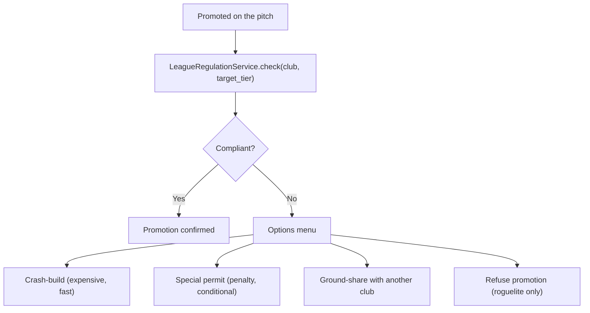

# Regulations and Compliance - Promotion-Gated Stadium and Operations Rules

> **Status note (2026-06-11, FMX-143):** This system/mode note is `status: draft` — it was
> reopened 2026-05-27 and was **not** among the 133 decisions ratified in the 2026-06-08
> sweep (#153). "Approved" wording below is **pre-reopen history**, not a current status
> claim; the product rules described here await individual re-approval (decided by Nico,
> 2026-06-11: keep `draft`, re-approval is a later HITL pass — see
> [[../40-Execution/ratification-status-inventory-2026-06-11|status inventory]]). Frontmatter
> is the status SSOT per
> [[../10-Architecture/09-Decisions/ADR-0092-vault-governance-status-ssot-and-reference-integrity-sweep|ADR-0092]].
> The ratified GDDR layer ([[README|Game Design Hub]]) may cover the same system — the GDDR
> is then the binding record.

Promotion must mean **infrastructure + operations obligations**, not just
better opponents and TV money. The compliance gameplay loop turns sporting
success into investment pressure.

FMX-13 adds a finance-compliance layer: country profiles also define payment
cadence, parachute/solidarity patterns, financial licence checks and squad-cost
style ratios. Infrastructure compliance and finance compliance are evaluated
separately but surface in one licence readiness view.

## 1. Product rule

> **Each (country, tier, competition) tuple has a set of compliance rules.
> A club must meet the rules of its destination tier when promoted, or face
> consequences (special permit, alternate stadium, ground-share, refuse
> promotion).**

## 2. Three rule layers

| Layer | Rule type | Example |
|---|---|---|
| Federation / League | Hard admission rules | Floodlight standard, security concept, stadium admission |
| Country | Soft match culture | Alcohol policy, fan travel patterns, stadium culture |
| Competition | Special rules | Squad registration, security tiers, international requirements |

Implemented as: `LeagueRegulationService` returns merged rule set for
(country, tier, competition).

## 3. Country coverage at MVP

| Country | Coverage | Source |
|---|---|---|
| Germany | Bundesliga → Verbandsliga | [[../60-Research/regulations-and-pyramids-research]] §3 |
| England | Premier League → Step 7 | [[../60-Research/regulations-and-pyramids-research]] §4 |
| France | Ligue 1 + 2 | [[../60-Research/regulations-and-pyramids-research]] §5 |
| Italy | Serie A + B | [[../60-Research/regulations-and-pyramids-research]] §6 |
| Spain | LaLiga 1 + 2 | [[../60-Research/regulations-and-pyramids-research]] §7 |
| Other | Abstract licence profile | League + licence profile only |

Community packs ([[community-editor-and-datasets]]) can extend.

## 4. Compliance categories

A compliance rule belongs to a category. Each category has a graded
threshold per tier.

| Category | Examples |
|---|---|
| **Capacity** | Minimum / specific stand categories |
| **Floodlight** | lux / colour temperature / coverage |
| **Sanitary** | toilets per spectator, accessibility |
| **Press / media** | media seats, press conference room |
| **Security** | safety officer, security concept, separation zones |
| **Hospitality** | premium seats, suites, food service |
| **Medical** | paramedics, ambulance, first-aid stations |
| **Pitch + infra** | drainage, turf, irrigation, undersoil heating |
| **Connectivity** | WiFi, app infrastructure, broadcasting cables |
| **Squad** | home-grown minimum, work-permit, age-band quotas |
| **Finance** | squad cost, debt, cash runway, arrears, reporting readiness |

## 5. Promotion compliance check



## 6. Per-option details

### 6.1 Crash-build

- Cost: 1.5-2.5× normal build cost.
- Time: half the normal time.
- Risk: temporary capacity drop (existing stand torn down).
- Side effect: Fan zone disrupted for the season.

### 6.2 Special permit

- Granted for 1 season.
- Penalty: 10-30 % revenue cut from gate / hospitality.
- Conditions: must meet at end of season or face relegation.

### 6.3 Ground-share

- Rent another club's stadium (in-game-fictional rental market).
- Lower revenue (split with host).
- Atmosphere -10 % to -30 % from "not home".

### 6.4 Refuse promotion (Create-a-Club Roguelite mode only)

- Run gets a "compliance failure" badge.
- May trigger DNA `tradition ↓` (refusing is unusual).
- League stays at current tier.

## 7. Squad registration rules

Per competition:

- Total squad size cap.
- Home-grown minimum.
- Foreign player cap (per relevant FA rules - abstracted).
- Work-permit checks (abstract: each non-home foreign player has a
  "permit score" derived from career caps).
- U-21 minimum (continental cups).

FMX-81 adds player-contract eligibility hooks:

- `ContractPermissionPolicy` defines when another club may approach an expiring
  player for a pre-contract. Default profile axis = six-month international
  window, with domestic overrides where the fictional country profile requires it.
- `RegistrationPolicy` distinguishes signed/terms-agreed from match-eligible.
  A no-fee/free-agent contract can be agreed while registration waits for the
  next window or an exception.
- `WorkPermitVerdict` / GBE-like profiles are evaluated before a foreign player
  can be used by the target club. A failed verdict blocks registration or match
  eligibility; it does not rewrite Squad & Player contract truth.
- Free-agent policy must distinguish **pre-existing free agents** from
  **post-window free agents**. Exact top-5 values remain data-profile work.

## 7.1 Loan cap profiles and obligation catalog (FMX-155)

FMX-155 promotes the loan-cap and obligation-to-buy data shape needed by
[[../10-Architecture/09-Decisions/ADR-0075-loan-orchestration-process-manager]].
This section is the detailed Regulations home; the accepted player-facing
summary is in [[GD-0006-transfers]].

### 7.1.1 Ownership and snapshot rule

Regulations & Compliance owns:

- `LoanRegulationProfile` — a layered, versioned profile for cap, duration,
  exemption, same-counterparty and anti-circumvention checks;
- `ObligationConditionCatalog` — the allowed condition types for loan
  option/obligation clauses.

Transfer owns `LoanAgreement`, calls `LoanCapVerdict`, evaluates
`EvaluateObligationToBuy` over logged facts and emits the conversion handoff.
It never embeds cap values, exemption rules or domestic profile numbers.

At save creation, the active stock profile plus accepted community overrides is
copied into the per-save `EffectiveRuleSet`. Running saves do not read mutable
global legal data. Scheduled future changes may exist only if authored into the
snapshot at creation.

### 7.1.2 `LoanRegulationProfile`

Each profile has:

```text
LoanRegulationProfile =
  profileId
  profileVersion
  countryProfile
  competitionProfile?
  seasonRange
  globalBaseline
  domesticOverlay
  durationPolicy
  exemptionPolicies
  antiCircumventionPolicy
  obligationConditionCatalogVersion
```

`LoanCapVerdict(parentClubId, loaneeClubId, season, playerAge,
clubTrainedFlag)` returns:

```text
LoanCapVerdict =
  passes
  profileId
  profileVersion
  countedLayerResults[]
  exemptLayerResults[]
  violations[]
  warnings[]
```

Violation reason codes are stable FMX codes, for example:
`global_in_cap_exceeded`, `global_out_cap_exceeded`, `domestic_in_cap_exceeded`,
`domestic_out_cap_exceeded`, `same_counterparty_cap_exceeded`,
`duration_too_short`, `duration_too_long`, `subloan_forbidden`,
`bridge_guard_review`, `same_window_acquisition_blocked`,
`exemption_missing_training_evidence`.

### 7.1.3 Global baseline layer

The global baseline is the shared loan-rule substrate:

| Parameter | FMX baseline |
|---|---|
| Maximum counted incoming loans | 6 |
| Maximum counted outgoing loans | 6 |
| Maximum counted loans from/to one same counterparty | 3 each direction |
| Young home-developed exemption | Exempt from counting caps when both age profile and club-trained evidence match. |
| Duration | Window-to-window minimum, max one year. Renewal requires explicit player consent. |
| Sub-loan | Forbidden while loan is active. |
| Bridge guard | Rapid middle-club two-step transfer path produces a review/violation reason. |

The game never copies legal wording. Player-facing text uses fictional FMX
language such as "counting cap", "development exemption" and "same-club lane".

### 7.1.4 Domestic profile presets

These presets are IP-clean data profiles. Country-like labels are internal
authoring shorthand; release copy uses fictional league/association names.

| Profile | Domestic incoming | Domestic outgoing | Same counterparty | Extra flags |
|---|---:|---:|---:|---|
| England-like strict | 2 active / 4 season registrations | No exact outgoing cap in v1; still counted for anti-hoarding and pair checks | 1 incoming from same club | Overseas loans use global layer; same-window acquisition block; one domestic goalkeeper loan flag. |
| Germany-like development | 6 active counted | 6 active counted | 3 | U21 local-player exemption; up to two U23 development/affiliate loans can be exempt when profile flag is active. |
| France-like asymmetric | 5 active | 7 active | 2 outgoing to same club | International six/six remains separate; non-EU loanee interaction stays in registration/work-permit policy. |
| Italy-like transitional | 8 active counted | 8 active counted | 3 | Fictional high-movement profile; U23/development exemption flag; source-review before public legal claims. |
| Spain-like balanced | 6 active counted | 6 active counted | 3 | Fictional balanced profile; optional matchday same-source cap. |
| Abstract fallback | 6 active counted | 6 active counted | 3 | Global anti-hoarding shape plus young home-developed exemption. |

Implementation must treat every numeric value above as data. Community packs may
override them only through Regulations schema/semantic validation and per-save
snapshot merge. If a profile field is unset, the validator must either inherit
from the global baseline or mark the profile invalid; silent "no restriction" is
not allowed for MVP stock profiles.

### 7.1.5 Obligation-to-buy condition catalog

The focused v1 catalog contains only deterministic conditions over logged facts:

| Type | Parameters | Fact owner | Result |
|---|---|---|---|
| `minimumAppearances` | competition scope, threshold, cameo rule | Match facts / Statistics projection | True when eligible logged appearances meet threshold. |
| `minimumMinutes` | competition scope, minute or percent threshold | Match facts | True when logged minutes meet threshold. |
| `teamPromoted` | competition scope | League Orchestration | True after official season finalization. |
| `teamAvoidedRelegation` | competition scope | League Orchestration | True when final league result is not relegated. |
| `teamQualifiedForCompetitionClass` | fictional class id, season | League Orchestration | True when the club qualifies for the class. |
| `fixedOptionWindow` | start, deadline, actor | Transfer calendar / loan agreement | Enables option exercise and deadline warnings. |

Allowed composition:

- `single`;
- one-level `allOf`;
- one-level `anyOf`.

Rejected for v1: nested DSL, arbitrary scripts, xG/KPI triggers, training grade,
morale, hidden manager opinion, market value, finance-ratio triggers and manual
judgement.

### 7.1.6 Evaluation and UI

`EvaluateObligationToBuy` is a pure function over:

- `LoanAgreement` snapshot;
- `ObligationConditionCatalog` snapshot;
- Match appearance/minute facts;
- League final-outcome facts;
- save calendar/window facts.

Missing or ambiguous required facts return `notTriggered` with a
`needsReview` audit reason. No obligation auto-fires from incomplete data.

UI tiers:

| Tier | Surface |
|---|---|
| Quick | "Loan allowed / blocked" badge and "obligation risk" warning. |
| Standard | Exact cap reason and exact trigger thresholds. |
| Expert | Profile version, counted/exempt loan list, source fact ids and full condition-evaluation breakdown. |

### 7.1.7 Remaining boundaries

- Loan-quality weights, minutes-ratio thresholds and penalty magnitudes remain
  FMX-52 / GD-0043 calibration.
- Legal/IP review is required before public copy claims real-world domestic
  rule equivalence.
- Future code-phase work must ship contract tests for cap counting, exemption
  predicates, shallow condition composition and missing-fact behavior.

## 8. Operations rules

- Safety officer required (Germany 3. Liga +, England FA Ground Grading
  Grade A-B).
- Security concept (written plan) required at higher tiers.
- Anti-discrimination procedures (mandated at all tiers; tighter at top
  tiers).
- Alcohol policy: per country (e.g. Bundesliga allows; some other leagues
  restrict at risk matches).
- Matchday risk-tier rules: routine, guarded, elevated, high-risk, restricted
  and closed-door profiles determine required staffing, separation,
  public-order controls and commercial constraints.
- Away-supporter rules: allocation caps, fan separation, travel bans,
  escorted travel and away-sector closures are profile/rule outputs, not
  hidden matchday modifiers.

## 9. Compliance failure mid-season

If a club drops *below* current tier requirements mid-season (e.g.
stand-roof collapse, safety officer resignation):

- Warning + grace period (typically 6-12 weeks).
- If unresolved, partial sanctions: alcohol ban, sector closure, fine.
- If still unresolved at season end: forced relegation.

## 10. Competition revenue and commercial constraints

FMX-41 adds two finance-facing outputs:

- `CompetitionRevenueProfile`: prize schedule, gate-sharing rule,
  ticket-allocation rule, media/facility payment cadence, solidarity/parachute
  support, settlement delay, travel obligation, neutral-venue rule,
  replay/two-leg rule, security rule and forecast policy per competition
  profile.
- `LicenceCommercialConstraint`: rules that constrain matchday commerce, such
  as alcohol bans, sector closures, ghost matches, away-fan restrictions,
  hospitality requirements, safety staffing and financial-ratio checks.

Regulations & Compliance owns the rule catalog. CommercialPortfolio owns the
commercial settlement caused by those rules, and Club Management owns the
ledger posting caused by that settlement.

FMX-45 clarifies the split: Regulations and League/Competition data define
which cup profile applies; Club Management converts it into cash, receivable,
cost and forecast-shock settlement events. Fixture congestion can be exposed as
a profile hook, but fatigue and injury consequences stay with the sporting
systems.

FMX-46 adds `MatchdayOperatingCostProfile` inputs. Regulations & Compliance
owns the rules that can force or constrain operating settlement: alcohol bans,
away-fan caps or bans, safety-staffing minimums, public-order classification,
sector closures, ghost matches, fine ladders and risk-tier reclassification.
CommercialPortfolio turns those constraints into per-fixture settlement events;
Club Management posts the resulting finance ledger entries. Regulations never
writes ledger rows directly.

FMX-49 adds financing-compliance hooks. Regulations & Compliance owns the rule
catalog and emits check results; Club Management owns financing facilities,
overdue-payables ageing, runway and ledger posting. First-playable country
profiles are Top-5 exact-ish and IP-clean:

| Profile | Finance-compliance emphasis |
|---|---|
| England-like | Formal insolvency creates major sporting sanction risk; P&S/PSR-style loss review and tax/reporting pressure. |
| Germany-like | Pre-season economic capability and licence conditions/requirements. |
| France-like | DNCG-style wage-bill controls, transfer-fee controls, recruitment bans and relegation/conservative relegation. |
| Italy-like | Audited/interim accounts, no overdue payables, net equity and future financial information. |
| Spain-like | LCPD-style squad-cost capacity and registration gating. |
| UEFA overlay | No-overdue-payables, fair value, football earnings, acceptable deviation and squad-cost ratio. |

The rule outputs must distinguish at least: warning, transfer/registration
restriction, wage/transfer budget cap, points/sporting sanction, licence denial
and competition exclusion.

## 11. UI tiers

| Tier | Compliance surface |
|---|---|
| Quick | "Promotion ready: yes / no" badge + 1-3 actionable cards |
| Standard | Compliance dashboard with per-category status |
| Expert | Full rule-set view, per-rule current state, planned-action timeline |

## 12. Community editor hooks

Community packs ([[community-editor-and-datasets]]) can override:

- Tier definitions per country.
- Per-tier compliance thresholds.
- Sanction parameters.

Manifest must declare which countries it modifies, to allow safe layering.

## 13. Future-scope notes (classified future-scope)

- "Special permit" odds: should the board decide or is it always
  available? Always available but with cost - the league regulator is the
  fictional decider.
- Should women's leagues have their own rule set? Yes - additive overlay
  on top of country rules. See R2-13 in
  [[../95-Archive/gap-reports/research-wave-2-gaps]].
- Continental cups compliance is separate per UEFA-analogue body -
  modelled as a competition-layer rule set. Full continental cup
  design locked in [[../60-Research/late-game-systems]] (gap D6,
  2026-05-17): 3 tiers per continent (Champions Cup / Continental
  League / Challenge Trophy) + global IFC Club World Masters; IP-
  safe naming via fictional governing bodies (IFC / EFC / AFU /
  APFC / AFA); FFP-style penalties for Petrol-State + Murky owner
  archetypes.
