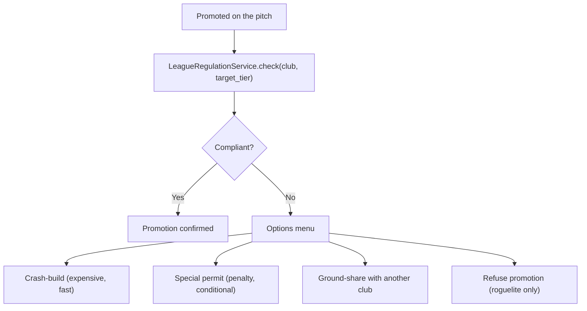

---
title: Regulations and Compliance - Promotion-Gated Stadium and Operations Rules
status: draft
tags: [game-design, regulations, compliance, leagues, promotion]
created: 2026-05-16
updated: 2026-05-16
type: game-design
binding: false
related: [[README]], [[../60-Research/regulations-and-pyramids-research]], [[../60-Research/late-game-systems]], [[stadium-and-campus]], [[matchday-event-engine]]
---

# Regulations and Compliance - Promotion-Gated Stadium and Operations Rules

Promotion must mean **infrastructure + operations obligations**, not just
better opponents and TV money. The compliance gameplay loop turns sporting
success into investment pressure.

## 1. Product rule

> **Each (country, tier, competition) tuple has a set of compliance rules.
> A club must meet the rules of its destination tier when promoted, or face
> consequences (special permit, alternate stadium, ground-share, refuse
> promotion).**

## 2. Three rule layers

| Layer | Rule type | Example |
|---|---|---|
| Federation / League | Hard admission rules | Floodlight standard, security concept, stadium admission |
| Country | Soft match culture | Alcohol policy, fan travel patterns, stadium culture |
| Competition | Special rules | Squad registration, security tiers, international requirements |

Implemented as: `LeagueRegulationService` returns merged rule set for
(country, tier, competition).

## 3. Country coverage at MVP

| Country | Coverage | Source |
|---|---|---|
| Germany | Bundesliga → Verbandsliga | [[../60-Research/regulations-and-pyramids-research]] §3 |
| England | Premier League → Step 7 | [[../60-Research/regulations-and-pyramids-research]] §4 |
| France | Ligue 1 + 2 | [[../60-Research/regulations-and-pyramids-research]] §5 |
| Italy | Serie A + B | [[../60-Research/regulations-and-pyramids-research]] §6 |
| Spain | LaLiga 1 + 2 | [[../60-Research/regulations-and-pyramids-research]] §7 |
| Other | Abstract licence profile | League + licence profile only |

Community packs ([[community-editor-and-datasets]]) can extend.

## 4. Compliance categories

A compliance rule belongs to a category. Each category has a graded
threshold per tier.

| Category | Examples |
|---|---|
| **Capacity** | Minimum / specific stand categories |
| **Floodlight** | lux / colour temperature / coverage |
| **Sanitary** | toilets per spectator, accessibility |
| **Press / media** | media seats, press conference room |
| **Security** | safety officer, security concept, separation zones |
| **Hospitality** | premium seats, suites, food service |
| **Medical** | paramedics, ambulance, first-aid stations |
| **Pitch + infra** | drainage, turf, irrigation, undersoil heating |
| **Connectivity** | WiFi, app infrastructure, broadcasting cables |
| **Squad** | home-grown minimum, work-permit, age-band quotas |

## 5. Promotion compliance check

## 6. Per-option details

### 6.1 Crash-build

- Cost: 1.5-2.5× normal build cost.
- Time: half the normal time.
- Risk: temporary capacity drop (existing stand torn down).
- Side effect: Fan zone disrupted for the season.

### 6.2 Special permit

- Granted for 1 season.
- Penalty: 10-30 % revenue cut from gate / hospitality.
- Conditions: must meet at end of season or face relegation.

### 6.3 Ground-share

- Rent another club's stadium (in-game-fictional rental market).
- Lower revenue (split with host).
- Atmosphere -10 % to -30 % from "not home".

### 6.4 Refuse promotion (Create-a-Club Roguelite mode only)

- Run gets a "compliance failure" badge.
- May trigger DNA `tradition ↓` (refusing is unusual).
- League stays at current tier.

## 7. Squad registration rules

Per competition:

- Total squad size cap.
- Home-grown minimum.
- Foreign player cap (per relevant FA rules - abstracted).
- Work-permit checks (abstract: each non-home foreign player has a
  "permit score" derived from career caps).
- U-21 minimum (continental cups).

## 8. Operations rules

- Safety officer required (Germany 3. Liga +, England FA Ground Grading
  Grade A-B).
- Security concept (written plan) required at higher tiers.
- Anti-discrimination procedures (mandated at all tiers; tighter at top
  tiers).
- Alcohol policy: per country (e.g. Bundesliga allows; some other leagues
  restrict at risk matches).

## 9. Compliance failure mid-season

If a club drops *below* current tier requirements mid-season (e.g.
stand-roof collapse, safety officer resignation):

- Warning + grace period (typically 6-12 weeks).
- If unresolved, partial sanctions: alcohol ban, sector closure, fine.
- If still unresolved at season end: forced relegation.

## 10. UI tiers

| Tier | Compliance surface |
|---|---|
| Quick | "Promotion ready: yes / no" badge + 1-3 actionable cards |
| Standard | Compliance dashboard with per-category status |
| Expert | Full rule-set view, per-rule current state, planned-action timeline |

## 11. Community editor hooks

Community packs ([[community-editor-and-datasets]]) can override:

- Tier definitions per country.
- Per-tier compliance thresholds.
- Sanction parameters.

Manifest must declare which countries it modifies, to allow safe layering.

## 12. Future-scope notes (classified future-scope)

- "Special permit" odds: should the board decide or is it always
  available? Always available but with cost - the league regulator is the
  fictional decider.
- Should women's leagues have their own rule set? Yes - additive overlay
  on top of country rules. See R2-13 in
  [[../95-Archive/gap-reports/research-wave-2-gaps]].
- Continental cups compliance is separate per UEFA-analogue body -
  modelled as a competition-layer rule set. Full continental cup
  design locked in [[../60-Research/late-game-systems]] (gap D6,
  2026-05-17): 3 tiers per continent (Champions Cup / Continental
  League / Challenge Trophy) + global IFC Club World Masters; IP-
  safe naming via fictional governing bodies (IFC / EFC / AFU /
  APFC / AFA); FFP-style penalties for Petrol-State + Murky owner
  archetypes.
