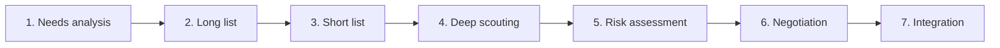
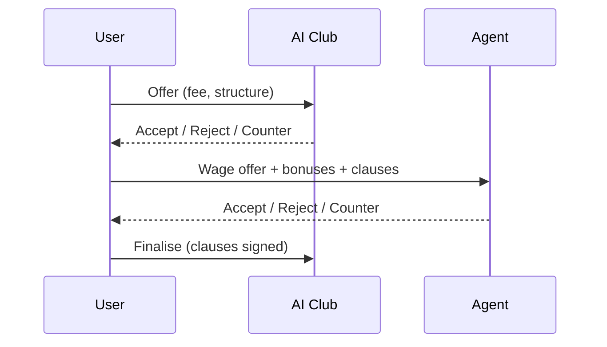

# Scouting and Recruitment - Funnel, Scout Attributes, Market Dynamics

Recruitment is a seven-step funnel. Each step has a cost, an information
quality and a different kind of failure mode. The single biggest gameplay
choice is *where to spend scouting effort* given a finite budget.

## 1. Seven-step recruitment funnel

| Step | What it produces | Cost driver |
|---|---|---|
| Needs analysis | Required role list | Analyst quality |
| Long list | Many candidates, blurred data | Scout coverage |
| Short list | Filtered by role fit, budget, personality, timing | Scout role understanding |
| Deep scouting | Live + video + data report | Scout regional knowledge + time |
| Risk assessment | Adaptability, injuries, mentality flag | Personality reading |
| Negotiation | Contract terms | Manager + sport director |
| Integration | Onboarding, language, tactical learning | Coach + dressing room |

Skipping a step costs information quality - a "panic buy" without deep
scouting is technically possible but high-risk.

## 2. Scout attributes

| Attribute | Bearing |
|---|---|
| Current Ability judgement | Accuracy on present strength |
| Potential Ability judgement | Projection on youth |
| Regional knowledge | Data quality in given markets |
| Role understanding | Tactical fit analysis (linked to [[tactics-system]]) |
| Personality reading | Character + leadership |
| Network | More chances for early discovery |

Each attribute is 1-10. A scout's value is the *combination* against the
club's recruitment strategy, not a single sum.

## 3. Player report opacity

A player report is *not* fully revealed instantly:

- **Layer 1** (first sight): Position, age, approximate ability range
  (★★ - ★★★★★), top-line traits.
- **Layer 2** (after 2-3 reports): Approximate attributes (banded),
  personality cue.
- **Layer 3** (after deep scout): Numeric attributes (1-10), PA range,
  hidden flags partly visible.

In expert UI, opacity layers are explicit; in Quick / Standard, layers
collapse into ★ ratings + a trust meter.

## 4. Market dynamics

Prices rise with:

- Competition (multiple clubs interested).
- Remaining contract length (shorter → cheaper).
- Wage demands.
- Agent relations.
- Other clubs' squad needs.
- Timing close to deadline.

In async multiplayer ([[async-multiplayer-private-group]]) the human-to-
human transfer market gains *bluffing* and *time-pressure exploitation* as
real strategies. See [[transfer-negotiations-p2p]].

## 5. Scouting budget allocation

Per period, the player allocates a scouting budget across:

- Regions (per continent / country / league tier).
- Player types (positions, age groups, role fit).
- Depth (broad coverage vs deep dives).
- Strategic targets (specific named players already short-listed).

The Chief Scout proposes default allocation; the player overrides.

## 6. Long list and short list management

The UI maintains two persistent lists:

- **Long list**: many candidates, periodic light updates from scouts.
- **Short list**: priority targets, frequent deep updates.

Each list entry shows trust meter, last update date, fit-to-tactic %.

## 7. Hidden flags surfaced by scouts

- Injury proneness.
- Big-match temperament.
- Professionalism / off-pitch behaviour.
- Adaptability (new country, new language).
- Ambition (will they accept rotation?).

Only deep + repeated scouting reveals these reliably.

## 8. Negotiation flow

See [[transfer-negotiations-p2p]] for human-to-human transfers; for AI
counter-parties:

Clauses: sell-on %, bonus per appearance, bonus per league position,
release clause, loyalty bonus, language/lifestyle requirements.

## 9. UI tiers

| Tier | Surface |
|---|---|
| Quick | "Need a striker? Top 3 recommended" + price preview |
| Standard | Short list + scout reports + recommend transfer |
| Expert | Long list, regional heat map, scout coverage map, deep flags |

## 10. Open questions

- Should there be a "Recruitment Hub" page (FM26 pattern) that consolidates
  needs + budget + scout coverage? Yes - it is the Standard-tier home.
- Agent system depth: simple cost layer or full agent-relationship system?
  Simple cost at MVP; relationship Phase 2+.
- Free agent market: do agents proactively offer free agents to the club?
  Yes, weighted by scout network + brand strength.
