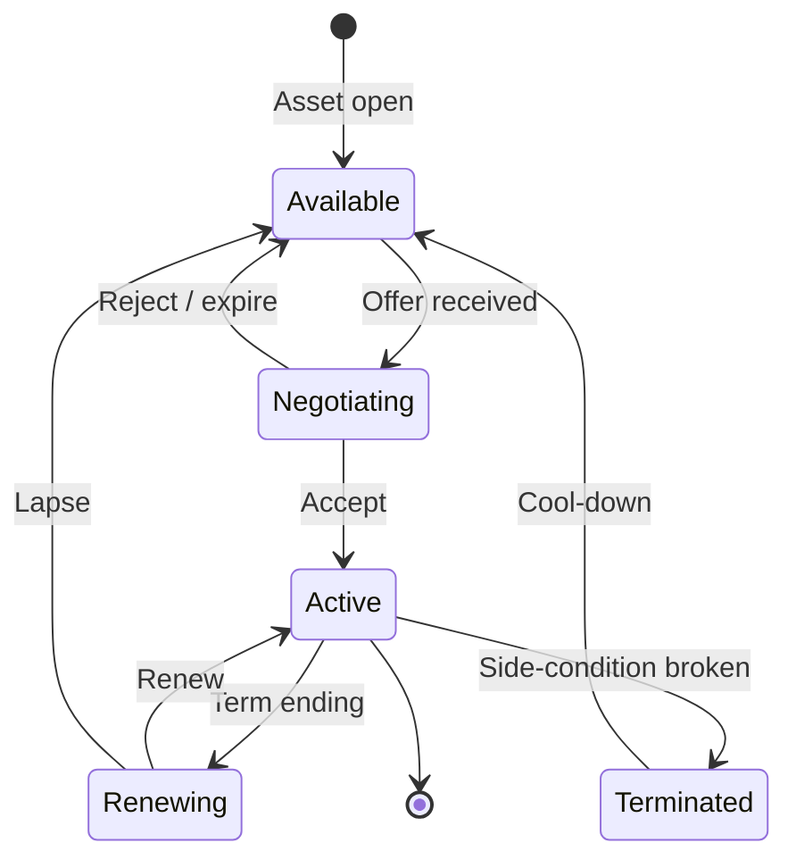

# Sponsorship Portfolio - Asset-level Sponsor Inventory

Sponsoring is **not** a single annual contract. Real clubs sell jersey
front, sleeve, training kit, naming rights, hospitality areas, LED boards,
app inventory and fan-zone activations as separate inventories. The game
models the same.

FMX-13 anchors sponsorship into the Club Management accounting ledger:
contracts may be recognised as revenue over time while cash arrives upfront,
periodically or as performance bonuses. Sponsor side-conditions are gameplay
constraints, not just flavour.

## 1. Sponsor categories

| Tier | Asset examples | Volume | Side-conditions |
|---|---|---|---|
| **Main partner** | Jersey front, global lead | Highest single contract | Strong brand-safety, exclusivity in category |
| **Secondary** | Sleeve, shorts, training kit | High | Compatible industries only |
| **Infrastructure** | Stadium name, stand, academy, training centre | Multi-year, lumpsum + annual | Naming rights, branding |
| **Match-day** | Half-time, fan zone, drinks, catering | Per-event or seasonal | Fan profile fit |
| **Digital** | App, line-up post, goal alert, fantasy/data | Annual | Reach + audience |
| **Local** | Crafts, dealers, regional brewery, SME | Many small contracts | Regional relevance |

## 2. Asset inventory taxonomy

A club's "inventory" lists every individual asset it can sell:

- Jersey front, sleeve, back, shorts.
- Training kit.
- Stadium name (one slot).
- Stand naming (multiple).
- VIP suites (multiple).
- LED ring board (rotation slots).
- Mobile app banner.
- Fan zone activation.
- Goal-alert pre-roll.
- Newsletter sponsor.
- Catering exclusivity (beer / soft drinks / sausages).

Each asset has a *base value* that depends on club KPIs:

```text
asset_value = base_rate
            * reach_factor              # league + global brand
            * utilisation_factor        # stadium occupancy
            * fan_profile_factor        # match to brand category
            * media_resonance_factor    # post-match coverage
            * exclusivity_multiplier    # category exclusivity
```

## 3. Sponsor valuation factors

A sponsor offer is computed from:

- Club **reach** (league level + brand_strength).
- Brand **safety / image** (DNA, recent incidents).
- **Table + league** (current + last-3-season average).
- **Stadium utilisation** (long-running attendance).
- **Hospitality quality** (premium share, comfort tier).
- **Fan profile + regional fit** (DNA + region).
- **Media resonance** (press conference engagement).
- **Per-category exclusivity** (no two brewery sponsors).

## 4. Sponsor side-conditions

Sponsors don't only bring money. They bring **side conditions** that
constrain other decisions:

- Youth focus minimums (some kit deals).
- Family-friendly image (kid zones, alcohol restrictions).
- Minimum reach (continental qualification required).
- Hospitality capacity (premium seats present).
- Fan activations per season (community / fan-zone events).
- Exclusion of competing industries (no rival brewery).
- Player conduct clauses (disciplinary triggers).
- Stadium-name retention (no name change for X years).

Breaking a side-condition → contract renegotiation, fine or termination.

## 4.1 Accounting and timing

Sponsor contracts define:

- cash cadence (upfront, monthly, seasonal, milestone);
- recognised revenue period;
- performance bonuses and penalties;
- termination and repayment clauses;
- category exclusivity and side-condition risk.

The finance ledger receives the cash and accrual entries; this note owns the
valuation and side-condition design.

## 5. Sponsor management UI tiers

| Tier | Sponsor view |
|---|---|
| Quick | "Sponsors income: amount/year" + 1 actionable card |
| Standard | Tier overview, accept/reject incoming offers |
| Expert | Full asset inventory, per-asset price, side-condition register |

## 6. Sponsor lifecycle



## 7. Linking to fans

Some sponsor categories *fight* the fan segments
([[fan-ecology]]). Examples:

- Gambling sponsor on jersey front: family + ultras segments unhappy.
- Stadium naming change: tradition segment unhappy.
- Energy drink in fan zone: family + ultras mixed; corporate happy.

The conflict surface is intentional - it provides decisions with
trade-offs.

## 8. Future-scope notes (classified future-scope)

- Stadium naming - one slot per club or none for traditional clubs? Both;
  some clubs have `tradition` so high that naming is non-negotiable.
- Multi-year vs single-year contracts: support both; default for main is
  3-year, side conditions reset annually.
- Should fan campaigns directly modify sponsor `media_resonance_factor`?
  Yes - a club-led campaign can raise it +5 % for the season.
