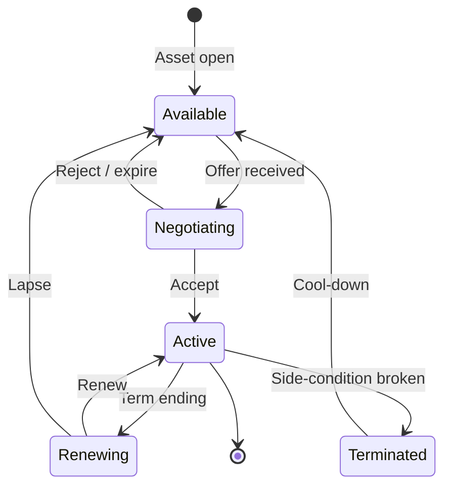

# Sponsorship Portfolio - Asset-level Sponsor Inventory

> **Status note (2026-06-11, FMX-143):** This system/mode note is `status: draft` — it was
> reopened 2026-05-27 and was **not** among the 133 decisions ratified in the 2026-06-08
> sweep (#153). "Approved" wording below is **pre-reopen history**, not a current status
> claim; the product rules described here await individual re-approval (decided by Nico,
> 2026-06-11: keep `draft`, re-approval is a later HITL pass — see
> [[../40-Execution/ratification-status-inventory-2026-06-11|status inventory]]). Frontmatter
> is the status SSOT per
> [[../10-Architecture/09-Decisions/ADR-0092-vault-governance-status-ssot-and-reference-integrity-sweep|ADR-0092]].
> The ratified GDDR layer ([[README|Game Design Hub]]) may cover the same system — the GDDR
> is then the binding record.

Sponsoring is **not** a single annual contract. Real clubs sell jersey
front, sleeve, training kit, naming rights, hospitality areas, LED boards,
app inventory and fan-zone activations as separate inventories. The game
models the same.

FMX-13 anchors sponsorship into the Club Management accounting ledger:
contracts may be recognised as revenue over time while cash arrives upfront,
periodically or as performance bonuses. Sponsor side-conditions are gameplay
constraints, not just flavour.

FMX-44 keeps sponsorship asset-driven but routes every signed deal through the
shared `CommercialContract` lifecycle. Sponsor-specific schedules define asset
packages, category exclusivity, activation obligations, fan-fit risk, renewal
rights and breach remedies.

FMX-48 adds fan-service campaigns as measurable sponsor activations. Sponsors
can fund, staff, supply, promote or prize a campaign, but the game must track
fit, KPI targets, low uptake, make-goods, cooldowns and fan-spam fatigue instead
of treating every activation as positive exposure.

FMX-54 extends the IP/privacy guardrails to sponsors and venues: sponsor brand
names, venue naming rights, hospitality partners and campaign labels are
fictional and follow ADR-0007/GD-0015 naming gates. No real brands, famous
homophones, slogan echoes or confusingly similar venue/sponsor names are used.
Fan-service activations must not collect or imply real private-person data,
supporter membership lists or special-category fan attributes unless a future
legal/privacy gate explicitly approves a hosted UGC/user-data feature.

## 1. Sponsor categories

| Tier | Asset examples | Volume | Side-conditions |
|---|---|---|---|
| **Main partner** | Jersey front, global lead | Highest single contract | Strong brand-safety, exclusivity in category |
| **Secondary** | Sleeve, shorts, training kit | High | Compatible industries only |
| **Infrastructure** | Stadium name, stand, academy, training centre | Multi-year, lumpsum + annual | Naming rights, branding |
| **Match-day** | Half-time, fan zone, drinks, catering | Per-event or seasonal | Fan profile fit |
| **Digital** | App, line-up post, goal alert, fantasy/data | Annual | Reach + audience |
| **Local** | Crafts, dealers, regional brewery, SME | Many small contracts | Regional relevance |

## 2. Asset inventory taxonomy

A club's "inventory" lists every individual asset it can sell:

- Jersey front, sleeve, back, shorts.
- Training kit.
- Stadium name (one slot).
- Stand naming (multiple).
- VIP suites (multiple).
- LED ring board (rotation slots).
- Mobile app banner.
- Fan zone activation.
- Family day / community ticket block.
- Away travel support.
- Choreo or supporter-dialogue support.
- Digital fan challenge.
- Goal-alert pre-roll.
- Newsletter sponsor.
- Catering exclusivity (beer / soft drinks / sausages).

Each asset has a *base value* that depends on club KPIs:

```text
asset_value = base_rate
            * reach_factor              # league + global brand
            * utilisation_factor        # stadium occupancy
            * fan_profile_factor        # match to brand category
            * media_resonance_factor    # post-match coverage
            * exclusivity_multiplier    # category exclusivity
```

## 3. Sponsor valuation factors

A sponsor offer is computed from:

- Club **reach** (league level + brand_strength).
- Brand **safety / image** (DNA, recent incidents).
- **Table + league** (current + last-3-season average).
- **Stadium utilisation** (long-running attendance).
- **Hospitality quality** (premium share, comfort tier).
- **Fan profile + regional fit** (DNA + region).
- **Media resonance** (press conference engagement).
- **Per-category exclusivity** (no two brewery sponsors).

## 4. Sponsor side-conditions

Sponsors don't only bring money. They bring **side conditions** that
constrain other decisions:

- Youth focus minimums (some kit deals).
- Family-friendly image (kid zones, alcohol restrictions).
- Minimum reach (continental qualification required).
- Hospitality capacity (premium seats present).
- Fan activations per season (community / fan-zone events).
- Fan-service campaign make-good if participation, exposure or availability is
  below the agreed threshold.
- Exclusion of competing industries (no rival brewery).
- Player conduct clauses (disciplinary triggers).
- Stadium-name retention (no name change for X years).

Breaking a side-condition → contract renegotiation, fine or termination.

## 4.1 Accounting and timing

Sponsor contracts define:

- cash cadence (upfront, monthly, seasonal, milestone);
- recognised revenue period;
- performance bonuses and penalties;
- termination and repayment clauses;
- category exclusivity and side-condition risk.

The finance ledger receives the cash and accrual entries; this note owns the
valuation and side-condition design.

## 5. Sponsor management UI tiers

| Tier | Sponsor view |
|---|---|
| Quick | "Sponsors income: amount/year" + 1 actionable card |
| Standard | Tier overview, accept/reject incoming offers |
| Expert | Full asset inventory, per-asset price, side-condition register |

## 6. Sponsor lifecycle

This diagram is the sponsor-asset view. The signed finance/legal gameplay
object follows the shared FMX-44 `CommercialContract` lifecycle in
[[../30-Implementation/club-economy-commercial-contracts]].



## 7. Linking to fans

Some sponsor categories *fight* the fan segments
([[audience-and-atmosphere]]). Examples:

- Gambling sponsor on jersey front: family + ultras segments unhappy.
- Stadium naming change: tradition segment unhappy.
- Energy drink in fan zone: family + ultras mixed; corporate happy.

The conflict surface is intentional - it provides decisions with
trade-offs.

## 8. Shared commercial contract shell

FMX-41 aligns sponsorship with catering and merchandise under the shared
`CommercialContract` contract. FMX-44 expands that shell to all six commercial
families: sponsorship, catering, merchandise, hospitality, supplier and
venue-activation deals. Sponsorship remains asset-driven, but it now uses the
same lifecycle and breach fields as other commercial deals:

- lifecycle state and contract version;
- term, renewal window, option periods and break clauses;
- cash schedule and accounting recognition schedule;
- fixed guarantee, performance bonus, make-good and penalty rules;
- category/territory/asset exclusivity plus carve-outs;
- activation obligations and fulfilment windows;
- fan/sponsor fit and reputation risk flags;
- curable/material/critical breach policy;
- termination, repayment and category-cooldown rules.

This lets sponsors fund fan-service campaigns, catering exclusivity or
merchandise drops without inventing separate finance mechanics for each case.

Exclusivity conflicts are structured, not free text:

```text
category x territory x asset x carve_outs
```

Draft sponsor-category risk bands:

| Category profile | Fan-fit risk |
|---|---|
| Local community | Low risk, high identity fit. |
| Regional brewery | Positive for some core/local fans, mixed family/alcohol risk. |
| Betting/gambling | High family, legal and reputation risk. |
| Energy-intensive | Medium-high reputation risk depending on generated profile. |
| Bank/fintech | Medium conflict risk with payment or digital partners. |
| Global tech/media | Reach upside, possible privacy/fan-trust risk. |
| Controversial state/owner-linked | High reputation and protest risk; Nico-gated for first playable. |

## 8.1 FMX-48 fan-service activation hooks

Sponsor contribution for a `FanEventCampaign` is not only money. The campaign
contract may provide:

- cash subsidy;
- prizes or product pool;
- transport support;
- media spend / content production;
- staff or operational support;
- community grant;
- digital tooling for participation or UGC.

Minimum sponsor KPI fields:

| Field | Meaning |
|---|---|
| `activationInventory` | Fan zone, family day, away travel, digital, beverage reward, community block or choreo/dialogue asset. |
| `sponsorContribution` | Cash, goods, services, media or staff. |
| `fitBand` | Segment/category fit from Audience & Atmosphere. |
| `kpiTargets` | Participation, attendance uplift, impressions, sentiment, leads, sales or community reach. |
| `makeGoodPolicy` | Extra slot, fee credit, social/LED inventory or contract extension if targets fail. |
| `cooldownPolicy` | Frequency limit by sponsor category, segment and campaign type. |
| `riskFlags` | Alcohol, child/family, data/UGC, controversial category, crowd-flow or public-order risk. |

Low uptake, cancellation or poor fan sentiment can reduce renewal value even if
cash was paid. High-fit campaigns can improve sponsor satisfaction and fan
trust; intrusive or repetitive campaigns create cooldown/fatigue penalties.

## 9. Future-scope notes (classified future-scope)

- Stadium naming - one slot per club or none for traditional clubs? Both;
  some clubs have `tradition` so high that naming is non-negotiable.
- Multi-year vs single-year contracts: support both; default for main is
  3-year, side conditions reset annually.
- Should fan campaigns directly modify sponsor `media_resonance_factor`?
  Yes - a club-led campaign can raise it +5 % for the season.
