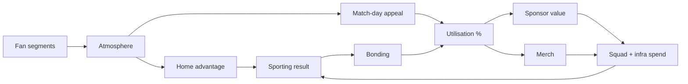
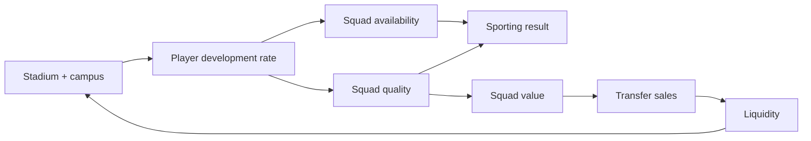
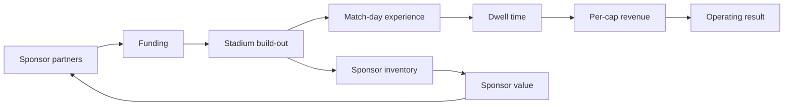
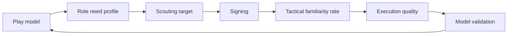

---
title: System Interplay - The Five Master Feedback Loops
status: draft
tags: [game-design, system-design, feedback-loop]
created: 2026-05-16
updated: 2026-05-17
type: game-design
binding: false
related: [[README]], [[../60-Research/systems-design-synthesis]], [[../60-Research/transfer-market-simulation]], [[transfer-market-and-contracts]]
---

# System Interplay - The Five Master Feedback Loops

The single design principle of the game: **no system is implemented in
isolation**. Every mechanic that changes a state must declare which other
systems read that state. The loops below are the contracts.

## 1. Loop 1: Fans → Atmosphere → Sport → Marketing

Detail:

- [[fan-ecology]] §3 atmosphere engine
- [[match-engine]] §1.1 home advantage input
- [[sponsorship-portfolio]] §3 valuation factors

## 2. Loop 2: Infrastructure → Development → Squad Value → Finance

Detail:

- [[stadium-and-campus]] §5 campus modifiers
- [[youth-academy-and-development]] §7 development math
- [[economy-system]] §2 revenue
- [[scouting-and-recruitment]] §10 free agents
- [[transfer-market-and-contracts]] §9 economy integration

## 3. Loop 3: Sponsors → Stadium → Experience → Sponsors

Detail:

- [[sponsorship-portfolio]] §2 asset inventory
- [[stadium-and-campus]] §4 modules
- [[fan-ecology]] §4 per-cap revenue math

## 4. Loop 4: Tactics → Squad Need → Recruitment → Tactics

Detail:

- [[tactics-system]] §6 familiarity
- [[scouting-and-recruitment]] §1 funnel
- [[match-engine]] §3 familiarity multiplier

## 5. Loop 5: Risk → Debt → Pressure → Decisions

```mermaid
flowchart LR
    Invest["Aggressive investment"] --> Liquidity["Liquidity ↓"]
    Liquidity --> Risk["Risk reserve ↓"]
    Invest --> Wage["Wage ratio ↑"]
    Wage --> Operating["Operating result ↓"]
    Operating --> Pressure["Board pressure ↑"]
    Risk --> Pressure
    Pressure --> Panic["Panic transfers /<br/>icon sale"]
    Panic --> Fans["Fan anger ↑"]
    Panic --> Squad["Squad weakening"]
    Squad --> Sport["Bad results"]
    Sport --> Pressure
    Fans --> Pressure
```

This is the engine of the [[mode-create-a-club-roguelite]] death spiral.
The transfer market is where the pressure becomes visible: boards can demand
wage cuts, owners can force sales, players can become wantaway and protected
stars only move when `sellPressure` exceeds `protectionScore` or the buyer
offers a genuinely exceptional package.

Detail:

- [[economy-system]] §6 spiral mechanics
- [[club-dna-and-governance]] §3 pressure loop
- [[fan-ecology]] §5 protest events
- [[transfer-market-and-contracts]] §8 AI club behaviour

## 6. Cross-cutting rules

- No mechanic may modify two pillar states atomically without an event
  trail. Every change must be observable in another system later.
- Every state value has a "where read" list - the design doc must declare
  which other systems read it.
- New mechanics are reviewed against the five loops first: which loop
  does this mechanic strengthen? does it create unintended feedback?

## 7. Future-scope notes (classified future-scope)

- Are there additional emergent loops we should track? Examples flagged
  for Phase 2:
  - Rivalry → Security events → Sanctions → Fan attendance → Atmosphere.
  - Sponsor side-condition breach → Fines → Liquidity → Investment cap.
- Do we expose loop visualisations in the UI? In the Expert tier as a
  "club health" diagram, yes; not in Quick / Standard.
