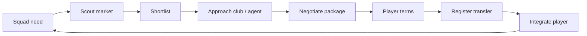

# Transfer Market and Contracts

> **Status note (2026-06-11, FMX-143):** This system/mode note is `status: draft` — it was
> reopened 2026-05-27 and was **not** among the 133 decisions ratified in the 2026-06-08
> sweep (#153). "Approved" wording below is **pre-reopen history**, not a current status
> claim; the product rules described here await individual re-approval (decided by Nico,
> 2026-06-11: keep `draft`, re-approval is a later HITL pass — see
> [[../40-Execution/ratification-status-inventory-2026-06-11|status inventory]]). Frontmatter
> is the status SSOT per
> [[../10-Architecture/09-Decisions/ADR-0092-vault-governance-status-ssot-and-reference-integrity-sweep|ADR-0092]].
> The ratified GDDR layer ([[README|Game Design Hub]]) may cover the same system — the GDDR
> is then the binding record.

> Approved 2026-05-17 after Nico resolved clause depth, Expert UI, transfer
> scope, training rewards and MVP agent depth. Research authority:
> [[../60-Research/transfer-market-simulation]].

The transfer market is a living economy, not a shop list. Clubs plan squads,
players and agents push their own interests, market conditions change by window,
and every deal is a negotiated package.

## 1. Player Fantasy

The player should feel three things:

- **Deals have reasons.** A player is available because of role, contract,
  finance, squad plan, agent pressure or owner policy.
- **Negotiation is strategic.** Cash, instalments, sell-on, bonuses, buy-back,
  loans and obligations can all solve different problems.
- **Information is imperfect.** Market value is a scouting / director estimate,
  not a universal truth.

## 2. Core Loop



The same loop drives AI clubs during their weekly / window ticks.

## 3. Market Surfaces

| Surface | Quick | Standard | Expert |
|---|---|---|---|
| Transfer feed | Top recommendations and urgent offers | Market lists, shortlists, scout trust | Full filters, heat maps, valuation bands |
| Player availability | Simple labels | Reasons and negotiation hints | Numeric pressure / protection estimates with confidence |
| Negotiation | Accept / reject / improve | Guided counter-offer wizard | Full clause editor, cash-equivalent value and net proceeds |
| Club strategy | Hidden | "Club may sell / wants cash" hints | Estimated seller preferences, walk-away risk and data source |

## 4. Availability Labels

Use explicit labels instead of exposing raw scores:

| Label | Meaning |
|---|---|
| Not for sale | Club protects the player; only exceptional overpay or crisis opens talks. |
| Would listen | Deal is possible if package fits club / player goals. |
| Available for right offer | Club has medium sale pressure, but price is protected. |
| Transfer listed | Club actively wants a permanent sale. |
| Loan candidate | Club wants minutes / wage sharing / development exposure. |
| Forced sale | Administration, owner directive, FFP or severe player crisis. |

## 5. Transfer Archetypes

| Archetype | Trigger | Typical package |
|---|---|---|
| Development-club prospect sale | Cash need, top prospect, buyer competition | Fee + sell-on + add-ons |
| Elite star shock sale | Wantaway, contract risk, successor ready, huge bid | High cash, limited clauses |
| Role-frustrated starter | Low minutes or tactical mismatch | Market fee, role promise matters |
| Deadline emergency | Injury / late outgoing | Overpay, short negotiation, fewer clauses |
| Loan to develop | Young player needs minutes | Loan fee, wage share, playing-time promise |
| Loan with option | Buyer wants risk cap | Loan fee + optional buy |
| Loan with obligation | Seller wants exit, buyer needs cash smoothing | Lower upfront fee + conditional obligation |
| Buy-back talent sale | Elite club protects future upside | Lower fee + buy-back / matching right |
| Distressed fire sale | Administration / owner cuts | Discounted but floor-protected sale |

## 6. Negotiation Components

An offer can contain:

- base fee;
- instalments;
- performance bonuses;
- sell-on percentage or profit share;
- buy-back option;
- matching right;
- loan-back;
- loan fee;
- wage-share percentage;
- optional buy clause;
- mandatory buy clause with conditions;
- playing-time promise;
- release clause;
- agent fee;
- signing / loyalty bonus;
- youth compensation / solidarity-style training reward deductions.

Nico decision: the MVP foundation supports the full clause family. Quick and
Standard can guide the player with presets, but Expert exposes the full editor.

## 7. Player Terms

After club agreement, the player / agent evaluates:

- wage and bonuses;
- squad role promise;
- contract length;
- signing fee / agent fee;
- league and club reputation;
- tactical role fit;
- geography / language / family adaptation flags;
- ambition, loyalty, professionalism and morale;
- relationship with manager / director;
- agent fee expectation and leak tendency.

Some players refuse even strong offers. That is a feature, not a failure.

Agents are simple at MVP: they modify transaction demands, leak risk and
negotiation temperature. They still have stable identities and traits so a
deeper relationship system can be layered on later.

People/persona and relationship inputs, if ratified through ADR-0052, are
consumed through the GD-0021 `TransferDecisionContext` planning hook. Transfer
does not duplicate People-owned social truth.

## 8. AI Club Behaviour

AI club transfer strategy is built each window:

```text
ClubTransferStrategy =
  buyTargets
  + sellCandidates
  + loanList
  + notForSaleCore
  + wageCorrectionTargets
  + successionNeeds
  + boardPressure
  + cashUrgency
  + styleFit
```

Selling compares `sellPressure` with `protectionScore`. Buying starts from role
need, squad age profile, tactical fit, budget and manager / owner personality.
Staff Operations recruitment-pipeline quality may influence discovery,
shortlist quality and report confidence through GD-0021; staff-skill profile
effects stay gated until Nico chooses the staff-skill MVP option.

## 9. Economy Integration

Transfer budget and cash are separate:

- A high transfer budget can still fail if liquidity cannot support upfront
  payment, wages and instalments.
- Instalments create future liabilities in the [[economy-system]] ledger and
  affect cash runway.
- Transfer fees create amortisation in Expert accounting views; this is distinct
  from cash timing.
- Sell-on and bonus obligations reduce expected net proceeds.
- Training rewards and solidarity-style deductions reduce seller net proceeds
  and can create small academy income for former clubs.
- Forced sales repair liquidity but damage squad strength, fan sentiment and
  dressing-room trust.

## 10. Transfer Scope

New-save setup includes a Transfer Scope setting:

| Preset | Use |
|---|---|
| Focused | Low-end devices / Small world. Full depth for user league, direct rivals and active shortlist. |
| Standard | Default. User nation, main continental leagues, connected promotion / continental / scouting markets. |
| Deep | Premium / Large world. Selected major nations plus strong talent-export and continental markets. |
| Custom Expert | Manual active leagues with projected performance / storage warning. |

Leagues become more active when they are connected to the user by competition,
promotion, loan pathways, rivalry, shortlist activity, former clubs, feeder /
affiliate links or continental fixtures.

## 11. Training Rewards

The game models training compensation and solidarity as simplified **training
rewards**:

- Quick shows only net cost / proceeds with a tooltip.
- Standard shows gross fee, deductions and net proceeds.
- Expert shows the full fee waterfall, including sell-on, bonuses, agent fees
  and training rewards.

This makes development clubs feel economically alive without making the lower UI
tiers legal-accounting screens.

## 12. Narrative Integration

Transfers feed D15 narrative systems:

- `Transfer Saga`: rumour -> bid -> negotiation -> decision -> aftermath.
- `Player Crisis`: role frustration / wantaway escalation.
- `Bankruptcy Saga`: forced sale and fan reaction.
- Press conferences during windows.
- Newspaper follow-ups for major moves, failed talks and shock sales.

## 13. Rules of Thumb

- Market value is never the final price.
- Price is a range plus a negotiation context.
- Clubs never sell protected core players for token fees.
- Clauses are priced internally as cash equivalents.
- Full simulation depth is tiered by world proximity.
- UI explains causes without exposing all hidden formulas.

## 14. Contract lifecycle, Bosman and free agents (FMX-81)

Contract expiry is a market force, not a passive date field. Proposed ADR-0073
assigns lifecycle truth to Squad & Player and keeps Transfer as the process owner
for negotiation cases.

### Contract Hub states

| State | Player-facing meaning |
|---|---|
| Secure | No immediate action. |
| Monitor | Plan now if the player is important, expensive or sellable. |
| Renewal Due | Open talks, sell, release or consciously defer. |
| Pre-contract Eligible | Other clubs may approach under the active Regulations profile. |
| Expiring | Last high-risk period before the player leaves or becomes unattached. |
| Free Agent | Player is unattached; signing is no-fee but registration/work eligibility still gates use. |

### Renewal loop

Important players must get a multi-touch arc:

1. **Intent** — extend at current level, reward, cut costs, sell or release.
2. **Stance** — player/agent reports openness and expected pain points.
3. **Offer** — wage, years, role and one key clause/bonus on mobile; Expert can
   expose the full clause family later.
4. **Counter / accept / cool-off** — two or three rounds before a cooldown or
   breakdown. The next retry can be easier/harder based on role, morale, form and
   competing interest.

This is the minimum loop that avoids the known "offer / no counter / lose player"
failure from GD-0006.

### Bosman / pre-contract opportunities

When Regulations says the pre-contract window is open, Transfer may open a
`PreContractCase`. The UI action is **Approach to Sign**:

- same player terms surface as other contract talks;
- no selling-club negotiation;
- future effective date, usually contract end / next valid registration point;
- may complete as terms agreed while registration/work eligibility remains pending.

For the user's own players, the inbox should surface "external clubs can now
approach" and "pre-contract agreed elsewhere" as critical risk cards.

### Free-agent signing

Free agents use `FreeAgentSigningCase`:

- no transfer fee and no seller;
- terms can be agreed at any time;
- player may still be unavailable until Regulations returns registration and
  work-permit eligibility;
- signing bonus and agent fee flow to Club Management as financial intents.

Free-agent lists are not just bargain bins: each candidate carries reason tags
such as recently released, wage-risk, veteran stopgap, youth upside and
work-permit risk.

## 15. Notification and opportunity surfacing

Expiry warnings are Notification-owned events with self-contained facts. Transfer
may consume the same facts to create market opportunities:

- internal risk: "Key midfielder can talk to other clubs in 30 days";
- external target: "Scouted winger enters pre-contract window";
- free-agent spotlight: "Released goalkeeper fits backup need";
- squad-planning prompt: "Three rotation players expire this summer".

Warnings should be batched into season-start, mid-season and end-season planning
beats where possible, with urgent individual cards for key-player risk.
