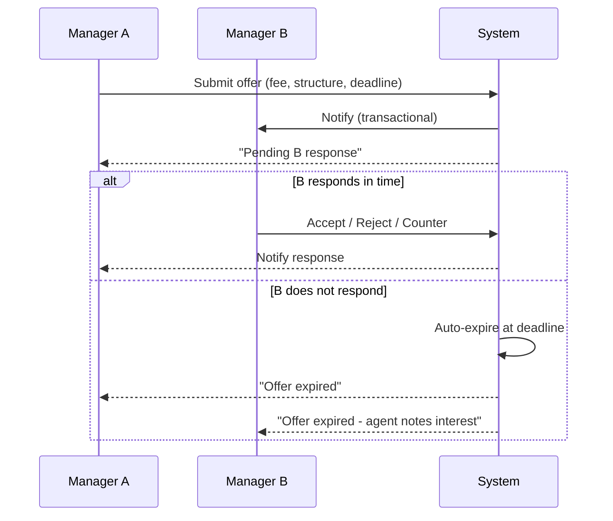

# Player-to-Player Transfer Negotiations

Human-to-human transfers are the most strategic interaction in async
groups. The design rule is **silence must not be the strongest strategy**.
This note documents the deadline-based escalation chain.

## 1. Product rule

> **A human-to-human transfer has a response deadline. Non-response is
> never costless, but never instantly catastrophic. Escalation goes
> through staged consequences.**

## 2. Offer flow

## 3. Escalation chain (verbatim)

Per [[../60-Research/async-multiplayer-research]] §4 and
[[../10-Architecture/state-machines/transfer]]:

| Stage | Trigger | Effect |
|---|---|---|
| 1 | First non-response | Offer `expired`. Agent registers interest. |
| 2 | Repeated ignored strong interest | `agentPressure ↑`, `playerUnrest ↑` for the target player |
| 3 | Sustained ignoring + player favors move | Player issues transfer request via media |
| 4 | Continued ignoring | Training-mood slip in B's squad |
| 5 | Public chain | Media leak / supporter unrest in B's club |

Strike is **never** an immediate consequence of one ignored offer.

## 4. Negotiation parameters

An offer contains:

- **Fee**: cash up front, instalments schedule.
- **Sell-on clause**: % to selling club on future sale.
- **Bonus per appearance**.
- **Bonus per league position**.
- **Release clause** (optional).
- **Loyalty bonus**.
- **Lifestyle / language requirement** (rare).

Counter-offers can adjust any of the above and reset the response
deadline (with limits to avoid infinite loops).

## 5. Player-side acceptance

Even if both clubs agree, the **player** must accept terms:

- Wage offer + bonuses.
- Squad role promise (starter / rotation).
- League level vs current.
- Geographical / family fit (hidden personality flags).
- Career trajectory ("I want Champions League football").

Personality + ambition flags drive this. Some players will refuse moves
regardless of money.

## 6. Hijack rule

If a counter-offer is open and a third human manager makes a competing
offer, the original counter-offer remains valid until its deadline. The
third offer is logged and surfaced to the player. Multiple humans can
bid; auction-style dynamics emerge naturally.

## 7. Anti-griefing rules

- Maximum **3 outstanding outgoing offers** per manager at once.
- Spam pattern (10+ offers in 24 h from same manager) triggers rate-limit.
- Offers below 30 % of fair-value mark are filtered as "lowball"
  (auto-rejected unless target is unhappy).
- Repeated lowballing logs a `griefingScore` per manager; admin can
  review.

## 8. Deadline parameters

Default deadlines depend on the cadence model (from
[[async-multiplayer-private-group]]):

- **Fixed cadence**: offer expires Friday evening of the week submitted.
- **Dynamic cadence**: offer expires at the slower of (24 h after
  submission) or (the next `pre_match_countdown`).

Group rule sets can override.

## 9. UI tiers

| Tier | Transfer-negotiation surface |
|---|---|
| Quick | Inbox card: "Offer for X. Accept / Reject / Counter / Defer" |
| Standard | Side panel with full offer terms and counter-offer wizard |
| Expert | Full offer history, bargaining-power meter, agent-pressure flag, clause editor |

## 10. Open questions

- Should the system propose "fair value" estimates to both sides? Yes,
  using market data from the league + scout reports.
- Auction mode for free agents (group-wide draft) - Phase 2.
- Cross-group transfer? Out of scope - groups are sealed.
