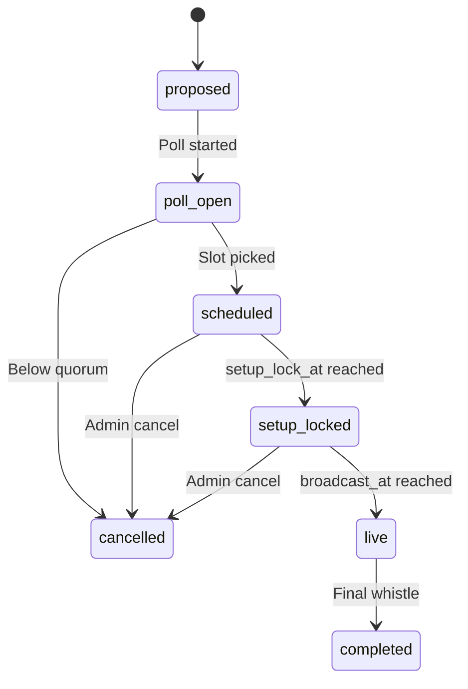

---
title: Watch Party and Conference Mode
status: draft
tags: [game-design, mode, multiplayer, watch-party, conference]
created: 2026-05-16
updated: 2026-05-16
type: game-design
binding: false
related: [[README]], [[../60-Research/async-multiplayer-research]], [[async-multiplayer-private-group]], [[../10-Architecture/state-machines/watch-party]]
---

# Watch Party and Conference Mode

A **synchronous spike** sitting on top of the async multiplayer model.
Targets emotional highlights (human-vs-human matches, finals, derbies,
relegation) without dragging the rest of the league into real-time
scheduling.

## 1. Product rule

> **Watch parties layer synchronous, scheduled live viewing on top of the
> normal async cadence. The async core stays unchanged; watch parties add
> deadlines that compute backwards from the broadcast time.**

## 2. Eligible match types

The game proposes watch-party candidates automatically:

- Human-vs-human league or cup match.
- Champions-League-equivalent final (continental cup).
- Domestic cup final.
- Last match-day with promotion / relegation implications.
- Relegation play-off.
- Derby (rivalry score above threshold from [[rivalry-system]]).

Group or admin confirms or rejects.

## 3. Scheduling

Polls with the standard pattern from
[[../60-Research/async-multiplayer-research]] §5:

- System proposes 2-4 slot suggestions in next 7 days.
- Members vote within a clear deadline.
- Auto-pick the best slot OR admin lock-in if tied.
- Reminders 24 h / 1 h / 5 min before start.

## 4. Backward deadline propagation

Once a watch party is scheduled:

```text
broadcast_at = T
tactic_lock_at = T - 30 min
line-up_lock_at = T - 30 min
transfer_lock_at = T - 60 min
setup_lock_at = T - 5 min
```

All upstream deadlines compute backwards. The matchday-open state in
[[async-multiplayer-private-group]] is bypassed for this match because
the scheduling event takes precedence.

## 5. Watch-party state machine

State machine in [[../10-Architecture/state-machines/watch-party]].



## 6. Broadcast architecture

Technical detail: [[../10-Architecture/09-Decisions/ADR-0015-spectator-snapshot-streaming]].

Summary:

- Match simulated **server-authoritative** on the match service.
- Periodic snapshots / event frames produced.
- A separate spectator / replay service consumes the stream.
- Spectators read it with **configurable delay** (15-60 s) to neutralise
  voice/chat coaching edge.
- Active managers see live (or quasi-live for human-vs-human).
- Chat live.
- Voice via external (e.g. Discord) - not in scope to host.

## 7. Live coaching rules

For watch-party / human-vs-human matches the group rule set specifies:

| Rule | Options |
|---|---|
| Pause allowed? | Yes / No |
| Inputs at any time? | Always / Only fixed windows |
| Coach view delay | Live / 5 s / 15 s |
| Spectator view delay | 15 / 30 / 60 s |
| Chat | Live / 10 s delayed for spectators |

The delay rule ensures spectators with voice contact to a manager cannot
feed real-time tactical info.

## 8. Conference mode

When multiple league matches happen at once at season's end:

- Conference subscribes to all live match feeds.
- Switches between feeds by event priority:
  - Goal (highest).
  - Penalty.
  - Red card.
  - Lead change.
  - Table swing (computed live).
  - Manager-flagged "high tension" moment.

Each manager can still actively manage their own match while watching
others. Conference is *additive* viewing, not replacement.

## 9. UI tiers

| Tier | Watch-party surface |
|---|---|
| Quick | Big "Watch live" card + 1-line commentary stream |
| Standard | Pitch view + chat + key event list |
| Expert | Multi-feed conference, heat-maps, predictive overlays, manager intervention timeline |

## 10. Future-scope notes (classified future-scope)

- Max watch-parties per week - tentative 1 to avoid scheduling fatigue.
- Spectator can rejoin mid-match? Yes, with delay applied from the joining
  point.
- Recording / replay availability post-match - yes, replay always
  available to group members.
- Auto-proposal trigger: which fixture properties qualify as
  "highlightable"? Documented in [[../50-Game-Design/rivalry-system]] §5
  and per match-day in [[../50-Game-Design/matchday-event-engine]].
