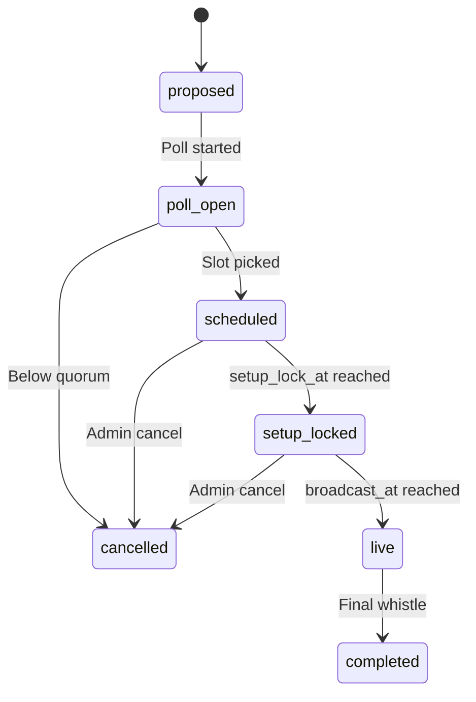

# Watch Party and Conference Mode

> **RATIFIED on 2026-06-19.** Nico approved the linked FMX decision
> queue via `APPROVE ALL RECOMMENDED`; this game-design record is now
> binding according to its approved scope.


> **Status note (2026-06-11, FMX-143):** This system/mode note is `status: draft` — it was
> reopened 2026-05-27 and was **not** among the 133 decisions ratified in the 2026-06-08
> sweep (#153). "Approved" wording below is **pre-reopen history**, not a current status
> claim; the product rules described here await individual re-approval (decided by Nico,
> 2026-06-11: keep `draft`, re-approval is a later HITL pass — see
> [[../40-Execution/ratification-status-inventory-2026-06-11|status inventory]]). Frontmatter
> is the status SSOT per
> [[../10-Architecture/09-Decisions/ADR-0092-vault-governance-status-ssot-and-reference-integrity-sweep|ADR-0092]].
> The ratified GDDR layer ([[README|Game Design Hub]]) may cover the same system — the GDDR
> is then the binding record.

A **synchronous spike** sitting on top of the async multiplayer model.
Targets emotional highlights (human-vs-human matches, finals, derbies,
relegation) without dragging the rest of the league into real-time
scheduling.

## 1. Product rule

> **Watch parties layer synchronous, scheduled live viewing on top of the
> normal async cadence. The async core stays unchanged; watch parties add
> deadlines that compute backwards from the broadcast time.**

## 2. Eligible match types

The game proposes watch-party candidates automatically:

- Human-vs-human league or cup match.
- Champions-League-equivalent final (continental cup).
- Domestic cup final.
- Last match-day with promotion / relegation implications.
- Relegation play-off.
- Derby (rivalry score above threshold from [[rivalry-system]]).

Group or admin confirms or rejects.

## 3. Scheduling

Polls with the standard pattern from
[[../60-Research/async-multiplayer-research]] §5:

- System proposes 2-4 slot suggestions in next 7 days.
- Members vote within a clear deadline.
- Auto-pick the best slot OR admin lock-in if tied.
- Reminders 24 h / 1 h / 5 min before start.

## 4. Backward deadline propagation

Once a watch party is scheduled:

```text
broadcast_at = T
tactic_lock_at = T - 30 min
line-up_lock_at = T - 30 min
transfer_lock_at = T - 60 min
setup_lock_at = T - 5 min
```

All upstream deadlines compute backwards from `broadcast_at`.

> **Draft reconciliation (FMX-102 / proposed [[../10-Architecture/09-Decisions/ADR-0088-async-escalation-fsm-and-watch-party-deadline-source-of-truth]]).**
> `broadcast_at` is the single **deadline source-of-truth** for this match: League Orchestration
> **adopts** it as the matchday timing **anchor at schedule time** (carried via `WatchPartyScheduled`)
> and derives the matchday locks from it — the matchday-open lifecycle is **not** bypassed (League
> still owns it; it just derives its deadlines from `broadcast_at`). Resolved at schedule time +
> immutable once the matchday opens, so ADR-0012's no-mid-cycle-mutation rule holds. (Supersedes the
> earlier "is bypassed … the scheduling event takes precedence" wording on ratify.) See
> [[../10-Architecture/state-machines/league-week]] §3.1.

## 5. Watch-party state machine

State machine in [[../10-Architecture/state-machines/watch-party]].



## 6. Broadcast architecture

Technical detail:
[[../10-Architecture/09-Decisions/ADR-0099-spectator-watch-party-streaming-over-committed-event-log]].
Draft context-owner detail:
[[../10-Architecture/09-Decisions/ADR-0133-watch-party-context-definition]].

Summary:

- Match simulated **server-authoritative** on the match service.
- Match owns the committed event log / replay stream.
- Watch Party consumes the stream for party-scoped broadcast/session state.
- Spectators read it with **configurable delay** (15-60 s) to neutralise
  voice/chat coaching edge.
- Active managers see live (or quasi-live for human-vs-human).
- Chat, markers and moderation are Watch Party social state in the FMX-159
  draft proposal.
- Voice via external (e.g. Discord) - not in scope to host.

## 7. Live coaching rules

For watch-party / human-vs-human matches the group rule set specifies:

| Rule | Options |
|---|---|
| Pause allowed? | Yes / No |
| Inputs at any time? | Always / Only fixed windows |
| Coach view delay | Live / 5 s / 15 s |
| Spectator view delay | 15 / 30 / 60 s |
| Disconnect pause mode | Off / Active managers / All managers |
| Disconnect pause window | 30-300 s, default 180 s |
| Chat | Live / 10 s delayed for spectators |

The delay rule ensures spectators with voice contact to a manager cannot
feed real-time tactical info.

Default disconnect behavior: only active managers may pause the shared
broadcast, and only within the group's pause budget. Passive spectators never
pause the match; reconnect puts them back on the current delayed stream or the
replay.

## 8. Conference mode

When multiple league matches happen at once at season's end:

- Conference subscribes to all live match feeds.
- Switches between feeds by event priority:
  - Goal (highest).
  - Penalty.
  - Red card.
  - Lead change.
  - Table swing (computed live).
  - Manager-flagged "high tension" moment.

Each manager can still actively manage their own match while watching
others. Conference is *additive* viewing, not replacement.

## 9. UI tiers

| Tier | Watch-party surface |
|---|---|
| Quick | Big "Watch live" card + 1-line commentary stream |
| Standard | Pitch view + chat + key event list |
| Expert | Multi-feed conference, heat-maps, predictive overlays, manager intervention timeline |

## 10. Future-scope notes (classified future-scope)

- Max watch-parties per week - tentative 1 to avoid scheduling fatigue.
- Spectator can rejoin mid-match? Yes, with delay applied from the joining
  point.
- Recording / replay availability post-match - yes, replay always
  available to group members.
- Auto-proposal trigger: which fixture properties qualify as
  "highlightable"? Documented in [[../50-Game-Design/rivalry-system]] §5
  and per match-day in [[../50-Game-Design/matchday-event-engine]].
- FMX-159 draft proposes one primary match for MVP Watch Party and keeps
  conference secondary feeds additive; no conference behavior is binding until
  [[../10-Architecture/09-Decisions/ADR-0133-watch-party-context-definition]]
  is accepted.
