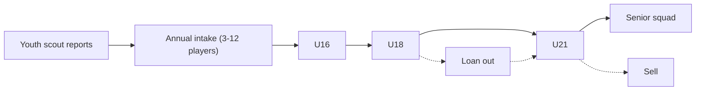

# Youth Academy and Player Development

Player development is the slowest-moving system and the most rewarding one
when it works. Modelled as a *portfolio* - not every cohort delivers, but
infrastructure improves the odds.

## 1. Player hidden values

Each player carries (visible to varying degrees):

- **Current Ability (CA)** - present strength.
- **Potential Ability (PA)** - stored as a **range** (e.g. 75-85), not a
  single value. Only revealed gradually by scouts + coaches.
- **Learning ability** - how fast attributes can move.
- **Professionalism** - effort + training quality multiplier.
- **Ambition** - propensity to want bigger stages.
- **Resilience** - injury recovery + setback bounce-back.
- **Injury proneness**.
- **Positional understanding**.
- **Game intelligence**.

The PA range, learning ability, professionalism and injury proneness are
the four hidden values that scouts gradually estimate.

## 2. Development levers

| Lever | Influence |
|---|---|
| Training quality | Attribute growth, role learning |
| Match minutes | Match-readiness, decision quality |
| Mentoring | Personality transfer from senior leadership |
| Competition level | Learning curve vs overload |
| Infrastructure | Injury prevention, recovery |
| Morale / status | Training efficiency multiplier |
| Coach specialisation | Targeted role development |
| Loan environment | See §6 |

## 3. Development phases

| Phase | Age band | Focus | Key risk |
|---|---|---|---|
| Apprentice | U16-U18 | Technique, coordination, game understanding, personality shape | Overuse / burnout |
| Breakthrough | 18-21 | Hard minutes, positional sharpening, first loans | Plateau without minutes |
| Build | 22-27 | Peak build, tactical detail, role stabilisation | Wage misalignment if star already |
| Maintenance | 28+ | Performance maintenance, mentoring, physical decline | Injury cascade |

Physical attributes decline ~28; mental attributes can grow into late
career.

## 4. Academy pipeline



Intake quality depends on:

- Head of Youth quality.
- Youth scout regional coverage.
- Investment level (per season).
- DNA `philosophy` (youth-focused clubs get +1 intake quality tier).
- Academy infrastructure ([[stadium-and-campus]] §5).

## 5. Intake event

Annual scripted event. Player sees:

- 3-12 new players.
- Per-player report (Layer 1 ability + traits).
- Head of Youth's opinion ("one to watch", "long-term project").
- "Promote to U-21 / U-19 / release" choice.

## 6. Loan system

Loans are not just "+minutes". The target environment matters:

| Factor | Effect |
|---|---|
| League quality | Determines learning ceiling |
| Play style match | Faster role learning, fewer wasted minutes |
| Promised role | Substitute / rotation / starter |
| Coach quality | Development rate multiplier |
| Guaranteed minutes | Hard contract clause |
| Medical standards | Re-injury risk |

A bad loan can *retard* a player's development by causing them to play out
of role or with too little intensity.

## 7. Per-player development calculation

Weekly:

```text
growth = base_potential_step
       * training_quality_factor
       * coach_specialisation_factor
       * minutes_factor
       * morale_factor
       * personality_multiplier   # professionalism + ambition
       * age_curve_factor
```

`base_potential_step` is sampled from the PA-range distribution.

## 8. UI tiers

| Tier | Youth UI |
|---|---|
| Quick | "Youth intake: 3 prospects to watch" card + 1 action |
| Standard | Academy tree (U16-U21), promote/release buttons |
| Expert | Per-player development grid, attribute trajectories, PA estimate |

## 9. Mentoring sub-system

A senior leadership-group player can mentor up to 2 young players. Effects:

- Personality transfer (e.g. mercenary mentor → mercenary protégé).
- Faster integration.
- Reduced morale shocks.

Mentoring pairs are surfaced as suggested cards; player can override.

## 10. Open questions

- Should release of academy players carry a small "former club" sell-on
  clause? Yes - it gives a slow long-tail revenue stream.
- Pre-academy partner schools / nurseries - in scope? Phase 2 (community
  editor can author them).
- "Wonderkid" tagging - explicit or emergent? Emergent: tag is applied
  when the public PA-range overlaps an exceptional band.
