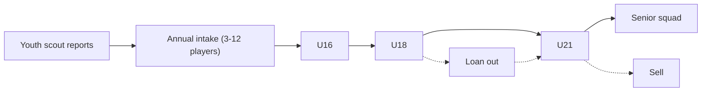

# Youth Academy and Player Development

Player development is the slowest-moving system and the most rewarding one
when it works. Modelled as a *portfolio* - not every cohort delivers, but
infrastructure improves the odds.

> Approved by the systemic events / player lifecycle pass (2026-05-17).
> Implement from this note together with [[../60-Research/data-generators]]
> and [[../10-Architecture/09-Decisions/ADR-0018-systemic-events-and-player-lifecycle]].

## 1. Player hidden values and uncertainty

Each player carries (visible to varying degrees):

- **Current Ability (CA)** - present strength.
- **Potential** - stored internally as a deterministic underlying value /
  curve seed, exposed to the player as a scouting/coaching **range**.
- **Eight hidden meta attributes** from [[../60-Research/data-generators]]:
  `potential`, `consistency`, `pressure`, `professionalism`,
  `determination`, `adaptability`, `injury_proneness`, `big_matches`.

The following are **derived labels**, not extra MVP hidden attributes:

| Label | Derived from |
|---|---|
| Learning ability | potential, age phase, professionalism, coach fit |
| Ambition | determination, adaptability, contract pressure, career context |
| Resilience | injury proneness, pressure, medical quality, morale |
| Leadership | mental attributes, age, squad status, captaincy history |
| Positional understanding | role fit, tactical familiarity, mental attributes |
| Game intelligence | visible mental attributes + role/tactic performance data |

Scouts gradually narrow the public PA range and improve confidence in
personality labels. The true underlying value does not change just because
the player learns more about it.

## 2. Development levers

| Lever | Influence |
|---|---|
| Training quality | Attribute growth, role learning |
| Match minutes | Match-readiness, decision quality |
| Mentoring | Personality transfer from senior leadership |
| Competition level | Learning curve vs overload |
| Infrastructure | Injury prevention, recovery |
| Morale / status | Training efficiency multiplier |
| Coach specialisation | Targeted role development |
| Loan environment | See §6 |

## 3. Development phases

| Phase | Age band | Focus | Key risk |
|---|---|---|---|
| Apprentice | U16-U18 | Technique, coordination, game understanding, personality shape | Overuse / burnout |
| Breakthrough | 18-21 | Hard minutes, positional sharpening, first loans | Plateau without minutes |
| Build | 22-27 | Peak build, tactical detail, role stabilisation | Wage misalignment if star already |
| Maintenance | 28+ | Performance maintenance, mentoring, physical decline | Injury cascade |

Physical attributes decline ~28; mental attributes can grow into late
career.

## 4. Academy pipeline



Intake quality depends on:

- Head of Youth quality.
- Youth scout regional coverage.
- Investment level (per season).
- DNA `philosophy` (youth-focused clubs get +1 intake quality tier).
- Academy infrastructure ([[stadium-and-campus]] §5).

## 5. Intake event

Annual scripted event. Player sees:

- 3-12 new players.
- Per-player report (Layer 1 ability + traits).
- Head of Youth's opinion ("one to watch", "long-term project").
- "Promote to U-21 / U-19 / release" choice.

## 6. Loan system

Loans are not just "+minutes". The target environment matters:

| Factor | Effect |
|---|---|
| League quality | Determines learning ceiling |
| Play style match | Faster role learning, fewer wasted minutes |
| Promised role | Substitute / rotation / starter |
| Coach quality | Development rate multiplier |
| Guaranteed minutes | Hard contract clause |
| Medical standards | Re-injury risk |

A bad loan can *retard* a player's development by causing them to play out
of role or with too little intensity.

## 7. Per-player development calculation

Weekly:

```text
growth = base_progression
       * age_phase_factor
       * training_quality_factor
       * coach_specialisation_factor
       * minutes_factor
       * role_fit_factor
       * morale_factor
       * health_factor
       * personality_factor
       + bounded_noise
```

`bounded_noise` is small and seeded. Visible causes must dominate random
variation so development feels fair.

Development output emits explanation tags for UI and narrative:
`training_focus`, `match_minutes`, `role_mismatch`, `injury_rehab`,
`morale_low`, `mentor_influence`, `loan_context`.

## 8. UI tiers

| Tier | Youth UI |
|---|---|
| Quick | "Youth intake: 3 prospects to watch" card + 1 action |
| Standard | Academy tree (U16-U21), promote/release buttons |
| Expert | Per-player development grid, attribute trajectories, PA estimate |

## 9. Mentoring sub-system

A senior leadership-group player can mentor up to 2 young players. Compact
groups are preferred: 1 mentor + 1-2 mentees, or a 3-4 player group with
one dominant positive influence.

Mentor suitability comes from:

- squad status and age;
- leadership/captaincy standing;
- personality label;
- shared language/culture;
- training attendance;
- relationship context.

Effects:

- Slow movement of hidden/meta tendencies such as professionalism,
  determination, pressure handling and adaptability.
- Personality-label transfer (e.g. mercenary mentor → mercenary protégé)
  as an emergent outcome, not an instant tag copy.
- Faster integration.
- Reduced morale shocks.
- Optional player-tendency transfer when the football role context matches.
- Optional player skill/perk candidate evidence when the role context,
  training focus and mentor profile match the draft FMX-23 skill model in
  [[GD-0020-eos-player-skills-personas-and-people]].

Conflicts are allowed: a demanding mentor can improve professionalism while
hurting morale or temperament. Caps and diminishing returns prevent a
solvable "perfect mentoring tree".

Mentoring pairs are surfaced as suggested cards; player can override.

## 10. Future-scope notes (classified future-scope)

- Should release of academy players carry a small "former club" sell-on
  clause? Yes - it gives a slow long-tail revenue stream.
- Pre-academy partner schools / nurseries - in scope? Phase 2 (community
  editor can author them).
- "Wonderkid" tagging - explicit or emergent? Emergent: tag is applied
  when the public PA-range overlaps an exceptional band.
