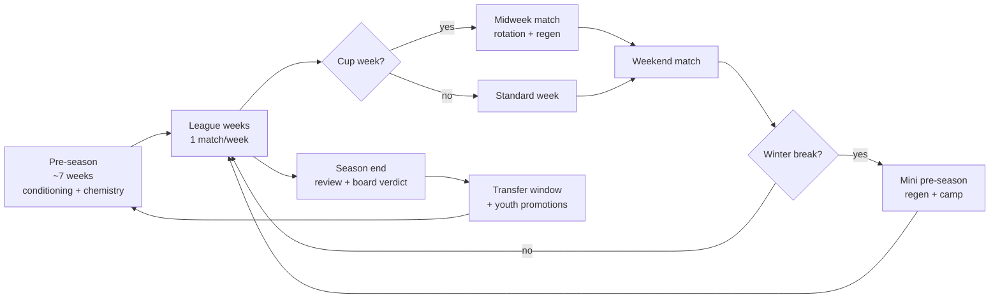
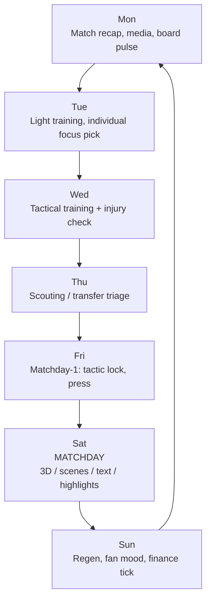

# Anstoss Series Deep Dive

> Phase 1 research output for [AKOM-113](https://linear.app/coding-x/issue/AKOM-113/research-deep-dive-classic-anstoss-design-patterns).
> Captures the design DNA of the Anstoß lineage as inspiration for our offline-first
> PWA football manager. IP-clean: no copyrighted manual text is reproduced; quotes
> are limited to short references for design analysis. Fonts, crests, real club and
> real player names are not used and not even approximated (see [[ip-and-licensing]]
> and [[../10-Architecture/09-Decisions/ADR-0007-naming-schema]]).

## 1. Series at a glance

Anstoß – Der Fußballmanager is a German football management series created by
Gerald Köhler at Ascon/Ascaron, starting in 1993 on Amiga and MS-DOS, released
internationally as *On the Ball* and in France as *Carton Rouge*. The series ran
until 2006 and is widely considered the genre benchmark in German-speaking
markets, peaking with **Anstoss 3** (2000) which debuted at #1 on German sales
charts and is generally treated as the creative high water mark.[^wiki-anstoss]
[^wiki-anstoss3][^vodafone-retro][^otb-wiki][^otb2-squakenet]

Relevant successors / spiritual descendants:

- **EA Fußball Manager** series (Köhler at EA after Ascaron).[^vodafone-retro]
- **We Are Football** (Winning Streak Games, 2021 / 2024 / 2027) — Köhler's
  modern reinterpretation aimed at reviving the building and long-term
  club-development feel of classic German managers.[^waf-wiki][^waf-preview]
- **Anstoss 2022** (Kalypso / 2tainment) — instructive *failure* case showing how
  the formula breaks when balance, UI, and progression are ignored.[^a22-gamestar]
[^a22-pcgames]

## 2. The "Anstoss feeling" — design DNA

Across retrospectives and reviews five qualities recur:

1. **Office-as-cockpit pacing.** The manager sits in a stylised office and the
   week unfolds around them; the player chooses a *click depth* per task rather
   than being forced through every sub-screen.[^vodafone-retro][^retro-replay]
2. **Tactile humour.** Newspaper headlines, sponsor letters, board grumbling,
   player gossip and absurd flavour events ("Babe of the Month", a "schwarze
   Kasse"/black account, doping options) give the simulation a parodic German
   tabloid voice. Reviewers consistently flag the comedic tone as a primary
   reason the games are remembered.[^a2005-gameswelt][^a2005-stern][^acz-funny]
3. **Lightweight depth, not realism.** Strength is on a 1–13 scale (Anstoss 3),
   talent in 5 buckets, ~32 character traits — enough texture for emergent
   stories without a stat-dump UI.[^acz-attrs][^acz-info]
4. **Weekly heartbeat.** A predictable Monday-to-Sunday rhythm of training,
   media, scouting, finances and one (sometimes two) match days. Pre-season is
   ~7 weeks of conditioning before the league heartbeat takes over.[^acz-zeck]
   [^acz-frische]
5. **Club-life simulation around the pitch.** Stadium attractions (hotels,
   discos, fan shop, high-rises), board trust, sponsor letters, fan mood and
   media interviews are first-class subsystems, not flavour
   text.[^aow-finanzen][^acz-bauwerke][^acz-info][^aj-vorstand1]

## 3. Mechanics map by manager subsystem

The table groups the canonical Anstoss subsystems and the mechanics that, per
sources, define them. We use this as a checklist for our own MoSCoW scope work
in [[feature-gap-analysis]].

| Subsystem | Core mechanics | Sources |
|---|---|---|
| **Squad & contracts** | 1–13 strength scale, 5 talent caps (max 8/9/10/11/12), ~32 trait attributes, contract length & wage negotiation, captain/leader roles. | [^acz-attrs][^acz-info] |
| **Training** | Weekly plan with daily slots, condition vs freshness, individual training (one player per week), team chemistry ("Eingespielt"), training camps with location effects, mandatory regeneration to avoid injuries. | [^gw-tipps][^acz-zeck][^acz-frische][^acz-trainings] |
| **Youth & scouting** | Separate youth screen, scout missions (~42 days), scout quality tied to staff salary, youth investment slider (up to several million/season), promotion gate (≥17, two youth weeks). | [^aow-jugend][^acz-jugend][^acz-invest] |
| **Transfers** | Transfer list pulse at season start, age/talent arbitrage on 18–19y prospects, long contracts on talents, AI bidding pressure. | [^gw-tipps] |
| **Finance** | Operating revenue (gate, sponsor, prize money) vs. expenses (wages, fan amenities, stadium running cost, federation levy ~4 % of monthly income); structural profit/loss; presidential spending freeze when balance turns negative. | [^aow-finanzen] |
| **Stadium & matchday revenue** | Capacity expansion + on-grounds buildings (hotel, restaurant, fan shop, high-rises, disco, carousel) each with own ROI, ticket-price tuning per match prestige, fan amenities affecting mood. | [^aow-finanzen][^acz-bauwerke][^aj-finanzen] |
| **Board & president** | Season goals (often unrealistic in later seasons), board-trust % (wins +~3 %, losses −1–5 %), "win-or-fired" pressure, levers to lift trust: bank-balance > threshold, presidential palace +10 %, formal board meeting +5–10 % once per season; expert advice: do **not** negotiate goals (cost without payoff). | [^aj-vorstand1][^aj-vorstand2][^acz-rauswurf][^acz-vertrag] |
| **Media & PR** | 600+ interview prompts and 2400+ keyed responses across mood states; varieties: post-match, player, president; press affects player morale, fan mood and board pressure. | [^acz-info] |
| **Fan & morale** | "Stimmung" trackable in team comparison; ideal motivation ~110; praise effective only when form ≥ 11 (else 1:1 conversations); personal events (relationship, homesickness) drive temporary swings. | [^acz-stimmung][^acz-lob] |
| **Match presentation** | Multiple modes: **3D**, **scenes-only**, **text ticker**, **goal-only highlights**; halftime team talks; substitutions and tactical tweaks live; speed control via options. | [^retro-replay][^acz-3d][^acz-speed][^aow-spielbericht] |
| **Career arc** | Long-term goal: club legend → eventually national-team coach (Bundestrainer); save state designed to roll across many seasons. | [^wiki-anstoss][^vodafone-retro] |

## 4. Pacing — season and weekly rhythm

The pacing model below is reconstructed from publicly described training
schedules and matchday flow; it is the *shape* we want, not a copy of any
specific Anstoss save.[^acz-zeck][^acz-frische][^acz-trainings][^retro-replay]

### Season arc

### Standard league week

Implementation hint for our project: model the week as 7 discrete *day ticks*
plus a *match tick*, with the player able to *fast-forward* tasks they did not
explicitly customise — this is how Anstoss avoids forcing 7 screens per real-time
session.[^retro-replay]

## 5. UI/UX takeaways for mobile-first adaptation

Anstoss was designed for 4:3 CRTs with a mouse; mobile constraints (one-handed,
portrait, < 1 s tap budget, intermittent network) force adaptation. Key
takeaways:

1. **Default to a single "this week" home screen.** Anstoss' office hub maps
   well to a portrait dashboard: next match card on top, three or four
   contextual action cards below (training plan, transfers, board pressure,
   finances). Modern mobile FM titles use the same *contextual surfacing*
   pattern.[^fm26-touch][^fm-portfolio]
2. **Three match presentation tiers, not four.** Mobile sessions are short.
   Drop "scenes only" and ship **highlights**, **2D ticker**, and **3D**
   (post-MVP). Anstoss already proved players self-select tier by session
   length.[^retro-replay][^acz-3d]
3. **Weekly fast-forward is the primary interaction.** A persistent "advance to
   next event" button that respects the user's outstanding decisions (analogous
   to Anstoss' day-by-day step) is more important than any sub-screen.
   [^retro-replay]
4. **Tabular data → cards.** The 1–13/talent grid translates well to compact
   player cards; never reproduce a desktop-style data grid on phones.
   [^fm-portfolio]
5. **Halftime is a modal, not a screen.** Tactical tweaks must fit a 30-second
   bottom-sheet with formation, mentality and 1-tap subs; deep options collapse
   under "More".[^acz-speed]
6. **Press / board events as feed cards.** Rather than a full inbox UI, mobile
   should surface board, sponsor and media events as Twitter-style feed cards
   with *Accept / Decline / Defer* primary actions.[^acz-info][^aj-vorstand1]
7. **Frictionless onboarding > full editor.** Anstoss shipped a powerful editor;
   on mobile we ship a guided 60-second start (pick country → pick fictional
   club → optional manager avatar) and defer custom data to post-MVP.[^fm26-touch]
8. **Offline-first by default.** All week ticks, save, training plan edits,
   transfer offers and youth investment must work fully offline; sync is a
   post-MVP nicety.[[../30-Implementation/pwa-offline-strategy]]
9. **Humour belongs in copy, not in mechanics.** The Anstoss tone (tabloid
   headlines, absurd letters) is portable to a PWA; the genuinely problematic
   bits (doping, "Babe of the Month", "schwarze Kasse") are not. We get the
   warmth without the legal/PR risk.[^a2005-stern][^acz-funny]

## 6. IP-safe inspiration and hard boundaries

Inspiration to keep:

- **System architecture**: subsystem split (squad, training, youth, transfers,
  finance, stadium, board, media, fans, matchday, career arc).
- **Pacing**: 7-week pre-season + weekly heartbeat + winter break.
- **Tone**: parodic, warm, German-speaking-friendly copy; players have
  personality traits with story potential (smoker, prankster, perfectionist).
- **Progression loop**: club legend → national team is a strong long-term goal.
- **Player rating compression**: a 1–13 / 5-tier-talent style scale is
  legible on phones; preferred over FM-style 1–20-times-30 grids.[^acz-attrs]

Hard boundaries (do **not** copy):

- **No real club, league, kit, badge or stadium names**, even with single-letter
  permutations (e.g. "Preußen Dortmund", "Oliver Huhn"). Manchester United v.
  Sega/SI shows clubs actively police even *altered* marks; our policy is full
  fictionalisation.[^wiki-anstoss3][^mu-sega-2020][^mishcon-fm]
- **No real player names**, including phonetic puns. Replace with a generated
  name pool (see [[../10-Architecture/09-Decisions/ADR-0007-naming-schema]]).
- **No quoted Anstoss manual or in-game text.** Reviews and wikis are fair to
  paraphrase; manual text is copyrighted. We never paste >1 sentence verbatim.
- **No copy of Ascaron / Kalypso UI assets**, fonts, screenshots or trademarked
  iconography.
- **No mechanics that are legally toxic on a PWA** (gambling-style sponsor
  draws, doping mini-game, "schwarze Kasse" / illegal accounting).
  [^a2005-stern]
- **Federation acronyms** (e.g. Anstoss' fictional "AOFA") are inspirational —
  we mint our own (`packages/game-data` will own the canonical names).
  [^aow-finanzen]

The artistic-expression / "Rogers v Grimaldi" defense covered some FM cases but
is jurisdiction-specific and brittle; we deliberately avoid relying on
it.[^mishcon-fm][^manfields-mu]

## 7. Recommendations for our MVP and post-MVP

MVP-blocking recommendations (must land before Phase 2 alpha):

1. **Adopt the weekly-tick model.** Engine ticks days in a 7-day cycle plus a
   match tick; UI exposes a single "advance" verb. Source: Anstoss day-by-day
   loop.[^retro-replay][^acz-zeck]
2. **Compressed rating scale.** Use 1–10 strength + 4 talent buckets — modeled
   on Anstoss' 1–13 / 5-tier system but tighter for mobile readability and
   determinism.[^acz-attrs][^acz-info]
3. **Three-tier match presentation.** Ship highlights and 2D ticker for MVP;
   defer 3D entirely. Supports short mobile sessions.[^retro-replay][^acz-3d]
4. **Halftime modal with three controls only.** Formation, mentality, one-tap
   sub. Deeper tactics behind a "More" expander.[^acz-speed]
5. **Office-style home dashboard.** Portrait dashboard with next-match,
   training, transfers, board cards. Anstoss-style hub adapted for thumbs.
   [^fm26-touch][^fm-portfolio]
6. **Board-trust %, not score.** Single 0–100 % "board trust" stat with
   transparent deltas after each match. Easier to read than multi-axis
   pressure systems.[^aj-vorstand1][^aj-vorstand2]
7. **Two-layer finance.** Operating P&L (wages, gate, sponsor, levy) and
   investment budget (transfers, stadium upgrades) separated as in
   Anstoss.[^aow-finanzen]
8. **Pre-season as an explicit phase.** First 6–7 weeks gated as a "preparation"
   mode: only friendlies, training camps, no league fixtures.[^acz-zeck]
9. **Inbox-as-feed.** Board, media, sponsor, scout reports unified as a feed
   with `Accept / Decline / Defer / Snooze`.[^acz-info]
10. **Fully fictional naming pool from day 1.** No real-world data import path
    for clubs/players in MVP. Editor only edits fictional entities.
    [[../10-Architecture/09-Decisions/ADR-0007-naming-schema]]

Post-MVP / nice-to-have:

11. **3D match mode** behind a perf flag (Anstoss tier).[^retro-replay]
12. **Stadium attractions sub-economy** (hotel, fan shop, etc.) as second-tier
    revenue source.[^acz-bauwerke]
13. **Player traits ("32 character attributes" inspiration).** Trim to 8–12
    flavour traits (`smoker`, `prankster`, `homesick`) that drive narrative
    events.[^acz-info][^acz-stimmung]
14. **Career mode toward national-team coach** as long-term goal arc.
    [^wiki-anstoss]
15. **Offline-friendly cup competitions** including midweek match rotation
    pressure.[^acz-frische]
16. **Press conferences** with 100+ keyed responses (Anstoss had 600+; ours can
    start smaller).[^acz-info]
17. **Retro 2D ticker mode** as a deliberate design choice (Anstoss text mode)
    once analytics show users prefer it.[^retro-replay]

## 8. Open questions (parked, not blocking)

- **Localisation tone.** Anstoss humour is very German. Should EN copy match
  the same tabloid-parody register, or fall back to dryer FM-style? → input
  for ADR-0006 i18n.
- **Editor scope on mobile.** Anstoss-class editor is desktop-grade; for a PWA,
  is editing fictional entities (kit colours, club mottos) MVP or post-MVP?
- **Licensable real leagues structure.** League *structure* (tiers, promotion
  rules) is generally not protected — confirmable input for
  [[ip-and-licensing]].
- **Save-game economy.** Anstoss saves were single-slot per profile; our Dexie
  + ADR-0005 save format should support multiple parallel saves cheaply.

## 9. Sources

All retrieved 2026-05-15 unless noted. Wiki and forum sources used for
cross-checking; reviews used for evaluative claims; we do not quote any manual
text.

[^wiki-anstoss]: Wikipedia DE — *Anstoss (Computerspiel)*. <https://de.wikipedia.org/wiki/Anstoss_(Computerspiel)>
[^wiki-anstoss3]: Wikipedia DE — *Anstoss 3*. <https://de.wikipedia.org/wiki/Anstoss_3>
[^vodafone-retro]: Vodafone Featured / Gaming — *Die Anstoss-Reihe: Ein Rückblick auf den beliebten Fußball-Manager*. <https://vodafone.de/featured/gaming/die-anstoss-reihe-ein-rueckblick-auf-den-beliebten-fussball-manager>
[^otb-wiki]: Wikipedia EN — *On the Ball (video game series)*. <https://en.wikipedia.org/wiki/On_the_Ball_(video_game_series)>
[^otb2-squakenet]: Squakenet — *On The Ball 2 (1997)*. <https://www.squakenet.com/game/on-the-ball-2/>
[^waf-wiki]: Wikipedia DE — *We Are Football*. <https://de.wikipedia.org/wiki/We_Are_Football>
[^waf-preview]: GameStar — *We Are Football Preview: Bringt zurück, was wir verloren glaubten*. <https://www.gamestar.de/artikel/we-are-football-preview-fussballmanager-gerald-koehler,3368196.html>
[^a22-gamestar]: GameStar — *In Anstoss ist ein guter Fußballmanager versteckt, aber viel Glück beim Suchen* (Anstoss 2022 review). <https://www.gamestar.de/artikel/anstoss-2022-fussballmanager-test-steam-review,3386237.html>
[^a22-pcgames]: PC Games — *Anstoss: Der Fussballmanager Early-Access-Check – holpriger Start*. <https://www.pcgames.de/Anstoss-2022-Spiel-72844/News/Early-Access-Check-1407055/2/>
[^retro-replay]: Retro Replay — *Anstoss 3: Der Fußballmanager*. <https://retro-replay.com/db/windows/anstoss-3-der-fusballmanager/>
[^a2005-gameswelt]: Gameswelt — *Anstoss 2005 – Test*. <https://www.gameswelt.de/anstoss-2005/test/anstoss-2005-233>
[^a2005-stern]: Stern.de — *"Anstoss 2005": Fußball-Manager ohne den letzten Kick*. <https://www.stern.de/digital/computer/-anstoss-2005--fussball-manager-ohne-den-letzten-kick-3552106.html>
[^acz-funny]: Anstoss Coaching Zone — *Lustige Sprüche rundum Anstoss*. <http://www.anstoss-zone.de/anstoss3/a3_sonstiges/lustige_sprueche_20.php>
[^acz-attrs]: Anstoss Coaching Zone — *Spielerdaten in Anstoss 3* (strength scale 1–13, talent tiers). <http://anstoss-zone.de/anstoss3/a3_specials/eigenschaften_20.php>
[^acz-info]: Anstoss Coaching Zone — *Infos über Anstoss 3* (interview counts, character system). <https://www.anstoss-zone.de/anstoss3/a3_infos.php>
[^acz-zeck]: Anstoss Coaching Zone — *Zeckenkopfs Wochen* (training plan reference). <http://www.anstoss-zone.de/anstoss3/a3_training/zeckenkopf_20.php>
[^acz-frische]: Anstoss Coaching Zone Forum — *Frische und Kondition hochbringen*. <http://forum.anstoss-zone.de/viewtopic.php?t=14022>
[^acz-trainings]: Anstoss Coaching Zone — *Trainingspläne für Anstoss*. <https://www.anstoss-zone.de/anstoss3/a3_training.php>
[^gw-tipps]: Gameswelt — *Anstoss 3 – Allg. Tips & Tricks*. <https://www.gameswelt.de/anstoss-3/tipp/anstoss-3-allg-tips-tricks-111907>
[^aow-jugend]: Anstoss Online Wiki — *Jugend*. <https://wiki.anstoss-online.de/index.php/Jugend>
[^acz-jugend]: Anstoss Coaching Zone Forum — *Jugend fördern*. <http://forum.anstoss-zone.de/viewtopic.php?t=8616>
[^acz-invest]: Anstoss Coaching Zone Forum — *Anstoss 3 – Höhe Investitionen (Jugend etc.)*. <http://forum.anstoss-zone.de/viewtopic.php?t=14583>
[^aow-finanzen]: Anstoss Online Wiki — *Finanzen*. <https://wiki.anstoss-online.de/index.php?title=Finanzen>
[^aj-finanzen]: Anstoss Jünger — *Finanzen steigern*. <https://www.anstoss-juenger.de/index.php?topic=2442.0>
[^acz-bauwerke]: Anstoss Coaching Zone — *Bauwerke auf dem Stadiongelände von Anstoss 3*. <http://www.anstoss-zone.de/specials/bauwerke.php>
[^aj-vorstand1]: Anstoss Jünger — *Vorstandsvertrauen*. <https://www.anstoss-juenger.de/index.php?topic=2433.0>
[^aj-vorstand2]: Anstoss Jünger — *Vertrauen des Vorstands*. <https://www.anstoss-juenger.de/index.php?topic=3419.0>
[^acz-rauswurf]: Anstoss Coaching Zone Forum — *Frustrierendes Präsidium / rote Karten*. <http://forum.anstoss-zone.de/viewtopic.php?t=14351>
[^acz-vertrag]: Anstoss Coaching Zone Forum — *A3: Vertragsverlängerung bei 67%*. <http://forum.anstoss-zone.de/viewtopic.php?t=10134>
[^acz-stimmung]: Anstoss Coaching Zone Forum — *Anstoss 3 – Stimmung & Co.*. <http://www.anstoss-zone.de/phpBB3/viewtopic.php?t=13123>
[^acz-lob]: Anstoss Coaching Zone Forum — *Lob und Tadel*. <http://forum.anstoss-zone.de/viewtopic.php?t=15729>
[^acz-3d]: Anstoss Coaching Zone Forum — *Anstoss 3 problem mit 3D Spiel* (match presentation modes). <http://forum.anstoss-zone.de/viewtopic.php?t=12194>
[^acz-speed]: Anstoss Coaching Zone Forum — *Spielgeschwindigkeit anpassen – vor allem im Szenenmodus*. <http://forum.anstoss-zone.de/viewtopic.php?t=14998>
[^aow-spielbericht]: Anstoss Online Wiki — *Spielbericht*. <https://wiki.anstoss-online.de/index.php?title=Spielbericht>
[^fm26-touch]: Apple App Store — *Football Manager 26 Touch* (mobile UI design notes). <https://apps.apple.com/de/app/football-manager-26-touch/id1626267810>
[^fm-portfolio]: Sebastian Schulz portfolio — *Football Manager Game (2014–2016)* (mobile FM UI process). <https://portfolio.sebastianbash.com/portfolio/football-manager-game/>
[^mu-sega-2020]: BAILII — *Manchester United Football Club Ltd v Sega Publishing Europe Ltd & Anor [2020] EWHC 1439 (Ch)*. <https://mansfield.bailii.org/ew/cases/EWHC/Ch/2020/1439.html>
[^mishcon-fm]: Mishcon de Reya — *Brands in Sports Video Games: Why Football Manager Might Be the Exception*. <https://www.mishcon.com/news/brands-in-sports-video-games-whyfootball-managermight-be-the-exception>
[^manfields-mu]: Mansfield BAILII case copy — referenced together with [^mu-sega-2020]. <https://mansfield.bailii.org/ew/cases/EWHC/Ch/2020/1439.html>
