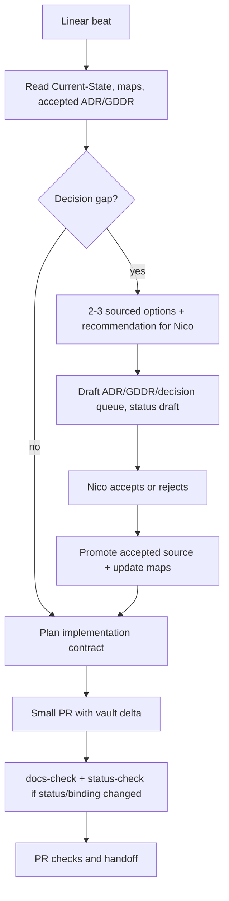
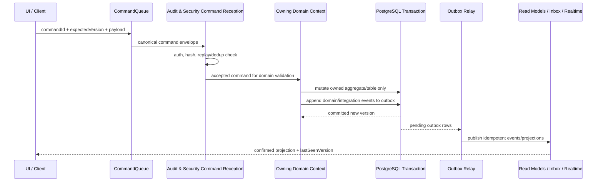
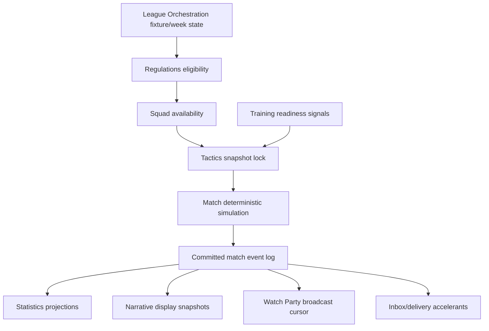
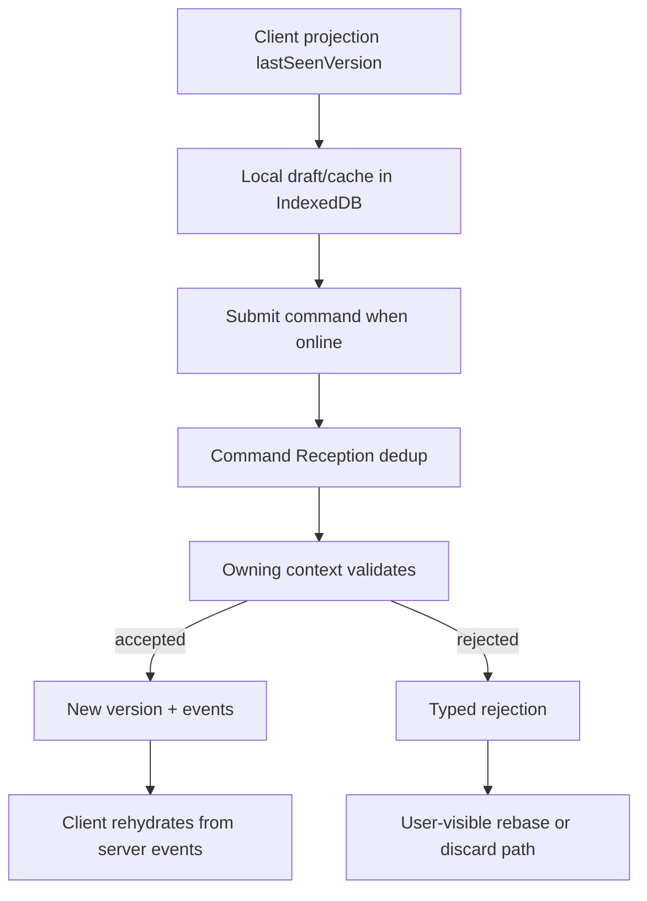

# Architecture Decision Portfolio Review

## Question

Does the current FMX architecture still match the complete gameplay direction,
remain domain-driven/modular enough for separate team ownership, and represent
the best current technical posture before code-phase bootstrap?

## Executive finding

The architecture is **coherent and compatible** with the accepted gameplay
documentation. No broad platform pivot is recommended.

The strongest current line is:

- service-ready DDD modular monolith first;
- bounded contexts as team and model boundaries;
- PostgreSQL + Drizzle as system of record;
- same-transaction outbox for cross-context publication;
- hybrid-online/offline-ready PWA with IndexedDB/Dexie for local caches/drafts;
- server-authoritative multiplayer and strict SP/MP separation;
- swappable deterministic match engine behind versioned contracts;
- React/TanStack Start as presentation/full-stack shell, not domain authority;
- LLM/narrative/display layers outside authoritative state.

The architecture is not "finished" in an implementation-ready sense. Four
hardening items should be closed before code bootstrap:

1. **Status-body hygiene:** some accepted ADR/GDDR bodies and front-door maps
   still contain historical "draft/non-binding/pending" text.
2. **Stack-currency follow-through:** FMX-198 already accepted the current
   posture; PostgreSQL 18.x, Node 24 LTS and pnpm 11.8.0 need narrow follow-up
   implementation/source checks before active pins change.
3. **Module-card completion policy:** FMX-169 accepted a staged MVP slice, not
   all 28 module cards. That is pragmatic, but "every team understands every
   aspect" eventually requires all-28 context cards or a deliberate exception.
4. **Architecture fitness automation:** ADR-0121 is correct but still future
   code-phase tooling. The first code PRs must create the import/storage/query
   boundary checks before feature work fans out.

## Scope Reviewed

| Surface | Result | Review implication |
|---|---:|---|
| ADR decision files | 112 accepted, 11 superseded | No active open architecture decision queue remains. Review by decision family, not by inventing new ADR outcomes. |
| Game-design files | 47 accepted GDDRs, 25 draft system notes, 1 superseded | Gameplay intent is binding at the GDDR layer; non-numbered system notes are detailed planning context unless promoted. |
| Feature files | 2 current, 2 approved, 22 draft | MVP feature implementation authority is intentionally narrower than the full gameplay portfolio. |
| Module notes | 7 current, 27 draft | Existing module cards cover an MVP-critical slice; full handoff clarity needs broader coverage later. |
| State-machine notes | 11 current, 12 draft | Current FSM coverage is useful but not yet complete for every workflow. |
| Validators before edits | `docs-check` passed, `status-consistency-check` passed | The remaining issues are semantic clarity, not broken vault structure. |

ADR-by-ADR coverage lives in
[[architecture-adr-coverage-matrix-2026-06-22]]. That appendix checks every
current accepted ADR once; superseded ADRs are treated as historical evidence
and implementation exclusions.

## Architecture Fitness Verdict

| Criterion | Verdict | Evidence / concern |
|---|---|---|
| Domain-driven boundaries | Strong | The 28-context map groups domain language around football-management capabilities, not technical layers. This aligns with Microsoft DDD guidance to model services around business capabilities and bounded contexts. |
| Modular team ownership | Strong but incomplete handoff surface | Context ownership is clear in `bounded-context-map`; all-28 local module cards are not complete because FMX-169 accepted staged coverage. |
| Gameplay compatibility | Strong | Match, economy, AI world, narrative, watch party, offline, monetization and compliance gameplay each have technical owner boundaries and known event/ACL seams. |
| Replaceability | Strong where critical | Match engine, renderer, realtime transport, SurrealDB/graph projection and future extracted services are behind interfaces or rebuildable projections. |
| Determinism/replay | Strong | ADR-0096, ADR-0113, ADR-0117 and ADR-0120 create a clear deterministic floor. |
| Offline honesty | Strong | ADR-0020/0090/0124 keep MVP offline in app shell/cached reads/drafts and avoid pretending Background Sync is authoritative. |
| Current-version posture | Medium | FMX-198 closed the decision posture, but active repo pins still need narrow follow-up before bootstrap. |
| Documentation handoff clarity | Medium | Front-door maps are mostly current, but accepted-body stale prose and incomplete module cards can confuse human teams. |
| Automated boundary enforcement | Medium | ADR-0121 defines the right checks, but there is no code workspace yet, so enforcement is still a code-phase gate. |

## Technical Decision Portfolio

| Decision family | Current decision | Why it remains best | Main alternative | Compatibility verdict |
|---|---|---|---|---|
| DDD service-ready modular monolith | ADR-0019 plus ADR-0089: one deployable first, contexts designed for extraction. | Best fit for a docs-first early product with many domain decisions and few runtime scaling facts. It keeps transactions and local development simple while preserving service contracts. | Microservices from day one. That increases operational/distributed consistency cost before product seams are proven. | Compatible. Requires ADR-0121 boundary checks before code spreads. |
| 28 bounded contexts under merge-review gate | `bounded-context-map`, ADR-0089, GD-0038. | Best current compromise between domain clarity and context-count discipline. Contexts map to football-management capabilities and team ownership. | Collapse into fewer coarse modules or freeze 28 forever. Collapse risks overloaded models; freeze blocks domain learning. | Compatible. Treat 28 as managed ceiling, not permanent law. |
| Per-context contract style | Commands, queries, domain events, JSON-serialisable/public contracts, opaque refs. | Matches DDD published-language/ACL practice and supports later extraction. | Shared internal imports or shared relational model. Faster short term, but breaks team isolation. | Compatible. Needs contract templates in module cards. |
| PostgreSQL + Drizzle system of record | ADR-0021/0027/0028, stack ledger. | Relational integrity, transactions, migrations, auditability and operational maturity fit a long-running football-management sim. Drizzle keeps schema/types close to TypeScript. | SurrealDB primary, document DB, event store first, or SQLite-only local saves. Each weakens either transactionality, operational certainty, or server-authoritative MP posture. | Compatible. PostgreSQL 18.x is current stable; exact active version follows FMX-198/bootstrap. |
| Schema-per-save | ADR-0027/0097. | Gives strong save isolation, migration control and restore/archive surfaces for long careers. | Row-level `save_id` everywhere. Simpler object count, but weaker isolation and harder per-save migration. | Compatible with SP/MP separation and long-save migration, but object-count ceilings must stay enforced. |
| No cross-context DB relations/joins | ADR-0019/0027/0121. | Enforces true bounded contexts and later service extraction. | Direct Drizzle relations/FKs across contexts. Convenient early, but couples domain teams and database lifecycle. | Required for modularity. Needs scanners as first code-phase quality gate. |
| Transactional outbox | ADR-0028. | Current best floor for atomically committing state changes and publishable events without distributed transactions. | Broker-first dual writes, 2PC, or event sourcing everywhere. Broker-first risks loss/duplication; 2PC is coupling-heavy; universal event sourcing is too broad. | Compatible. Consumers must remain idempotent and projection-only where appropriate. |
| Command reception dedup | ADR-0119 with ADR-0090/0115. | Separates client retry UX from authoritative replay/dedup and rejects mismatched hashes before domain validation. | Let Offline Sync or each domain handle dedupe locally. That scatters security semantics. | Compatible and necessary for offline/retry/server-authoritative MP. |
| Hybrid-online/offline-ready PWA | ADR-0020/0090/0124. | Honest MVP: app shell, safe cached reads, drafts and UI state offline; authoritative progression remains server-confirmed. | Full offline-first authority in MVP or pure online web app. Full offline authority is too complex; pure online breaks product promise. | Compatible. Background Sync remains best-effort only. |
| IndexedDB/Dexie client storage | ADR-0020/0124. | IndexedDB is asynchronous and suitable for structured client data; Dexie adds a usable abstraction. | localStorage, OPFS-only, SQLite WASM, or server-only. localStorage blocks and is too small/simple; others are heavier or less aligned with web baseline. | Compatible. Keep game state out of localStorage. |
| TanStack Start + React shell | ADR-0021 and stack ledger. | TanStack Start provides SSR, streaming, server functions and type-safe routing without taking domain authority away from DDD modules. | Next.js/Remix/SPA-only. Viable, but current decisions already favor TanStack data/router cohesion and server functions. | Compatible. RC status is a bootstrap risk gate, not a pivot trigger. |
| React role | UI composition only. | React docs position it as UI/component library; FMX keeps domain state in contexts/services. | Put simulation/domain state in React stores. That would erase server authority and team boundaries. | Compatible. Zustand remains narrow client/sim state, not system of record. |
| Match engine abstraction | ADR-0096/0026/0120 and GD-0042, with ADR-0049 as superseded history. | A deterministic engine port lets gameplay evolve and enables runtime spike without tying renderer/UI to authority. | Browser-only TS engine or hard Rust-first engine without spike. One risks authority/perf, the other premature lock-in. | Compatible. Runtime spike remains code-phase evidence, not a chat decision. |
| Renderer abstraction | ADR-0024/0029/0041/0047. | Canvas 2D for MVP match authority/presentation, optional Babylon presentation later. Keeps visuals non-authoritative. | 3D match first or SVG/DOM match first. Too much risk/perf burden for core simulation. | Compatible. No gameplay state may depend on renderer. |
| Realtime transport | ADR-0023/0099/0102. | SSE is enough for MVP one-way projection streams; Centrifugo remains scale path behind interface. | WebSockets/Centrifugo from day one or polling only. WebSocket-first adds ops too early; polling-only weakens live UX. | Compatible. Durable event log/inbox remains source of truth. |
| LLM/narrative boundary | ADR-0030/0054/0065/0117/0126 and GD-0018/0028. | Generated prose never applies authoritative state; persisted display snapshots protect replay. | Let LLMs produce state-changing effects. Not acceptable for determinism/security. | Compatible. This is one of the strongest architecture/gameplay alignments. |
| Statistics and analytics as projection | ADR-0081, GD-0031. | Read-model owner can serve analytics/standings history without stealing official ordering from League. | Let analytics own official standings or let each domain build its own projections. Both create authority ambiguity. | Compatible. Rebuildability and metric versioning must stay explicit. |
| Security/privacy/trust posture | ADR-0115/0116/0123/0127/0128. | Strong enough for MP/public eligibility/payment/legal gates while keeping ownership split. | Minimal auth/session only until later. Too late for replay/save/payment trust. | Compatible. Implementation evidence remains pre-launch gate. |
| Responsible gaming/no-P2W | ADR-0107/0108/0122, GD-0041/0045. | Protects shared-state fairness and keeps monetization cosmetic/non-power. | Time-savers or paid gameplay boosts. Conflicts with MP fairness and responsible-gaming posture. | Compatible. Must be tested at entitlement/effect boundaries. |
| Quality gates | ADR-0118/0120/0121/0125. | Combines unit/property/replay/e2e/mutation/architecture-fitness with risk-scaled gates. | Coverage-only or manual review only. Insufficient for deterministic simulation and modular boundaries. | Compatible. Code-phase scripts must exist before feature fan-out. |
| Workflow and traceability | ADR-0044/0045/0103/0110/0114/0132. | Issue-first, worktree/branch separation, docs-phase validators and future code-phase DoD support multi-agent work. | Ad hoc topic branches and undocumented decisions. Already caused drift; not acceptable for handoff. | Compatible. Continue issue-first with narrow PRs. |
| SurrealDB deferred | ADR-0021 plus FMX-166. | Keeps graph/live experimentation optional and non-authoritative behind rebuildable projection. | SurrealDB primary now or never revisit. Primary now is unnecessary risk; never revisit blocks future graph/live value. | Compatible. Future trial must source-check then-current stable. |

## Gameplay Compatibility Matrix

| Gameplay area | Binding gameplay source | Architecture fit | Notes / required guardrail |
|---|---|---|---|
| Core weekly loop and career progression | GD-0001, GD-0011, MVP scope | League Orchestration plus Manager & Legacy split is compatible. | League owns calendar/state; Manager & Legacy consumes snapshots, not commands. |
| Create-a-Club Roguelite first playable | GD-0017, GD-0019, GD-0044, feature slice | Compatible with hybrid-online MVP and server-confirmed progression. | Carry slots/archetypes must be deterministic and no-P2W. |
| Match engine and tactics | GD-0002, GD-0004, GD-0025, GD-0042 | Match/Tactics/Training/Squad split is compatible and now clarified by ADR-0129/0130/0131. | `TacticSnapshot` is lock-time contract; renderer is not authority. |
| Transfers, contracts and loans | GD-0006, GD-0036, GD-0040 | Transfer, Squad & Player, Regulations and Club ledger seams are compatible. | Contract/CLM future seam should not leak into current Transfer/Squad ownership. |
| Finance, economy and commercial systems | GD-0008, GD-0022, GD-0023, ADR-0050/0058 | Compatible; Club ledger sole writer plus CommercialPortfolio/Audience/Stadium producers is sound. | Ledger ACL/events must be strict; no context writes ledger rows directly. |
| AI world drift | GD-0024, ADR-0071, FMX-139 | Compatible; AI World owns policy refs/events, consumer contexts apply local effects. | GD-0043 owns numeric calibration; no hidden cross-context mutation. |
| Narrative, media and dialogue | GD-0013, GD-0018, GD-0028, GD-0034 | Compatible; Narrative/Media emit advisory content/effect intents only. | Owner contexts clamp/reject/apply effects; display snapshots persist verbatim. |
| Analytics and records | GD-0031, GD-0032, ADR-0081/0083 | Compatible as projection/read-model layer. | League/Match/etc. keep official facts; Analytics is rebuildable projection. |
| Watch party and async social | GD-0035, Watch Party system notes, ADR-0099/0133 | Compatible; Watch Party owns party lifecycle/social layer, Match owns event log/replay. | CRDT/editable overlays remain future; MVP chat/markers are append-only. |
| Offline and save trust | GD-0014, GD-0037, ADR-0090/0116/0124 | Compatible. | Offline drafts are non-authoritative unless future selective offline authority is ratified. |
| Monetization/cosmetics | GD-0041, GD-0045, ADR-0107/0108/0122 | Compatible. | Entitlements must be effect-zero in shared/public modes; cosmetic evidence must cover IP/accessibility. |
| Compliance/security/release gates | GD-0015, ADR-0112/0127/0128/0132 | Compatible but evidence-gated. | Legal/store/security evidence remains pre-launch, not docs-only proof. |

## Dynamic Workflows

These workflows centralize the current architecture handoff model. They are
non-binding in this research note until Nico promotes them into an
implementation/process note or a code-phase DoD update.

### 1. Decision-to-Implementation Workflow

Guardrail: no implementation starts from chat, raw research, draft notes or
archived gaps when a current/accepted/approved source exists.

### 2. Cross-context Command Workflow

Guardrail: command reception is synchronous and security-owned; domain contexts
validate only after replay/dedup succeeds; consumers are idempotent.

### 3. Gameplay Feature Slice Workflow

Guardrail: one gameplay slice must name exactly one command owner for each
state mutation. Consumers may project, react or reject through ACLs, but cannot
write another context's aggregate/table.

### 4. Matchday Runtime Workflow

Guardrail: Match owns fixture-scoped simulation/event log, not durable player
truth, tactics library, training plans or official season rollover.

### 5. Offline Draft/Rebase Workflow

Guardrail: Background Sync can assist retries, but no authoritative progression
depends on Background Sync availability.

### 6. Separate Team Handoff Workflow

| Step | Owning team output | Consumer team input |
|---|---|---|
| Context charter | Module card with owner, aggregates, commands, queries, events, tables, state machines, quality scenarios | Public contract only |
| Contract change | Versioned command/query/event schema and migration note | ACL/projection update, no internal imports |
| State mutation | Owner aggregate/table write and outbox event | Event handling or query consumption |
| Read model | Owner-published query or consumer-owned projection from events | Rebuild policy and metric version |
| Test evidence | Owner contract tests, property tests, replay fixtures | Consumer contract compatibility tests |
| Boundary enforcement | Dependency/import/SQL scanner rules | No cross-context internals, FKs or joins |

## Guardrails for Code Bootstrap

| Guardrail | Required before code fan-out |
|---|---|
| Public contract per context | Every implemented context exports only commands, queries and events through a typed public package/interface. |
| No shared tables | No ownerless shared lookup tables; all tables belong to exactly one context/package. |
| No cross-context Drizzle relation/FK | Store opaque branded IDs across contexts; validate via contract/query, not FK. |
| No cross-context joins | Cross-context read needs an owner query, projection or ACL. |
| Domain first | Domain/application service owns business rules; React/Zustand components do not decide game legality. |
| Determinism first | Simulation and replay paths use versioned seeds, engine/content identifiers and deterministic fixtures. |
| Event idempotency | Every consumer treats outbox/integration events as at-least-once. |
| Offline honesty | UI labels draft, stale, cached and non-binding states clearly; no fake offline authority. |
| Current versions | Re-source-check exact versions before first lockfile and before any package upgrade. |
| Docs in same PR | Architecture/gameplay/behavior changes update source notes and maps in the same PR. |

## Compatibility Risks and Recommended Follow-ups

| Risk | Severity | Recommendation |
|---|---|---|
| Historical accepted-body prose still says draft/non-binding/pending | Medium | Open a narrow status-body hygiene sweep rather than mutating dozens of records inside FMX-211. |
| All-28 context module cards not complete | Medium | Keep FMX-169 staged hybrid for MVP, but create a later "all context cards before code fan-out" gate if Nico wants full team handoff readiness. |
| PostgreSQL/Node/pnpm active pins lag latest-stable posture | Medium | Execute FMX-198 follow-ups with fresh source checks; do not use FMX-211 to change active pins. |
| Architecture fitness not executable yet | High once code starts | First code-phase foundation PR must implement ADR-0121 import/storage/query checks before domain teams split. |
| TanStack Start still RC | Medium | Keep as selected target but require bootstrap spike and re-check before lockfile. |
| Accepted/current files with `binding: false` | Low/Medium | Decide whether governance wants `status` alone as authority or a cleanup rule that accepted/current implies `binding: true`. |

## Recommendation

Accept the current architecture portfolio as the right direction and do **not**
open a broad replacement ADR.

Recommended Nico decisions for FMX-211:

- D1 = A: confirm the portfolio as coherent/current with targeted hardening
  follow-ups.
- D2 = A: open a narrow status-body hygiene sweep, not a mass rewrite in this
  review.
- D3 = A: keep FMX-198 as the stack-currency authority and route active pin
  changes through narrow follow-ups.
- D4 = B: keep FMX-169 staged module cards for MVP, but require all-28 context
  cards before multi-team code fan-out.
- D5 = A: promote the dynamic workflows into a current implementation/process
  note before code-phase feature implementation.
- D6 = A: make ADR-0121 architecture fitness tooling a first foundation PR gate.

Until Nico answers, this review is a sourced synthesis, not a binding
architecture decision.

## Related

- [[raw-perplexity/raw-fmx-211-architecture-source-checks-2026-06-22]]
- [[architecture-adr-coverage-matrix-2026-06-22]]
- [[../40-Execution/fmx-211-architecture-review-decision-queue-2026-06-22]]
- [[../10-Architecture/bounded-context-map]]
- [[../10-Architecture/10-Quality]]
- [[../30-Implementation/stack-currency-ledger]]
