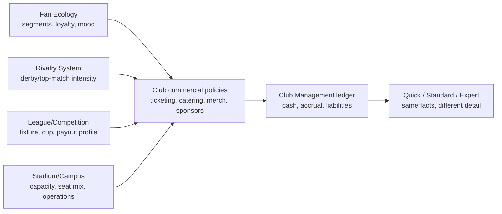

# Club Economy Impact Map and Commercial Contracts - Research Synthesis 2026-05-28

## Question

Which FMX domains directly affect financial success, which contracts are needed
between them, and how should ticketing, season tickets, catering, merchandise,
cup games, fan events and the singleplayer Investor cash purchase be modelled
so the economy is realistic, explainable and still fair as a game?

## Nico direction captured in this beat

- Output shape: a dossier series, not a chat-only summary.
- Country scope: Germany, England, Spain, Italy and France receive equal
  research depth; abstract countries remain fallback profiles.
- Balance style: **Realistic Rails** - realistic causal chains, but warnings,
  forecasts and recovery options make the game playable.
- Investor: singleplayer-only real-money purchase that grants in-game money.
  It is **clean cash**, not debt, not a fan/owner backlash, not a board-control
  event and never a multiplayer advantage. It still cannot fix a broken club
  loop if weekly obligations remain structurally higher than income.
- Fan-service events such as subsidised away trains, summer parties and
  goal-linked beer promotions should exist as paid campaigns with measurable
  fan and commercial effects.
- UI: one shared simulation core with Quick / Standard / Expert surfaces.

## Core finding

Financial success is not owned by a "money system" alone. The economy is a
causal graph:

The draft architecture answer is: **Club Management owns commercial policy,
commercial contracts and the ledger.** Other domains own causal facts and expose
read models/events. They do not post money directly.

## Direct financial impact map

| Domain / system | Direct finance effect | Contract needed | Ledger output |
|---|---|---|---|
| Fan Ecology | Attendance probability, season-ticket renewal, per-capita catering, merchandise propensity, hospitality demand, sponsor fit, boycott risk | `FanDemandForecast` | Ticket, catering, merch, hospitality and sponsor valuation entries |
| Rivalry System | Derby/top-match uplift, away demand, security risk, atmosphere, premium-price tolerance | `FixtureCommercialProfile` via Match/League fixture context | Ticket uplift, security cost, risk-event/fine exposure |
| League Orchestration | Home fixture count, cup rounds, season timing, promotions/relegations, prize/payment schedule | `CompetitionRevenueProfile` | Media/prize/cup receipts, matchday cadence, travel obligations |
| Match | Result, goals, star-player availability, home/away status, attendance final, incidents | `MatchdaySettlementInput` | Matchday revenue/cost and campaign-trigger entries |
| Stadium and Campus | Capacity, seat mix, premium inventory, fan-zone quality, catering points, shop capacity, venue-event eligibility, ownership/lease costs | `StadiumCommercialSnapshot` | Capacity-limited ticket revenue, facility costs, venue income |
| Ticketing policy | Season-ticket share, single-ticket inventory, top-match surcharge, concessions, family blocks, away allocation | `TicketingPolicy` | Season-ticket cash, deferred revenue/accrual, single-ticket match cash |
| Catering | Own operation, concession, minimum guarantee, revenue share, exclusivity, cost of goods, staffing | `CommercialContract` with `contractKind=catering` | Matchday/venue catering cash and margin/cost entries |
| Merchandise | Own shop, license, wholesale, e-commerce partner, kit supplier terms, royalties, inventory risk | `CommercialContract` with `contractKind=merchandise` | Merchandise revenue, COGS, royalty, guarantee and stock-risk entries |
| Sponsorship | Asset sales, category exclusivity, side-conditions, performance bonuses, penalties | `CommercialContract` with `contractKind=sponsorship` | Upfront cash, periodic revenue, bonus/penalty liabilities |
| Squad, Player and Staff | Wages, bonuses, agent fees, player-star demand effects, transfer amortisation, staff wages | Existing staff/player/transfer facts plus economy ledger contracts | Wage, fee, amortisation, bonus and attraction/brand effects |
| Regulations and Compliance | Licence checks, finance ratios, sanctions, alcohol/sector restrictions, cup eligibility | `LicenceFinanceCheck` / sanction events | Fines, lost revenue, forced cost, licence risk |
| Fan event campaigns | Away train subsidy, summer party, beer-per-goal, family day, choreo support | `FanEventCampaign` | Campaign cost, sponsor contribution, segment loyalty and revenue effects |
| Investor entitlement | Real-money IAP produces in-game cash grant in SP only | `InvestorEntitlementGrant` | Clean cash inflow with entitlement provenance |

## Research implications by topic

### 1. Tickets and season tickets

Season tickets are a risk-management tool: they bring cash and demand certainty
early, but they cap upside if a season becomes hot and reduce single-ticket
inventory. Academic season-ticket research identifies season-ticket rights,
league membership, utilisation, sporting performance and market size as price
drivers. A German Bundesliga example in that research cites season-ticket
discounts around the high-20-percent range versus matchday pricing; FMX should
store ranges, not a global constant.

Game model:

- `seasonTicketShareTarget` is a policy, not a fixed club trait.
- Loyal/core-heavy clubs can sell higher season-ticket volume and keep stadiums
  fuller in bad years.
- Fair-weather/casual-heavy clubs keep more upside for top games, stars and
  winning streaks, but suffer lower utilisation in bad years.
- Top-match/rivalry surcharge applies to single-ticket and hospitality
  inventory first; season-ticket holders already paid and receive effective
  value from included high-demand matches.
- Expert view shows opportunity cost: upfront certainty versus missed
  top-match yield.

### 2. Fan composition

The fan scene is an economic model, not only atmosphere. Loyal segments stabilise
attendance and season-ticket renewal; corporate and casual segments raise
per-capita spend but are more form- and opponent-sensitive. A bad sporting year
with a traditional fan base can still keep high occupancy. A modern success-led
brand can collapse faster when table position, stars or hype drop.

Required fan outputs:

- `basePopulationBySegment`
- `loyaltyBySegment`
- `moodBySegment`
- `attendanceElasticityBySegment`
- `seasonTicketRenewalProbability`
- `cateringPropensity`
- `merchandisePropensity`
- `hospitalityDemand`
- `sponsorCategoryFit`

### 3. Ticket pricing, top games and rivals

Topspiel surcharges are justified by demand factors, but must be bounded by
fan-trust effects:

- opponent prestige;
- rivalry tier;
- table context;
- star-player availability;
- kickoff time/weather;
- recent form;
- away-demand pressure;
- fan mood and affordability tolerance.

The model should support policy presets: `fanFriendly`, `marketBased`,
`premiumMax`, `communityProtected`. Pricing too aggressively may improve one
match's cash while lowering loyalty, renewal and sponsor image.

### 4. Cup games and competition revenue

Cup games are full economy events, not bonus popups:

- home cup ties create ticket/catering/security/merchandise facts;
- away ties create travel and possible gate-share/prize facts depending on the
  competition profile;
- later rounds create prize, media, sponsor-bonus and merchandise spikes;
- fixture congestion creates sporting and injury cost;
- neutral finals create travel, allocation, sponsor, merch and prize profiles;
- elimination removes expected future fixtures and future prize paths.

The competition profile, not Club Management code, defines prize cadence, gate
sharing, replay rules, neutral venue rules and media payments.
FMX-45 expands this into [[cup-and-competition-revenue-profiles-2026-05-28]]:
cash, receivables and future EV are separate, and elimination removes forecast
upside rather than posting a hidden cash loss.

### 5. Catering

FMX needs at least four catering structures:

| Model | Cash upside | Risk / cost | Gameplay trade-off |
|---|---|---|---|
| In-house | Highest upside and full quality control | Staffing, inventory, COGS, compliance | Best for clubs with good operations and high utilisation |
| Concession lease | Predictable fixed rent | Lower upside | Stable for small clubs or low expertise |
| Revenue share | Shares upside/downside | Contract complexity and audit | Good middle ground for growing clubs |
| Minimum guarantee plus share | Floor plus upside | May include exclusivity and side conditions | Realistic professional-stadium default |

All models need contract duration, renewal windows, service quality, exclusivity
category, minimum standards, sponsor compatibility and break clauses.

### 6. Merchandise

Merchandise is separate from ticketing and can be materially affected by stars,
cup runs, rivalry wins, kit launches and narrative arcs. The BVB annual-report
structure illustrates that merchandising and catering can be separate segments
with their own revenues, costs and staff. FMX should therefore avoid modelling
merchandise as a flat percentage of attendance.

Contract models:

- in-house store and inventory risk;
- licensed merchandise royalty;
- kit supplier guarantee plus royalty;
- e-commerce fulfilment partner;
- stadium shop lease/operation;
- short-run campaign drops for promotion, cup final, icon player or derby win.

### 7. Sponsorship

Sponsors value reach, image safety, category fit, attendance, hospitality,
media/cup exposure and fan-segment fit. Sponsor money can arrive upfront while
revenue is recognised across time. Contracts need side conditions, exclusivity,
bonuses, penalties and termination risk.

Important dependency: fan actions and commercial policies can affect sponsor
fit. A beer sponsor may like goal-beer activations; a family sponsor may dislike
alcohol-heavy campaigns.

### 8. Fan-service events and away travel

Events are deliberate spend for loyalty, not free flavour:

| Event | Cost | Positive effect | Risk |
|---|---|---|---|
| Subsidised away train | Train/coach/flight subsidy, security, logistics, damage reserve | Away support, core/ultras loyalty, atmosphere, narrative | Incident risk, budget drain |
| Summer party / family day | Venue, staff, security, sponsor activation | Family/core mood, local brand, sponsor fit | Weather, low attendance, opportunity cost |
| Beer-per-goal campaign | Sponsor cost or club co-pay, fulfilment | Casual/core buzz, sponsor activation, goal emotion | Alcohol-policy conflicts, family sponsor tension |
| Choreo support | Material and coordination support | Atmosphere, ultras/core trust | Sanction risk if pyro/incident chain follows |
| Community ticket day | Discounted blocks | Family/local recruitment | Lower per-seat yield |

Research anchors show real price scale and real campaign precedent:
DB charter examples start in the tens of thousands of euros, BVB had a
subsidised fan train case, and SV Darmstadt 98/Krombacher ran a litre-per-goal
style beer campaign in 2025/26.

### 9. Investor singleplayer purchase

Investor is not an owner model and not a balancing penalty. It is a payment
entitlement that grants clean in-game cash to the current singleplayer save.

Rules:

- SP only; hidden/disabled for multiplayer and competitive leaderboards.
- No random reward, no loot-box mechanic.
- Clear price and exact in-game amount before purchase.
- Ledger entry must show source `investor_entitlement`, so the player
  understands why cash changed.
- No fan mood penalty, no sponsor penalty, no debt, no board-control change.
- The financial simulation remains unchanged after the cash injection.
  Structural overspending still drains the new cash.
- Platform compliance must use the relevant store billing where required and
  carry in-game-purchase disclosure labels where required.

### 10. Quick / Standard / Expert presentation

The simulation core is shared. UI only changes detail:

| Tier | Player sees | Example |
|---|---|---|
| Quick | Action cards and summary costs | "Away travel support costs 42k. Choose bus, train or flight." |
| Standard | Driver breakdowns and forecast | "Train costs 42k, +core loyalty, +away atmosphere, low travel fatigue." |
| Expert | Full assumptions, contracts, ranges and sensitivity | Train capacity, subsidy per fan, security, damage reserve, sponsor contribution, segment effects |

Do not create separate economy rules per UI tier. Quick mode writes the same
policy values with defaults.

## Top-5 research matrix

These are profile inputs to research and calibrate, not final constants.

| Country | Economy profile focus | Research anchors |
|---|---|---|
| Germany | High attendance culture, strong season-ticket base, licence checks, lower-tier matchday relevance, fan travel and alcohol/safety rules | DFL Economic Report 2024/25; DFB 3. Liga licensing; BVB ticket and annual-report examples |
| England | Large media distributions, parachute/solidarity effects, match categorisation, high commercial scale, ground-grade pyramid | Premier League central payments; FA/National League ground grading in existing regulations research |
| Spain | Economic control and squad-cost limit framing, strong commercial/venue growth, club-by-club budget caps | LaLiga economic report and transparency/economic-control materials |
| Italy | Club financial reports, stadium ownership/lease tension, Serie A/B economic data, FIGC ReportCalcio | FIGC ReportCalcio 2025 |
| France | DNCG intervention culture, wage/recruitment controls, provisional relegation, media-right volatility | LFP/DNCG decisions and FFF/LFP licensing documents |

## Source links used

- DFL Economic Report 2024/25, revenue and expenditure:
  <https://report.dfl.de/2425/en/economic-report/economic-figures/licensed-football/revenue-and-expenditure.html>
- DFL Economic Report 2024/25, licensed-football overview:
  <https://report.dfl.de/2425/en/economic-report/german-licensed-football/overview/financial-situation-of-german-licensed-football.html>
- UEFA Financial Sustainability:
  <https://www.uefa.com/running-competitions/integrity/financial-sustainability/>
- Premier League central payments 2024/25:
  <https://www.premierleague.com/en/news/4325409>
- LaLiga Economic-Financial Report 2024/25 news:
  <https://www.laliga.com/en-CO/news/laliga-reaches-a-new-historical-maximum-in-revenues-and-exceeds-17-million-spectators>
- LaLiga transparency / economic management:
  <https://www.laliga.com/es-GB/transparencia>
- LFP DNCG decisions example:
  <https://www.lfp.fr/article/dncg-releve-de-decisions-du-15-novembre-2024>
- FIGC ReportCalcio 2025 PDF:
  <https://www.figc.it/media/277126/report-calcio-2025.pdf>
- BVB ticket prices 2025/26:
  <https://www.bvb.de/de/en/tickets/ticket-information/ticket-prices.html>
- Huth and Kurscheidt, season-ticket pricing research:
  <https://www.mdpi.com/1911-8074/15/9/392>
- BVB Annual Report 2024/25 PDF:
  <https://report.bvb.de/annual-report/2024-2025/_assets/downloads/gesamt-bvb-gb2425.pdf>
- Arena One Allianz Arena reference:
  <https://www.arena-one.com/en/successes/arena-stadium-references/allianz-arena-munich/>
- Deutsche Bahn charter train cost examples:
  <https://www.bahn.de/bahnbusiness/faq/was-kostet-ein-charterzug>
- BVB fan special train example:
  <https://www.bvb.de/de/de/aktuelles/news/news.html/News/Uebersicht/Fan-Sonderzug-des-BVB-Fuer-nur-sieben-Euro-nach-Frankfurt.html>
- SV Darmstadt 98 Krombacher goal bonus:
  <https://www.sv98.de/krombacher-boellenfall-goal-bonus/>
- Apple App Store Review Guidelines:
  <https://developer.apple.com/app-store/review/guidelines/>
- Google Play payments policy:
  <https://support.google.com/googleplay/android-developer/answer/9858738?hl=en>
- PEGI in-game purchases:
  <https://pegi.info/page/game-purchases>

## Open decisions for Nico

- Should ADR-0058's recommendation be accepted: commercial policy and contracts
  remain a Club Management sub-aggregate, with no separate Commercial
  Operations bounded context for MVP?
- Should Investor be available from first playable SP, or documented now but
  activated after platform/legal review?
- How much ticket-price autonomy should Quick mode have: presets only, or a
  simple slider with guardrails?
- Should fan travel default to club-subsidised options only for rivalry/high
  importance matches, or always be manually available?
- Which Top-5 profile gets first calibration soak after the abstract profile?
