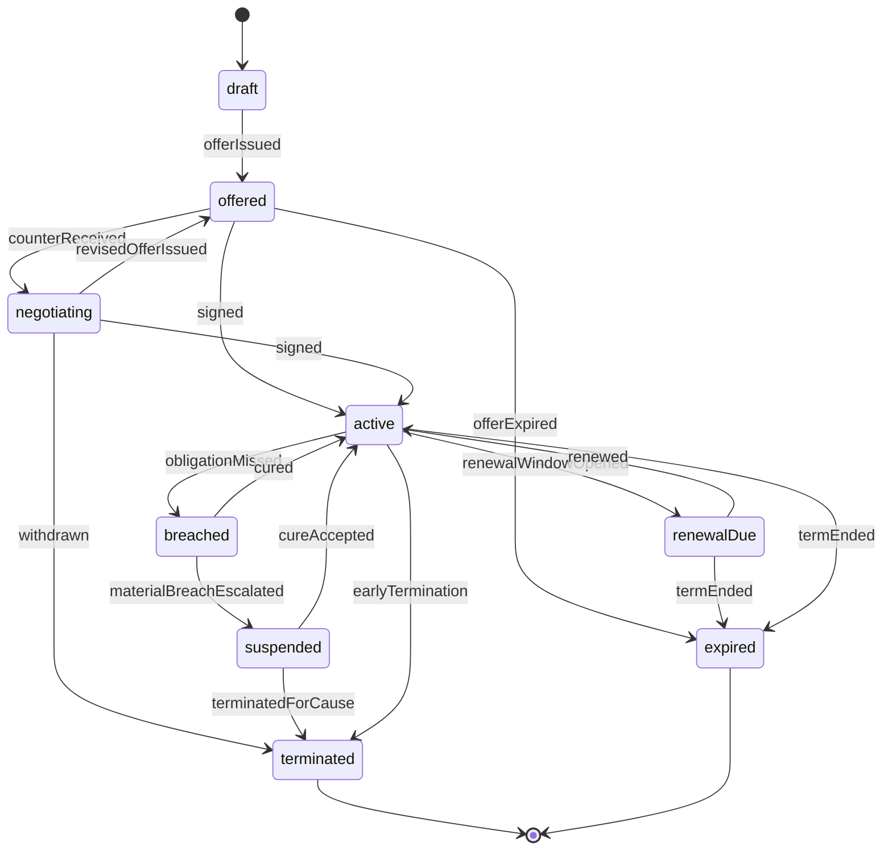

# Commercial Contract Lifecycle and Breach Model - Research Synthesis 2026-05-28

## Question

How should FMX model commercial contracts so sponsorship, catering,
merchandise, hospitality, suppliers and venue activations share one realistic
lifecycle without becoming legal software?

Nico's current defaults for this beat:

- prepare ADR-0058 for acceptance, but do not ratify it;
- research realistic options and recommend a game-adapted model;
- cover all six contract families;
- use severity-tier breach handling;
- capture numeric ranges as calibration inputs only, not final constants;
- expose Quick / Standard / Expert surfaces;
- keep AI-club behaviour to hooks for FMX-51;
- use an IP-clean fan-fit risk matrix, not real brands.

## Summary

The research answer is a **shared commercial contract lifecycle with
family-specific schedules**:

1. A reusable `CommercialContract` shell owns state, term, cash schedule,
   recognition schedule, rights, exclusivity, obligations, breach policy,
   amendment history and renewal policy.
2. Sponsorship, catering, merchandise, hospitality, supplier and
   venue-activation contracts add family-specific clause schedules rather than
   separate state machines.
3. Breaches use game-level severity tiers: curable, material and critical.
4. Contract value is not just "money per season"; it depends on assets,
   obligations, activation delivery, service quality, category conflicts, fan
   fit, reputation and accounting timing.
5. ADR-0058 Option C remains the recommended boundary: Club Management owns the
   commercial sub-aggregate and ledger posting; other domains publish facts.

This gives Quick players simple stable/balanced/upside choices while Expert
players can inspect the contract register, obligations, conflicts, breach
status and cash/accrual schedule.

## Evidence summary

| Finding | Source pattern | FMX implication |
|---|---|---|
| Commercial revenue contracts are performance-obligation based, not only cash receipts. | IFRS 15 five-step model; Manchester United annual report notes commercial revenue recognition over contract term and performance obligations. | Every commercial contract needs cash cadence and recognition schedule. |
| Football sponsorship sells asset packages across shirt, training kit, stadium naming, digital and global activations. | FC Barcelona / Spotify extension covers first-team jersey, training kit and stadium naming rights; Manchester United reports sponsorship, retail, licensing and tours as commercial revenue. | Contract assets must be explicit, not one sponsor amount. |
| Sponsor deals need category exclusivity and conflict rules. | Sports sponsorship clause guidance and public agreement examples emphasise category definitions, exclusivity, carve-outs and termination rights. | Portfolio register must detect overlapping beer, betting, banking, food, energy, digital and local categories. |
| Sponsorship value depends on delivery and activation, not logo placement only. | Sports sponsorship research highlights rights, activation obligations, IP use, hospitality, appearances, digital posts and make-good remedies. | Model obligations, KPI delivery and make-good/penalty events. |
| Venue concessions often combine management fee, rent/share, minimum guarantee, audit and service-level obligations. | MSFA audit documents U.S. Bank Stadium's food and beverage / catering / concession agreement; venue/operator sources show Aramark covers F&B, hospitality, retail and facility services. | Catering contracts need financial model plus SLA and reporting hooks. |
| Merchandise/licensing splits IP rights, retail operation, royalties, minimum guarantees and fulfilment risk. | Manchester United annual report separates retail, merchandising, apparel and product licensing revenue; sports commercial practice uses licensing and royalty schedules. | Merch contracts need royalty/MAG, inventory/fulfilment risk and channel scope. |
| CLM best practice uses central repository, lifecycle states, obligations, milestones, renewal alerts and audit/version history. | Thomson Reuters, Agiloft and other CLM sources converge on draft/negotiate/approve/sign/operate/amend/renew/terminate/expire. | FMX needs a compact FSM plus event log and version snapshots. |
| Fan/reputation fit is a commercial variable. | Sponsorship guidance emphasises morals clauses, approval rights and reputation; FMX fan ecology already tracks sponsor-category fit and boycott risk. | Use an IP-clean category risk matrix that affects fan trust, sponsor fit and renewal, not real brands. |

## Model options

### Option A - Flat annual commercial income

Contracts exist only as line items with yearly value and expiry.

- Pros: easiest to explain.
- Cons: cannot model exclusivity, breach, service quality, renewal, cash timing,
  fan backlash, own-vs-partner catering or merchandise risk.
- Verdict: reject. It contradicts FMX-41 and FMX-44 acceptance criteria.

### Option B - Separate lifecycle per contract family

Sponsorship, catering, merchandise, hospitality, supplier and venue activation
each get their own state machine.

- Pros: maximum detail and domain vocabulary.
- Cons: duplicates lifecycle mechanics and makes Quick / Standard / Expert hard
  to keep coherent.
- Verdict: reject for MVP planning. Keep family-specific clauses, not separate
  state machines.

### Option C - Shared lifecycle shell plus family-specific schedules

All commercial contracts share one lifecycle, event log, obligation model,
conflict detection, breach policy, renewal policy and accounting schedule. Each
family adds its own schedule: sponsorship assets, catering SLAs, merchandise
royalties, hospitality packages, supplier exclusivity or venue activation plan.

- Pros: realistic, modular, explainable, and aligned with ADR-0058 Option C.
- Cons: requires discipline so `CommercialContract` does not become a dumping
  ground for operation-specific details.
- Verdict: recommended.

### Option D - New Commercial Operations bounded context

Move all commercial lifecycle logic out of Club Management.

- Pros: clean if commercial operations becomes an independent product surface.
- Cons: premature now; the ledger and commercial settlement already live in
  Club Management and FMX-44 mostly refines that internal aggregate.
- Verdict: keep as future supersession option only. ADR-0058 can be prepared
  for acceptance with explicit extraction triggers.

## Recommended lifecycle



`renewed` is not a long-lived state. It creates a new contract version linked
to the previous one and returns to `active`.

## Event vocabulary

| Event | Meaning |
|---|---|
| `CommercialOfferCreated` | Club or counterparty creates a draft offer. |
| `CommercialOfferIssued` | Offer is visible to the counterparty. |
| `CommercialCounterReceived` | Counterparty proposes changed terms. |
| `CommercialOfferWithdrawn` | Offer is removed before signature. |
| `CommercialContractActivated` | Signed contract becomes effective. |
| `CommercialContractAmended` | New version replaces earlier terms. |
| `CommercialRenewalWindowOpened` | Incumbent renewal / first-refusal period begins. |
| `CommercialContractRenewed` | New version or successor contract starts. |
| `CommercialContractExpired` | Term ends with no renewal. |
| `CommercialObligationMissed` | Delivery, payment, service or reporting obligation missed. |
| `CommercialExclusivityConflictDetected` | New or existing deal conflicts with locked category rights. |
| `CommercialBreachOpened` | Curable/material/critical breach case opened. |
| `CommercialBreachCured` | Cure accepted within policy window. |
| `CommercialMakeGoodGranted` | Extra inventory/activation/credit offered instead of cash penalty. |
| `CommercialPenaltyApplied` | Ledger posts penalty, fee reduction or damage settlement. |
| `CommercialContractSuspended` | Rights/operation temporarily paused. |
| `CommercialContractTerminated` | Contract ends early by cause, convenience or mutual agreement. |
| `CommercialContractSuperseded` | Old version retained as history after amendment/renewal. |

## Draft contract refinement

`CommercialContract` should carry these shared fields:

| Field | Meaning |
|---|---|
| `contractId` | UUIDv7 identity. |
| `contractVersion` | Version number; amendments and renewals create new versions. |
| `contractKind` | sponsorship, catering, merchandise, hospitality, supplier or venue-activation. |
| `lifecycleState` | draft, offered, negotiating, active, renewalDue, breached, suspended, terminated or expired. |
| `counterpartyProfileId` | Fictional generated partner profile. |
| `assetPackage` | Rights granted: shirt, sleeve, stand, shop, pouring rights, hospitality area, digital inventory, etc. |
| `term` | Start/end week, renewal window, option periods and break clauses. |
| `cashSchedule` | Upfront, monthly, seasonal, matchday, milestone or arrears payments. |
| `recognitionSchedule` | Revenue/cost recognition period and performance-obligation basis. |
| `commercialModel` | Fixed fee, revenue share, royalty, minimum guarantee, management fee, lease/rent, supplier rebate or hybrid. |
| `fixedGuaranteeMinor` | Guaranteed amount, if any. |
| `minimumGuaranteeMinor` | Minimum annual / seasonal guarantee to true up against share/royalty. |
| `revenueShareBps` | Share rate in basis points, if any. |
| `costShareBps` | COGS/staffing split, if any. |
| `royaltyBps` | Merchandise/licence royalty, if any. |
| `exclusivityScope` | Category, territory, asset scope and carve-outs. |
| `obligationSchedule` | Club and counterparty obligations, due windows and fulfilment state. |
| `serviceLevelPolicy` | Queue, stockout, open-stand, fulfilment, hospitality or quality thresholds. |
| `performanceBonuses` | Promotion, cup, table, reach, attendance or activation triggers. |
| `penaltyPolicy` | Fee reduction, make-good, cash penalty, suspension or termination rule. |
| `breachPolicy` | Severity, cure window, repeat threshold and termination rights. |
| `renewalPolicy` | First negotiation, first refusal, auto-renew, matching right or open-market policy. |
| `fanFitRisk` | IP-clean category risk and segment reaction band. |
| `reputationRisk` | Counterparty, club and regulatory scandal hooks. |
| `portfolioDependencies` | Conflicts or dependencies with other active contracts. |
| `aiDecisionHints` | Read-only factors for FMX-51 AI club behaviour. |
| `auditTrail` | Event log with actor, event type, week and summary payload. |
| `provenance` | Source forecasts, snapshots and policy versions used. |

## Contract families

| Family | Typical options | Family-specific schedule |
|---|---|---|
| Sponsorship | Main, sleeve, training kit, stadium/stand naming, digital, local, matchday | Asset inventory, category exclusivity, activation obligations, appearance/digital deliverables, morals/reputation hooks. |
| Catering | In-house, concession lease, management fee, revenue share, minimum guarantee plus share | POS/opening rules, queue/stockout/waste/service SLAs, supplier mandates, alcohol/food policy. |
| Merchandise | Club-run, licensed partner, kit supplier guarantee, retail operator, ecommerce fulfilment | Royalty/MAG, channel scope, stock/returns risk, campaign drops, fulfilment SLA. |
| Hospitality | Suite leases, lounge packages, premium catering, corporate events | Seat/package inventory, service level, minimum spend/headcount, premium quality, sponsor overlap. |
| Supplier | Beer/soft drink/food/equipment/POS/energy partners | Mandatory supplier, rebates, volume targets, equipment support, exclusivity carve-outs. |
| Venue activation | Fan zone, community day, concert, sponsor event, summer party | Event rights, staffing, safety, sponsor contribution, fulfilment model, cancellation policy. |

## Breach severity model

| Severity | Examples | Player-facing consequence |
|---|---|---|
| Curable | Late report, one missed social post, minor stockout, small payment delay, low service score | Warning, cure timer, make-good option, small satisfaction hit. |
| Material | Repeated SLA failures, missed guarantee payment, exclusivity conflict, failed activation, serious fulfilment failure | Penalty, fee reduction, suspended rights, renegotiation, sponsor/fan trust impact. |
| Critical | Fraud/misreporting, regulatory ban, severe safety/health incident, major scandal, persistent uncured material breach | Termination for cause, damages/repayment, fan/reputation shock, blocked category cooldown. |

Game simplification:

- Cure windows are profile data, not hard-coded legal values.
- Make-goods are extra inventory, activation, credit or reduced future fee.
- Repeat material breaches escalate even if each individual breach was cured.
- Critical breaches can bypass cure only when policy/profile allows it.

## Exclusivity and portfolio conflicts

Exclusivity should be structured, not free text:

```text
exclusivity =
  category
  x scope
  x territory
  x asset
  x carve_outs
```

Draft categories:

| Category | Risk notes |
|---|---|
| Beer / alcohol | High fan identity and legal-policy interaction; family segment can react negatively. |
| Betting / gambling | High legal/reputation/family risk; may be restricted by country profile. |
| Banking / fintech | Medium conflict risk; can overlap with payment providers if categories are broad. |
| Food / catering | Strong venue-operation dependency; conflicts with supplier and concession deals. |
| Energy / utilities | Medium-high reputation risk depending on generated counterparty profile. |
| Kit / apparel | High asset exclusivity; affects merch, shirt, retail and teamwear. |
| Digital / media / data | Privacy and fan-trust hooks; sponsor value tied to reach/engagement. |
| Local / regional sponsor | Lower cash, high identity fit; can conflict with national category exclusivity if poorly scoped. |

Conflict outcomes:

- block offer before signature;
- allow narrow carve-out;
- require incumbent consent;
- reduce value due to diluted exclusivity;
- open material breach if an active deal is violated.

## Fan-fit risk matrix

The game uses generated categories and profiles, not real brands.

| Sponsor profile | Ultras / Hardcore | Core | Family | Fair Weather | Corporate | Casual / Event |
|---|---|---|---|---|---|---|
| Local community | Positive | Positive | Positive | Neutral | Neutral | Neutral |
| Regional brewery | Mixed-positive | Positive | Mixed | Neutral | Neutral | Positive |
| Betting/gambling | Negative | Mixed-negative | Negative | Neutral | Neutral | Mixed |
| Energy-intensive | Negative if identity clash | Mixed-negative | Mixed | Neutral | Mixed | Neutral |
| Bank/fintech | Neutral | Neutral | Neutral | Neutral | Positive | Neutral |
| Fast food/soft drink | Neutral | Neutral | Mixed-negative if family policy conflict | Positive | Neutral | Positive |
| Global tech/media | Mixed | Neutral | Neutral | Positive | Positive | Positive |
| Controversial state/owner-linked | Strong negative | Negative | Mixed-negative | Mixed | Mixed | Mixed |

Effects should flow through Fan Ecology as mood/trust/sponsor-fit facts and
through Club Management as value, renewal and breach/reputation risk. The matrix
provides starting bands only; generated club DNA and country profile can tune it.

## Cash and recognition

FMX should preserve the same accounting principle as FMX-43:

- cash moves when the contract says payment occurs;
- recognised revenue/cost follows the delivered performance obligation;
- upfront commercial cash can improve runway while creating deferred revenue;
- minimum guarantees true up against earned share/royalty at defined periods;
- penalties, rebates, damages and make-goods post as separate ledger facts.

Expert views can show the full schedule. Quick mode should only show:

- cash impact this season;
- recognised income/cost trend;
- risk of future clawback, penalty or lost renewal.

## AI club hooks

FMX-44 should not implement AI behaviour. It should expose decision inputs for
FMX-51:

| Hook | Meaning |
|---|---|
| `contractRiskAppetite` | How much value the AI tolerates for breach/reputation risk. |
| `exclusivityTolerance` | Preference for narrow versus broad category exclusivity. |
| `cashUrgency` | Willingness to accept upfront discount or advance. |
| `fanFitWeight` | How strongly AI protects fan trust over cash. |
| `serviceQualityWeight` | Catering/hospitality preference for quality versus guarantee. |
| `renewalBias` | Incumbent-renewal preference versus open-market upside. |

## Quick / Standard / Expert surfaces

| Tier | Surface |
|---|---|
| Quick | Choose stable/balanced/upside contract preset; see yearly cash, risk badge, conflict warning and one recommended action. |
| Standard | Compare offers by value, term, exclusivity, obligations, fan fit, service quality and 13-week cash/recognition forecast. |
| Expert | Contract register with lifecycle state, version history, obligation ledger, breach cases, exclusivity graph, renewal calendar, cash schedule and recognition schedule. |

## Acceptance scenarios

```gherkin
Feature: Commercial contract lifecycle and breach model

  Scenario: Exclusivity conflict blocks a sponsor offer
    Given the club has an active beer exclusivity contract
    When a new beverage sponsor offer overlaps the locked category
    Then the portfolio register flags a conflict
    And the offer is blocked, narrowed by carve-out or downgraded in value

  Scenario: Curable breach creates a make-good
    Given a sponsor is owed a digital activation
    And the club misses the activation window once
    When the breach policy evaluates the miss
    Then a curable breach case opens
    And the club can grant a make-good instead of immediate termination

  Scenario: Material service breach applies a penalty
    Given a catering operator repeatedly misses queue and stockout service levels
    When the repeat threshold is reached
    Then a material breach is opened
    And a fee reduction or penalty posts to the ledger
    And fan satisfaction is affected

  Scenario: Critical breach terminates a deal
    Given a counterparty has a severe reputation or regulatory event
    When the contract permits termination for critical breach
    Then the contract is terminated for cause
    And exit payments or repayments are posted separately from normal revenue

  Scenario: Renewal window protects the incumbent
    Given a main sponsor is inside its renewal window
    And the incumbent has first negotiation rights
    When a higher-value competing offer arrives
    Then the club must respect the renewal policy before accepting the competitor

  Scenario: Cash arrives before revenue is earned
    Given a sponsor pays an upfront guarantee
    When the contract activates
    Then cash runway improves
    And deferred revenue or future performance obligations are visible
    And recognised revenue follows the contract delivery schedule

  Scenario: Sponsor category backlash reduces commercial fit
    Given the club has a traditional supporter base
    When it accepts a controversial high-value sponsor category
    Then short-term cash improves
    But fan trust, sponsor fit and future renewal risk worsen

  Scenario: AI club hooks are exposed but not implemented
    Given an AI club evaluates a commercial contract in FMX-51
    When it reads the FMX-44 contract register
    Then it can consume risk appetite, fan-fit, cash urgency and renewal-bias hints
    But FMX-44 does not define final AI behaviour
```

## Open Nico decisions

- Accept ADR-0058 Option C after FMX-44 amendments, or reopen the Commercial
  Operations bounded-context option.
- Default family presets for stable/balanced/upside contracts.
- How strict Quick mode should be about blocking exclusivity conflicts versus
  allowing "accept with warning".
- Whether controversial categories are available in first playable or deferred
  until legal/reputation review.
- Whether catering/merchandise minimum guarantees and true-ups are visible in
  Standard mode or Expert only.
- Whether auto-renewal can happen without explicit player confirmation.

## Source links

- IFRS Foundation, IFRS 15 Revenue from Contracts with Customers:
  <https://www.ifrs.org/issued-standards/list-of-standards/ifrs-15-revenue-from-contracts-with-customers/>
- PwC, Accounting for typical transactions in the football industry:
  <https://www.pwc.de/de/technologie-medien-und-telekommunikation/pwc-accounting-for-typical-transactions-in-the-football-industry.pdf>
- Manchester United plc 2025 Annual Report:
  <https://www.sec.gov/Archives/edgar/data/1549107/000110465925091251/manu-20250630x20f.htm>
- FC Barcelona and Spotify extend sponsorship agreement through to 2030:
  <https://www.fcbarcelona.com/en/club/news/4383962/fc-barcelona-and-spotify-extend-sponsorship-agreement-through-to-2030>
- BVB annual reports:
  <https://aktie.bvb.de/en/publications/annual-reports-2>
- U.S. Bank Stadium / Aramark partner page:
  <https://www.usbankstadium.com/stadium-info/partners/aramark>
- Minnesota Office of the Legislative Auditor, MSFA report:
  <https://www.auditor.leg.state.mn.us/fad/2018/fad18-04.htm>
- Thomson Reuters, Contract lifecycle management overview:
  <https://legal.thomsonreuters.com/blog/what-is-contract-lifecycle-management/>
- Agiloft, CLM best practices:
  <https://www.agiloft.com/best-practices-for-contract-lifecycle-management-clm/>
- LegalClarity, sponsorship contract terms:
  <https://legalclarity.org/how-do-sponsorships-work-contracts-taxes-and-ftc-rules/>
- Fynk, sports sponsorship agreement template and clause overview:
  <https://fynk.com/en/templates/sponsorship-agreement/>
