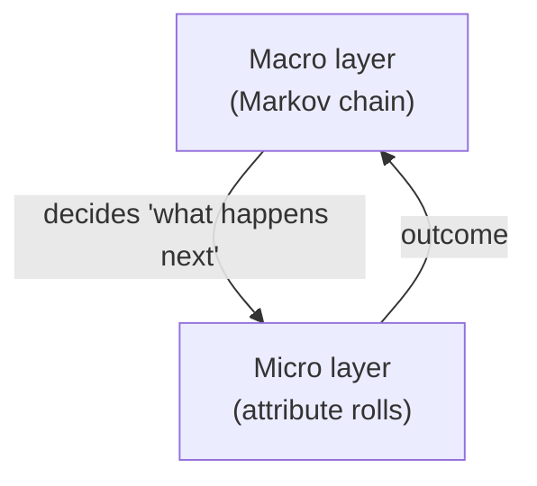
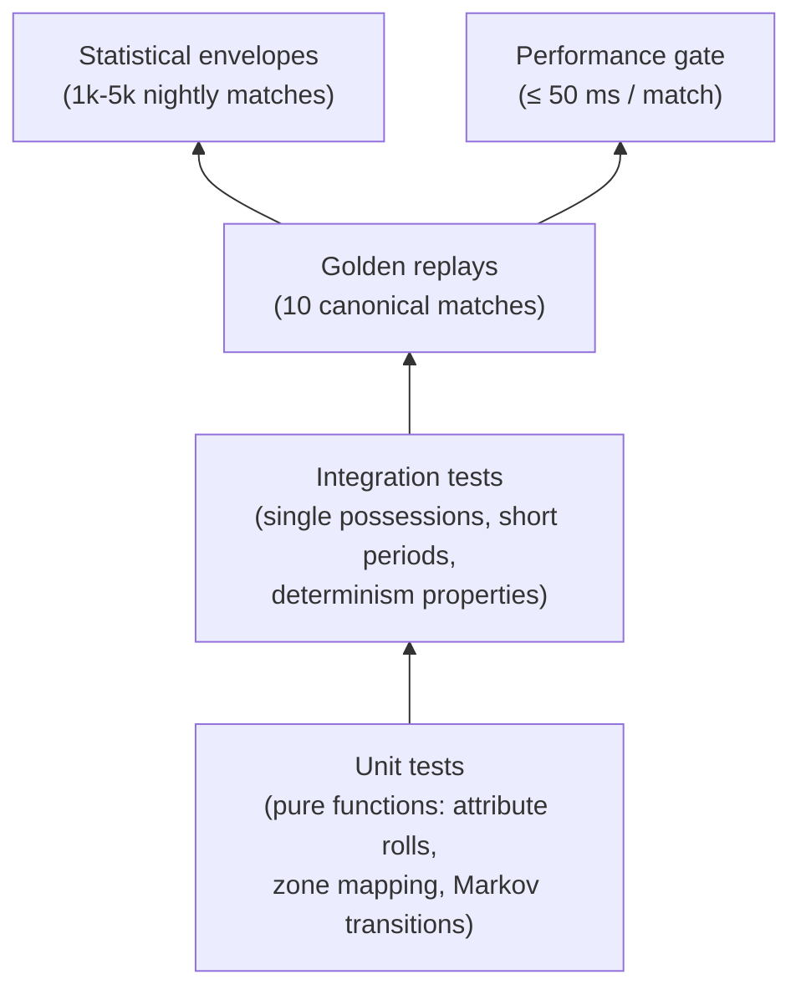

# Match Engine Simulation Model - Locked Decisions

This note resolves Wave 3 gap **D1** (R2-01: Deterministic match-engine
simulation model). It is the **binding** reference for the match engine
implementation in `packages/match-engine`.

These rules feed Wave 3 gap **A3** (ADR-0003 Match Engine depth
rewrite), **E13** (Worker bridge), **E11** (test strategy), **I8**
(zone granularity + tick rate), and the M2 (Match Engine v1)
milestone.

## 1. Simulation model - Hybrid Markov + attribute rolls

### 1.1 Two layers

The engine has two cooperating layers:



#### Macro layer - possession-level Markov chain

State:

```ts
type MacroState = {
  teamInPossession: 'home' | 'away' | 'none'  // none = loose ball after rebound
  zoneId: number                              // 0..17 (18-zone grid)
  phase: 'build_up' | 'final_third' | 'transition' | 'set_piece'
  pressureLevel: 0 | 1 | 2 | 3                // local defending team pressing intensity
}
```

Transitions yield the next event type and a target zone:

- `pass_short`, `pass_medium`, `pass_long`, `pass_through`, `cross`,
  `switch_play`, `back_pass`
- `carry`, `dribble_attempt`
- `shot`, `cutback`, `header`
- `foul`, `tackle`, `interception`, `clearance`
- `out_of_play`, `offside`, `turnover`
- `set_piece_award` → forces phase transition

Transition probabilities are parameterised by:

- **Zone influence deltas** (see §4).
- **Tactic configuration**: pressing height, block depth, mentality,
  width, passing tempo, line height.
- **Fatigue + morale** (read from squad context).
- **Score state + clock**: trailing teams take more risks late.

#### Micro layer - attribute-vs-attribute integer contests

When the macro layer chooses an event, 1-3 attribute contests
determine success/failure and numeric outcomes:

| Event | Primary contest | Secondary contests |
|---|---|---|
| Pass | `passer.passing + technique + decision` vs `pressureDefender.defending + anticipation + pressIntensity` | Direction modifier from `pass_type`; pressure level from §4 |
| Carry / Dribble | `attacker.dribbling + agility + balance` vs `defender.tackling + positioning + aggression` | Stamina modifier |
| Shot | `shooter.finishing + composure + bodyShape` vs `keeper.shotStopping + positioning` | `xg_bp` from zone + pressure; angle + distance |
| Aerial duel | `attacker.heading + jumping + bravery` vs `defender.heading + jumping + positioning` | Pitch condition modifier |
| Tackle | `defender.tackling + anticipation + aggression` vs `attacker.dribbling + balance + composure` | Foul probability if aggression high |
| Save | `keeper.shotStopping + reflexes + handling` vs `xg_bp` of the shot | Body part modifier |

Each contest is computed as **integer basis-points** (0-10000) per the
D8 lock:

```ts
function resolvePassAttempt(
  passer: Player, target: Player, defender: Player,
  passType: PassType, pressure: number,
  rng: PCG32
): { success: boolean; intercepted: boolean } {
  const baseSkill =
    (passer.passing + passer.technique + passer.decisions) / 3   // 0..100
  const opposition =
    defender
      ? (defender.defending + defender.anticipation) / 2
      : 0
  const pressMod = pressureToBp(pressure)                        // 0..3000 bp
  const typeMod = passTypeBpMod(passType)                        // -1500..+500 bp

  const successBp = clamp(
    skillToBp(baseSkill) - skillToBp(opposition) - pressMod + typeMod,
    500, 9500
  )
  const roll = rng.nextU32() % 10000
  if (roll < successBp) return { success: true, intercepted: false }
  // Failed: split between out-of-play and intercepted
  const intRoll = rng.nextU32() % 10000
  return { success: false, intercepted: intRoll < 6000 }
}
```

All branches use **integer comparisons** (`roll < successBp`), no
float-threshold compares. PRNG: `pure-rand` PCG32 via the
`MatchCoreRng` stream (per D8 §2).

### 1.2 Why hybrid

Per Perplexity research 2026-05-16, the alternatives were inferior:

- **xG-only / Poisson-only**: good for scores, bad for tactics +
  visualisation + intermediate states.
- **Minute-by-minute Markov alone**: too coarse for short sequences
  (press → regain → shot).
- **FM-style per-tick micro alone**: too expensive for our 50 ms
  budget + Web Worker.

Hybrid Markov + attribute rolls is what open-source TS football sims
(e.g. `nutmeggame/football-sim`) and academic work
(Lucey et al. 2014, Goes et al. 2020) converge on for event-level
simulation with tactical depth.

## 2. Tick granularity - per-event with integer-second jumps

### 2.1 Time model

- `simClock` is **integer seconds**.
- Each event consumes an integer `duration_s` derived per event type:

| Event type | Typical `duration_s` |
|---|---|
| `pass_short` | 3-6 |
| `pass_medium` | 4-8 |
| `pass_long` / `cross` | 6-12 |
| `dribble_attempt` / `carry` | 4-10 |
| `tackle` / `interception` | 1-3 |
| `shot` | 1-3 |
| `save` | 1-2 |
| `foul` | 3-6 |
| `set_piece` execution | 20-40 |
| `set_piece` (penalty) | 30-60 |
| `substitution` | 60-90 |
| `injury` (stoppage) | 30-180 |
| `tactical_change` | 0 (instant) |
| `whistle` (HT/FT) | 0 |

Within a range, the actual `duration_s` is sampled from `MatchCoreRng`
with a triangular-style integer distribution (mode in the middle).

### 2.2 Event count

Typical match: ~120-180 events. AI-vs-AI batch-simulation can run
quieter matches (e.g. ~80-100 events) by trimming filler micro-events.

### 2.3 Period boundaries

- 1H: 0-2700 s (45 min).
- HT: 2700-2701 s (instant whistle event).
- 2H: 2701-5401 s.
- FT: 5401-5402 s.
- ET (if applicable): 5402-7202 s (two 15 min halves).

If an event's `duration_s` would overshoot a period boundary, the
duration is **clamped** so the event finishes precisely at the
boundary. The whistle event fires immediately after.

### 2.4 UI derivation

UI layers (commentary, viewer, stats) derive per-minute summaries
from `floor(sim_clock_s / 60)`. No engine-internal per-minute tick.

## 3. Event schema

### 3.1 Required core fields (every event)

```ts
type MatchEventCore = {
  id: number                   // 0..N-1, sequential per match
  match_id: string             // ULID
  engine_version: string       // pinned per match (D8)

  sim_clock_s: number          // integer second at event start
  duration_s: number           // integer seconds consumed
  period: 1 | 2 | 3 | 4        // 1=1H, 2=2H, 3=ET1, 4=ET2

  event_type: EventType        // see §3.2
  outcome: Outcome             // see §3.3

  team_id: string | null       // primary actor's team; null for whistles
  player_ids: number[]         // [0] = primary actor; rest = context (defender, assister, …)

  start_pos: Point | null      // integer mm; null for meta events
  end_pos: Point | null
  start_zone_id: number | null // 0..17
  end_zone_id: number | null
}

type Point = { x: number; y: number }  // integer mm (105 000 × 68 000 grid)
```

### 3.2 Event taxonomy

```ts
type EventType =
  | 'kickoff'
  | 'pass'              // payload: PassPayload
  | 'carry'             // payload: optional CarryPayload
  | 'duel'              // payload: DuelPayload
  | 'shot'              // payload: ShotPayload
  | 'save'              // payload: SavePayload
  | 'goal'              // payload: optional GoalPayload
  | 'foul'              // payload: FoulPayload
  | 'card'              // payload: CardPayload
  | 'offside'           // payload: optional
  | 'interception'      // payload: optional
  | 'clearance'         // payload: optional
  | 'set_piece'         // payload: SetPiecePayload (execution event)
  | 'substitution'      // payload: SubPayload
  | 'injury'            // payload: InjuryPayload
  | 'tactical_change'   // payload: TacticalChangePayload
  | 'whistle'           // payload: optional (kickoff/HT/FT)
  | 'misc'
```

### 3.3 Outcome enum

```ts
type Outcome =
  | 'success'
  | 'fail'
  | 'blocked'
  | 'foul_won'
  | 'foul_committed'
  | 'out_of_play'
  | 'offside'
  | 'goal'
  | 'save'
  | 'injury'
```

### 3.4 Optional fields

#### `phase` (build_up | final_third | transition | set_piece)

Useful for analytics (zone-entry tracking, transition success rate).

#### `tactical_context` (Expert tier + analytics)

```ts
type TacticalContext = {
  team_shape_id: string                        // e.g. "4-3-3", "3-5-2"
  opponent_shape_id: string
  team_mentality: 'very_defensive' | 'defensive' | 'balanced' | 'attacking' | 'very_attacking'
  team_press_height: 'low' | 'medium' | 'high'
  team_block_depth: 'low_block' | 'mid_block' | 'high_block'
  team_width: 'narrow' | 'standard' | 'wide'
  team_zone_pressure?: number  // -100..+100 local pressure differential
}
```

Stored only when the snapshot differs from the previous event (delta
encoding to save space). UI / analytics layers reconstruct full
context by carrying the last seen state forward.

#### `payload` - typed per event_type

```ts
// PassPayload
type PassPayload = {
  pass_type: 'short' | 'medium' | 'long' | 'through' | 'cross' | 'backpass' | 'switch'
  foot: 'left' | 'right' | 'head' | 'other'
  pressure_level: 0 | 1 | 2 | 3                // 0 = unopposed, 3 = very high
  expected_completion_bp: number               // 0..10000
  assist_potential_bp?: number                 // direct chance creation
}

// ShotPayload
type ShotPayload = {
  body_part: 'left' | 'right' | 'head' | 'other'
  shot_type: 'open_play' | 'counter' | 'set_piece' | 'penalty' | 'direct_fk'
  on_target: boolean
  blocked: boolean
  xg_bp: number                                // 0..10000
  distance_mm: number
  angle_deg_int: number                        // 0..180
  goalkeeper_id?: number
  rebound_event_id?: number                    // link to follow-up event
}

// DuelPayload
type DuelPayload = {
  duel_type: 'tackle' | 'aerial' | 'dribble'
  defender_id: number
  foul_called: boolean
  advantage_played: boolean
}

// FoulPayload
type FoulPayload = {
  fouled_player_id: number
  severity: 'light' | 'careless' | 'reckless' | 'serious'
  set_piece_type: 'fk_direct' | 'fk_indirect' | 'penalty' | 'corner' | 'throw_in'
}

// CardPayload
type CardPayload = {
  player_id: number
  color: 'yellow' | 'red'
  reason_code: 'tactical' | 'violent' | '2nd_yellow' | 'professional' | 'dissent'
}

// SetPiecePayload (execution)
type SetPiecePayload = {
  type: 'corner' | 'fk_wide' | 'fk_central' | 'penalty' | 'throw_in' | 'goal_kick'
  side: 'left' | 'right' | 'center'
  routine_id?: string  // links to tactic routine
}

// SubPayload
type SubPayload = {
  team_id: string
  player_out_id: number
  player_in_id: number
  reason: 'tactical' | 'injury' | 'fatigue' | 'time_wasting' | 'other'
}

// TacticalChangePayload
type TacticalChangePayload = {
  team_id: string
  new_shape_id?: string
  new_mentality?: string
  new_press_height?: string
  new_block_depth?: string
  new_width?: string
}

// InjuryPayload
type InjuryPayload = {
  player_id: number
  severity: 'knock' | 'medium' | 'serious'
  treatment_seconds: number
}

// MiscPayload
type MiscPayload = {
  note: 'kickoff' | 'half_time' | 'full_time' | 'period_start' | 'period_end'
}
```

### 3.5 Storage

Per A4 + D14:

- **SCHEMALESS** SurrealDB table `match_event` (event/log/payload
  tables are schemaless).
- Linked rows pattern: `match_event.match: record<match>`.
- For human-involving matches: every event is stored.
- For AI-vs-AI matches: no event rows by default (seed-only); on
  re-sim, events are generated transiently or persisted on watch-
  party demand (per ADR-0011).

### 3.6 Optional `rng_trace` for debugging

```ts
type RngTrace = {
  stream: 'MatchCoreRng' | 'MatchAiRng' | string
  last_u32: number  // last draw before this event resolved
}
```

Off by default; toggled on in `engineVersion == debug-*` builds.

## 4. Formation interaction - hybrid zone + role influence

### 4.1 Zone influence map

For each team, the engine maintains a zone-by-zone influence map:

```ts
type ZoneInfluence = {
  attacking: number    // 0..100+
  defending: number    // 0..100+
  pressing: number     // 0..100+
  support: number      // 0..100+ (for passing options + combinations)
}

type TeamInfluence = ZoneInfluence[]  // length 18 (one per zone)
```

### 4.2 Computing influence per player

For each on-pitch player, derive **base zone weights** from formation
+ role, then apply duty/instructions/traits modifiers:

```ts
function computePlayerInfluence(
  player: Player,
  formation: Formation,
  role: Role,
  duty: Duty,
  instructions: PlayerInstructions,
  traits: PlayerTrait[]
): PlayerInfluence {
  // 1. Base zones from formation × role
  let weights = formationZoneWeights[formation][role]  // 18 zone weights

  // 2. Duty multiplier (Attack/Support/Defend)
  weights = applyDutyMultiplier(weights, duty)

  // 3. Instructions adjust laterally + vertically
  weights = applyInstructions(weights, instructions)  // "stay wider", "roam", "mark tighter"

  // 4. Traits (e.g. "drifts to centre", "shoots from distance") shift weight patterns
  weights = applyTraits(weights, traits)

  // 5. Convert to attacking/defending/pressing/support contributions
  //    (depends on role: e.g. an Inverted Wing-Back contributes attacking + support
  //     in central middle zones plus defending in wide deep zones)
  return weightsToContributions(weights, role, duty)
}
```

`formationZoneWeights` is a lookup table per formation × role
(authored once in `packages/match-engine/data/formations.ts`).

### 4.3 Aggregating to team influence

```ts
function computeTeamInfluence(
  players: Player[],
  formation: Formation,
  tacticConfig: TacticConfig
): TeamInfluence {
  const result: TeamInfluence = newZeroInfluence(18)
  for (const p of players) {
    const contrib = computePlayerInfluence(
      p, formation, p.role, p.duty, p.instructions, p.traits
    )
    accumulate(result, contrib)
  }
  // Apply tactic-level modifiers (press height, line, width, mentality)
  return applyTacticModifiers(result, tacticConfig)
}
```

Cost: O(22 × 18) per recomputation, run only at:

- Kickoff.
- Each tactical-change event.
- Each substitution.

Negligible CPU cost relative to the 50 ms budget.

### 4.4 Per-event deltas

At each event, the macro layer reads both teams' influence at
`start_zone_id` and computes deltas:

```ts
function zoneDeltas(
  attacker: TeamInfluence,
  defender: TeamInfluence,
  zoneId: number
): ZoneDeltas {
  const a = attacker[zoneId]
  const d = defender[zoneId]
  return {
    attack_delta:   clamp(a.attacking - d.defending,    -100, 100),
    press_delta:    clamp(d.pressing  - a.support,      -100, 100),
    support_delta:  clamp(a.support   - d.support,      -100, 100),
  }
}
```

These deltas feed the Markov transition probability adjustments and
the attribute roll thresholds.

### 4.5 Emergent formation effects

Examples of what falls out for free:

- **Midfield overload**: a 3-5-2 has 5 mid weights in central zones
  versus a 4-4-2's 4 → larger `support_delta` and `attack_delta` in
  centre → higher `pass_short` + `pass_medium` success + lower
  `forced_long_ball` rate.
- **Width mismatch**: wide 4-3-3 versus narrow 4-3-2-1 → large
  `attack_delta` in wide zones → higher `cross` and `cutback` event
  rate.
- **Press vs low-block**: high-press team has high `pressing` in
  defending team's build-up zones → opposition `pass_short` success
  drops, `forced_long_ball` rises, `turnover` event rate climbs.
- **Tactical familiarity multiplier** (per
  [[../50-Game-Design/training-load-and-medicine]] §6): reduces team
  influence by `(100 - familiarity)/100`, simulating disorganised
  execution.

No matchup matrices required.

## 5. RNG stream usage (locked from D8 + Q5)

| Stream | Used for |
|---|---|
| `MatchCoreRng(matchId)` | Markov transition probabilities; all attribute rolls; event duration sampling; injury rolls; foul/card severity rolls |
| `MatchAiRng(matchId)` | In-match AI tactical decisions: when to sub, what to sub to, formation tweaks, aggression changes, time-wasting decisions |

**Strict separation**. Refactoring the AI logic later (adding new
randomness consumers in `MatchAiRng`) must not perturb the physical
event sequence (which depends only on `MatchCoreRng`).

Other streams (`WeatherRng`, `InjuryRng` for long-term injury
modelling, etc.) are used outside the match engine to compute
pre-match inputs (weather modifier, base injury proneness) - their
values are baked into the match's pre-match-setup snapshot per
[[../50-Game-Design/match-engine]] §1.1.

## 6. Performance budget + Worker contract

### 6.1 Budget

- Target: **≤ 50 ms** for a full match on a 2022 mid-range Android
  in a Web Worker (locked from
  [[research-wave-2-gaps]] R2-09 tentative).
- Soft alert: 30-40 ms (CI alerts before we hit the hard cap).
- AI vs AI batch simulation (no narrative output): **≤ 30 ms** per
  match (less event narrative work).

### 6.1.1 Match quality profiles

The simulation supports four output-depth profiles. Profiles change output
volume and sampling frequency; they do not create separate football rules.

| Profile | Event depth | Spatial samples | Default use |
|---|---|---|---|
| `competitive-full` | Full event taxonomy | Full lightweight sampling | Human-involving matches, watch-party fixtures, key competitive matches |
| `interactive-standard` | Full event taxonomy | Reduced sampling | Active singleplayer match on capable devices |
| `background-detailed` | Selected event categories + key stats | Sparse or on-demand | Important AI fixtures in active leagues |
| `background-fast` | Summary-only macro outputs | None | Rest-world fixtures and large matchday batches |

Determinism requirement: the selected profile is part of `MatchInputs` and
therefore part of the replay/audit input set. Changing profile changes output
depth, so it must be stored with the match record.

### 6.1.2 Interactive chunking

For non-interactive batch and replay paths, the engine may simulate the full
match before playback. For human-interactive matches, the runtime may buffer
future events in chunks and accept intervention commands at deterministic
points:

- dead balls and set pieces;
- halftime and extra-time breaks;
- injury/card/substitution stoppages;
- tactical phase transitions.

Past events are immutable. Interventions recompute team influence and future
transition weights only from the intervention point forward.

### 6.2 Worker bridge contract

```ts
// In the main thread
interface MatchWorkerBridge {
  simulate(input: MatchInputs): Promise<MatchResult>

  // For live human-vs-human matches: streaming events
  simulateStreaming(input: MatchInputs): AsyncIterable<MatchEventCore>

  // For watch-party / replay: re-simulate from seed
  replay(input: MatchInputs): AsyncIterable<MatchEventCore>
}

interface MatchInputs {
  engine_version: string
  seeds: { coreSeed: number; aiSeed: number }
  quality_profile: 'competitive-full' | 'interactive-standard' | 'background-detailed' | 'background-fast'
  home_lineup: Lineup
  away_lineup: Lineup
  home_tactic: TacticConfig
  away_tactic: TacticConfig
  weather: WeatherInputs
  referee_profile: RefereeProfile
  emit_full_event_log: boolean   // true for human matches, false for AI-vs-AI default
}

interface MatchResult {
  events: MatchEventCore[]       // empty if emit_full_event_log = false
  summary: MatchSummary          // always present
  rng_final_state: RngStateSnapshot
}
```

### 6.3 Worker bridge mechanics

- Implemented in `packages/match-engine/src/worker.ts`.
- Communication via `postMessage` with discriminated-union message
  types (locked in gap E13 / E17 follow-up).
- Events are sent in batches (typically per virtual minute or every
  ~20 events, whichever first) to avoid `postMessage` overhead per
  event.
- Determinism contract: the worker MUST NOT call `setTimeout`,
  `requestAnimationFrame`, `Date.now()`, `Math.random()` (per D8
  §5).

## 7. Pre-match setup

Locked from [[../50-Game-Design/match-engine]] §1.1, augmented with
D1 specifics:

```ts
type PreMatchSetup = {
  team_strengths: { home: number; away: number }   // 0..100, derived from lineup + tactic familiarity
  form: { home: number; away: number }              // -100..+100
  morale: { home: number; away: number }            // -100..+100
  home_advantage: number                            // 0..100, from atmosphere engine (fan-ecology)
  tactic_fit: { home: number; away: number }       // 0..100, familiarity × cohesion
  fatigue: { home: number[]; away: number[] }      // per-player 0..100
  weather: WeatherInputs                            // temperature, wind, rain
  referee_profile: RefereeProfile                   // foul threshold, card threshold
}
```

Pre-match setup is computed once at `lineup_locked` and frozen for
the duration of the match. Tactical changes during the match update
the relevant TeamInfluence map (§4.3) but don't re-compute pre-match
setup.

## 8. Test strategy - full pyramid

### 8.1 Test pyramid



### 8.2 Unit tests (PR-blocking)

Pure-function tests covering:

- Attribute-roll calculators.
- Zone mapping (x,y → zone_id).
- Influence aggregation (player → zone influence).
- Markov transition selection.
- Time progression + period boundaries.
- Event duration sampling.

Run on every commit. Target: 95 %+ coverage of `packages/match-engine/src/`.

### 8.3 Integration tests (PR-blocking)

- Single-possession simulations (start in zone X, team A in
  possession; run until turnover/shot).
- Formation-vs-formation micro-tests (5-minute periods).
- Determinism: same inputs + seeds → identical event log.
- Fast-check property tests:
  - Generator: random valid squads + formations + tactics + seeds.
  - Properties: termination, monotonic `sim_clock_s`, valid period
    transitions, conservation (goals in events == score in summary),
    zone-coordinate sanity, monotonic tactic effects (higher press
    → not fewer opposition turnovers).

### 8.4 Golden replays (PR-blocking subset; full on main)

**10 canonical matches** covering:

| # | Scenario | Tests |
|---|---|---|
| 1 | Symmetric baseline (4-3-3 vs 4-3-3 balanced) | Core flow, symmetry |
| 2 | Low-block vs heavy attack | Pressing, block depth, shot volumes |
| 3 | Pressing mismatch (high-press vs lower stamina) | Pressing logic, fatigue linkage |
| 4 | Width mismatch (3-4-3 wide vs 4-3-2-1 narrow) | Wide zone entries, cross counts |
| 5 | Midfield overload (3-5-2 vs 4-4-2) | Central zone dominance |
| 6 | Set-piece heavy team | Set-piece flow, xG distribution |
| 7 | Card + foul heavy match (aggressive traits) | Foul, advantage, card logic |
| 8 | Injury + substitution sequence | Subs, tactical changes, formation recalc determinism |
| 9 | One-sided domination (extreme rating mismatch) | Upper-tail scoreline distribution |
| 10 | 0-0 defensive stalemate (both 5-4-1 low-block) | Lower-tail distribution |

For each: fixed rosters + attributes + formations + tactics + all
RNG seeds + engine version. CI asserts **byte-identical** event log
+ stats. Subset (2-3 matches) runs on every PR; all 10 on main.

### 8.5 Statistical envelopes (nightly on main)

Simulate 1 000-5 000 league-style matches, assert bounded ranges:

- 0-0 rate: 6-10 % (±3 % tolerance).
- Average total goals per match: 2.4-3.0 (±0.3).
- Team scores in 0-3 range: 80-90 %.
- Scores > 5: < 5 %.
- Avg shots per team: 8-18.
- Avg total xG: 2.3-3.0.
- Goals / xG ratio: 0.8-1.2.
- High-press team turnover share > low-block team turnover share in
  opponent half.
- Wide-formation cross count > narrow-formation cross count.

Failure threshold: 2 standard deviations from canonical band.

### 8.6 Performance gate (PR-blocking)

```ts
const ITER = 100
const start = process.hrtime.bigint()
for (let i = 0; i < ITER; i++) {
  simulateMatch(fixedHeavyScenario)
}
const avgMsPerMatch = Number(process.hrtime.bigint() - start) / 1e6 / ITER

if (avgMsPerMatch > 50) throw new Error(`Perf regression: ${avgMsPerMatch} ms/match > 50`)
if (avgMsPerMatch > 35) console.warn(`Perf alert: ${avgMsPerMatch} ms/match > 35 soft cap`)
```

Heavy scenario: two high-press teams + aggressive traits + lots of
fouls/cards. Run in Node CI on every PR. Cross-browser perf checks
(via Playwright headless Chromium) run on main.

## 9. Implementation roadmap

### Phase 1 - skeleton (M2 milestone)

- `packages/match-engine/src/` skeleton with:
  - `engine.ts` — main `simulate(input)` entry point.
  - `worker.ts` — Web Worker bridge.
  - `macro/markov.ts` — Markov transition selection.
  - `micro/contests.ts` — attribute-roll calculators.
  - `formation/influence.ts` — zone-influence computation.
  - `events/types.ts` — schema definitions.
  - `data/formations.ts` — formation × role zone weight tables.
- Golden replays 1, 2, 9, 10 (simplest + tail behaviours).
- 50 % unit-test coverage.

### Phase 2 - depth (post-MVP)

- Full event taxonomy (set pieces, cards, injuries, tactical
  changes).
- Golden replays 3-8.
- Statistical envelope tests on main.
- Performance gate active.
- Property-based tests.

### Phase 3 - advanced

- Detailed referee profiles influencing foul + card thresholds.
- Weather effect on event durations + injury probability.
- Tactical familiarity multiplier integration.
- Set-piece routine system.

## 10. Locked decisions summary

| Decision | Locked choice |
|---|---|
| Simulation model | Hybrid Markov + attribute rolls |
| Tick granularity | Per-event with integer-second `simClock` jumps |
| Event schema | Required core + typed optional payloads + optional tactical_context (delta-encoded) |
| Formation interaction | Hybrid zone + role influence; per-zone deltas modulate Markov transitions + attribute thresholds |
| RNG streams | Strict separation: `MatchCoreRng` (physics) + `MatchAiRng` (in-match AI) |
| Performance budget | ≤ 50 ms per full match in Web Worker; soft alert 30-40 ms |
| Test strategy | Full pyramid: unit + integration + 10 golden + statistical envelopes + property-based + perf gate |
| Storage policy | Match table SCHEMAFULL; match_event table SCHEMALESS; AI vs AI = seed-only (re-sim on demand) |
| Worker bridge | postMessage with discriminated-union types; events batched per virtual minute or every 20 events |
| Numeric representation | Integers + basis-points throughout (per D8 §4) |

## 11. Cross-references

- **A3** (ADR-0003 Match Engine depth rewrite) — paste §10 + §1 + §3
  into the Decision section.
- **D9** (R2-09 performance budgets) — 50 ms target locked here;
  cross-browser perf check is D9's scope.
- **E13** (Worker bridge implementation guide) — concrete
  postMessage protocol locked here.
- **E11** (test strategy implementation guide) — paste §8 verbatim.
- **I8** (match-engine zone/tick) — locked: 18 zones, per-event tick.
- **R2-04** (AI manager / opponent behaviour) — owns the
  `MatchAiRng` consumer set.

## 12. Sources

- Perplexity research, 2026-05-16 (gap D1). Five-question Q&A
  covering simulation model, tick granularity, event schema,
  formation interaction, test strategy.
- Lucey, P. et al. (2014). "Quality vs Quantity: Improved Shot
  Prediction in Soccer". MIT Sloan Sports Analytics Conference.
- Goes, F. et al. (2020). "Beyond Plus-Minus in soccer: A new model
  for player contribution". Journal of Quantitative Analysis in
  Sports.
- Maymin, J. (2024). "The Soccer Analytics Handbook".
- American Soccer Analysis xG models (referenced for macro layer
  contrasts).
- Open-source TS reference: `nutmeggame/football-sim` (Markov +
  attribute rolls architecture).
- `bygfoot` (open-source manager game) — pure attribute-roll
  reference, contrasted as too-complex.
- `pure-rand` (PCG32 reference) — locked PRNG library (per D8).
- `fast-check` — property-based testing library (E11).
- Wave 3 gap D1 Q&A with Nico (2026-05-16): all six locked decisions
  accepted.
