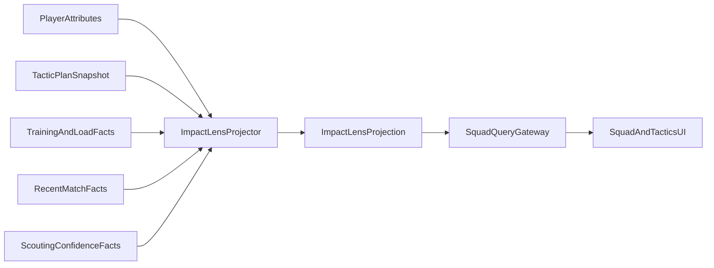

# Player Strength Presentation - Impact Lens

> Locked 2026-05-17 after review of [[raw-perplexity/raw-player-strength-overview]].
> Nico chose the **Impact-first, no global OVR** direction. This note is the
> implementation-facing synthesis; raw research remains historical input only.

## 1. Decision

The game does **not** expose a global player Overall / OVR / universal star
rating as the canonical strength representation.

Player strength is shown through the **Impact Lens**:

- **Role Impact**: how useful a player is for a specific role, duty, tactic and
  availability context.
- **Category profile**: Technical / Mental / Physical / GK summaries derived
  from the locked attribute schema.
- **Availability status**: fitness, fatigue, form, morale, injury/suspension
  and match sharpness as separate signals.
- **Scouting confidence**: labels, ranges and trust levels instead of fake
  precision for unknown players.
- **Explanation layer**: the UI can explain why a player is recommended without
  exposing hidden data the user has not earned.

The product promise is: **the squad view tells you who helps this plan now**,
not who has the biggest generic number.

## 2. Why the raw research needed correction

The attached research had the right product instinct but needed alignment with
current vault decisions.

### Adopt

- Role- and tactic-adaptive player comparison is stronger than a flat OVR.
- Category scores improve scanability on mobile.
- Status icons must stay visible because today's strongest player may not be
  available or in form.
- A drill-down explanation is a real differentiator against both spreadsheet
  and card-style competitors.
- The computation belongs in read models, not in the match-engine core.

### Correct

- The raw input used broader attribute clusters such as Character and older
  examples. The locked schema is [[data-generators]] §10:
  **16 visible + 4 GK extras + 8 hidden meta on a 1-20 scale**.
- Quick tier previously used star ratings. That conflicts with Nico's chosen
  no-global-OVR policy. Quick now uses qualitative Impact bands and assistant
  recommendations.
- Category and Impact scores are **integer projections**, not new domain
  attributes.
- CA/PA remain internal generation and development concepts. They do not become
  squad-list OVR.
- Multiplayer fairness requires uncertainty to be symmetric and tied to
  scouting, not monetisation.

### Reject

- A single 0-100 OVR shown for every player.
- A 1-5 star "true strength" shortcut.
- Hiding fitness, morale or form inside the strength number.
- Cross-context database joins to compute a convenient squad table.
- Premium-only precision or paywalled player-strength advantage.

## 3. Competitor sanity check

| Pattern | Strength | Weakness | Our response |
|---|---|---|---|
| Football Manager PC-style attributes + custom views | Deep, transparent, high agency | Squad overview can become spreadsheet work; role suitability is not the compact primary lens | Keep full Expert attribute access, but make Impact Lens the default tactical scan |
| FM-style stars and reports | Fast and familiar | Can hide the causal reason behind the recommendation | Replace global stars with explainable role/tactic labels and ranges |
| EA / mobile card OVR + six categories | Very fast comparison | Collapses tactical identity into one marketable number | Use categories for readability, but never a universal OVR |
| External/custom role-suitability tools | Strong for optimisers | Lives outside the game or requires manual setup | Bring that reasoning into the first-party squad and tactic flow |

The unique position is a **first-party tactical manager lens**: mobile-fast,
explainable, deterministic and tied to the current tactic.

## 4. Canonical inputs

Impact Lens uses stored domain facts. It never owns the facts.

| Input | Owner | Use |
|---|---|---|
| Visible player attributes | Squad & Player | Base category and role fit computation |
| Hidden meta attributes | Squad & Player / scouting reveal rules | Uncertainty, development and limited explainability |
| Position, natural sides, traits | Squad & Player | Role eligibility and role modifiers |
| Current tactic, role, duty, instructions | Tactics / Match setup contract | Role weights and tactical modifiers |
| Tactical familiarity | Training / Tactics | Execution readiness indicator |
| Fitness, fatigue, injuries, sharpness | Squad & Player + Training outcomes | Availability layer |
| Form and recent match ratings | Match output published back as facts | Trend layer |
| Morale | Squad & Player | Status layer |
| Scouting confidence | Scouting / Recruitment | Precision gating for external players |

No context may read another context's internal tables to compute Impact. Use
public queries, published facts, or denormalised projection inputs in the owning
context per [[../10-Architecture/bounded-context-map]].

## 5. Attribute categories

Per [[data-generators]] §10, the visible categories are:

| Category | Attributes |
|---|---|
| Technical | Passing, First Touch, Dribbling, Finishing, Crossing, Tackling, Heading |
| Mental | Decisions, Positioning, Vision, Composure, Work Rate |
| Physical | Pace, Strength, Agility, Stamina |
| GK | Reflexes, Handling, Aerial Reach, Distribution |

Hidden meta remains hidden unless a scouting rule reveals it as a label or
range: Potential, Consistency, Pressure, Professionalism, Determination,
Adaptability, Injury Proneness, Big Matches.

## 6. Scores and labels

### 6.1 Category score

Category scores are integer 0-100 projections from visible 1-20 attributes:

```text
normalised_attr = round((attribute_1_to_20 - 1) * 100 / 19)
category_score = round(weighted_average(normalised_attrs))
```

Default category weights are equal. Role-specific variants can weight a category
for explanation, but the base category profile stays stable so players can
learn what "Technical" or "Physical" means.

### 6.2 Role Impact

Role Impact is an integer 0-100 projection:

```text
role_impact =
  base_role_attribute_fit
  + tactic_modifier
  + role_duty_modifier
  + trait_modifier
  + familiarity_modifier
  + availability_modifier
  + form_morale_modifier
```

Rules:

- All persisted values are integers.
- Clamp final Impact to 0-100.
- Each component should be inspectable in Expert explanations.
- Availability and form modifiers must be shown separately in UI so the player
  can understand when a strong player is being dragged down by short-term state.
- Hidden meta may influence the projection only when the design says the
  manager can infer it. Otherwise it may widen uncertainty, not reveal truth.

### 6.3 Qualitative bands

Quick tier does not show exact scores. It shows qualitative bands:

| Internal range | Quick label |
|---:|---|
| 85-100 | Ideal fit |
| 70-84 | Strong fit |
| 55-69 | Usable fit |
| 40-54 | Compromise |
| 0-39 | Poor fit |

Labels can be localised and themed, but they must not become star icons that
players read as universal OVR.

### 6.4 Scouting uncertainty

For non-owned or poorly scouted players, Impact and categories become ranges or
labels:

| Scouting state | Surface |
|---|---|
| Unknown | Position, age, rough role tags, no exact Impact |
| First sight | Broad label, e.g. "possible Strong fit", low trust |
| Follow-up reports | Impact range, category bands, trust meter |
| Deep scout | Narrow range or exact Standard/Expert values, hidden-meta labels where earned |

The trust meter describes **information quality**, not player quality.

## 7. UI tiers

| Tier | Player strength presentation |
|---|---|
| Quick | Best-XI / Auto-Coach recommendations, qualitative role Impact bands, availability warnings, no global score |
| Standard | Role Impact number or tight range, Technical / Mental / Physical / GK bars, fitness / form / morale / sharpness icons, compact explanation sheet |
| Expert | Full 1-20 visible attributes, Impact formula breakdown, role-weight drivers, scouting uncertainty bands for hidden meta, comparison matrix |

Quick must still sort lists. Its default sort key is internal Role Impact for
the selected tactic, but the UI presents this as an assistant-ranked list rather
than an OVR leaderboard.

## 8. Squad row pattern

Standard row:

```text
Name + number | Positions | Planned role/duty
Impact: 78 (Strong fit) | Technical 74 | Mental 81 | Physical 66
Fitness 92 | Form ↑ | Morale stable | Sharpness 70
```

Mobile constraints:

- Fixed-height rows for virtualisation.
- No horizontal-scroll dependency for the primary squad view.
- Drill-down opens a sheet; it does not expand every row inline.
- Colour is always redundant with text / icon / shape.

## 9. Explanation layer

The Impact explanation answers "why this recommendation?" with earned
information:

```text
Strong fit as Ball-Playing Defender (Support)
+ Passing, Decisions and Positioning match the role
+ Current tactic values short build-up from the back
- Sharpness is low after missed matches
- Heading is only usable against aerial opponents
```

Rules:

- Never reveal exact hidden meta before scouting earns it.
- Use plain language first, numbers second.
- Keep explanations deterministic from the same projection snapshot.

## 10. Architecture

`ImpactLensProjection` is a Squad & Player read model, exposed via the
context's `queryGateway`.



Implementation constraints:

- The projection is read-only. Commands never trust it as workflow authority.
- Server-side SurrealDB can persist materialised rows if performance requires
  it; Dexie can cache the same read shape for offline UI.
- Live Queries may refresh the UI projection, but they never decide command
  success or workflow transitions.
- If offline and stale, the UI must show "last updated" or equivalent stale
  state rather than pretending the Impact is current.
- Compute-on-read is acceptable for small squads; materialise when list,
  transfer or scouting pages need fast sorting across many players.

## 11. Projection shape

Canonical fields should remain close to this shape:

```ts
type ImpactBand = 'ideal' | 'strong' | 'usable' | 'compromise' | 'poor'
type ScoutingConfidence = 'unknown' | 'low' | 'medium' | 'high' | 'owned'

type ImpactLensProjection = {
  playerId: string
  clubId: string
  tacticId: string
  roleId: string
  dutyId: string
  roleImpact: number
  roleImpactBand: ImpactBand
  roleImpactRange?: { min: number; max: number }
  categoryScores: {
    technical: number
    mental: number
    physical: number
    goalkeeper?: number
  }
  availability: {
    fitness: number
    fatigue: number
    sharpness: number
    injuryStatus: 'available' | 'doubtful' | 'injured' | 'suspended'
  }
  trends: {
    form: 'up' | 'flat' | 'down'
    morale: 'high' | 'stable' | 'low'
  }
  scoutingConfidence: ScoutingConfidence
  explanationDrivers: Array<{
    kind: 'positive' | 'negative' | 'neutral'
    label: string
  }>
  computedAt: string
}
```

Exact implementation types belong in code later; the documentation contract is
the semantic shape.

## 12. Acceptance criteria for future implementation

- No global OVR or universal player star is visible in squad, tactic, scouting
  or transfer lists.
- Every ranked recommendation has a role/tactic context.
- Quick tier can auto-pick and rank without showing exact numbers.
- Standard tier shows Impact + categories + status in one mobile-safe row.
- Expert tier can explain component weights without revealing unearned hidden
  attributes.
- Multiplayer and singleplayer use the same core projection semantics; MP only
  constrains precision and freshness.
- Projection computations are deterministic, integer-based and testable from
  stored inputs.
- Projection ownership respects DDD storage boundaries and `queryGateway`
  contracts.

## 13. Open tuning questions

These are tuning tasks, not blockers for the direction:

- Exact role-weight tables for all 50 roles.
- Whether availability modifies Impact directly or only annotates it in Expert.
- Localised German labels for Quick bands.
- Threshold tuning after playtests: players may need fewer or more than five
  qualitative bands.
- Whether transfer-market search should default to current tactic Impact or
  role-neutral category filters.
## Related

- [[raw-perplexity/raw-player-strength-overview]]
- [[data-generators]]
- [[tactics-and-formations]]
- [[surrealdb-schema-patterns]]
- [[../50-Game-Design/progressive-disclosure-ui]]
- [[../50-Game-Design/tactics-system]]
- [[../50-Game-Design/squad-and-club-structure]]
- [[../50-Game-Design/scouting-and-recruitment]]
