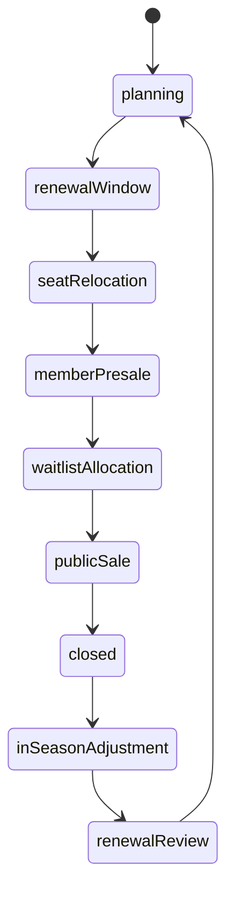

# Season-Ticket Lifecycle and Accounting - Research Synthesis 2026-05-28

## Question

How should FMX model season tickets so they are realistic, financially causal,
fair as a game, and still usable through Quick / Standard / Expert dashboards?

Nico's current defaults for this beat:

- use full accrual accounting, not a cash-only shortcut;
- model supporter rights at fan-group / cohort level, not individual supporters;
- keep resale, refund and transfer as policy effects and liability pools, not a
  full secondary-market simulation;
- keep all ranges tunable until balance tests and Nico approval.

## Summary

Season tickets should be a **campaign lifecycle plus accounting schedule**, not
a one-time "get money now" button. The player sells a defined share of stadium
inventory early, receives cash or instalment receivables, creates a liability
for future match access, then recognises revenue as included home matches are
played.

Recommended draft model: **Option C - Fan-Group Lifecycle + Full Accrual
Schedule**.

1. Fan Ecology forecasts renewal and new demand by segment and seat class.
2. Stadium publishes available capacity by seat class after sanctions,
   construction and away allocations.
3. Club Management runs a `SeasonTicketCampaign` through renewal, relocation,
   member/waitlist allocation, public sale and closed states.
4. The ledger posts cash/receivables and deferred revenue at sale time, then
   releases recognised revenue match by match.
5. Resale, no-show, transfer and compensation policies affect utilisation,
   credits, fan trust and future renewal as aggregate group effects.

The game implication is direct: a high season-ticket share improves liquidity
and occupancy floors, but locks in discounts, reduces single-ticket inventory
for top matches, and makes price hikes politically visible.

## Evidence summary

| Finding | Source pattern | FMX implication |
|---|---|---|
| Season tickets move through renewal, relocation, presale / waitlist and sale windows. | Tottenham renewal and relocation FAQs; Inter renewal / new sale / waiting-list phases; BVB and 1. FC Koeln waiting-list pages. | Campaign state must be explicit; do not treat season tickets as a single yearly slider. |
| Clubs distinguish seat classes and access products. | Arsenal 19/23-game packages and cup schemes; Inter BASE / PLUS / FULL products; PSG Tribune / Club Premier products. | Model product packages and seat-class quotas separately from the generic season-ticket share. |
| Payment plans and finance partners are real. | Tottenham offers a 10-month finance arrangement via V12 Finance with a fee; clubs also apply account credit during renewal. | Support upfront, instalment and finance-partner cash timing; separate club cash from recognised revenue. |
| No-show / seat-utilisation rules are active tools. | Arsenal requires season-ticket utilisation thresholds; 1. FC Koeln checks Dauerkarte usage; Barcelona and Inter use seat-release systems. | Track aggregate utilisation and no-show risk; unused seats should hurt atmosphere, single-ticket opportunity and renewal eligibility / trust. |
| Official exchange / seat-release systems often create credit rather than immediate free-form resale. | Arsenal account credit, Tottenham 1/19 account credit, Inter voucher credit, Barcelona Seient Lliure accumulated balance. | FMX should use club-controlled credit pools, not a supporter-to-supporter marketplace. |
| Waiting lists are strategic scarcity signals. | BVB reports season-ticket sales stopped with very large waiting list pressure; 1. FC Koeln caps season-ticket count to preserve day tickets. | Waitlist pressure is a club growth / price-trust / capacity signal and a source of future demand, not just UI flavour. |
| Cup access is often a separate scheme or add-on. | Arsenal cup scheme and priority windows; Tottenham automatic cup-ticket scheme; Inter FULL extra big-match benefits. | Cup matches should not be silently bundled everywhere; model included matches, optional cup rights and material-right hooks. |
| Football accounting recognises season-ticket revenue as matches are played. | Manchester United financial statements say matchday revenue, including allocated season-ticket amounts, is recognised when the match performance obligation is satisfied. PwC's football IFRS guide uses match-by-match delivery / access logic. | Ledger needs cash receipt, deferred revenue / contract liability and match recognition entries. |
| Attendance and matchday revenue vary with home-match count and competitions. | Manchester United annual report links matchday revenue to the number of home games and cup participation. | Promotion, relegation and cup qualification change both demand and the performance schedule. |
| Accessibility and family rules are separate allocation surfaces. | Arsenal accessible ticketing and several club concession / family policies treat access rights differently from standard adult seats. | Seat allocation needs family and accessibility quotas, not only standing/seating/premium. |

## Model options

### Option A - Cash-only season-ticket slider

The player chooses a percentage, receives money at season start, and matchday
ticket revenue is reduced by a flat discount.

- Pros: simple, cheap to implement, easy Quick-mode copy.
- Cons: violates the full-accounting direction, hides liabilities and cash
  timing, cannot handle renewal windows, no-show, waiting lists, payment plans,
  cup add-ons or group compensation.
- Verdict: reject as simulation core. It can exist only as a Quick preset view
  over a real campaign model.

### Option B - Individual holder marketplace

Every season-ticket holder is simulated with attendance, resale, refund,
transfer, seat history and payment state.

- Pros: very realistic at micro level.
- Cons: far too heavy, privacy-like mental model, hard to explain, unnecessary
  because Nico explicitly wants fan groups rather than single fans.
- Verdict: reject for MVP and likely long-term core. Keep individual-like
  details as aggregate policy effects.

### Option C - Fan-Group Lifecycle + Full Accrual Schedule

Season-ticket campaigns operate on cohorts: segment x seat class x package x
payment plan. The ledger receives a full accounting schedule. Utilisation,
credit, transfer and compensation are aggregate policy pools.

- Pros: realistic causal loop, supports Quick / Standard / Expert, respects
  full accounting, avoids individual supporter simulation, and keeps tuning in
  profile data.
- Cons: needs good read models and balance scenarios so new players understand
  why cash received is not the same as revenue earned.
- Verdict: recommended.

## Lifecycle

The draft state machine should be deterministic and season-scoped:



| State | Purpose | Main outputs |
|---|---|---|
| `planning` | Board/finance sets share targets, discount bands, package rules and seat-class quotas. | Draft `TicketingPolicy`, campaign forecast, trust warnings. |
| `renewalWindow` | Existing holders / cohorts renew or churn based on price, form, trust and package value. | Renewal demand, cash / receivable plan, churned seats. |
| `seatRelocation` | Renewed holders may move seat class or block if inventory allows. | Updated allocation; accessibility/family/premium exceptions. |
| `memberPresale` | Members / loyalty tiers / fan groups can buy before public sale. | New season-ticket holders by segment and seat class. |
| `waitlistAllocation` | Scarce clubs allocate remaining seats from waiting list rules. | Waitlist conversion, waitlist pressure, unmet demand. |
| `publicSale` | If inventory remains, sell packages publicly. | Public-sale uptake, weaker-loyalty cohort mix. |
| `closed` | Campaign finalised before season start. | Accounting schedule frozen except defined adjustments. |
| `inSeasonAdjustment` | No-show, seat-release, compensation and cup add-on flows update liabilities and utilisation. | Credit liability, utilisation state, fan-trust facts. |
| `renewalReview` | End-of-season eligibility and trust evaluation. | Renewal base for next campaign, waitlist movement, price-hike memory. |

Implementation note: cancelled / inaccessible matches should be events inside
`inSeasonAdjustment`, not a normal campaign state.

## Draft contract: `SeasonTicketCampaign`

Owned by Club Management.

| Field | Meaning |
|---|---|
| `campaignId` | UUIDv7 identity. |
| `clubId` | Club running the campaign. |
| `seasonId` | Season scope. |
| `policyId` | Linked `TicketingPolicy`. |
| `campaignState` | `planning`, `renewalWindow`, `seatRelocation`, `memberPresale`, `waitlistAllocation`, `publicSale`, `closed`, `inSeasonAdjustment`, `renewalReview`. |
| `includedFixturePolicy` | League-only, league-plus-defined-cup, premium package or profile-specific package. |
| `seatClassQuotas` | Standing, seating, family, premium, suites/hospitality, accessibility. Away allocation is reserved and not sold as home season-ticket inventory. |
| `targetShareBySeatClass` | Desired season-ticket share by seat class. |
| `discountVsSingleTicketBasketBand` | Expected discount versus a comparable single-ticket basket by seat class/package. |
| `renewalWindow` | Start/end week and communication policy. |
| `earlyBirdWindow` | Optional early-bird discount / loyalty protection. |
| `seatRelocationWindow` | Relocation eligibility and priority. |
| `memberPresaleWindow` | Member/fan-group/loyalty access before public sale. |
| `waitlistPolicy` | Ordering, eligibility, max offers, abandoned-offer handling and waitlist-pressure output. |
| `paymentPlanPolicy` | Upfront, internal instalment, finance partner, account credit and failed-payment handling. |
| `loyaltyTierPolicy` | Renewal rights, attendance minimums, priority windows and benefit bands. |
| `fanGroupEligibilityPolicy` | Group-level rules for protected family/community/ultras/core access without individual fan simulation. |
| `useItOrReleasePolicy` | Aggregate no-show threshold, seat-release incentives and renewal consequence band. |
| `groupCompensationPolicy` | Credit/refund/discount handling for cancelled, relocated or inaccessible included matches. |
| `allocationOutcome` | Sold seats and unmet demand by segment, package and seat class. |
| `accountingScheduleId` | Linked `SeasonTicketAccountingSchedule`. |
| `trustGuardrail` | Price-shock and fairness limits from Fan Ecology / country profile. |
| `provenance` | Forecasts, stadium snapshot, fixtures and policy versions used. |

## Draft contract: `SeasonTicketAccountingSchedule`

Owned by Club Management ledger boundary. It is an accounting plan, not a
separate money owner.

| Field | Meaning |
|---|---|
| `scheduleId` | UUIDv7 identity. |
| `campaignId` | Linked campaign. |
| `cashReceiptPlan` | Expected and actual cash receipts by week/payment method. |
| `instalmentReceivableMinor` | Outstanding club-owned receivables for internal instalment plans. |
| `financePartnerFeeMinor` | Fee/cost if a credit partner pays the club upfront or assumes credit risk. |
| `grossConsiderationMinor` | Total ticket consideration before credits and fees. |
| `accountCreditAppliedMinor` | Existing supporter account credit used against renewals. |
| `deferredRevenueMinor` | Contract liability remaining for included future matches. |
| `recognizedRevenueByMatch` | Allocated revenue released as each included match is played. |
| `remainingPerformanceObligations` | Matches / access benefits still owed. |
| `creditLiabilityMinor` | Credits from exchange, compensation or carried balances. |
| `refundLiabilityMinor` | Actual refund obligation pool where profile/policy requires cash refund. |
| `materialRightLiabilityMinor` | Optional hook for cup priority rights, renewal discounts or bundled benefits if treated separately later. |
| `recognitionPolicy` | Equal per included match, seat-class weighted, package weighted or profile-specific. |
| `adjustmentEvents` | Cancellations, relocations, sanctions, capacity closures, cup opt-ins or package amendments. |

Minimum ledger flow:

```text
on sale / renewal:
  Dr Cash or Receivable
  Cr Deferred season-ticket revenue
  Cr/Dr Account credit liability if existing credits are applied

on included home match played:
  Dr Deferred season-ticket revenue
  Cr Recognised matchday ticket revenue

on instalment collection:
  Dr Cash
  Cr Receivable

on finance partner plan:
  Dr Cash net of partner fee
  Dr Finance partner fee / cost
  Cr Deferred season-ticket revenue

on cancelled or inaccessible included match:
  Dr Deferred season-ticket revenue or recognised revenue reversal if needed
  Cr Credit liability or refund liability
```

The game does not need to expose journal-entry terminology in Quick mode, but
the underlying data must preserve the distinction between cash runway,
recognised revenue and future obligations.

## Seat-class allocation

Season-ticket policy should allocate only home inventory after the stadium
snapshot has removed unavailable capacity and away obligations.

| Seat class | FMX handling |
|---|---|
| Standing | High atmosphere, lower price, high loyalty / ultras/core share, strong trust sensitivity if displaced. |
| Standard seating | Main family/core/casual inventory; balanced renewal and single-ticket upside. |
| Family | Protected quota with concession rules, safety/comfort sensitivity and strong long-term fan-growth value. |
| Premium / hospitality | High revenue, corporate demand, separate service quality and sponsor value. |
| Suites | Contract-like hospitality inventory; may be better handled as commercial/hospitality contract if multi-year. |
| Accessibility | Protected access inventory; not a yield-optimisation pool. |
| Away | Reserved away allocation; never sold as normal home season-ticket stock. |

## Fan-group model

FMX should not create individual season-ticket holders. It should track cohorts:

```text
cohort =
  fan_segment
  x seat_class
  x product_package
  x payment_plan
  x loyalty_tier
```

Group outputs:

- renewal probability;
- no-show / utilisation probability;
- seat-release participation;
- credit balance pool;
- price-shock / trust memory;
- waitlist conversion;
- atmosphere contribution by included match;
- catering / merchandise propensity by cohort.

This preserves the user's requested realism without turning FMX into a CRM or
ticketing SaaS.

## Country-profile tendencies

These are profile priors only; generated club DNA and fan history can override
them.

| Country profile | Season-ticket tendency | Game implication |
|---|---|---|
| Germany | Strong member / Dauerkarte culture, standing allocation, scarce season tickets at major clubs, strong waitlist pressure and fan-first politics. | High renewal floor, lower aggressive-pricing headroom, waitlist is a growth signal, standing displacement is politically expensive. |
| England | High top-tier scarcity, membership/waitlist funnels, official exchange/share tools, payment plans and strong category pricing. | Rich lifecycle tooling, high premium upside, visible fan-affordability pressure, strong account-credit and finance-plan hooks. |
| Spain | Member / socio season-pass logic, seat-release systems, cup/European priority, stadium-renovation capacity effects. | Model attendance incentives and seat release; cup rights and temporary-venue constraints matter. |
| Italy | Abbonamento products, fan-card identity checks, user-change limits, official resale/credit and stadium-quality variance. | Access eligibility and transferability constraints matter; stadium comfort changes family/casual uptake. |
| France | Abonnement packages, virage/tribune differentiation, premium products and official resale/credit mechanisms. | Regional demand can be volatile; security/named-ticket constraints affect transfer and resale policy. |

## Promotion, relegation and cup qualification

Season tickets are sensitive to future fixture value, but the game must stay
fair by forecasting uncertainty rather than surprising the player after payment.

| Event | Effect |
|---|---|
| Promotion | Higher demand, stronger waitlist conversion, price-headroom temptation, possible stadium/compliance pressure. |
| Relegation | Lower casual/corporate demand, higher churn for event-led clubs, loyal clubs keep a stronger base but resist price hikes. |
| Continental qualification | Raises package value, premium/corporate demand and cup-scheme value; may create relocation constraints for non-compliant seats. |
| Cup run | Adds single-match sale and cup add-on opportunities; season-ticket holders may have priority or auto-charge options depending on policy. |
| New stadium / renovation | Can reset seat-class allocation, waiting-list conversion, accessibility/family capacity and utilisation incentives. |

## Quick / Standard / Expert surfaces

| Tier | Surface |
|---|---|
| Quick | Pick Safe / Balanced / Upside campaign. Shows upfront cash, recognised revenue warning, projected occupancy floor, fan-trust warning and "top-match upside lost" hint. |
| Standard | Edit seat-class share, discount band, payment-plan mix and waitlist use. Shows renewal forecast, 13-week cashflow, deferred revenue balance, single-ticket inventory and no-show risk. |
| Expert | Full campaign state, cohort allocation, payment receivables, credit/refund liability pools, match-by-match revenue recognition, utilisation sensitivity and promotion/relegation scenarios. |

Quick copy rule: never say "profit" when the player only received cash early.
The readable distinction is **cash now** versus **revenue earned as matches are
played**.

## Balance scenarios

```gherkin
Feature: Season-ticket lifecycle and accounting

  Scenario: Early cash is not earned revenue
    Given a club sells season tickets before the season
    When the campaign closes
    Then cash runway improves
    And deferred revenue increases
    But recognised matchday ticket revenue only increases as included matches are played

  Scenario: High season-ticket share reduces top-match upside
    Given two clubs have the same demand and stadium
    And one club sells a higher season-ticket share at a discount
    When a high-rivalry top fixture is played
    Then the high-season-ticket club has fewer single-ticket seats to surcharge
    And may earn less match-by-match ticket revenue despite stronger early cash

  Scenario: Loyal fan groups renew in a bad season
    Given a traditional club has high ultras and core loyalty
    And sporting form is poor
    When the renewal forecast runs
    Then the loyal cohorts renew above the event-led club baseline
    But large price hikes still damage ticketing trust

  Scenario: Promotion price hike creates trust risk
    Given a club is promoted
    And latent demand exceeds available capacity
    When the club raises season-ticket prices above its trust guardrail
    Then cash and deferred revenue can rise
    But renewal trust, atmosphere and future boycott risk are downgraded

  Scenario: Instalment plan changes cash timing
    Given a club offers internal instalments
    When season-ticket sales are posted
    Then deferred revenue reflects the full campaign obligation
    And cash arrives over the instalment schedule
    And receivable risk is visible in Standard and Expert views

  Scenario: Finance partner changes cost and risk
    Given a club offers a finance-partner plan
    When the partner pays the club upfront
    Then cash arrives earlier net of partner fee
    And credit risk is not treated like club-owned instalment receivables

  Scenario: Group-level compensation after an inaccessible match
    Given an included home match cannot admit a seat-class cohort
    When the adjustment posts
    Then the group receives a credit or refund-liability pool according to policy
    And no individual supporter record is created

  Scenario: Seat release improves utilisation
    Given a high no-show season-ticket cohort
    And an official seat-release policy is active
    When members release unused seats early enough
    Then utilisation and single-ticket availability improve
    And credit liability or renewal credit is updated as an aggregate pool
```

## Open Nico decisions

- Default season-ticket share and discount ranges per Top-5 profile and club
  archetype.
- Whether Quick mode should expose the waiting list as a visible asset or only
  as a demand / scarcity warning.
- Whether internal instalment receivable risk is active in MVP, or only
  documented with finance-partner plans as the first playable default.
- Whether cup priority rights are accounted as a visible material-right hook in
  Expert mode at MVP, or deferred until cup economy is implemented.
- How strict "use it or release it" renewal consequences may be without
  modelling individual supporters.
- Whether accessibility and family quotas are hard guardrails in all profiles
  or profile-tuned minimums pending legal/accessibility review.

## Source links

- Arsenal Seat Utilisation:
  <https://help.arsenal.com/support/solutions/articles/101000582626-seat-utilisation>
- Arsenal Season Ticket FAQs:
  <https://help.arsenal.com/support/solutions/articles/101000583998-season-ticket-faqs>
- Arsenal Ticket Exchange:
  <https://help.arsenal.com/support/solutions/articles/101000579609-ticket-exchange>
- Tottenham Season Ticket Renewals FAQs:
  <https://ask.tottenhamhotspur.com/hc/en-us/articles/360020871219-Season-Ticket-Renewals-2025-26-FAQs>
- Tottenham Ticket Exchange for Season Ticket Holders:
  <https://ask.tottenhamhotspur.com/hc/en-us/articles/6776102951708-Ticket-Exchange-Season-Ticket-Holders>
- Tottenham Automatic Cup Ticket Scheme:
  <https://ask.tottenhamhotspur.com/hc/en-us/articles/360000607159-Automatic-Cup-Ticket-Scheme-Gold-Season-Ticket>
- BVB Buying Season Tickets:
  <https://service.bvb.de/docs/en/dauerkartenkauf-planen>
- 1. FC Koeln Ticketing / Dauerkarten:
  <https://fc.de/service/stadionerlebnis/ticketing>
- FC Barcelona Seient Lliure information:
  <https://www.fcbarcelona.com/en/news/845581/information-about-seient-lliure>
- FC Barcelona attendance / season-pass usage measures:
  <https://www.fcbarcelona.com/en/club/news/2652210/end-to-camp-nou-season-ticket-exemption-period-and-return-of-seient-lliure>
- Inter season tickets:
  <https://www.inter.it/it/abbonamenti>
- Inter season-ticket general conditions:
  <https://www.inter.it/en/general-conditions-season-tickets-25-26>
- PSG subscriptions:
  <https://billetterie.psg.fr/fr/offres/abonnement>
- Manchester United 2025 annual report:
  <https://www.sec.gov/Archives/edgar/data/1549107/000110465925091251/manu-20250630x20f.htm>
- Manchester United 2024 interim report:
  <https://www.sec.gov/Archives/edgar/data/1549107/000141057825000168/manu-20241231xex99d1.htm>
- PwC, Accounting for typical transactions in the football industry:
  <https://www.pwc.de/de/technologie-medien-und-telekommunikation/pwc-accounting-for-typical-transactions-in-the-football-industry.pdf>
- IFRS Foundation, IFRS 15 Revenue from Contracts with Customers:
  <https://www.ifrs.org/issued-standards/list-of-standards/ifrs-15-revenue-from-contracts-with-customers/>
