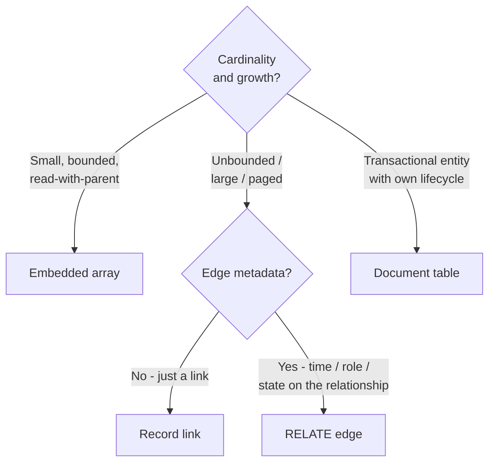
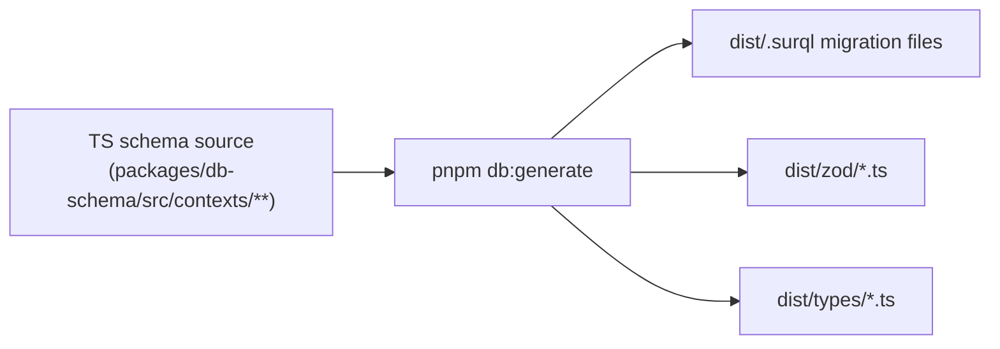

# SurrealDB Schema Patterns - Historical Context

> **Superseded — historical memory only.** This document is superseded by [[../10-Architecture/09-Decisions/ADR-0027-postgres-data-model]] and [[../30-Implementation/postgres-drizzle-integration]] and must not be implemented. The current decision/spec lives there; see also [[../00-Index/Decision-Log]] for the authoritative index. Retained for historical context per the vault's supersede discipline.

This note resolves Wave 3 gap **D14** (R2-14: SurrealDB schema patterns
for offline-first game data). It is the **binding** reference for how
every bounded context lays out its persistence on SurrealDB 2.x and
how the client-side store relates to it.

These rules feed Wave 3 gap **A4** (ADR-0004 Data Model depth rewrite),
**E1** (SurrealDB integration implementation guide) and **D12**
(multiplayer feasibility / hotseat → async handoff).

## 1. Per-save isolation - hybrid model (locked)

### Decision

A **shared platform DB** plus **one database per save**, all inside a
single namespace.

```text
namespace: soccer_manager
  database: platform        # identity, save registry, outbox, audit,
                            # global IP-clean catalog (fictional players,
                            # competitions, regions, naming pools)
  database: save_01J...     # one DB per save
  database: save_01K...
  database: save_01L...
  ...
```

### Why

- Strong per-save isolation (backup, restore, export, deletion are
  database-scoped).
- The platform DB owns cross-save concerns: user accounts, save
  registry, IP-clean catalog, the outbox + Redis fan-out tier from
  [[../10-Architecture/09-Decisions/ADR-0013-transactional-outbox]],
  audit trail, abuse detection.
- One namespace keeps DBA / connection-pool operations simple at
  Dokploy single-node scale.
- Hotseat → MP handoff is a *snapshot import* into a new save DB, not
  a row-level cross-DB join.

### What lives in the platform DB

| Table | Owner | Purpose |
|---|---|---|
| `user` | Identity & Access | User account, credentials, profile |
| `device` | Identity & Access | Per-device PRF salt for save encryption |
| `session` | Identity & Access | Auth session records |
| `save_registry` | Platform | (saveId, ownerUserId, mode, leagueId, status, dbName) |
| `mp_group` | League Orchestration | Async MP group metadata (members, cadence, content mode) |
| `invite` | League Orchestration | MP group invites |
| `outbox_event` | Audit & Security | Transactional outbox (per B4) |
| `outbox_event_archive_YYYY_MM` | Audit & Security | Monthly cold archives (per B4) |
| `consumer_event_offset` | Audit & Security | Per-consumer idempotency table (per B4) |
| `catalog_player_archetype` | Catalog | IP-clean player archetypes for procedural generation |
| `catalog_region` | Catalog | Fictional regions / countries / naming pools |
| `catalog_competition_template` | Catalog | Fictional competition templates |
| `audit_log` | Audit & Security | Sensitive admin actions |

### What lives in a per-save DB

Everything mutable to one save: leagues, clubs, squads, players,
match records, training plans, transfer offers, watch parties,
notifications, fan-segment state, sponsor contracts.

Each per-save DB carries its own per-context tables (per
[[../10-Architecture/bounded-context-map]]) and is the unit of
backup / restore / clone / delete.

### Cross-save operations

- **List a user's saves**: query `save_registry` in the platform DB.
- **Hotseat → MP handoff**:
  1. Freeze the source save (mark read-only in `save_registry`).
  2. Export an encrypted snapshot of the source save DB.
  3. Server validates the snapshot (decrypt, schema check, integrity
     check) per [[../10-Architecture/09-Decisions/ADR-0011-server-authoritative-multiplayer]] §Hotseat handoff.
  4. Create a new MP-flavoured save DB.
  5. Import the validated snapshot into the new save DB.
  6. Add a row to `save_registry` linking new DB ↔ promotion source.
- **Clone save** (Phase 2): mirror the source save DB into a new one;
  drop the previous outbox state.
- **Delete save**: drop the save DB; remove the `save_registry` row.

### Rejected alternatives

- **Namespace per save**: operational sprawl at > 100 saves; backup
  surface fragmented; permission boundaries already cover what we need
  at DB level.
- **One shared DB + `save_id` column on every row**: easiest initially
  but cross-save leakage risk grows with every feature; index bloat
  becomes a real problem at year-2 storage.
- **DB-per-save without a platform DB**: forces save registry +
  outbox + catalog into every save DB; cross-save listing becomes
  fragile.

## 2. Schema strategy - hybrid (locked)

### Decision

- **SCHEMAFULL** for stable core entities: `player`, `club`, `league`,
  `competition`, `fixture`, `match`, `transfer_offer`, `sponsor`,
  `training_plan`, `staff`, `save_registry`, `user`, `device`,
  `mp_group`, `invite`, `consumer_event_offset`.
- **SCHEMALESS** for event / log / payload tables: `match_event`,
  `outbox_event`, `outbox_event_archive_YYYY_MM`, `audit_log`,
  `narrative_event_log`, `notification`.

### Why

- SCHEMAFULL on core domain tables gives type safety and enforces
  constraints close to the data; matches our Zod-driven contracts
  ([[../10-Architecture/09-Decisions/ADR-0013-transactional-outbox]]
  §6) without duplicating logic.
- SCHEMALESS on append-only event tables avoids `DEFINE FIELD` churn
  on every payload tweak; preserves payload fidelity for replay /
  audit even when consumer expectations evolve.
- Matches the schema-versioning policy from B4: events evolve
  forward-compatible via JSON + Zod; consumers ignore unknown fields.

### Field-level patterns

For SCHEMAFULL tables:

- Every field has `DEFINE FIELD ... TYPE ... ASSERT ...` where
  practical (use `ASSERT` for invariants the DB can cheaply check).
- Optional fields default explicitly: `VALUE` clause.
- Timestamps use `datetime`.
- Money + probabilities + attributes use **integer** types (per
  [[determinism-and-replay]] §4 locked decision).
- IDs are SurrealDB record links (`record<player>`).

For SCHEMALESS tables:

- Schema is enforced at the application layer via Zod (per B4).
- A required `event_id` (UUIDv7), `event_type`, `schema_version`,
  `emitted_at`, `aggregate_id` skeleton is implicit but not DB-
  enforced.

## 3. Relationship modelling (locked per-relationship)

The rule of thumb: choose per relationship, not globally.

| Relationship | Pattern | Rationale |
|---|---|---|
| club → players | **Record link** on `player.club: record<club>` | One-to-many; queried both ways; roster mutates constantly; embedding rosters would cause write-amplification |
| match → match_events | **Linked rows** (`match_event.match: record<match>`) | 100-200 rows per human match; pagination, replay scrubbing, partial reads all matter |
| transfer_offer → counter-offers | **Linked rows** with `parent_offer: record<transfer_offer>?` | Chained, mutable, deep history; recursive embedding gets ugly |
| transfer (clubA, player, clubB, fee, clauses) | **Document table**, not RELATE | A transfer is a transactional entity, not a graph edge; needs business rules + clauses |
| watch_party → participants | **RELATE edge** (`RELATE watch_party:... -> participates -> user:...` with edge metadata `joined_at`, `left_at`, `role`) | True many-to-many over time with meaningful edge metadata |
| scouting_mission → (scout, region, targets) | **Document + record links**; `targets` as linked rows if dynamic | Mission is a business object; scout + region are references; large dynamic target sets shouldn't be embedded |
| club → stadium / club → stadium_attractions | **Embedded** (small, immutable per-match, read-together) | Stadium config is read with the club; updates are rare |
| sponsor_contract (sponsor + asset + club) | **Document table** with record links to sponsor + asset | A contract is a transactional entity |
| rivalry (clubA, clubB, scores) | **Document table** with record links | The rivalry has its own lifecycle (sub-scores per §3 of [[../50-Game-Design/rivalry-system]]) |
| user → mp_group_memberships | **RELATE edge** with `joined_at`, `role` | True relationship with edge metadata |
| player → injuries (history) | **Linked rows** (`injury.player`) | History grows; pagination needed |
| player → traits / tendencies | **Embedded array** of small string IDs | Read-together, rare update, small cardinality |
| training_plan → drills | **Embedded array** in `training_plan` | Read-together, rewritten per week, bounded size |

### General decision tree



## 4. Migrations + type generation (locked)

### Decision

**TS-first schema mirror** under `packages/db-schema` is the single
source of truth. It emits:

- `.surql` migration files (idempotent, forward-only).
- Zod schemas (used at every API + bus boundary).
- TypeScript types.

Migrations apply via an explicit **`pnpm db:migrate`** release step
(not on container boot).

### `packages/db-schema` layout

```text
packages/db-schema/
  src/
    contexts/
      identity/
        user.ts             # TS table definition
        device.ts
        session.ts
        index.ts
      league/
        season.ts
        league_week.ts
        index.ts
      club/
      squad/
      training/
      transfer/
      match/
      watch-party/
      notifications/
      sync/
      audit/
        outbox_event.ts
        consumer_event_offset.ts
        audit_log.ts
    generators/
      to-surql.ts           # emits DEFINE TABLE / FIELD / INDEX
      to-zod.ts             # emits Zod schemas
      to-types.ts           # emits TS types
    migrations/             # generated, committed
      000001-init-identity.surql
      000002-init-league.surql
      ...
  package.json
```

### Authoring entity definitions in TS

```ts
// packages/db-schema/src/contexts/squad/player.ts
import { defineTable, fields } from '@/db-schema'

export const player = defineTable('player', {
  scope: 'per_save',
  schemafull: true,
  fields: {
    name:        fields.string(),
    nationality: fields.recordLink('region'),
    dob:         fields.datetime(),
    club:        fields.recordLink('club'),
    position:    fields.enum(['GK','DEF','MID','FWD']),
    ca:          fields.intRange(0, 100),
    pa_min:      fields.intRange(0, 100),
    pa_max:      fields.intRange(0, 100),
    wage_cents:  fields.intPositive(),
    traits:      fields.array(fields.string()),
    contract:    fields.embedded(contractEmbed)
  },
  indexes: [
    { fields: ['club', 'position'] },
    { fields: ['nationality'] }
  ]
})
```

The generator emits all three artefacts; the application code imports
the Zod schema from the same source, eliminating drift.

### Migration discipline

- Migrations are **forward-only** and **idempotent**: every
  `DEFINE` uses `IF NOT EXISTS`.
- Renames use the phased pattern:
  1. Add new field (migration N).
  2. Backfill (migration N+1, optional data migration script).
  3. Switch reads + writes to new field (code release).
  4. Remove old field (migration N+M, where M is one or more
     releases after the switch).
- Destructive changes are isolated in their own migration file with
  a `# WARNING: DESTRUCTIVE` header.

### Runner

```sh
pnpm db:migrate            # apply pending migrations to all live databases
pnpm db:migrate --dry-run  # show what would run
pnpm db:migrate:status     # list applied + pending
```

Runs as an explicit Dokploy **release step** before the new image's
app containers start. Boot-time migrations are forbidden in
production (acceptable in dev only).

The runner iterates:

1. Platform DB (single).
2. Every save DB enumerated via `save_registry`.

Long-running migrations on many save DBs are queued and reported per-
DB; failures pause rollout.

### Type generation pipeline



CI gate: `pnpm db:generate && git diff --exit-code` fails the build
if the generated artefacts drift from the committed copy.

## 5. Browser offline store (locked: Dexie-only at MVP; WASM as research track)

### MVP decision

The browser uses **Dexie / IndexedDB only**:

- Local save snapshot for offline singleplayer.
- Pending-command outbox (replayed on reconnect per
  [[../10-Architecture/09-Decisions/ADR-0011-server-authoritative-multiplayer]]
  §Offline conflict policy).
- Read-model projection cache (driven by Live Query events when
  online; stale-on-load when offline).
- Drafts (tactic, training, transfer drafts).

Server-side SurrealDB stays as the system of record.

### Why not SurrealDB WASM in browser at MVP

Even if technically possible:

- Bundle size (megabytes) is hostile to PWA install time on mobile.
- IndexedDB persistence under PWA constraints (iOS ITP / Android
  eviction) is not battle-tested.
- Migration discipline across browser environments is complex.
- Debugging is harder than Dexie.
- Dexie has a mature TS-first ecosystem; SurrealDB WASM tooling for
  the browser is still maturing in 2026.

### Research track (post-MVP)

A `R3-track-surreal-wasm-browser` research item is opened. Trigger
conditions for re-evaluating:

- Capacitor / native packaging is in scope (then bundle size matters
  less; native filesystem can replace IndexedDB).
- Server cost becomes a constraint and we want richer local query
  support.
- SurrealDB WASM bundle size drops below ~500 KB compressed and gains
  formal PWA persistence guarantees.

Until then: Dexie-only.

## 6. Live Queries pattern (locked: UI-only, never workflow authority)

### Decision

Live Queries are the **realtime UI projection channel**. They are
**never** the authority for command acceptance or workflow
transitions.

| Use Live Queries for | Don't use Live Queries for |
|---|---|
| Dashboard refresh (current state) | Confirming a command succeeded (re-read authoritative state) |
| List + detail screen reactivity | Deciding whether a workflow transition fired |
| Watch-party + spectator stream events | Triggering follow-up commands |
| Presence indicators (who's online) | Quorum / countdown / deadline decisions |
| Notification inbox updates | Idempotency checks |

### Per-context `queryGateway` abstraction

Each bounded context's `src/domain/<context>/index.ts` exports a
`queryGateway`:

```ts
// src/domain/match/index.ts
export const matchQueryGateway = {
  // One-shot
  getMatchById: (matchId: string) => Query<MatchReadModel>,
  listMatchesByLeagueWeek: (leagueId: string, week: number) => Query<MatchListItem[]>,

  // Live (Live Queries under the hood)
  subscribeMatchEvents: (matchId: string) => Subscription<MatchEvent>,
  subscribeLeagueWeekStatus: (leagueId: string) => Subscription<LeagueWeekStatus>
}
```

UI uses TanStack Query for cache + refetch + stale control; Live Query
events invalidate / update the relevant query keys.

### Ordering & delivery caveat

Live Queries deliver eventually. For workflow correctness, every
critical transition handler:

1. Receives a domain event from the outbox (the authoritative trigger,
   per B4).
2. Re-reads the authoritative state inside its own transaction.
3. Decides + writes the next state.

The UI may *see* a Live Query update first, but UI never decides
workflow.

## 7. Schema sketch per bounded context

Skeleton schemas for the 11 bounded contexts. Detail goes into A4
(ADR-0004 depth rewrite). Tables are listed with their DB scope
(`platform` or `per_save`).

### Identity & Access (`platform`)

```text
user        # email, name, password_hash, account_secret, created_at
device      # user, device_salt, last_seen_at
session     # user, device, token_hash, expires_at
```

### League Orchestration (`per_save`; some metadata on `platform`)

```text
league_week    # league, season, week_number, state, quorum, …
                 (state machine per ../10-Architecture/state-machines/league-week)
season         # league, year, ruleset
fixture        # league, season, home_club, away_club, matchday, …
```

(MP group metadata + invites live on `platform`.)

### Club Management (`per_save`)

```text
club             # name, region, dna, brand_strength, …
stadium          # embedded in club (small, read-together)
finance_ledger   # SCHEMALESS event-log; entries by aggregate club
sponsor          # name, tier, category
sponsor_contract # sponsor, club, asset, fee_cents, side_conditions
board_state     # club, confidence_sub_scores, last_warning_at
fan_segment_state# club, segment, population, mood, loyalty
```

### Squad & Player (`per_save`)

```text
player          # SCHEMAFULL; CA, PA range, traits, contract embed
injury          # linked rows (player.injury)
contract        # embedded inside player
impact_lens_projection
                # SCHEMAFULL read model; player + club + tactic + role context,
                # integer Role Impact, category scores, status signals,
                # scouting confidence, explanation drivers
```

`impact_lens_projection` is owned by Squad & Player. Inputs from tactics,
training, match and scouting arrive through public query contracts, published
facts or denormalised projection inputs; there is no cross-context JOIN. The
same read shape may be cached in Dexie for offline UI and refreshed by Live
Query invalidation when online.

### Training (`per_save`)

```text
training_plan   # club, week, blocks embedded
training_outcome# SCHEMALESS event log (TrainingWeekProcessed events)
```

### Transfer (`per_save`)

```text
transfer_offer       # SCHEMAFULL; parent_offer record link for counter chain
transfer             # realised transfers; document table
agent_pressure_state # player, agent_pressure_score, last_update
```

### Match (`per_save`)

```text
match           # SCHEMAFULL; engine_version, seed, lineups, tactics, summary
match_event     # SCHEMALESS; full event log for human-vs-human and human-vs-ai
match_summary   # embedded inside match; result + key stats
```

(AI vs AI matches have a `match` row but no `match_event` rows by
default; re-sim generates them on demand per
[[determinism-and-replay]] §3.)

### Watch Party (`per_save`)

```text
watch_party     # state machine record
RELATE participates  # watch_party -> participates -> user (edge with joined_at, role)
watch_party_poll_vote# linked rows
```

### Notification (`per_save`)

```text
notification    # SCHEMALESS; per-user inbox items
push_subscription # per-user, per-device push endpoints (mostly on platform actually)
```

### Offline Sync (`per_save` for content, `platform` for telemetry)

```text
sync_status     # per-user, per-save sync state
```

(Client-side outbox lives in Dexie, not SurrealDB.)

### Audit & Security (`platform`)

```text
outbox_event             # SCHEMALESS; UUIDv7 PK (per B4)
outbox_event_archive_YYYY_MM  # monthly cold archives (per B4)
consumer_event_offset    # UNIQUE (consumer_name, event_id)
audit_log                # sensitive admin actions
```

## 8. Locked decisions summary (for A4 / E1 paste)

| Topic | Decision |
|---|---|
| Per-save isolation | Hybrid: shared `platform` DB + DB per save in one namespace `soccer_manager` |
| Schema strategy | SCHEMAFULL core + SCHEMALESS event/log/payload tables |
| club → players | Record link on `player.club` |
| match → match_events | Linked rows |
| transfer_offer → counter-offers | Linked rows with `parent_offer` |
| transfer | Document table (not RELATE) |
| watch_party → participants | RELATE edge with `joined_at` + `role` |
| scouting mission | Document + record links |
| sponsor_contract | Document with record links |
| rivalry | Document with record links |
| club → stadium | Embedded |
| player → traits | Embedded array |
| training_plan → drills | Embedded array |
| Migration source of truth | TS-first in `packages/db-schema` |
| Migration runner | Explicit `pnpm db:migrate` release step (not boot-time) |
| Migration discipline | Forward-only, idempotent, `IF NOT EXISTS`, phased renames |
| Type generation | Custom generator emits `.surql` + Zod + TS types |
| Browser offline store | Dexie / IndexedDB only at MVP |
| SurrealDB WASM in browser | Research track only (post-MVP, Capacitor / native trigger) |
| Live Queries | UI projection updates only; never workflow authority |
| Per-context query layer | `queryGateway` exported from `src/domain/<context>/index.ts` |

## 9. Cross-references

- **A4** (ADR-0004 Data Model depth rewrite) — paste §8 + §7 as the
  decision section.
- **E1** (SurrealDB integration implementation guide) — paste §4 +
  the migration runner + queryGateway pattern.
- **D12** (multiplayer feasibility) — hotseat → MP handoff =
  snapshot-and-import between per-save DBs (§1 of this note).
- **D13** (women's football data model) — must respect the
  per-relationship modelling rules (§3) and SCHEMAFULL vs SCHEMALESS
  hybrid (§2).
- **B4** (transactional outbox) — outbox tables live in `platform`
  DB; consistent with B4's storage decision.

## 10. Sources

- Perplexity research, 2026-05-16 (gap D14). Six-question Q&A
  covering per-save isolation, schemafull vs schemaless, relationship
  modelling, migrations + type-gen, browser WASM, Live Queries.
- SurrealDB 2.x documentation:
  - Namespaces and databases.
  - DEFINE TABLE / DEFINE FIELD / DEFINE INDEX / DEFINE ACCESS.
  - Record links, RELATE / graph edges, embedded fields.
  - Live queries / subscriptions.
  - Migration patterns (`IF NOT EXISTS`).
  - JavaScript SDK + WASM bundle considerations.
- Wave 3 gap D14 Q&A with Nico (2026-05-16): all recommendations
  accepted; SurrealDB WASM kept as post-MVP research track.
## Related

- [[../95-Archive/gap-reports/research-wave-2-gaps]]
- [[../95-Archive/gap-reports/wave-3-gap-analysis]]
- [[determinism-and-replay]]
- [[player-strength-presentation]]
- [[../10-Architecture/09-Decisions/ADR-0004-data-model]]
- [[../10-Architecture/09-Decisions/ADR-0013-transactional-outbox]]
- [[../10-Architecture/09-Decisions/ADR-0021-revised-tech-stack]]
- [[../10-Architecture/09-Decisions/ADR-0027-postgres-data-model]]
- [[../10-Architecture/bounded-context-map]]
