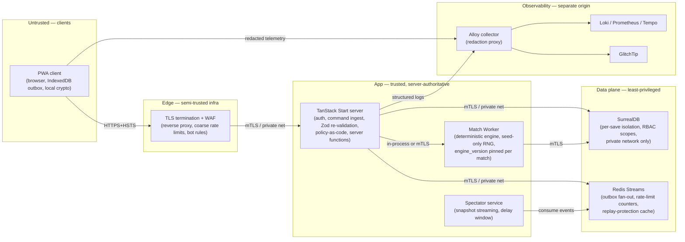

# Threat Model

This note resolves Wave 3 gap **F1** (Detailed threat model). It is the
**single binding security reference** that every other security-related
gap (F2 Auth flows, F3 Session management, F5 Account recovery,
F6 GDPR, F10 Audit trail, F11 Secrets management, F12 Rate limiting,
F13 Pentest strategy) and architecture document (C6 Crosscutting,
C8 Risks, D18 Risk register) anchors against.

It uses STRIDE per asset + bounded context, with an explicit attacker
tier model and a closed list of in-scope vs out-of-scope threats. All
controls reference the responsible ADR / gap / standard.

## 1. Scope and assumptions

### 1.1 Product context

- Offline-first PWA football manager (singleplayer + private async
  multiplayer of small friend groups).
- TanStack Start (React + Vite + SSR + server functions), SurrealDB
  (single-tenant on Hetzner), IndexedDB via Dexie, Service Worker
  via Workbox.
- Server-authoritative multiplayer per
  [[../10-Architecture/09-Decisions/ADR-0011-server-authoritative-multiplayer]].
- Saves encrypted at rest (AES-GCM-256, PBKDF2-SHA256 600 000 iter.
  for derived keys) per
  [[../10-Architecture/09-Decisions/ADR-0005-save-format]].
- Audit trail = transactional outbox + cold archive per
  [[../10-Architecture/09-Decisions/ADR-0013-transactional-outbox]].
- Self-hosted observability stack (OpenTelemetry + Loki / Prometheus
  / Tempo / Alloy + GlitchTip) per
  [[../10-Architecture/09-Decisions/ADR-0017-observability-logging]].
- EU-only data residency (Hetzner), self-hosted Dokploy.

### 1.2 What we protect

| Asset class | Examples | Confidentiality | Integrity | Availability |
|---|---|---|---|---|
| **Account credentials** | password hash, account secret, session tokens, recovery codes | High | High | Medium |
| **Save data** | game state, event log, RNG seed, lineups, tactics | Medium | **High** (cheat-relevant in MP) | High |
| **Multiplayer state** | league standings, transfer offers, match results | Low (intra-group) | **High** | High |
| **User PII** | email, display name, sender-locale, timezone | High | Medium | Low |
| **Server secrets** | DB creds, JWT signing key, sops/age keys, OTel ingest tokens | **Critical** | **Critical** | Medium |
| **Code-supply chain** | npm deps, container images, build provenance | High | **Critical** | Medium |
| **Audit trail** | outbox + cold archive | Medium | **High** (forensic value) | Medium |
| **Operational telemetry** | crash logs, perf metrics, traces | Medium (PII-redacted) | Low | Medium |

### 1.3 Attacker tiers — in / out of scope (locked)

Based on Perplexity research 2026-05-18 + OWASP Risk Rating + ENISA
Threat Landscape framing. Cost/benefit analysis for an indie EU
studio with minimal PII (no payments, no health, ~thousands of
users), self-hosted infra, no APT-grade adversary expected.

| Tier | Description | In scope | Rationale |
|---|---|---|---|
| **T0** | Anonymous remote attacker (script kiddies, scanners, bots) | **Yes** | Dominant threat for any internet-facing service. Cheap controls. Negligence not to handle. |
| **T1** | Authenticated user (legit account, tries to escalate) | **Yes** | OWASP Top 10 #1 is Broken Access Control. Account-takeover would violate privacy stance. |
| **T2** | Malicious MP group member (cheat / grief inside a group) | **Yes** | Gameplay integrity is core to product trust. Server-authoritative design + sanity caps required. |
| **T3** | Network attacker (Wi-Fi MITM, captive portals, rogue APs) | **Yes** | Handled via standard HTTPS / HSTS hygiene. Cheap, mandatory under GDPR. |
| **T4** | Compromised dependency (npm typosquat, supply chain) | **Yes** (baseline) | ENISA top emerging risk. Modest effort, high payoff. Indie-grade not enterprise-grade controls. |
| **T5** | Insider (operator with shell on Hetzner / Dokploy) | **Partial** | Protect against pragmatic misuse (least-privilege, secret stores, separate envs). Not full NOC-grade UEBA. |
| **T6** | Targeted attacker against a specific user (harassment) | **Partial** | Privacy defaults + block/report + minimal metadata exposure. Not full doxing-resistance. |
| **T7** | Nation-state / APT | **No** | Likelihood ≈ 0 for our profile. Cost would distract from product. Revisit if profile changes. |
| **T8** | Local-device attacker (physical access to logged-in device) | **No** (beyond session hygiene) | Browser sandbox + OS handle this. Short-lived tokens + "log out everywhere" are the only app-level controls. |
| **T9** | Side-channel attacker (Spectre, timing) | **No** | Cloud + browser already mitigate. We rely on well-vetted crypto libraries; no home-rolled primitives. |

**Locked**: this tier list is the binding scope of the threat model.
Any future request to expand scope (e.g. monetisation introduces
payment data → T7 becomes more relevant) requires an ADR + update
to this note.

### 1.4 Methodology

- **STRIDE** per asset × bounded context for the threat catalogue
  (Microsoft / OWASP standard practice).
- **OWASP ASVS v5.0 Level 2** as the verification baseline (target
  L2 across the board; L3 only for crypto storage + auth ASVS V11
  + V6).
- **Trust-boundary diagram** to drive control placement (§3).
- **Residual risks** explicitly accepted with rationale (§6).
- Sources: OWASP ASVS v5, NIST SP 800-38D / 800-63B / 800-92 /
  800-190, ENISA Threat Landscape 2025, SLSA Framework v1.0,
  Sigstore + npm provenance docs, MDN WebCrypto, RFC 8018.

## 2. Asset inventory by bounded context

Per [[../10-Architecture/bounded-context-map]] there are 11 contexts.
This table maps each to its primary asset and the dominant STRIDE
categories that apply.

| Context | Primary assets | Dominant STRIDE |
|---|---|---|
| **Identity & Access** | account credentials, sessions, devices, account-secret KEK | S, T, I, E |
| **League Orchestration** | season state, week tick, deadlines, quorum decisions | T, R, D, E |
| **Club Management** | finances, board state, facility config | T, R, I |
| **Squad & Player** | player base data, contracts, hidden attributes, Impact Lens | T, I, E |
| **Training** | training plans, load model, development deltas | T, R |
| **Transfer** | offers, clauses, negotiation state, transfer window timing | T, R, D, E (high) |
| **Match** | match engine inputs (seed, lineups, tactics, engine_version), event log | T (cheat-relevant), R, E |
| **Watch Party** | spectator polls, broadcast schedule, conference state | T, D |
| **Notification** | inbox content, push tokens | I, D |
| **Offline Sync** | local outbox, command replay buffer | T, R, D |
| **Audit & Security** | outbox + cold archive, anomaly flags | R (high), I, D |

(S = Spoofing, T = Tampering, R = Repudiation, I = Information Disclosure, D = Denial of Service, E = Elevation of Privilege.)

## 3. Trust boundaries

**Boundary controls per edge:**

| Boundary | Threats | Controls |
|---|---|---|
| Internet ↔ Edge | network attack, DDoS, scanners | TLS 1.3 + HSTS preload; WAF (OWASP CRS); IP-rate-limit; bot rules; CSP enforced on responses |
| Edge ↔ App | misconfigured edge, origin spoof | mTLS / private network; strict `Host` validation; origin allowlist |
| App ↔ Match Worker | tampered seed/engine, untrusted compute | server-issued seed only; `engine_version` server-config-driven, never client-supplied; engine binary hash recorded with match record |
| App ↔ DB | least privilege, replay | scoped DB creds (app-runtime vs migration); per-context query gateway; parameterised queries only; revision-locked CAS on transfer mutations |
| App ↔ Redis | counter tamper, idempotency abuse | private network; per-context key prefixes; idempotency keys are HMAC of server secret (not user-controlled) |
| Client ↔ Observability | telemetry injection, PII leak | same-origin telemetry endpoint with redaction proxy; client telemetry queues capped (cf. [[telemetry-privacy]]); no raw save / token / passphrase in payload |

## 4. STRIDE catalogue

For each STRIDE category: the top concrete threats, the bound
control (linked to ADR / gap / standard), and the residual risk we
explicitly accept.

### 4.1 Spoofing

| # | Threat | Bound control | Residual |
|---|---|---|---|
| S1 | Fake client / bot impersonates a user and submits commands | Strong auth + short-lived access tokens (≤ 30 min) + revocable refresh; **F2 Auth flows** decides MFA / passkey scope; rate-limit on login | Compromised device still indistinguishable from user — Audit + anomaly detection only |
| S2 | Session/token theft via XSS, malicious extension, or device compromise | Strict CSP (`script-src 'self'` + nonces; no `unsafe-inline`), Trusted Types in report-only first then enforce in Chrome/Edge, `HttpOnly` + `Secure` + `SameSite=Lax` cookies, token rotation on refresh | Browser extensions with `<all_urls>` permission bypass CSP. Cannot fully mitigate. |
| S3 | Service Worker spoofing / misregistration intercepts requests or serves altered shell | SW served same-origin only over HTTPS, narrow scope, immutable hashed bundles, **no runtime caching of untrusted HTML**, `worker-src 'self'` in CSP, signed container image carrying the SW | Compromised CI/build pipeline could ship a malicious SW (mitigated by T4 controls + image signing per §4.4-T6) |
| S4 | Phishing / lookalike origin tricks users into entering passphrase or exporting save | Re-auth required for export/import, account-secret rotation; clear in-app copy on portable export ("we cannot recover this passphrase"); educate via onboarding (D5) | User can still be phished — out-of-band education only |
| S5 | Telemetry identity spoofing pollutes security observability | Server tags every telemetry event with server-side identity; client-reported `device_id` is advisory only, never trusted for authz | Bots can still flood the queue → throttle + sample (cf. telemetry-privacy.md §3) |

ASVS v5 anchors: **V6 Authentication**, **V7 Session Management**,
**V3 Web Frontend Security**, **V12 Secure Communication**.

### 4.2 Tampering

| # | Threat | Bound control | Residual |
|---|---|---|---|
| T1 | Local save tampering in IndexedDB to cheat singleplayer or craft illegal MP commands | Server-authoritative validation (ADR-0011); AES-GCM AEAD detects modification but **does not prevent user from re-encrypting after modification with their own key** — therefore **client-side save integrity is not relied on for MP truth** | Singleplayer cheating is accepted (user-owned device). MP cheating blocked by server re-validation, not by save integrity. |
| T2 | Service Worker cache poisoning / poisoned offline bundle | Immutable content-hashed assets + SRI for any non-bundled imports + signed container image (cosign keyless) + Workbox cache-name versioning per build | Local browser cache compromise still possible by a different installed PWA on same origin (irrelevant for Klubhaus Elf since single origin) |
| T3 | Command replay / reorder / alter from offline outbox | Server-issued `turn_token` per (season, phase, user); idempotency key = `HMAC(server_secret, user_id ‖ season_id ‖ league_id ‖ endpoint ‖ client_cmd_id)`; per-(user, context) Redis TTL replay cache; commands include `season_id` + `phase_id` — old commands → `409 stale_phase` | A command valid in the current phase that is reordered within the phase can still hit. Mitigated by per-resource state machines (transfer FSM enforces order). |
| T4 | Portable export tampering: user imports modified or malicious save | AEAD tag verification on import (ADR-0005 §2); strict schema validation before any state read; reject if envelope/save/engine version unknown; sandboxed dry-run replay against stored seed before commit (per ADR-0011 §Hotseat handoff §3) | Maliciously-crafted but schema-valid save that exploits a logic bug in import path → mitigated by fuzz testing on import handler (open task) |
| T5 | Telemetry / log tampering — attacker injects misleading logs | Server-side tagging (client-supplied fields are advisory); structured logs append-only via outbox (ADR-0013); log integrity = retention + access control + (optional) hash-chain on cold archive partitions (open Q&A for F10) | Pre-sync local manipulation possible; server cross-checks vs outbox event sequence |
| T6 | Container image tampering between build and deploy | cosign keyless signing in CI (GitHub Actions OIDC + Sigstore public good); Dokploy pulls only from GHCR with digest pinning; SBOM via Syft attached to image label | Sigstore Rekor outage breaks verification path; documented runbook required (open task) |
| T7 | Engine_version pin tampering by client | `engine_version` is server-config-driven per match record, NOT taken from client request; client-reported version is telemetry only; match worker loads engine bundle by server config + hash-verify | Misconfigured server pin can cause divergent replays — mitigated by CI rule "engine bundle hash must match version manifest" |
| T8 | Seed manipulation / prediction | Seed derived as `HMAC_SHA256(server_master_secret, league_id ‖ season_id ‖ match_id ‖ scheduled_kickoff ‖ engine_version)`; CSPRNG fallback for non-deterministic seeds; never derived from client data | Master secret compromise = catastrophic, must rotate; mitigated by F11 secrets management |

ASVS v5 anchors: **V2 Validation and Business Logic**,
**V4 API and Web Service**, **V11 Cryptography**, **V14 Data Protection**.

### 4.3 Repudiation

| # | Threat | Bound control | Residual |
|---|---|---|---|
| R1 | User denies issuing a command after reconnect/sync | Outbox event = append-only with `actor_id` + `ip_address_hash` + `device_id` (telemetry) + `client_version` + `engine_version` + server timestamp + server-issued `turn_token`; receipt returned to client per command batch | Compromised client may generate plausible logs before sync. Audit cross-checks vs other contexts. |
| R2 | Offline queue dispute ("the client never sent that action") | Client outbox is local — we cannot prove client intent. Server stores received-command audit; client UI shows "queued vs synced" status (per ADR-0002 §8 outbox visibility) | Local mutation of outbox before sync is invisible to server. Accepted: server only acts on what it received. |
| R3 | Admin / operator disputes over config changes, deploys, data migrations | Immutable CI provenance (GitHub Actions OIDC + Sigstore), signed container images, sops+age commit history, separate prod/staging Dokploy projects, named SSH keys per operator | Shared root login on Hetzner VM = forbidden; runbook (F11) covers detection |
| R4 | Telemetry / log gaps prevent reconstructing who did what | Retention per [[telemetry-privacy]]: operational logs ≥ 30 days hot, domain audit (outbox) tiered 60 days hot + monthly cold archive forever (ADR-0013); admin UI must query both transparently | Cold archive query latency higher; F10 documents query patterns |
| R5 | Export / import disputes (source of save can't be verified) | Portable export envelope binds creator: AAD includes `createdAt` + `creatorAccountId` + `creatorDevice`; receiver sees this at import time | User-to-user trust still required; not an authority mechanism |

ASVS v5 anchors: **V8 Logging and Error Handling** (v5
renumbered from v4 V7), **NIST AU family (AU-2, AU-3, AU-6,
AU-9)**.

### 4.4 Information Disclosure

| # | Threat | Bound control | Residual |
|---|---|---|---|
| I1 | Local data leakage from IndexedDB, SW caches, crash dumps, browser sync | Encrypt all saves at rest (ADR-0005), no plaintext PII in caches, redact crash payloads before queueing (telemetry-privacy §3), no auth tokens in IndexedDB | OS-level backup may capture encrypted blob (acceptable — AEAD protects); screenshots / memory inspection at OS level out of scope (T8) |
| I2 | Sensitive telemetry leakage via logs / traces (tokens, passphrases, save bodies) | Mandatory redaction at Alloy collector (Otel proxy) + client-side redaction before queueing; redaction rules in CI test; deny-list incl. `password`, `passphrase`, `accountSecret`, `Authorization`, `Cookie`, `seed`, `idempotencyKey` | New PII field may slip past CI; quarterly redaction-list review (open task) |
| I3 | Cross-origin leakage from weak CSP, CORS, or third-party assets | Strict CSP (§3 boundary table); CORS allowlist explicit; `Referrer-Policy: strict-origin-when-cross-origin`; `Permissions-Policy` deny-by-default; no third-party scripts in production (analytics is self-hosted per ADR-0017) | Sub-resource not yet shipped (no third-party at MVP); when added it must use SRI |
| I4 | Export file exposure if portable saves shared / backed up unencrypted | Portable export is always AEAD-encrypted with user passphrase; UX warns user; no plaintext export ever shipped | User explicitly choosing to share the passphrase with file is intentional |
| I5 | Multiplayer metadata leakage (traffic timing reveals roster / tactic info) | TLS plus uniform polling intervals; do not branch request size on tactic choice; padding optional per spectator stream | Sophisticated traffic-analysis adversary out of scope (T6 partial) |
| I6 | Email / display name correlation reveals real identity in MP | Identity model: email stored server-side only; only display names exposed in groups; block/report function; abuse-log retention with delete-on-request | Friend group is by definition private — members know each other; not a privacy bug |
| I7 | Source map / dev assets shipped to production | CI gate: `pnpm build` strips source maps for prod bundle; SBOM verifies no `*.map` in image | Server-side stack traces are sanitised before being returned to client |

ASVS v5 anchors: **V14 Data Protection**, **V3 Web Frontend
Security**, **V11 Cryptography**, **NIST Privacy Framework** (data
minimisation), **GDPR Art. 5(1)(c) + 32**.

### 4.5 Denial of Service

| # | Threat | Bound control | Residual |
|---|---|---|---|
| D1 | Command flood / sync storm from buggy or malicious client | Per-endpoint token-bucket rate limits in Redis (counts: per user / IP / device); ASVS V4 anchor; cheap reject path (auth before processing) | Distributed attack (botnet) requires edge-WAF; baseline = Cloudflare-equivalent at edge (F12 finalises) |
| D2 | Offline queue explosion → huge upload on reconnect | Client cap: outbox ≤ 1000 commands or 10 MB, oldest-first eviction with user warning per ADR-0002; server-side batch limit 50 commands / 1 MB / request, > → 413 | Determined user keeps client open offline long enough to fill; UI warns at 70 % of cap |
| D3 | SW or cache abuse → client storage exhaustion or update loops | Workbox cache budget per cache (e.g. images: 50 entries / 50 MB LRU); SW update flow has retry cap; ADR-0002 §8 transient retry `0/10s/30s/2min/5min` cap 7 | Browser quota itself is OS-dependent; we follow `navigator.storage.estimate()` (ADR-0002) |
| D4 | DB / resource exhaustion on SurrealDB from expensive query / fan-out | Per-context `queryGateway` with documented query budgets; CI integration test verifies p95 < target; Live Queries used only for UI projections (per surrealdb-schema-patterns); admin endpoints have separate connection pool | A new query path slipping past CI; quarterly query-budget audit |
| D5 | Observability pipeline overload (high-cardinality metrics, log spikes) | OTel tail-based sampling at Alloy; log rate-limit per source; cardinality limits per metric; drop policy for noisy tenants (cf. telemetry-privacy.md §5) | Production spike may degrade observability before sampling kicks in; alert on dropped-event rate |
| D6 | Low-cost griefing via spam transfer offers / watch-party invites | Per-resource rate limits: e.g. `transfer_offer` 5 / minute / 50 / day per user, max 3 pending offers from same club / week; progressive sanctions (429 → temp-mute → manual review) | Sophisticated multi-account abuse needs F12 + manual moderation (Out-of-scope until reports surface) |

ASVS v5 anchors: **V4 API and Web Service**, **V13 Configuration**,
**NIST SP 800-53 SC-5**.

### 4.6 Elevation of Privilege

| # | Threat | Bound control | Residual |
|---|---|---|---|
| E1 | XSS → full app compromise: token theft, command forging, save access | CSP `script-src 'self'` + nonces; Trusted Types (Chrome/Edge enforced, others report-only); React's default escaping; no `dangerouslySetInnerHTML` for user content; output sanitisation for narrative content (per narrative-content-pipeline §Voice consistency) | Zero-day in React / Vite-generated bundle still possible; mitigated by short token TTL + audit |
| E2 | Authorization bypass in API (IDOR, broken object-level auth) | Centralised `authorize(actor, action, resource)` function called by every command/query handler; policy-as-code (in-house RBAC matrix at MVP, OPA optional post-MVP); ASVS V8 anchor; integration tests force every endpoint through authz | New endpoint without authz call → CI lint rule (open: F1 follow-up) |
| E3 | Service Worker privilege misuse if compromised (controls network responses + caches) | SW is minimal logic only; no secrets in SW context; SW updates require user navigation (not bypass-able); SW code reviewed in same PR discipline as the rest | Compromised SW shipped via T6 supply chain → cosign verification + immutable hashed bundles |
| E4 | Supply-chain compromise (pnpm workspace dep, build-time inject) | `pnpm install --frozen-lockfile` in CI; Socket.dev or Snyk on PR; Dependabot with weekly schedule for prod deps; `pnpm.overrides` with `SECURITY_OVERRIDES.md`; `npm audit signatures` advisory; CI gate on `npm audit --audit-level=high`; SBOM (Syft) on every image; cosign keyless image signing | Subtle malicious code below Socket detection threshold; quarterly dependency audit of "Tier A" (auth, crypto, serialization, SW tooling) packages |
| E5 | Container or host escape from Docker/Dokploy or misconfigured secrets | Non-root container user; readonly root FS where possible; pinned base image by digest; Hetzner cloud firewall allow-list; sops+age for at-rest secrets; runtime secrets injected via Dokploy env (not baked into image); SSH keys per operator; Hetzner host patches via automated schedule | Container-runtime CVE (unmitigated) → quarterly patch cycle + Trivy scan on every build |

ASVS v5 anchors: **V1 Encoding and Sanitization**, **V5 Validation
and Business Logic**, **V8 Authorization**, **V13 Configuration**,
**NIST SP 800-190**, **CIS Docker Benchmark**.

## 5. Cryptographic decisions (locked from research)

These resolve the open WebCrypto / KDF questions surfaced during F1
research; they refine but do not contradict ADR-0005.

### 5.1 KDF — keep PBKDF2 at MVP, plan Argon2id

- **Decision**: PBKDF2-SHA256 @ 600 000 iterations stays the MVP
  KDF for both **device-backup** and **portable-export** modes per
  ADR-0005 §3.
- **Rationale**: 2026 Perplexity research confirms PBKDF2 remains
  "acceptable when constrained" by OWASP Password Storage Cheat
  Sheet, especially when the input is high-entropy (account secret
  is randomly generated, not user-chosen). Argon2id is *preferred*
  for **passphrase**-derived keys but costs ~30-50 KB WASM bundle.
- **Forward path**: when we add portable export to the UI (post-MVP
  per ADR-0005 §1), switch the **portable-export-only** key
  derivation to Argon2id via libsodium.js or `argon2-browser`. The
  device-backup key stays on PBKDF2 because the input is already
  high-entropy. Envelope's `kdf` field is already version-tagged
  (ADR-0005 §3) so the migration is non-breaking. Tracked as F1
  follow-up (see §8).
- **Anti-pattern avoided**: do not derive the device-backup key
  directly from the account password; always go through the stable
  account-secret indirection.

### 5.2 AES-GCM IV space

- **Decision**: AES-GCM-256 with 96-bit random IVs per ADR-0005 §2
  is correct.
- **Key rotation policy**: rotate the content-encryption key on
  any of:
  - password change (forces new account-secret-wrapped envelope),
  - device migration (per-device deviceSalt regenerates),
  - major `envelopeVersion` migration,
  - **soft cap: 1 million encryptions per key** (far below NIST
    SP 800-38D's `~2^32` collision-bound for 96-bit random IVs).
- **Counter**: per-save IV is fresh-random; no counter mode IV
  reuse. Persistent counter is *not* needed and *must not* be
  introduced (Q&A point closed).
- **XChaCha20-Poly1305** is **not** adopted at MVP. AES-GCM is
  native WebCrypto, sufficient with the rotation policy above.

### 5.3 Compress-then-encrypt

- **Decision**: keep the existing `JSON → gzip → AES-GCM` pipeline
  from ADR-0005 §4.
- **Risk analysis**: CRIME / BREACH-style compression side-channels
  require attacker-influenced plaintext + attacker-observable
  ciphertext length + an oracle. None of the three apply to local
  save files at rest. For TLS transport, gzip is at the TLS layer
  not the save layer, so no save-level mixing.
- **Rule**: if a future feature embeds **attacker-controllable
  content** (e.g. user-typed scout report) alongside **secret
  content** in the same compression frame, that path must move to
  `encrypt-then-no-compress` or fixed-size framing. Tracked as
  CI lint rule (F1 follow-up).

### 5.4 Web Crypto handling

- All long-lived `CryptoKey` instances created with
  `{ extractable: false }`.
- Prefer `deriveKey` over `deriveBits`; only use `deriveBits` for
  interop with libsodium for Argon2id (post-MVP).
- Keys stored in IndexedDB as `CryptoKey` objects when supported;
  fall back to wrapped raw bytes only with a clear comment.
- All decryption errors surface uniformly (`InvalidEnvelopeError`)
  — do not leak which check failed.

## 6. Residual risks — explicitly accepted

| # | Residual risk | Rationale for acceptance | Re-evaluate when |
|---|---|---|---|
| RR-1 | Compromised browser / device can impersonate user | Endpoint security is OS/browser scope, not app scope | Critical user data (payments) ever added |
| RR-2 | Singleplayer save tampering | User owns the device and the game state; cheating in SP harms only the user | Save tampering enables MP cheating without server validation catching it |
| RR-3 | Sophisticated traffic-analysis adversary | Out-of-scope per T6 partial / T7 No | Profile changes (e.g. political-themed mode) |
| RR-4 | Local outbox manipulation before sync | We cannot prove client intent; server only acts on what it received | Disputes spike in operations |
| RR-5 | Compromised CI pipeline ships malicious code | Image signing + SBOM + supply-chain controls reduce but never eliminate | Significant incident reported |
| RR-6 | Browser extension with `<all_urls>` permission bypasses CSP | Out-of-app threat | App ever stores genuinely critical secrets (e.g. real-money tokens) |
| RR-7 | Zero-day in React / Vite / SurrealDB / Workbox | Patch cadence + dependabot + Trivy scan | High-severity advisory triggers ad-hoc response |
| RR-8 | EU operator with valid SSH key dumping DB | Insider partial; covered by least-privilege + audit | Team grows past one operator → role split |
| RR-9 | DDoS from large botnet | Edge WAF (Cloudflare-equivalent) is post-MVP per F12; baseline rate limits help but won't stop volumetric attack | Real user reports degradation under attack |

## 7. Control map → ADRs, gaps, standards

This is the master cross-ref so every control above has a clear
owner.

| Control area | Owning ADR / gap / doc | Standard |
|---|---|---|
| Auth flows (passkey vs password+MFA), session lifecycle | **F2 Auth flows** + **F3 Session management** (open) | OWASP ASVS V6 + V7, NIST SP 800-63B |
| Account-secret rotation + recovery codes + save-key continuity | **F5 Account recovery** (open) + ADR-0005 §3 (device backup KDF) | OWASP ASVS V6, RFC 8018 |
| GDPR data inventory, consent, user rights, DPIA | **F6 Privacy & GDPR compliance** (open) + [[telemetry-privacy]] | GDPR Art. 5 / 25 / 32 / 33-34, ePrivacy |
| Audit trail spec, hash-chain decision | **F10 Audit trail** (partial done 2026-05-17) + ADR-0013 | OWASP ASVS V8, NIST AU-2/3/6/9 |
| Secrets management runbook (sops+age+direnv, rotation, leak response) | **F11 Secrets management** (open) | NIST SP 800-57, GitHub OIDC docs |
| Rate limiting / anti-abuse infrastructure | **F12 Rate limiting** (open) | OWASP API Sec API4, OWASP Rate Limiting Cheat Sheet |
| Pentest strategy / scope / vendor selection | **F13 Pentest strategy** (open, P3) | OWASP WSTG, PTES |
| CSP / Trusted Types / SRI / cookie hardening | **E7 TanStack Start integration patterns** (P1) | OWASP ASVS V3, CSP L3, W3C Trusted Types |
| Service Worker hardening | **E17 Service Worker architecture detail** (P0) | W3C Service Workers, Workbox docs |
| Supply chain (provenance, signing, SBOM, SCA) | **E10 CI/CD pipeline** (P0) + this note §5 | SLSA v1.0, Sigstore docs, CISA SSDF |
| Container / host hardening | **E3 Dokploy deployment depth** (P1) + **E10** | NIST SP 800-190, CIS Docker Benchmark |
| SurrealDB hardening (TLS, scopes, network policy) | **E1 SurrealDB integration depth** (P0) + ADR-0019 + surrealdb-schema-patterns | SurrealDB docs |
| Risk register + arc42 §Risks | **D18 Risk register** + **C8 arc42 Risks** (open) | arc42 template + NIST RMF |
| Crosscutting concerns (arc42 §8) | **C6 arc42 Crosscutting** (P1, partial via ADR-0017) | arc42 template |
| Engine integrity (seed protection, version pin, replay) | ADR-0003 + ADR-0011 + determinism-and-replay | This note §3 (App ↔ Match Worker boundary) |
| Telemetry redaction + EU residency | ADR-0017 + telemetry-privacy | GDPR, OWASP ASVS V14 |

## 8. Open decisions for Nico (Q&A required)

These are the **product-owner decisions** F1 cannot close without
HITL input. Answers will be folded back into this note and the
relevant downstream gaps (F2/F3/F5/F6/F10/F11/F12/F13) inherit.

### Q1. Confirm attacker tier scope

The matrix in §1.3 is the binding scope. Concretely:

- **In scope**: T0, T1, T2, T3, T4.
- **Partial**: T5 (insider — least-priv + logs only), T6 (targeted
  user — privacy defaults + block/report only).
- **Out of scope**: T7 (APT), T8 (local-device beyond session
  hygiene), T9 (side-channel beyond using vetted crypto).

**Question for Nico**: any objection to locking this scope? Any
tier you want moved (e.g. T6 from Partial to In scope because we
expect harassment risk in friend groups)?

### Q2. Argon2id timing

For portable-export passphrase keys, we plan to keep PBKDF2 @ 600k
at MVP and switch to Argon2id when portable export ships in the UI
(post-MVP per ADR-0005 §1). The migration is non-breaking thanks to
the `kdf` envelope field.

**Question for Nico**: confirm "PBKDF2 at MVP, Argon2id when
portable-export UI ships" as the policy, OR do you want Argon2id
from day one (pays ~30-50 KB WASM cost immediately but never
revisits)?

### Q3. Hash-chain on audit cold archive (F10 follow-up)

ADR-0013 makes the outbox the audit trail; F10 created the audit
runbook but **left hash-chain tamper-evidence open**. Tamper
evidence on the cold archive partitions adds a small build cost
(hash of partition N+1 includes hash of partition N) and detects
admin / insider editing the archive.

**Question for Nico**: ship hash-chain at MVP (yes/no) given the
T5 partial-in-scope insider model? Recommended: **yes**, because
the cost is low and the insider tier is in scope.

### Q4. Audit visibility for end-users

ADR-0013 says outbox IS the audit trail. F10 left open: should
end-users see their own audit log (e.g. "what happened with my
transfer offer last week")?

**Question for Nico**: user-facing audit at MVP (yes/no)?
Recommended: **partial yes** — surface user-relevant outbox events
in the Sync/Activity view (ADR-0002 §8 already exists) but no full
audit dump UI at MVP.

### Q5. WAF / edge provider choice

The threat model assumes a Cloudflare-equivalent WAF at the edge
for T0 baseline. Open: which provider?

- **Cloudflare** (free tier + WAF + Bot Management on paid tier)
- **Bunny.net Shield** (EU-based, simpler pricing)
- **Self-hosted nginx + modsecurity** (full EU residency, more ops)
- **No edge WAF at MVP** (rely on app-level only; accept higher T0
  cost)

**Question for Nico**: pick one (Bunny is the EU-residency-friendly
default; Cloudflare is the broadest defense). This drives F12 Rate
Limiting design.

### Q6. Supply-chain tier policy

Section §5 calls out a "tiered" dependency policy: Tier A (auth,
crypto, SurrealDB client, SW tooling) requires signed releases /
manual review for unsigned. Tier B is standard.

**Question for Nico**: confirm Tier A package list? Initial list
proposal:

- `@simplewebauthn/server`, `@simplewebauthn/browser` (if passkey)
- `argon2-browser` / `libsodium.js` (post-MVP)
- `surrealdb` (the official JS client)
- `workbox-*` packages
- `dexie`
- `zod`

### Q7. Pentest commitment

F13 (P3, pentest strategy) is post-MVP per priority. But the
threat model would benefit from a one-off external review **before
the first public beta**.

**Question for Nico**: budget + intent for a single external
pentest pre-beta (yes/no, even if F13 stays P3 for the ongoing
program)?

## 9. F1 follow-up tasks (deferred, not blocking)

These are concrete tasks surfaced during F1 that have a clear home
elsewhere; folded into the relevant downstream gap.

| # | Task | Owner gap |
|---|---|---|
| FU-1 | Implement Argon2id-via-WASM derivation path for portable export | F5 + ADR-0005 amendment |
| FU-2 | CI lint rule: every endpoint handler must call `authorize(...)` | E10 + F2/F3 |
| FU-3 | CI lint rule: redaction deny-list updated alongside any new PII field | F6 + telemetry-privacy follow-up |
| FU-4 | Quarterly Tier A dependency audit runbook | F11 |
| FU-5 | Fuzz test on save import handler (T4 mitigation) | E11 (test strategy) |
| FU-6 | Sigstore Rekor-outage runbook (verification fallback path) | F11 + E10 |
| FU-7 | Quarterly query budget audit (D4 mitigation) | E11 |
| FU-8 | Dropped-event alert on telemetry pipeline (D5 mitigation) | ADR-0017 + H1 incident runbook |
| FU-9 | Hash-chain on cold archive (pending Q3 answer) | F10 follow-up |

## 10. Sources

### Standards

- OWASP Application Security Verification Standard v5.0:
  https://owasp.org/www-project-application-security-verification-standard/
- OWASP Password Storage Cheat Sheet:
  https://cheatsheetseries.owasp.org/cheatsheets/Password_Storage_Cheat_Sheet.html
- OWASP API Security Top 10 (2023):
  https://owasp.org/API-Security/editions/2023/en/0x00-header/
- OWASP Risk Rating Methodology:
  https://owasp.org/www-community/OWASP_Risk_Rating_Methodology
- NIST SP 800-38D (GCM mode + IV requirements):
  https://csrc.nist.gov/publications/detail/sp/800-38d/final
- NIST SP 800-53 Rev. 5 (control families AC / AU / SC):
  https://csrc.nist.gov/publications/detail/sp/800-53/rev-5/final
- NIST SP 800-63B (digital identity / authentication):
  https://pages.nist.gov/800-63-3/sp800-63b.html
- NIST SP 800-92 (log management):
  https://csrc.nist.gov/publications/detail/sp/800-92/final
- NIST SP 800-190 (container security):
  https://csrc.nist.gov/publications/detail/sp/800-190/final
- NIST SP 800-218 SSDF: https://csrc.nist.gov/projects/ssdf
- ENISA Threat Landscape 2025: https://www.enisa.europa.eu/topics/cyber-threats/threats-and-trends
- RFC 8018 (PBKDF2 / PKCS #5):
  https://www.rfc-editor.org/rfc/rfc8018
- W3C WebAuthn 3: https://www.w3.org/TR/webauthn-3/
- W3C Content Security Policy Level 3: https://www.w3.org/TR/CSP3/
- W3C Service Workers: https://www.w3.org/TR/service-workers/
- W3C Web Cryptography Level 2: https://www.w3.org/TR/webcrypto-2/
- W3C Trusted Types: https://www.w3.org/TR/trusted-types/
- SLSA Framework v1.0: https://slsa.dev/
- CIS Docker Benchmark:
  https://www.cisecurity.org/benchmark/docker

### Tooling references

- Sigstore + cosign keyless: https://www.sigstore.dev/
- npm provenance docs:
  https://docs.npmjs.com/generating-provenance-statements/
- npm Trusted Publishers:
  https://docs.npmjs.com/trusted-publishers/
- Syft (SBOM): https://github.com/anchore/syft
- Trivy (vuln scan): https://github.com/aquasecurity/trivy
- MDN SubtleCrypto:
  https://developer.mozilla.org/en-US/docs/Web/API/SubtleCrypto
- MDN AES-GCM:
  https://developer.mozilla.org/en-US/docs/Web/API/AesGcmParams
- Socket.dev: https://socket.dev/
- Snyk: https://snyk.io/

### Project-internal anchors

- [[../10-Architecture/09-Decisions/ADR-0002-offline-first]] §8
  (outbox visibility, retry policy)
- [[../10-Architecture/09-Decisions/ADR-0005-save-format]] §2-§4
  (AES-GCM, PBKDF2, compress-then-encrypt)
- [[../10-Architecture/09-Decisions/ADR-0011-server-authoritative-multiplayer]]
  §Hotseat handoff, §AI vs AI match policy
- [[../10-Architecture/09-Decisions/ADR-0013-transactional-outbox]]
  §Decision (outbox = audit trail, tiered retention)
- [[../10-Architecture/09-Decisions/ADR-0017-observability-logging]]
  §Decision (EU residency, redaction, capped client telemetry)
- [[../10-Architecture/09-Decisions/ADR-0019-modular-monolith-ddd]]
  (11 bounded contexts, strict storage isolation)
- [[telemetry-privacy]] (categories, redaction rules, retention)
- [[../30-Implementation/audit-trail]] (operational audit primer)

### Perplexity research transcripts (this gap)

Six focused Perplexity-sonar-pro queries, 2026-05-18:

1. STRIDE threats specific to offline-first PWA + async MP.
2. OWASP ASVS v5 L2 mapping for the stack.
3. Async MP anti-cheat (seed protection, replay, idempotency,
   transfer-window race conditions, save-promotion attacks).
4. WebCrypto best practices (PBKDF2 vs Argon2id, AES-GCM IV
   space, compress-then-encrypt, key rotation).
5. Supply chain (npm provenance state in 2026, lockfile policy,
   SW CSP/Trusted Types, Syft+Trivy+cosign, SurrealDB hardening).
6. Attacker tier scoping (T0-T9 in/out matrix for an indie EU
   studio).

Raw transcripts not committed (ephemeral); citations preserved
inline in §10 above. If a future agent needs to re-run them, the
prompts are reproduced in this PR's description.
