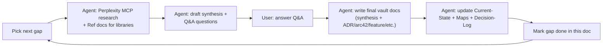
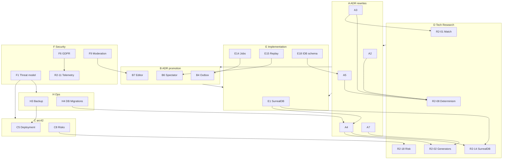

# Wave 3 Gap Analysis and Execution Backlog

> **Superseded 2026-05-22.** This document is no longer the active backlog of
> record. [[Documentation-V1]] classifies and closes
> the documentation-level gap state. Keep the W3 IDs here for traceability only.
> Do not open implementation work from this document unless a current issue,
> accepted ADR, approved GDDR or current implementation spec re-promotes it.

> **MVP scope amendment (2026-05-18):** Gap **D5** onboarding research below
> records the 2026-05-17 Q&A outcome. For current MVP product scope, prefer
> [[MVP-Scope]], [[GD-0017-mvp-scope-and-mode-sequencing]]
> and [[onboarding-strategy]]: Roguelite playable first; Career visible as
> "comes later"; hybrid-online authority (not full offline-first onboarding).

> This is the **plan-of-record** for completing the project's starting
> documentation and architecture. After Wave 1 (competitor + IP +
> PWA-offline research) and Wave 2 (game design + bounded contexts + 7
> proposed ADRs) the vault has a strong product/design layer, but most
> architecture, implementation, security, ops and product-business
> documentation is still stub-level. Wave 3 catalogues every remaining
> gap, prioritises it P0-P3 and defines the per-gap workflow.

## 1. Why this exists

The vault's purpose is to be **durable project memory**
([[vault-governance]]). A 5-line stub ADR or a 1-sentence
arc42 chapter cannot drive implementation. Wave 3 closes the gap between
"we made a decision" and "an agent can implement it from the vault
alone".

Wave 3 also absorbs the 19 already-listed technical research items
([[research-wave-2-gaps]] R2-01..R2-19) under group **D** below, so we
have one backlog of record.

## 2. Methodology

Gaps were identified by auditing:

- Every accepted/draft ADR in [[../10-Architecture/09-Decisions/]].
- Every arc42 chapter under [[../10-Architecture/]].
- Every implementation note under [[../30-Implementation/]].
- The "Future-scope notes" sections inside the 25 Wave-2 game-design notes
  under [[../50-Game-Design/]].
- The pre-existing R2-01..R2-19 backlog in [[research-wave-2-gaps]].
- The Project Goals + Glossary + Current-State indexes for missing
  product / business / operations content.

The result is **123 gap entries** across twelve groups (A-L). Each entry
follows a fixed template so it can be executed gap-by-gap without
re-opening this document.

## 3. How to read this document

Gap IDs are stable. Each ID maps to a single execution session (or a
small batch). When a gap is executed:

1. Read the entry below.
2. Run the listed Perplexity / Ref research.
3. Draft synthesis + the Q&A questions for Nico.
4. Get Nico's answers.
5. Write the listed output files.
6. Update [[Current-State]] and maps so future agents reach
   the new material.

When a gap is **done**, append "(done YYYY-MM-DD)" to its title and add
a "Done outputs" line listing the final vault paths.

## 4. Per-gap workflow (agent-led)



### Per-gap entry template (fixed)

Every entry below uses the following template:

- **Priority**: P0 / P1 / P2 / P3
- **Why now**: 1-2 lines explaining why this matters.
- **Scope**: 3-6 bullets describing what is in scope.
- **Research questions**: 3-6 questions to send to Perplexity / Ref.
- **Q&A questions for Nico**: 2-4 questions that need a product owner
  decision.
- **Output files**: vault paths the gap produces or updates.
- **Promotes / supersedes**: ADRs / notes that are promoted or
  superseded when the gap is done.
- **Dependencies**: other gap IDs that must complete first (if any).
- **Estimated effort**: S (≤ 1 session), M (1-2 sessions), L (multiple
  sessions).

## 5. Prioritisation legend

| Priority | Meaning |
|---|---|
| **P0 - Critical / Blocking** | Blocks an accepted ADR, a milestone start (M2-M8), or has a hard real-world deadline (legal / GDPR) |
| **P1 - High** | Unblocks a draft ADR rewrite or an arc42 chapter that future agents read for orientation |
| **P2 - Medium** | Improves clarity, reduces tech debt, expected before public beta |
| **P3 - Nice-to-have** | Post-MVP polish or operational maturity |

## 6. Gap catalogue

### A. ADR depth rewrites (Wave 1 stubs)

Rewrite each Wave-1 ADR from a 5-20 line stub to a full Decision Record:
**Context → Drivers → Options Considered → Decision → Consequences →
Compliance → Sources**.

#### A1. ADR-0001 Tech Stack — depth pass

- **Priority**: P1.
- **Why now**: [[ADR-0001-tech-stack]] is 8 lines today. Every subsequent ADR references the stack but the trade-offs that pinned it are not documented.
- **Scope**: Rewrite the ADR with full context (offline-first PWA, IP-clean, agent-friendly CI), considered alternatives (Next.js, Remix, Astro, Phoenix LiveView, native Capacitor-first), decision, consequences per layer, compliance rules.
- **Research questions**: 2026 status of TanStack Start beta API stability; current shadcn/ui release model; SurrealDB 2.x stability + migration story; Biome 2.x parity vs Prettier; pnpm 10.x workspace patterns.
- **Q&A questions for Nico**: Lock TanStack Start as the SSR framework or keep a fallback? Pin SurrealDB version range? Allow Bun/Deno experiments or pnpm-only?
- **Output files**: rewrite [[ADR-0001-tech-stack]] to `status: accepted`.
- **Promotes / supersedes**: promotes itself from `draft` to `accepted`.
- **Dependencies**: none.
- **Estimated effort**: M.

#### A2. ADR-0002 Offline-first — depth pass (done 2026-05-16)

- **Priority**: P0.
- **Why now**: Drove every save / sync decision but only 12 lines.
- **Q&A outcome (2026-05-16)** — Perplexity research + Nico locked six decisions in addition to the upstream locks from B2 / D8 / A4 / A5 / B4:
  - **SW tooling**: `vite-plugin-pwa` with `injectManifest` (custom SW + Workbox 7 plugins).
  - **Update strategy**: **hybrid smart** — auto-`skipWaiting` if no in-progress state (match in progress, draft transfer, active watch-party); `workbox-window` prompt otherwise.
  - **Outbox replay triggers**: cross-browser primary (startup + `online` event + `visibilitychange`) + Chromium-only `BackgroundSyncPlugin` as optional accelerator + post-MVP Web Push sync-hint for installed PWAs.
  - **Storage budget**: soft cap ~300 MB; warn at 70% of `navigator.storage.estimate().quota`; encourage export of saves > 6 months old; `navigator.storage.persist()` on Chromium/Firefox; iOS treated as fragile (no-op).
  - **Install UX**: never on first load; surface after first match completed OR first save created + ≥ 3 sessions; dismissible card with 7-day snooze; quota-warning override copy; manifest + icons spec'd; iOS Share→Add-to-Home-Screen guide for Safari.
  - **Outbox visibility**: dedicated Sync/Activity view + nav badge + `setAppBadge()` + non-modal banner on hard-reject + Recreate shortcut; transient errors retry with `0/10s/30s/2min/5min` exponential backoff cap at 7; hard-reject business errors never auto-retry; per-`rejected_with_reason` copy table.
- **Output files**: rewrote [[ADR-0002-offline-first]] from 12-line stub to full Decision Record (8 decision rules + capability matrix + Workbox config + manifest + Compliance + CI enforcement, ~14 KB).
- **Done outputs**: [[ADR-0002-offline-first]] (accepted).
- **Promotes / supersedes**: ADR-0002 promoted from `draft` to `accepted`.
- **Dependencies**: D8 (done), B2 (done), A4 (done), A5 (done), B4 (done). D11 (telemetry/privacy) still open.
- **Estimated effort**: M (actual: M).

#### A3. ADR-0003 Match Engine — depth pass (done 2026-05-16)

- **Priority**: P0.
- **Why now**: Match engine is the heart of the product; current ADR was 10 lines.
- **Q&A outcome (2026-05-16)** — Perplexity research + Nico locked three remaining decisions on top of the D1 + D8 + A4 + B2 lockdowns:
  - **Formation zone weights authoring**: TS literal in `packages/match-engine/src/data/formations/` as canonical source-of-truth + JSON-based community override packs (per ADR-0016).
  - **Set-piece routines**: hybrid delivered incrementally - MVP = canonical TS-literal library (~15-25 routines) exposed as dropdowns at all UI tiers; Phase 2 = per-club editor for Expert tier with replay-embedded routine definitions; community packs add library-grade routines.
  - **Routine + formation ID naming**: namespaced slug pattern (`category/name` for core, `mod.<pack>.category/name` for community, `club:<id>.<slug>` for per-club, `n-n-n` for formations, short uppercase for roles). Stable IDs forever; semantic changes = new ID + compatibility stub.
- **Output files**: rewrote [[ADR-0003-match-engine]] from 10-line stub to full Decision Record (9 decision rules + package layout + public API + Consequences + Compliance + CI enforcement, ~12 KB).
- **Done outputs**: [[ADR-0003-match-engine]] (accepted).
- **Promotes / supersedes**: ADR-0003 promoted from `draft` to `accepted`.
- **Dependencies**: D1 (done), D8 (done), A4 (done), B2 (done), A5 (done), A2 (done), B7/ADR-0016 (proposed).
- **Estimated effort**: S (actual: S).

#### A4. ADR-0004 Data Model — depth pass (done 2026-05-16)

- **Priority**: P0.
- **Why now**: Every bounded context needs a schema. Current ADR was 11 lines; schemas live nowhere yet.
- **Q&A outcome (2026-05-16)** — Perplexity research + Nico locked all four open questions:
  - **Save quotas**: soft UX limit (10 active) + archive flow + server-side hard cap (50 total per user). No tiering at MVP.
  - **Schema generator**: custom TS-first generator in `packages/db-schema` emits `.surql` + Zod + TS types. CI gate `pnpm db:generate && git diff --exit-code` blocks drift.
  - **Cloud-sync format (Phase 2)**: hybrid — initial encrypted full snapshot per device + encrypted incremental ops + periodic checkpoints (every 100 deltas or 5 MB). Save-level content key wrapped per member for shared MP saves.
  - **Women's football additivity**: structured `gender_eligibility` set on player + `gender_restriction` enum on competition + season calendar lives on competition (not gender). Supports women's, men's, mixed, open, junior open and future non-binary edge cases without migration redesign.
- **Output files**: rewrote [[ADR-0004-data-model]] from 11-line stub to full Decision Record (9 decision rules + Consequences + Compliance + CI enforcement).
- **Done outputs**: [[ADR-0004-data-model]] (accepted; 8 KB of binding decisions covering storage topology, schema strategy, generator, relationships, numeric representation, save lifecycle, identity model, cross-context coordination, forward additivity).
- **Promotes / supersedes**: ADR-0004 promoted from `draft` to `accepted`.
- **Dependencies**: D14 (done), D8 (done), B2 (done), B4 (done). D2 (R2-02 procedural generators) and D13 (R2-13 women's football) remain as separate gaps but the schema is now additive-safe for them.
- **Estimated effort**: M (actual: M).

#### A5. ADR-0005 Save Format — depth pass (done 2026-05-16)

- **Priority**: P0.
- **Why now**: Saves are versioned but the format and migration policy were unspecified beyond 17 lines.
- **Q&A outcome (2026-05-16)** — Perplexity research + Nico locked the two remaining open questions:
  - **Export model**: two explicit export modes - **'Device backup'** (account-secret + device-salt key, auto-restores when signed in) + **'Portable export'** (user-supplied passphrase + per-export salt, shareable, "forgot = lost" UX). Matches Bitwarden / 1Password / Obsidian Sync / Standard Notes industry norms.
  - **KDF**: PBKDF2-SHA256, **600 000 iterations** (OWASP 2026 minimum), 32-byte random salt per export. Web Crypto native, no bundle cost. Argon2id rejected (~30-50 KB WASM bundle for marginal gain).
  - **Compression**: `CompressionStream('gzip')` only - native cross-browser (Chromium/WebKit/Firefox), zero bundle, Web-Worker compatible, ~70-80% reduction. Pipeline: `JSON → gzip → AES-GCM-encrypt`. Envelope carries `compression: 'gzip'` for future swap.
  - **Versioning**: three independent version fields - `envelopeVersion` (envelope format), `saveVersion` (payload shape), `engineVersion` (per D8 deterministic replay). Phased rename pattern per A4 §6.3; old-engine dynamic-import for legacy save replay.
- **Output files**: rewrote [[ADR-0005-save-format]] from 17-line stub to full Decision Record (11 decision rules + restore flowcharts + Consequences + Compliance + CI enforcement).
- **Done outputs**: [[ADR-0005-save-format]] (accepted; ~12 KB binding decisions covering envelope schema, encryption with AAD-bound header, KDF detail, compression-then-encrypt pipeline, RNG state snapshot per D8, three-version migration model, restore + import flows).
- **Promotes / supersedes**: ADR-0005 promoted from `draft` to `accepted`.
- **Dependencies**: D8 (done), B2 (done), A4 (done).
- **Estimated effort**: S (actual: S).

#### A6. ADR-0006 i18n — depth pass

- **Priority**: P1.
- **Why now**: i18n choice is locked but copy strategy, namespace policy, tone guide are missing.
- **Scope**: i18next config, namespace strategy (per route group), lazy-load patterns under TanStack Start, ICU MessageFormat, de-DE primary tone vs en-GB fallback, Intl API usage.
- **Research questions**: i18next vs FormatJS vs lingui bundle sizes in 2026; TanStack Start SSR + lazy translations; football vocabulary tone references (Anstoss humour vs FM dry register).
- **Q&A questions for Nico**: Default tone for de-DE (Anstoss tabloid vs dry)? Translation workflow (in-house, community, or contracted)? RTL languages in scope?
- **Output files**: rewrite [[ADR-0006-i18n]]; new [[../30-Implementation/i18n-and-tone-guide]].
- **Promotes / supersedes**: promotes ADR-0006 to `accepted`.
- **Dependencies**: D10 (R2-10), D15 (R2-15).
- **Estimated effort**: M.

#### A7. ADR-0007 Naming Schema — depth pass

- **Priority**: P1.
- **Why now**: IP-clean is mission-critical and the current ADR is 11 lines.
- **Scope**: Document algorithmic name generation, denylist + bloom-filter pipeline, heraldic crest synthesiser, league + currency analogues, scenario pack import rules (community vs core).
- **Research questions**: Behind-the-Name CC BY-SA viral risk in build pipeline; Wikidata bloom filter size + FP rate; SVG heraldry generators (`svg.js`, `paper.js`, `@svgdotjs/svg.js`); recent IP cases (Manchester United v Sega 2020, Mishcon de Reya FM analysis).
- **Q&A questions for Nico**: Hard denylist (real club names + permutations) or also soft denylist (sound-alikes)? Scenario pack opt-in disclaimer wording? Crest style (heraldic vs modernist vs hybrid)?
- **Output files**: rewrite [[ADR-0007-naming-schema]]; new [[data-generators]] (per R2-02).
- **Promotes / supersedes**: promotes ADR-0007 to `accepted`.
- **Dependencies**: D2 (R2-02).
- **Estimated effort**: L.

#### A8. ADR-0008 Mobile-first UI — depth pass

- **Priority**: P1.
- **Why now**: The 3-tier progressive disclosure decision needs a concrete UI architecture.
- **Scope**: Document route inventory, navigation pattern (bottom-nav / drawer / hub-tile), shadcn/ui primitives in scope at MVP, design tokens, WCAG 2.2 AA commitments, touch targets, motion preferences.
- **Research questions**: TanStack Router file-based routing patterns at scale; bottom-nav vs drawer mobile FM patterns in 2026; shadcn/ui touch + a11y posture; WCAG 2.2 vs BITV 2.0 differences.
- **Q&A questions for Nico**: Bottom nav or hub-tile home? Dark mode at MVP or Phase 2? PWA install prompt UX?
- **Output files**: rewrite [[ADR-0008-mobile-first-ui]]; new [[../30-Implementation/mobile-ux-ia-a11y]] (per R2-07).
- **Promotes / supersedes**: promotes ADR-0008 to `accepted`.
- **Dependencies**: D3 (R2-03), D5 (R2-05), D7 (R2-07), D16 (R2-16), D17 (R2-17).
- **Estimated effort**: L.

#### A9. ADR-0009 Cursor Orchestration — depth pass

- **Priority**: P2.
- **Why now**: Operational rather than gameplay-critical; needs updating once analytics + telemetry decisions land.
- **Scope**: Document Cursor IDE + Cloud + CLI integration, hooks, Bugbot review gates, Linear linkage, MCP servers in use.
- **Research questions**: Cursor 2026 hook / MCP ecosystem updates; Bugbot review rules patterns; Linear MCP cleanup.
- **Q&A questions for Nico**: Any new MCP servers to enable (Datadog, Sentry, Slack)? Auto-merge policy for Cursor agents?
- **Output files**: rewrite [[ADR-0009-cursor-orchestration]].
- **Promotes / supersedes**: promotes ADR-0009 to `accepted`.
- **Dependencies**: D11 (R2-11).
- **Estimated effort**: S.

### B. ADR promotion (Wave 2 proposed → accepted)

Each Wave-2 ADR is currently `proposed`. Promotion is a small per-ADR
session: re-read, refine if Nico asks, then flip status to `accepted` and
update [[Decision-Log]].

#### B1. Promote ADR-0010 Modular Monolith + DDD (done 2026-05-16)

- **Priority**: P0.
- **Why now**: Foundational architecture decision; everything else depends on bounded contexts being agreed.
- **Scope**: Read ADR with Nico, accept or refine bounded-context list, decide on `domain/` folder convention, accept.
- **Q&A questions for Nico**: Confirm 11 bounded contexts? Any context to split / merge?
- **Q&A outcome (2026-05-16)**:
  - All 11 contexts accepted as-is.
  - Strict storage isolation accepted (no cross-context table reads).
  - Nico raised the bar: **maximum service-architecture readiness** —
    deploy as monolith for MVP but design every context's contract as
    if it were a separate service. Service extraction must be a
    deployment change, not a refactor.
- **Output files**: ADR-0010 status flipped `proposed` → `accepted`; ADR title widened to "Service-ready Modular Monolith"; [[bounded-context-map]] revised with strict storage rule + service-extraction order; [[Decision-Log]] + [[Architecture-Map]] + [[Current-State]] updated.
- **Done outputs**: [[ADR-0019-modular-monolith-ddd]] (accepted); [[bounded-context-map]] (status: current).
- **Dependencies**: none.
- **Estimated effort**: S (actual: S).

#### B2. Promote ADR-0011 Server-Authoritative Multiplayer (done 2026-05-16)

- **Priority**: P0.
- **Why now**: Trust model for multiplayer; required before any MP feature work.
- **Q&A questions for Nico**: Singleplayer locally authoritative (yes by default) - confirm. Are there hybrid scenarios (e.g. hotseat)?
- **Q&A outcome (2026-05-16)**:
  - **Hotseat**: local-authoritative on device; a hotseat save can later
    be **promoted** into an async MP group via a one-way handoff with
    server-side integrity validation. From the moment the save is
    accepted server-side, that club's truth lives on the server; the
    device save becomes read-only for the promoted club. No demote
    path.
  - **AI vs AI matches**: Perplexity research applied →
    **hybrid server-sim + on-demand re-simulation**. Server simulates
    every fixture with the same deterministic engine contract and a
    relevance-based quality profile. Human-involving matches store the
    full event log. AI vs AI matches store
    `seed + lineups + tactics + qualityProfile + summary` and re-simulate
    deterministically on demand when a watch-party or audit requests the
    full log.
  - **Save integrity**: saves are encrypted at rest with AES-GCM 256 via
    Web Crypto; key derivation PBKDF2 from account secret + device salt.
    Tampering breaks the save.
  - **Offline conflict**: hard-reject with `rejected_with_reason` + show
    new state. No auto-rebase at MVP.
- **Output files**: ADR-0011 flipped `proposed` → `accepted` with all four edge cases encoded; [[match]] persistence extended with `engine_version`, `match_type`, and the AI vs AI seed-only storage policy; [[Decision-Log]] + [[Architecture-Map]] + [[Current-State]] updated; gap A5 + D12 entries updated with locked-from-B2 constraints.
- **Done outputs**: [[ADR-0011-server-authoritative-multiplayer]] (accepted), [[match]] (extended persistence schema).
- **Dependencies**: B1 (done).
- **Estimated effort**: S (actual: S; Perplexity research subroutine added ~15 min).

#### B3. Promote ADR-0012 Async Cadence Models

- **Priority**: P1.
- **Why now**: Defines the dual cadence (Fixed + Dynamic) that the league state machine respects.
- **Q&A questions for Nico**: Confirm default = Fixed Cadence. Confirm season-boundary switch policy.
- **Output files**: flip status; update Decision-Log.
- **Dependencies**: B1, B2.
- **Estimated effort**: S.

#### B4. Promote ADR-0013 Transactional Outbox (done 2026-05-16)

- **Priority**: P0.
- **Why now**: Domain-event reliability is foundational; many downstream features depend on it.
- **Q&A questions for Nico**: Outbox table in SurrealDB or separate queue (Redis Streams)? Retention policy?
- **Q&A outcome (2026-05-16)** - all five Perplexity-backed recommendations accepted:
  - **Storage backend**: SurrealDB outbox (atomic with state) + Redis Streams (rebuildable hot fan-out buffer with consumer groups). Fallback = pure SurrealDB outbox if Redis proves problematic.
  - **Retention**: tiered hot 60 days + monthly-partitioned cold archive forever. Outbox is the audit trail. ~10 GB/year storage on Hetzner.
  - **Idempotency**: UUIDv7 event IDs + separate correlation-id; consumer-side `consumer_event_offset` table; 60-day prune.
  - **Schema versioning**: JSON + Zod + forward-compat. Optional `schema_version` metadata. No Avro/Protobuf registry; no per-version handlers; no per-version event types.
  - **Backpressure**: time-based lag alerts (warning >1 min, critical >5 min) + count fallback (>10k). MVP = monitoring only; soft backpressure only if real overload observed.
- **Output files**: ADR-0013 flipped `proposed` → `accepted` with full pipeline + table schema + envelope + observability spec; gap E14 (jobs) gets full implementation scope; gap E1 (SurrealDB integration) gets outbox-table + claim-by-CAS pattern; gap F10 (audit trail) gets "outbox IS the audit trail" lock; gap D14 (SurrealDB schemas) gets outbox-table + `consumer_event_offset` + archive partition policy.
- **Done outputs**: [[ADR-0013-transactional-outbox]] (accepted).
- **Dependencies**: B1 (done).
- **Estimated effort**: S (actual: M; Perplexity research subroutine produced strong recommendations that warranted full documentation).

#### B5. Promote ADR-0014 State Machines

- **Priority**: P1.
- **Why now**: Locks the "no ad-hoc booleans" rule.
- **Q&A questions for Nico**: TypeScript discriminated-union or external library (XState)?
- **Output files**: flip status; update Decision-Log.
- **Dependencies**: B1.
- **Estimated effort**: S.

#### B6. Promote ADR-0015 Spectator Snapshot Streaming

- **Priority**: P2.
- **Why now**: Drives watch-party + replay architecture, but only matters once async multiplayer is implemented.
- **Q&A questions for Nico**: Confirm separate spectator service; default delay value (15 / 30 / 60 s)?
- **Output files**: flip status; update Decision-Log; informs E15.
- **Dependencies**: B2, B4.
- **Estimated effort**: S.

#### B7. Promote ADR-0016 Community Dataset Overrides

- **Priority**: P2.
- **Why now**: Editor design is locked but pack file format + manifest must be approved before implementation.
- **Q&A questions for Nico**: Pack distribution = file-only (no marketplace) - confirm. Optional signature scheme?
- **Output files**: flip status; update Decision-Log; informs E22 + F9.
- **Dependencies**: A4 (data model).
- **Estimated effort**: S.

### C. arc42 chapter completion

Each chapter currently 5-20 lines; expand to a real chapter with
subsections, diagrams and links to ADRs.

#### C1. arc42-01 Introduction — full chapter

- **Priority**: P1.
- **Scope**: Goals (offline-first manager, async friend leagues, fictional universe), stakeholders (player, manager / coach, sponsor, board, fans), out-of-scope, requirements overview, quality goals.
- **Research questions**: arc42 7.0 template conventions; sample managers' GDDs structure.
- **Q&A questions for Nico**: Primary stakeholder ranking? Any non-player stakeholders (publishers / press / community)?
- **Output files**: rewrite [[01-Introduction]].
- **Dependencies**: G1 (mission expansion).
- **Estimated effort**: M.

#### C2. arc42-02 Constraints — full chapter

- **Priority**: P1.
- **Scope**: Technical (offline-first PWA, TypeScript strict, pnpm, Biome, no real-IP), organisational (small team, agent-led), regulatory (GDPR, DMA / sport governance), legal (IP).
- **Research questions**: 2026 PWA store policies (Apple App Store, Google Play); GDPR + ePrivacy current state.
- **Q&A questions for Nico**: Any constraints to add (team size, budget, target launch date)?
- **Output files**: rewrite [[02-Constraints]].
- **Dependencies**: F6 (GDPR).
- **Estimated effort**: M.

#### C3. arc42-03 Context — full chapter

- **Priority**: P1.
- **Scope**: Business context (player, league host, community modder, sponsor for press kit), technical context (client PWA, server functions, SurrealDB, OS push services, optional Discord webhooks).
- **Q&A questions for Nico**: Any third-party integrations to declare now (e.g. Discord, Twitch, paid analytics)?
- **Output files**: rewrite [[03-Context]] with mermaid context diagrams.
- **Estimated effort**: M.

#### C4. arc42-04 Solution Strategy — full chapter

- **Priority**: P1.
- **Scope**: Top-level decisions table (modular monolith / DDD / offline-first / server-authoritative MP / progressive disclosure UI), trade-offs, ADR pointers.
- **Output files**: rewrite [[04-Solution-Strategy]].
- **Dependencies**: B1-B7.
- **Estimated effort**: M.

#### C5. arc42-07 Deployment — full chapter

- **Priority**: P0.
- **Why now**: Need a clear deployment topology before M2 starts producing artifacts.
- **Scope**: Environments (dev / staging / prod), Dokploy on Hetzner setup, secrets (sops + age + direnv), CI/CD pipeline, container registry, runtime workers (match worker, scheduler), zero-downtime deploy.
- **Research questions**: Dokploy 2026 features; sops + age workflow in CI; Workbox build integration with Vite + TanStack Start.
- **Q&A questions for Nico**: Number of envs (dev only? + staging?). Any non-Hetzner targets (Vercel preview, Cloudflare)? Native build pipeline (post-MVP)?
- **Output files**: rewrite [[07-Deployment]]; update [[deployment-dokploy]].
- **Dependencies**: E10 (CI/CD).
- **Estimated effort**: L.

#### C6. arc42-08 Crosscutting Concerns — full chapter

- **Priority**: P1.
- **Scope**: Logging, errors, security baseline, accessibility (WCAG 2.2 AA / BITV 2.0), performance budgets, observability, PWA update strategy, internationalisation.
- **Output files**: rewrite [[08-Crosscutting]].
- **Dependencies**: F1 (threat model), F11 (secrets).
- **Done 2026-05-17**: [[08-Crosscutting]] rewritten with ADR-0017 logging/observability rules, error taxonomy, telemetry privacy links, metrics/alerts, PWA/offline constraints and security baseline. F1/F11 can still deepen threat-model and secrets specifics later.
- **Done outputs**: [[08-Crosscutting]], [[ADR-0017-observability-logging]].
- **Estimated effort**: L.

#### C7. arc42-10 Quality — full chapter

- **Priority**: P1.
- **Scope**: Quality goals (offline reliability, save durability, MP fairness, accessibility, performance, IP cleanliness), quality scenarios per goal, metrics, gates.
- **Output files**: rewrite [[10-Quality]].
- **Dependencies**: E11 (test strategy), D9 (R2-09 perf).
- **Estimated effort**: M.

#### C8. arc42-11 Risks — full chapter

- **Priority**: P1.
- **Scope**: Full risk register: technical (TanStack Start beta, SW eviction), legal (IP, GDPR), product (MP balance, casual/expert tension), operational (agent reliability).
- **Output files**: rewrite [[11-Risks]].
- **Dependencies**: D18 (R2-18 risk register research).
- **Estimated effort**: M.

### D. Technical research (R2-01..R2-19)

Each entry below corresponds 1:1 to an R2-xx item in
[[research-wave-2-gaps]]. The Wave 2 doc is preserved for traceability;
its IDs are mirrored here verbatim. Wave 3 adds explicit per-gap research
+ Q&A.

#### D1. R2-01 Deterministic match-engine simulation model (done 2026-05-16)

- **Priority**: P0.
- **Q&A outcome (2026-05-16)** — Perplexity research + Nico locked six decisions:
  - **Simulation model**: hybrid Markov + attribute rolls. Macro Markov chain over `{teamInPossession, zoneId, phase, pressureLevel}` decides event type + target zone; micro attribute-vs-attribute integer contests resolve outcomes.
  - **Tick granularity**: per-event with integer-second `simClock` jumps; event durations sampled from typed ranges (passes 3-10s, set pieces 20-40s, etc.); clamped at period boundaries; UI derives per-minute via `floor(sim_clock_s/60)`.
  - **Event schema**: required core (id, match_id, engine_version, sim_clock_s, duration_s, period, event_type, outcome, team_id, player_ids, start/end_pos in integer mm, start/end_zone_id) + typed optional payloads (Pass/Shot/Duel/Foul/Card/SetPiece/Sub/TacticalChange/Injury/Misc) + optional delta-encoded `tactical_context`.
  - **Formation interaction**: hybrid zone + role influence. Per-player zone influence weights (attacking/defending/pressing/support) from formation+role+duty+instructions+traits, aggregated to per-zone team scores; per-zone deltas modulate Markov transition probabilities + attribute roll thresholds. Recomputed at kickoff, tactical_change, substitution only.
  - **RNG separation**: strict - `MatchCoreRng` for physics (Markov + attribute rolls + duration sampling + injuries), `MatchAiRng` for in-match AI tactical decisions (subs, formation tweaks, time-wasting). Allows AI refactor without perturbing physical event sequences.
  - **Test pyramid**: full - unit (95% coverage of pure functions) + integration (single-possession sims, fast-check determinism + monotonic tactic properties) + 10 canonical golden replays (covering symmetric / low-block / press mismatch / width mismatch / overload / set-piece / cards / injuries / one-sided / 0-0 stalemate) + statistical envelope tests (1k-5k nightly matches with 0-0 rate 6-10%, avg goals 2.4-3.0, scores in 0-3 range 80-90%, formation effect directionality) + CI perf gate (≤ 50 ms hard / 30-40 ms soft alert).
- **Output files**: new [[match-engine-simulation-model]] research note (status: current, binding: true). 14 KB with locked simulation model, time model, event schema (~10 typed payloads), formation influence algorithm, test pyramid, three-phase implementation roadmap.
- **Done outputs**: [[match-engine-simulation-model]] (locked decisions ready to paste into A3 + E11 + E13 + I8).
- **Dependencies**: D8 (done), A4 (done).
- **Estimated effort**: L (actual: L).

#### D2. R2-02 Player & club generator algorithms (done 2026-05-17)

- **Priority**: P0.
- **Why now**: Fundamental for every downstream system (scouting, youth, transfer market, async-MP). Must lock IP-safe naming + procedural worldgen before any feature work can land. ADR-0007 had been a 10-line stub since Wave 1.
- **Q&A outcome (2026-05-17)** — Perplexity research (4 deep dives: name-gen algorithms + corpora + legal-safe sources, heraldic SVG crest grammar, club tier model + Country × Tier finance matrix + stadium / prestige formulas, player attribute taxonomy + generation pipeline + lazy-expansion strategy) plus comparative analysis across FM / FM Mobile / Anstoss random worlds / Hattrick / Top Eleven / OSM / SM24 / EA FC Career / Champ Man, plus 8-question Q&A with Nico:
  - **Locale list at MVP**: 7 Tier-1 buckets (DACH, British Isles, France, Spain, Italy, Low Countries, Lusophone). Tier-2 post-MVP: Nordic, Eastern Europe, Hispanic LATAM, Turkey, Asia (JP/KR/CN), Arabic, Africa (3 buckets).
  - **Name generation algorithm**: hybrid wordlist (Wikidata CC0 + national open-data) + phonotactic fallback. Per-locale composition rules at MVP: Spanish two-surname, Portuguese particles, Dutch tussenvoegsel, German "von" with low probability.
  - **Crest generation**: grammar-based hybrid (7 shields × 8 divisions × 10 region-biased palettes × 40-50 charges × 4 borders × 3 banners → ~5 M unique crests). Pure TS → SVG (no WebGL, no 3D per D9). Lazy generation: `CrestDesign` struct (~6 bytes) stored at world-gen; SVG rendered + cached on first display.
  - **Crest icon source**: custom ~40-icon library inlined as TS path strings, restyled from Game-Icons.net (CC-BY 3.0 with attribution) + Heroicons / Tabler (MIT).
  - **City naming**: "real-region + fictional city" policy. GeoNames CC-BY 4.0 for real regions; fictional cities via phonotactic recombination of region-typical syllables; Bloom-filter rejection of real GeoNames cities.
  - **Club tier model**: 5 tiers + 10-country starting Country × Tier matrix (DE / EN / ES / IT / FR / PT / NL / BR / AR / JP); log-normal money; prestige formula clamped 0-100.
  - **Player attribute schema**: 16 visible (7 Technical + 5 Mental + 4 Physical) + 4 GK-only extras + 8 hidden meta on 1-20 scale. FM Mobile-style simplification.
  - **Player generation**: hybrid archetype-first + CA budget Dirichlet allocator across ~50 archetypes (sweeper keeper, ball-playing CB, inverted FB, deep-lying playmaker, box-to-box CM, inside forward, poacher, target man, etc.). **Lazy expansion** for Tier C players (~85-90 % of total) — store 12-byte compact profile; expand to full attributes on demand. Big perf + storage trick.
- **Locked from D8 §2.3**: adds **RNG stream #9 `GeneratorRng`** with hierarchical sub-labels; label-derived seeding means no existing replay is invalidated (D8 future-proof property exercised for the first time).
- **Locked from D9**: fits ≤ 8 s Large-world genesis budget on Snapdragon 695 via lazy expansion + dedicated Web Worker. IndexedDB delta ≤ 25 MB for Large world.
- **Locked from ADR-0004**: SCHEMAFULL `player` + `club` schemas already in place; D2 fills generation logic only, no schema changes needed.
- **Best-of-competitors techniques adopted**: wordlist-based name gen with cultural rules (FM, FIFA, Hattrick); CA/PA split with hidden potential (FM newgens); archetype-first player generation (FM's role+duty model); lazy expansion (Hattrick server-side, adapted to client-side via determinism); Country × Tier finance matrix (FM real-world data + Anstoss random worlds); log-normal money distributions (real economics); hierarchical seed derivation (modern PRNG practice).
- **Our unique style**: Wikidata CC0 + GeoNames CC-BY 4.0 IP-safe corpus (legal-cleanliness as marketing differentiator); region-biased crest grammar with cultural priors (nobody else does this well); procedural crests as a polish point rather than afterthought; lazy expansion enables client-side feasibility without burning IndexedDB.
- **Output files**: wrote [[data-generators]] (new, 15-section binding research note with full Country × Tier matrix, ~50-archetype library, complete pipeline spec). Promoted [[ADR-0007-naming-schema]] from 10-line stub to full Decision Record (13 decision rules + CI enforcement + IP compliance contract). Updated [[determinism-and-replay]] §2.2 (added stream #9) + §2.3 (exercised future-proof property).
- **Promotes / supersedes**: ADR-0007 promoted from `draft` to `accepted`; [[data-generators]] is `current binding`. Future R2 / I-tier items (D13 women's football, D15 narrative content, I4 wonderkid tagging) build on this foundation.
- **Dependencies**: D8 (done), D9 (done), A4 (done), A5 (done), ADR-0007 (was draft).
- **Estimated effort**: L (actual: L).

#### D3. R2-03 Tactics & formation depth on mobile (done 2026-05-17)

- **Priority**: P1.
- **Why now**: D4 (AI manager behaviour) just locked what AI opponents do; D3 is the user-facing counterpart — what the user does to control their own team. Tactics is the single most-played UI of a manager game. Pre-existing `tactics-system.md` GDD was `draft` with attribute-schema mismatch to D2.
- **Q&A outcome (2026-05-17)** — Perplexity research (4 deep dives: mobile-first tactics UX, formation taxonomy + role catalogue + instructions, tactical familiarity + opposition tactics + touchline shouts, competitor analysis) + 8-question Q&A with Nico:
  - **Formations**: **20** total (Nico chose maximum depth) - core 8 (4-4-2 / 4-3-3 / 4-2-3-1 / 3-5-2 / 4-1-2-1-2 Diamond / 5-3-2 / 3-4-3 / 4-5-1) + advanced 12 (4-1-4-1 / 4-2-2-2 / 4-3-2-1 Christmas Tree / 3-4-1-2 / 3-4-2-1 / 4-2-3-1 Wide / 5-4-1 / 4-1-2-3 / 3-3-3-1 / 5-2-3 / 4-4-2 Asymmetric / 4-3-3 DM Pivot).
  - **Roles**: **50** total across 8 position groups (Nico chose FM PC depth) - GK 3 / CB 5 / FB-WB 6 / DM 5 / CM 7 / AMC 6 / Wide-W 7 / ST 8 + 3 cross-position alternates.
  - **Instructions per tier**: 0/6/18 player + 1/5/8 team. Standard player 6 = high-impact; Expert player 18 in 4 groups. Standard team 5 = Mentality + Pressing + Defensive Line + Width + Tempo; Expert team 8 adds Build-up Style + Time-Wasting + Focus of Play.
  - **Mentality**: 5 visible bands + 7 internal steps.
  - **Phase logic**: Standard global only; Expert light per-phase overrides (4 phases × 2-4 overrides).
  - **Familiarity**: full FM-style with squad-continuity factor + new-manager Similarity (Nico's accepted). Single bar 0-100; growth +4/+2/0 training × +3/match × continuity bonus × weekly cap 8; decay 2/wk floor 20; SwitchModifier 1.0-0.6; piecewise penalty curve (0→0.4×, 80→1.0×, 100→1.04×); ContinuityMatchFactor 1.0-0.80; new-manager Similarity (0.5+0.5×Sim) partial carryover.
  - **Tactic slots + presets**: 2/3/3 slots with familiarity + 0/10/50 saved presets per tier.
  - **Opposition tactics**: **3-layer template system** (Nico's refinement) - 8 archetypes + ~25-30 sub-archetype variants (3-4 per main archetype with distinct philosophies) + manager-signature templates per D4's 10 AI archetypes + emergent club character (clubs accumulate historic counter-template fingerprint over manager history). Nobody else does this.
  - **Touchline shouts**: **3 universal** at all tiers (no tier gating, Nico's refinement) - Encourage / Demand More / All-Out Attack. 10-min cooldown, 5-10 min duration, multipliers on mentality/pressing/tempo/discipline. Future shouts (Focus-Regroup, Time-Waste, Tackle Harder) deferred post-MVP.
  - **Tactical predictability penalty**: up to 5 % offensive-effectiveness reduction for 100 % single-tactic usage; counter-templates cancel half. Ties to D4 arms race.
  - **Tactic preset sharing**: URL-encoded share codes per ADR-0016 (TACTIC-<hash>-<base64-LZ-JSON>); local-only at MVP.
- **Locked from D2**: 16+4+8 attribute schema on 1-20 scale (replaces tactics-system.md GDD's incorrect "10+8+10+5 on 1-10" claim as a mechanical fix).
- **Locked from A3**: 20-formation zone-weight authoring (~500-650 unique entries with DRY pattern reuse; fits 80-100 KB bundle).
- **Locked from D4**: 10 AI archetypes drive Layer-3 manager-signature templates.
- **Locked from D9**: touch target 44 × 44 px enforced; per-tier UI complexity matches Quick/Standard/Expert progressive disclosure.
- **Best-of-competitors techniques adopted**: single familiarity bar (FM Mobile); 3 registered tactic slots (FM PC); tap-to-place editing (EA FC Mobile, FM Mobile); bottom-sheet role pickers (modern mobile UI); preset-first formation library (Top Eleven, FM Mobile); segmented controls (Hattrick, OSM); URL share codes (FM community); touchline shouts as morale modifiers (FM).
- **Our unique style**: 3 in-app tiers user can switch (rare; FM has separate Touch vs PC products); touch-first interaction model (better than FM Mobile's drag-drop port); explicit ContinuityMatchFactor + new-manager Similarity (FM has familiarity but mechanics are opaque); 3-layer opposition template system with emergent club character (no competitor surfaces tactical fingerprint per club); tactical predictability penalty; deterministic + replay-stable for global challenge seasons.
- **Output files**: wrote [[tactics-and-formations]] (new, 15-section binding research note: 20-formation taxonomy + 50-role catalogue + per-tier instructions + familiarity formulas + 3-layer opposition system + mobile UX patterns + WCAG accessibility); promoted [[tactics-system]] from `draft` to `approved` with reconciled D2 attribute schema; cross-linked from [[../../50-Game-Design/match-engine]] + [[set-pieces]] + [[progressive-disclosure-ui]].
- **Promotes / supersedes**: locks [[tactics-and-formations]] as `current binding`; promotes [[tactics-system]] from `draft` to `approved`; closes I6 (mentality slider vs bands - locked as 5 visible bands + 7 internal steps) effectively; opens up A8 follow-up (ADR-0008 Mobile-first UI needs to absorb this note's per-tier exposure tables + touch-target rules).
- **Dependencies**: D2 (done), D4 (done), A3 (done), D9 (done), D8 (done).
- **Estimated effort**: M (actual: M).
- **Estimated effort**: M.

#### D4. R2-04 AI manager / opponent behaviour (done 2026-05-17)

- **Priority**: P1.
- **Why now**: Without AI opponents, the match engine has nothing to do. After A3 (match engine) + D2 (data generators) + D9 (perf budgets), AI behaviour was the next P0-equivalent piece — the world has players + clubs + a sim engine but no opponents to populate it.
- **Q&A outcome (2026-05-17)** — Perplexity research (5 deep dives: AI architecture comparison, in-match decisions, out-of-match decisions, competitor analysis, difficulty + world drift + dynasty) plus 8-question Q&A with Nico:
  - **AI architecture**: utility AI core + light FSM situation classifier + heuristic constraints (industry consensus for 2026). Rejected behaviour trees (wrong abstraction), GOAP/HTN (too heavy), ML (bundle bloat + tuning friction), pure rules (brittle).
  - **Personality system**: 8 primary continuous traits [0,1] (`tacticalAttacking`, `pressingPreference`, `youthTrust`, `starPreference`, `transferAggressiveness`, `bargainSeeking`, `riskTaking`, `tinkering`) + 3 derived (`loyalty`, `fitnessFocus`, `wageDiscipline`). Personality drifts ±0.2 over career.
  - **10 manager archetypes** at MVP: Park-the-Bus Pragmatist, Counter-Attacking Reactive, High-Pressing Aggressor, Possession Maestro, Youth Developer, Galáctico Collector, Moneyball Director, Tinkerman, Conservative Stabilizer, Chaos Motivator.
  - **4 difficulty modes** (Easy / Normal / Hard / Sim) — FM-style "constraints + AI optimisation" approach. No AI stat cheats on Normal/Hard/Sim; only Easy gets minor user help. 20-knob per-tier table.
  - **World drift**: moderate explicit mechanics — wage inflation tied to success; progressive FFP; talent diffusion (40 % elite regens spawn at non-elite clubs); tactical arms race with opposition memory; board expectation escalation +1 tier per overperformance season.
  - **Structural events**: Rising Rival every ~5 in-game years (mid-table club gets New Investor + funds boost) + Giant Collapse every ~10 years (top club enters financial crisis, fire-sale).
  - **AI career arcs** full at MVP: job churn 10-20 % / season, retirement at 60-70 via Normal(67, 4), legendary detection (3+ titles or 2+ continentals), rival tracking (user's primary AI rival follows their manager career, not just current club).
  - **Late-game content** phased: 12 dynasty achievements + arms race + expectation escalation at MVP; national team / Hall of Fame / legacy mode post-MVP.
- **Locked from D8**: uses pre-allocated `WorldAiMgmtRng` (stream #2) + `MatchAiRng` (stream #4) with hierarchical sub-labels. New AI sub-systems add labels under existing streams — no schema changes (per D8 §2.3 future-proof property).
- **Locked from A3**: AI lives outside `packages/match-engine/` but invokes via `simulate(input)`; in-match AI runs in the same Web Worker as the match engine.
- **Locked from ADR-0011**: AI-vs-AI matches use seed-only storage + on-demand re-sim via same AI code path. Hot-seat → async-MP promotion uses same `packages/ai-manager/` on server post-MVP.
- **Locked from D2**: AI managers generated per `generator:manager:<id>` sub-label with archetype + jitter; lazy expansion of Tier C managers (compact 16-byte profile) per same pattern.
- **Locked from D9**: out-of-match ~5-6 ms / club / week (700 clubs in 3.5-4.2 s); in-match ~25 ms / match. Bundle target 60-80 KB gzipped.
- **Locked from bounded-context-map**: AI decisions split across League (structural events) + Club (per-club personality + decisions) + Transfer (market mechanics) contexts.
- **Best-of-competitors techniques adopted**: utility AI as core (FM essentially; 4X games); manager personality vector (Anstoss 3 Erni Buntspecht; FM subtler); trigger-based in-match decisions (FM Touchline Tablet; FIFA Career); per-role squad gap analysis (FM); multi-club bid escalation (FM gold standard); job-security as continuous value (FM, Anstoss); wage inflation tied to success (real-world football, FM); progressive FFP (UEFA/DFL).
- **Our unique style**: determinism + replay-stable AI (no competitor guarantees; enables global challenge seasons); per-manager difficulty in shared async-MP worlds (no competitor has this); roguelite mode as built-in dynasty refresh (solves late-game staleness natively); lazy expansion of AI managers; Web Worker-batched weekly tick fitting Snapdragon 695 (desktop competitors take 30-60 s for similar work, we fit ~5 s in a PWA).
- **Output files**: wrote [[ai-manager-behaviour]] (new, 15-section comprehensive research note: AI architecture + personality system + archetype library + out-of-match per-system decisions + in-match decision pipeline + 4-tier difficulty model with 20-knob table + world drift mechanics + AI career arcs + late-game content + determinism + perf budget). Cross-linked from [[tactics-system]], [[mode-manage-a-club-career]], [[bounded-context-map]].
- **Promotes / supersedes**: locks [[ai-manager-behaviour]] as `current binding`; supersedes "AI manager decisions ... detailed in R2-04" pointer in bounded-context-map; resolves the open question from D8 about who consumes `WorldAiMgmtRng` + `MatchAiRng`.
- **Dependencies**: D8 (done), A3 (done), B2/ADR-0011 (done), D2 (done), D9 (done), bounded-context-map (current).
- **Estimated effort**: L (actual: L).

#### D5. R2-05 Strategic onboarding (done 2026-05-17)

> **Historical Q&A (2026-05-17); MVP superseded 2026-05-18 by
> [[GD-0017-mvp-scope-and-mode-sequencing]].** The bullets
> below preserve the original research outcome. Current MVP: Roguelite active,
> Career "comes later", hybrid-online (see [[ADR-0020-hybrid-online-mvp-offline-ready]]).

- **Priority**: P1.
- **Why now**: After locking D2 + D3 + D4 (clubs, players, AI managers, tactics with 20 formations / 50 roles / 18 instructions / 3-layer opposition), the depth becomes a barrier without strong onboarding. Without D5 the simulation is impressive but unapproachable.
- **Q&A outcome (2026-05-17)** — Perplexity research (3 deep dives: FTUE patterns + retention benchmarks + competitor comparison, inbox-as-narrative tutorial + sender voice cards + 12-message arc, feed-cards + Assistant UX + accessibility) + 8-question Q&A with Nico:
  - **FTUE 60-second flow** (Nico's refinement): single experience question PLUS visible "Advanced setup" escape hatch. Default fast path = 4 steps (experience → mode → club → home with first tutorial card); Advanced path = full 5-screen wizard for power users.
  - **Mode picker upfront** (Nico's choice): both Manage-a-Club Career + Create-a-Club Roguelite available from day 0 as launch tiles. Veterans head straight to Roguelite; new players default to Career.
  - **12-message first-season inbox tutorial arc** over 4 in-game weeks; 10-sender cast (4 core: Assistant ~50% / Chairman 15% / DoF 20% / Head Scout 10%; 6 supporting: Head of Youth / Player Agent / Journalist / Sponsors / Family / Anonymous Tips); per-sender voice cards.
  - **Configurable named Assistant Manager** ("Alex" default + 3-5 portrait presets + "No portrait" accessibility option). "Ask Assistant" sticky FAB on key screens. Voice consistent across inbox + coach marks + match commentary + Ask Assistant button.
  - **Feed-card daily action queue** as Home dashboard primary UI (Nico's choice over inbox-primary): 3-5 priority cards per in-game day; Gmail-style swipe semantics (right=complete/open, left=snooze+undo); priority algorithm time-pressure + impact-type + player-behaviour.
  - **Per-difficulty assistant intensity auto-scaling** with user override (Settings → Assistance: Full / Standard / Minimal + Allow auto-handle minor tasks on Easy/Normal).
  - **"While you were away" recap** auto-shown after 7+ in-game days OR 14+ real days absent.
  - **Veteran skip with safety net** (micro-tooltips + Settings reset + auto-detection of struggle).
- **Locked from D9**: PWA install prompt timing (after sessions ≥ 3 + first success + 20 min total playtime); UI tier auto-mapping; touch targets 44 × 44 px.
- **Locked from D4**: 4 difficulty modes + AI archetypes → assistant intensity scaling.
- **Locked from D3**: 3 UI tiers + per-tier tactics complexity → tutorial depth scaling + Quick tier's 5 starter presets (Solid 4-4-2 / Counter-Attack 4-3-3 / High-Pressing 4-2-3-1 / Park the Bus 5-3-2 / Balanced 4-3-3) become the "Choose Playstyle" picker after FTUE.
- **Locked from D2**: world-size presets visible only in Advanced setup wizard; recommended-club logic uses D2's procedural club generation.
- **Locked from Wave 1**: [[club-boss-analysis]] inbox-as-narrative pattern + [[anstoss-series-deep-dive]] sender voice references.
- **Best-of-competitors techniques adopted**: single experience-question FTUE (Top Eleven); recommended-club default (Top Eleven, OSM); inbox-as-narrative tutorial (Anstoss 1-3, Club Boss); named Assistant Manager (FM Mobile, EA FC); coach marks max 2-3 per screen (modern mobile games); feed-card daily action queue (Top Eleven, EA FC objectives); "While you were away" recap (modern returning-user UX); PWA install after first success + 3 sessions (Web.dev best practice); per-difficulty assistant intensity (FM implicit, our explicit); mode unlock progression (Career-first default per Nico).
- **Our unique style**: 3-in-1 silent tier auto-mapping (single question → UI tier + difficulty + recommended-club tier; no competitor does this); Anstoss-style 10-sender inbox cast on mobile (PC-only previously); Gmail-inspired feed-card swipe semantics (novel for genre); explicit soft-transition message ending tutorial at week 4 (no competitor handles tutorial→narrative handover gracefully); mode picker upfront with both available day 0 (Nico's choice; veterans rewarded with agency); per-difficulty assistant intensity + user override toggle (best of FM manual help + casual mobile proactive coach); deterministic + offline-first onboarding works fully offline + PWA prompt timed to first success not session 1.
- **Output files**: wrote [[onboarding-strategy]] (new, 18-section binding research note: full FTUE flow + New Save wizard + 12-message tutorial arc with EN+DE subjects + 10-sender voice cards + Assistant Manager UX + feed-card priority algorithm + tutorial overlay patterns + returning-user recap + accessibility paths + PWA install + achievement celebrations + IndexedDB schema + perf budget + sources). Created [[onboarding-and-tutorial]] (new `approved` GDD; 14 sections). Cross-linked from [[mode-manage-a-club-career]] + [[mode-create-a-club-roguelite]] + [[progressive-disclosure-ui]].
- **Promotes / supersedes**: locks [[onboarding-strategy]] as `current binding`; creates [[onboarding-and-tutorial]] as `approved` GDD; opens A8 follow-up (ADR-0008 Mobile-first UI needs to absorb feed-card + coach mark + halftime modal patterns); opens K1 + K3 follow-ups (player-onboarding docs + tutorial scripts) for full body-copy authoring.
- **Dependencies**: D2 (done), D3 (done), D4 (done), D9 (done), Wave 1 [[club-boss-analysis]] + [[anstoss-series-deep-dive]] (done).
- **Estimated effort**: M (actual: M).

#### D6. R2-06 Late-game / end-game systems (done 2026-05-17)

- **Priority**: P1.
- **Why now**: After locking the user-facing journey D5 → D3 → D4 → A3, the question "what keeps the user playing past season 10?" became blocking. D4 §11 had explicitly deferred national team / Hall of Fame / legacy mode to post-MVP; D6 specifies them. EA FC Career dies ~season 5; FM has 50-year saves; we need to position closer to FM than EA.
- **Q&A outcome (2026-05-17)** — Perplexity research (3 deep dives: continental cups + competition formats, Bundestrainer + manager meta-progression + Make Your Career, ownership transitions + Hall of Fame + Legacy mode + 50-year longevity) + 10-question Q&A with Nico. **All 10 recommendations accepted as-is** — maximum scope locked:
  - **Continental stack**: 3 tiers per continent (Champions Cup / Continental League / Challenge Trophy) + global IFC Club World Masters. IP-safe fictional bodies (IFC / EFC / AFU / APFC / AFA).
  - **Competition format**: classic 32-team groups + knockout at MVP (FM-like, safer AI/UI); Swiss model deferred to Phase 2.
  - **National team mode**: dual-role with 3 engagement levels (Full Control / Match-Only / Light Touch) - FM-depth + PWA ergonomics. Unlock at rep ≥ 75 + (5 seasons OR 3 trophies).
  - **Owner archetypes**: 6 at MVP (Sugar Daddy / Asset Stripper / Foundation-Community / Petrol-State / Murky / Foreign Business) covering anti-staleness + narrative variety + FFP/regulatory hooks.
  - **Bankruptcy / Administration**: include at MVP with Heroic Save path → "Saved the Club" HoF credit.
  - **Hall of Fame**: full 3-layer (Manager per-save + Manager cross-save + Club per-save + Player Legends) - CK3 + Civ + FM combined.
  - **Legacy mode**: 3 options (Chairman / new manager / hard retire) - CK3-style generational continuity.
  - **Cross-save persistence**: full meta-file with 3-tier Legacy perks; meta-only NEVER feeds runtime sim (deterministic-safe per D8 - same seed + same legacy config at gen → byte-identical world).
  - **Make Your Career creator**: full (Background + Coaching Badge + Tactical Specialisation + Nationality + Languages) - FM-proven replayability.
  - **50-year save longevity**: full stack (Career phases UI + generational regens + Year-X events + continental power shifts + Anstoss newspaper archive + records book) - first PWA manager to ship this depth.
- **Locked from D4**: extends D4 §10.4 (Rising Rival + Giant Collapse), §11 (deferred national team / HoF / legacy now specified), §9.5 (legendary detection extended).
- **Locked from D5**: 12 dynasty achievements feed cross-save HoF metadata; Assistant Manager voice carries into post-tournament debriefs.
- **Locked from D8**: cross-save Legacy perks are world-gen-time parameters only (meta-only, never runtime input). Same `worldSeed` + same legacy config at creation → byte-identical world.
- **Locked from D2**: national team eligibility via D2 §10.4 birth + heritage; archetype generation extended to owner archetypes (6 new types added via existing pattern).
- **Locked from ADR-0007**: all continental cup + governing body + national team competition names must be fictional (locked in §3.1-3.2 of [[late-game-systems]]).
- **Best-of-competitors techniques adopted**: 3-tier continental cup stack (UEFA 2021+); classic 32-team groups + knockout (FM / EA FC / PES); country coefficient with 5-year rolling window (UEFA); dual-role club + national team (FM PC / Anstoss 3); Bundestrainer arc (Anstoss 3 iconic feature); 4-year tournament cycles + 2-year continental offset (FIFA + UEFA); manager + club + player legend detection (FM PC); era detection (FM + CK3); 6 owner archetypes (FM + Anstoss); cross-save Hall of Fame (Civ + CK3); Legacy perks (CK3 dynasty); generational regens (FM + The Sims); league reform (CK3 + real football); newspaper archive (Anstoss + FM news); records book (Hattrick + FM); manager creator (FM PC).
- **Our unique style**: CK3-style cross-save Hall of Fame with deterministic-safe Legacy perks (FM has per-save only); 3-engagement-level dual-role for PWA tablet ergonomics (FM only Full Control); 6 data-driven Owner archetypes with explicit user takeover decision points (FM implicit; Anstoss binary); Civ-style career phases UI explicit on timeline (FM emergent); continental power shift era labels explicit on global overview (no competitor surfaces this); Anstoss newspaper + Hattrick records unified (each game has one or other); generational regens with "Son of X" narrative tagging + media headlines (FM has regens but no narrative continuity); deterministic + offline-first entire system enables global challenge seasons with cross-save bragging.
- **Output files**: wrote [[late-game-systems]] (new, 15-section binding research note: continental cup stack design + Bundestrainer arc + Make Your Career creator + 5-branch talent tree + region-based reputation + 6 owner archetypes + bankruptcy / administration + 3-layer Hall of Fame + 3-option Legacy mode + 3-tier cross-save Legacy perks + full 50-year save longevity stack + IndexedDB schemas + perf budget; ~1000 lines). Cross-linked from [[mode-manage-a-club-career]] §7 (Bundestrainer stub now expanded) + [[regulations-and-compliance]] §8 (continental cups now designed).
- **Promotes / supersedes**: locks [[late-game-systems]] as `current binding`; closes D4 §11.2 deferred items (national team dual-role + Hall of Fame + legacy mode + roguelite-mode integration); expands `mode-manage-a-club-career.md` §7 Bundestrainer stub.
- **Dependencies**: D4 (done), D5 (done), D8 (done), D2 (done), A3 (done), D3 (done), ADR-0007 (accepted).
- **Estimated effort**: L (actual: L).

#### D7. R2-07 Mobile UX, IA & accessibility

- **Priority**: P1.
- **Scope**: Route inventory, navigation, shadcn primitives, WCAG 2.2 AA, touch targets.
- **Q&A questions for Nico**: Bottom-nav vs hub-tile? Dark mode at MVP?
- **Output files**: [[mobile-ux-ia-a11y]] (new); updates A8.
- **Estimated effort**: L.

#### D8. R2-08 Determinism, RNG, replay (done 2026-05-16)

- **Priority**: P0.
- **Scope**: Seedable PRNG choice, RNG-stream isolation, replay format, save-determinism rules.
- **Q&A outcome (2026-05-16)** — all locked in [[determinism-and-replay]]:
  - **PRNG**: PCG32 in 32-bit JS (no BigInt). Library: `pure-rand` (TS-first, used by fast-check). Fallback: roll-our-own 30-line PCG32.
  - **RNG streams**: 8 named streams - WorldRng, WorldAiMgmtRng, MatchCoreRng(matchId), MatchAiRng(matchId), WeatherRng, InjuryRng, TransferRng, NewsRng/PresentationRng. Seeded from masterSeed via xxhash32(label, parentSeed). Adding new streams later is safe (no perturbation of existing streams).
  - **Replay format**: hybrid - `(seed, lineups, tactics, qualityProfile, engineVersion)` is canonical truth for every match (already locked in ADR-0011); human-involving matches additionally store the **FULL event log** (every pass/duel/dribble/shot/foul/sub/card/goal/HT/FT, ~5-20 KB/match) for fast UI + audit. AI-vs-AI stays seed-only.
  - **Numeric representation**: integers / basis-points (money in cents, probabilities 0-10000, attributes 0-100, coordinates integer-mm). No transcendental math in deterministic decision logic.
  - **12 save-determinism rules** locked (lint-enforced where possible).
  - **CI determinism gate**: Chromium-only at MVP via Playwright; WebKit + Firefox added in Phase-2 hardening.
- **Output files**: new [[determinism-and-replay]] research note.
- **Done outputs**: [[determinism-and-replay]] (status: current, binding: true).
- **Estimated effort**: M (actual: M).

#### D9. R2-09 Performance budgets on low-end Android & iOS (done 2026-05-17)

- **Priority**: P1.
- **Why now**: arc42 §Crosscutting carried a placeholder "Lighthouse mobile ≥ 90 until D9 defines the full device matrix"; D1 / A2 / D8 had locked the match-engine, storage, and determinism budgets but no overarching device matrix or CI strategy.
- **Q&A outcome (2026-05-17)** — Perplexity research (CWV / Lighthouse, device matrix, JS budgets, test-rig comparison, comparative analysis of FM Mobile / Top Eleven / OSM / SM24 / Hattrick / EA FC Mobile / others) + Nico:
  - **Three-tier supported device matrix**: Premium / Standard (optimisation target) / Floor (with warning banner); plus Off-target (HTML fallback). Standard tier = Snapdragon 695 / 4 Gen 2 / 6 Gen 1 / Helio G99 / Exynos 1330 / A13/A14, 4-6 GB RAM, Android 12+/iOS 16+. Floor tier = 3 GB RAM / A12 / Android 10+ / iOS 15+ / Chromium 90+.
  - **Tight CWV product targets**: LCP p75 mobile ≤ 2.0 s, INP ≤ 120 ms on primary flows, CLS ≤ 0.05. Lighthouse mobile ≥ 90 (block deploy < 85); desktop ≥ 95 (block < 90).
  - **Balanced JS bundle budgets**: initial critical ≤ 200 KB (hard cap 250 KB); total session ≤ 700 KB (hard cap 1 MB); per-route lazy heavy ≤ 100 KB; per-route lazy small ≤ 50 KB; third-party ≤ 50 KB.
  - **Phased CI test rig**: Phase 1 (MVP) emulated CI only (Lighthouse CI + Playwright + injected web-vitals + bundle-size CI + match-engine perf gate); Phase 2 (post-MVP) add LambdaTest weekly real-device job (~€1.5 k/yr); Phase 3 (optional, only if needed) build 5-device hardware rig (~€2.4 k one-off).
  - **World-size presets** (FM-style): Small / Medium / Large at New Save; Floor tier forced Small; Medium default on Standard.
  - **Match render policy**: explicit no interactive/authoritative browser 3D match view. The original D9 phrasing was "no 3D ever"; [[ADR-0029-3d-presentation-layer]] scoped that ban to the live match render pipeline on 2026-05-20, and [[ADR-0041-presentation-renderer-strategy]] tightened the renderer portfolio on 2026-05-22. Two modes only - Text & Stats (first-class, Floor default) + 2D canvas (primary, mandatory, 30/60 fps cap by tier). The separate 3D Presentation Layer is Three.js/R3F only and must remain outside the match renderer; PixiJS is no longer planned for the match surface.
  - **Best-of-competitors techniques adopted**: discrete-event sim (FM/OSM/Champ Man — already locked in D1), text-first match mode (OSM/Hattrick/Top Eleven), world-size slider (FM Mobile's #1 perf lever), compact binary saves (already locked in A5), virtualised tables + minimal DOM (FM26 UI Speed Patch lesson), graphics scalability (FM/SM/FC Mobile), small assets + LRU eviction (Top Eleven/FC Mobile), throttle + yield (FM processing screens), battery saver + reduced motion (SI recommendations + `prefers-reduced-motion`), incremental updates (every scalable manager).
  - **Our unique twist**: deterministic match engine + Worker-based simulate-to-completion for non-interactive fixtures plus buffered interactive chunks for human matches gives our local-sim PWA a thin-client-like UI profile without losing offline play.
- **Output files**: wrote [[performance-budgets]] (new, comprehensive, 16-section research note with §12 cheat-sheet table); updated [[08-Crosscutting]] §Performance to incorporate the device matrix + budgets + match render policy; propagated "no 3D" decision into [[../../50-Game-Design/match-engine]] §7 and moved 3D match view from "Could (deferred)" to "Won't (out of scope)" in [[feature-gap-analysis]] §4.
- **Promotes / supersedes**: locks [[performance-budgets]] as `current binding`; supersedes "Lighthouse ≥ 90 placeholder" in arc42 §Crosscutting; supersedes "3D match view post-MVP" in match-engine GDD + feature-gap-analysis.
- **Dependencies**: D1 (done), A2 (done), D8 (done), A3 (done), D11 (done, telemetry for RUM CWV).
- **Estimated effort**: S (actual: S).

#### D10. R2-10 i18n, copy tone & localisation strategy

- **Priority**: P2.
- **Scope**: Library shortlist, namespace strategy, tone register, Intl API.
- **Q&A questions for Nico**: Default tone? RTL languages in scope? Translation workflow?
- **Output files**: [[i18n-and-tone]] (new); updates A6.
- **Estimated effort**: M.

#### D11. R2-11 Telemetry, privacy, GDPR for offline-first PWA

- **Priority**: P2.
- **Scope**: Threat model, self-hosted analytics stack (Plausible / PostHog / Umami), error reporting, consent UX, save encryption.
- **Q&A questions for Nico**: Self-hosted vs SaaS analytics? Default opt-in vs opt-out (jurisdictional)?
- **Output files**: [[telemetry-privacy]] (new); updates A2, A9, F6.
- **Done 2026-05-17**: Self-hosted observability direction locked by [[telemetry-privacy]] and promoted to [[ADR-0017-observability-logging]]. Product analytics (Umami/Plausible/PostHog) deferred to H7/G3; operational diagnostics use OpenTelemetry + Grafana stack + GlitchTip.
- **Done outputs**: [[telemetry-privacy]], [[ADR-0017-observability-logging]], [[client-telemetry]], [[observability-runbook]].
- **Estimated effort**: L.

#### D12. R2-12 Hotseat & async friend leagues feasibility

- **Priority**: P2.
- **Scope**: Pass-and-play UX, **hotseat → async MP promotion handoff** (locked in gap B2), async friend leagues via export/import vs cloud-relay, conflict resolution, anti-cheat.
- **Q&A questions for Nico**: Pass-and-play at MVP? Cloud relay tier (free / paid)? Hotseat handoff UX detail (one-time only, or repeated re-uploads allowed)?
- **Locked from gap B2**: Hotseat is local-authoritative; a hotseat save can be promoted into an async MP group via a one-way handoff with server-side integrity validation (decrypt → schema → optional event-log replay → accept canonical state); from that point the device save is read-only for the promoted club; no demote path.
- **Locked from gap D14**: Promotion mechanic = **snapshot-and-import between per-save DBs**, not row-level cross-DB joins. The server creates a new MP-flavoured save DB and imports the validated snapshot from the source hotseat save DB; the `save_registry` row in the `platform` DB links new → source.
- **Output files**: [[multiplayer-feasibility]] (new); updates A4.
- **Dependencies**: B2 (done), D14 (done; snapshot-and-import handoff path locked).
- **Estimated effort**: M.

#### D13. R2-13 Women's football data model readiness

- **Priority**: P2.
- **Scope**: Gender field shape, cross-league constraints, calendar offsets, value distribution.
- **Q&A questions for Nico**: Women's football at MVP (no), but schema additive (yes)? Mirror calendar shift?
- **Output files**: [[womens-football-data-model]] (new); updates A4.
- **Estimated effort**: S.

#### D14. R2-14 SurrealDB schema patterns (done 2026-05-16)

- **Priority**: P0.
- **Scope**: Schemafull `DEFINE TABLE` patterns, record-link vs embedded, RELATE graph, query patterns via `src/db/client.ts`, per-save isolation, migrations, embedded SurrealDB WASM, **outbox + consumer_event_offset tables** and the **monthly archive partition policy** (locked from B4).
- **Q&A outcome (2026-05-16)** — all locked in [[surrealdb-schema-patterns]]:
  - **Per-save isolation**: hybrid - shared `platform` DB (identity, save registry, outbox, audit, IP-clean catalog) + one DB per save in the same `soccer_manager` namespace.
  - **Schema strategy**: hybrid - SCHEMAFULL for stable core entities (player, club, league, match, transfer_offer, sponsor, training_plan, staff, user, mp_group); SCHEMALESS for event/log/payload tables (match_event, outbox_event, audit_log, narrative_event_log, notification).
  - **Relationship modelling**: per-relationship choice. club→players = record link; match→match_events = linked rows; transfer_offer→counter-offers = linked rows + parent_offer; transfer = document table; watch_party→participants = RELATE edge with metadata; club→stadium / player→traits / training_plan→drills = embedded.
  - **Migrations + type-gen**: TS-first schema mirror in `packages/db-schema`; custom generator emits `.surql` + Zod + TS types; explicit `pnpm db:migrate` release step (not boot-time); forward-only with phased rename pattern.
  - **Browser offline store**: Dexie / IndexedDB only at MVP. SurrealDB WASM kept as **post-MVP research track** (trigger: Capacitor / native packaging in scope, or server cost constraint, or WASM bundle < 500 KB with PWA persistence guarantees).
  - **Live Queries**: UI projection updates only; never workflow authority. Per-context `queryGateway` abstraction exported from `src/domain/<context>/index.ts`.
  - Skeleton schemas authored for all 11 bounded contexts.
- **Locked from B4** (already integrated): `outbox_event` + `consumer_event_offset` + `outbox_event_archive_YYYY_MM` tables live in the `platform` DB with the indexes from B4.
- **Output files**: new [[surrealdb-schema-patterns]] research note (status: current, binding: true).
- **Done outputs**: [[surrealdb-schema-patterns]] (locked decisions ready to paste into A4 + E1).
- **Dependencies**: B4 (done; outbox-table schema locked).
- **Estimated effort**: L (actual: L).

#### D15. R2-15 Narrative event content & authoring pipeline (done 2026-05-17)

- **Priority**: P1.
- **Why now**: D5 locked 12 inbox tutorial messages + 10-sender cast + voice cards but only subjects + CTAs - no full bodies. D6 locked Anstoss-style newspaper archive + takeover narrative + bankruptcy events + national tournament dialogues all needing content authoring. D4 board confidence + manager career arcs + rival tracking + AI archetype reactions need flavour. D15 owns the authoring format + ICU localisation + deterministic seeding + voice-card system + writer workflow connecting all of these.
- **Q&A outcome (2026-05-17)** — Perplexity research (2 deep dives covering authoring formats + competitor analysis + ICU best practices + event family taxonomy + story arcs + voice consistency + press conferences + newspaper generation + personal life + workflow + LLM assistance) + 9-question Q&A with Nico. **All 9 recommendations accepted as-is** — maximum scope locked:
  - **Authoring format**: Markdown + frontmatter source → compiled locale-split JSON + typed TS catalogues. Best balance writer + dev ergonomics.
  - **ICU library**: FormatJS / `intl-messageformat`. Industry standard; mature TS.
  - **Event taxonomy**: 106 stable IDs across 10 groups. Future-proof.
  - **Story arcs**: all 6 at MVP. Maximum narrative depth.
  - **Press conferences**: 5 tones × 4 contexts with cumulative season effects. FM + NBA 2K reference.
  - **Voice consistency**: voice cards + AI archetype reactions + CI lint rules. Disco Elysium-level consistency.
  - **Translation workflow**: Git + Markdown + custom React preview app at MVP; evaluate Inlang/Tolgee post-MVP.
  - **Personal life layer**: 6 family types toggleable (On/Reduced/Off). Anstoss-iconic.
  - **LLM assistance**: build-time only + human-reviewed + optional post-MVP. Preserves D8 determinism.
- **Locked from D5**: 10-sender cast + voice card structure; 12 tutorial messages get their full body copy via this pipeline.
- **Locked from D6**: newspaper archive generation algorithm + 6 owner archetype takeover narratives + bankruptcy arc + national tournament dialogues.
- **Locked from D4**: 10 AI manager archetypes feed reaction-tone weighting matrix (~1500-2000 reaction-context slots).
- **Locked from D8**: deterministic variant selection via extended RNG stream #9 `GeneratorRng` with `generator:narrative:*` sub-labels (future-proof per D8 §2.3).
- **Locked from D9**: bundle ~95-145 KB gzipped lazy-loaded per locale; IndexedDB ~3-5 MB narrative data per 50-year save.
- **Locked from ADR-0007**: all names fictional; placeholder system enforces this at compile time.
- **Best-of-competitors techniques adopted**: tagged event-family system (FM story engine FM23+); template-based newspaper with stat slots (Anstoss 3 Zeitung); cast of senders (Club Boss inbox); storylet model with quality gates (Failbetter Games Fallen London / Sunless Sea); authored branching scenes for special decisions (Ink 80 Days); voice consistency master class (Disco Elysium); press conference tone choices with effects (FM + NBA 2K career mode); per-AI-archetype reaction patterns (FM hidden personality); ICU MessageFormat industry standard; Markdown + frontmatter authoring (modern dev docs + SSGs); compiled-catalog runtime (Lingui / FormatJS); deterministic seeded variant selection (roguelikes + procedural narrative).
- **Our unique style**: deterministic + offline-first narrative pipeline (FM/Anstoss/EA FC all have runtime variation); voice-card linting in CI (no competitor lints voice consistency in CI); per-AI-archetype reaction patterns mapped explicitly from D4 (FM implicit; we make explicit + tuneable); personal life events as toggleable flavour layer (most competitors hardcode or omit); storylet quality-gate model adapted to football (novel for manager genre); Markdown + Git workflow for indie team (most competitors use proprietary tools); bundle determinism for PWA caching; build-time LLM only (never runtime — preserves D8 determinism).
- **Output files**: wrote [[narrative-content-pipeline]] (new, 18-section binding research note ~1500 lines: full authoring pipeline + ICU MessageFormat patterns + 106 event families taxonomy + 6 story arc state machines + press conference design + newspaper generation logic + voice consistency multi-layer + personal life layer + writer/translator workflow + LLM assistance design + determinism + RNG usage + perf budgets + IndexedDB schemas + open follow-ups + sources). Cross-linked from [[onboarding-and-tutorial]].
- **Promotes / supersedes**: locks [[narrative-content-pipeline]] as `current binding`; provides the content authoring + i18n pipeline for D5 onboarding inbox + D6 newspaper archive + D4 AI manager reactions + all in-game text beyond UI labels. Opens follow-ups for A6 (ADR-0006 i18n depth pass should incorporate this pipeline), D10 (per-locale tone register), E22 (full localisation workflow for Tier-2 locales), K3 (full body copy for the 12-message D5 tutorial arc).
- **Dependencies**: D5 (done), D6 (done), D4 (done), D8 (done), D2 (done), D9 (done), ADR-0007 (accepted).
- **Estimated effort**: M (actual: M-L; comprehensive scope).

#### D16. R2-16 Match-presentation rendering tech

- **Priority**: P1.
- **Scope**: Text feed, 2D ticker (SVG / Canvas2D / CSS), Lottie / Rive, sound, 3D post-MVP, match controls UX.
- **Q&A questions for Nico**: 2D engine tech (SVG vs Canvas)? Sound at MVP? Haptics?
- **Output files**: [[match-presentation-rendering]] (new); updates A8.
- **Estimated effort**: L.

#### D17. R2-17 React + TanStack client state without Redux/Zustand

- **Priority**: P1.
- **Scope**: Decision tree for client state (Router search params, TanStack Query, useReducer, signals); Worker-bridge pattern; Dexie ↔ React bridge.
- **Q&A questions for Nico**: Preact Signals or `@tanstack/react-store`? Worker port fan-out pattern?
- **Output files**: [[client-state-management]] (new); updates A1, A8.
- **Estimated effort**: M.

#### D18. R2-18 Risk register & consolidated threat model

- **Priority**: P2.
- **Scope**: Risk taxonomy, likelihood × impact, mitigation owners, cross-link to `needs-decision` items.
- **Output files**: [[risk-register]] (new); updates C8, F1.
- **Estimated effort**: M.

#### D19. R2-19 Game domain glossary & terminology

- **Priority**: P2.
- **Scope**: Audit Wave 1 + 2 docs for terms, de + en lemmas, subsystem ownership.
- **Output files**: [[game-glossary]] (new); update [[Glossary]].
- **Estimated effort**: M.

### E. Implementation guides

#### E1. SurrealDB integration depth

- **Priority**: P0.
- **Why now**: `surrealdb-integration.md` is 2 paragraphs; M2+ work cannot proceed without schemas + query patterns.
- **Scope**: Document `src/db/client.ts` API surface, parameterised query pattern, transaction patterns (including outbox row written inside same tx as state change), schema migration runner, type-gen integration, live-query subscriptions, queryGateway pattern, save-quota enforcement.
- **Locked from D14**: hybrid per-save isolation; SCHEMAFULL/SCHEMALESS hybrid; TS-first generator; `pnpm db:migrate` runner walks platform first then every save DB enumerated via `save_registry`; `queryGateway` per context; Live Queries for UI projections only.
- **Locked from A4**: server-side enforcement of soft 10 / hard 50 quota; `save_registry` row state machine `active → archived → deleted` with 30-day grace before per-save DB drop; archive-flow query patterns; cross-context queries via the owning context's `queryGateway` (never raw cross-context SurrealDB reads).
- **Locked from B4**: state-change command writes its outbox row inside the same SurrealDB transaction; outbox claim pattern `UPDATE outbox_event SET status='publishing' WHERE status='pending' ... RETURN ...`.
- **Research questions** (remaining): SurrealDB 2.x Node SDK performance; transaction-isolation level for the outbox-write; multi-publisher claim semantics; `EXPLAIN` + index tuning.
- **Q&A questions for Nico**: Live-query consumer pattern (TanStack Query subscription invalidation vs custom observable bridge)? Per-context connection isolation, or shared pool?
- **Output files**: update [[surrealdb-integration]].
- **Dependencies**: A4 (done), D14 (done), B4 (done).
- **Estimated effort**: M (reduced from L because D14 + A4 lock the schema + isolation + quota strategy).

#### E2. PWA offline strategy depth

- **Priority**: P0.
- **Scope**: Implementation guide for the offline-first contract — Workbox runtime config, cache namespace versioning, install-update prompt UI component, iOS Add-to-Home-Screen walkthrough.
- **Locked from A2**: SW tooling = `vite-plugin-pwa` `injectManifest`; SW scope `/`; hybrid smart update strategy (auto vs prompt based on `getAppActivityState()`); precache app shell + engine modules + manifest icons + offline-fallback HTML; runtime caching strategies (network-first navigations, SwR for read-only API, never-cache for mutating, LRU media); install prompt timing locked.
- **Research questions** (remaining): exact `getAppActivityState()` selector implementation (state shape, which contexts contribute); offline-fallback HTML layout (full app shell vs minimal "you're offline" page); icon design pipeline.
- **Q&A questions for Nico**: Offline-fallback HTML = full app shell (more bytes) or minimal "you're offline" + retry button (smaller)? Should we ship a custom install-card design or use shadcn primitives?
- **Output files**: update [[pwa-offline-strategy]].
- **Dependencies**: A2 (done).
- **Estimated effort**: S (downgraded from M because A2 locks the strategy).

#### E3. Dokploy deployment depth

- **Priority**: P1.
- **Scope**: Compose files per env, healthchecks, log shipping, blue-green or rolling deploys, runtime workers (match worker, scheduler).
- **Research questions**: Dokploy 2026 feature set; Hetzner CCM for Hetzner Cloud k8s if applicable.
- **Q&A questions for Nico**: Dokploy environments to provision (dev + prod, or +staging)? Backup target (S3-compatible bucket)?
- **Output files**: update [[deployment-dokploy]].
- **Dependencies**: C5.
- **Done 2026-05-17**: [[deployment-dokploy]] updated with ADR-0017 observability services, routing/access rules, volumes, retention, backups, alert delivery and upgrade cadence. Compose files themselves remain a later implementation task.
- **Estimated effort**: M.

#### E4. Secrets rotation

- **Priority**: P1.
- **Scope**: sops + age + direnv runbook, key rotation cadence, secret types, recovery.
- **Output files**: rewrite [[secrets-rotation]].
- **Dependencies**: F11.
- **Estimated effort**: S.

#### E5. Cursor cloud-agent workflow

- **Priority**: P2.
- **Scope**: Cloud agent setup, branch convention, PR review gate, Bugbot integration, MCP servers in use.
- **Output files**: update [[cursor-cloud-agent-workflow]].
- **Estimated effort**: S.

#### E6. Linear task tracking

- **Priority**: P2.
- **Scope**: Issue templates, labels, priorities, wave epics, vault-to-Linear handoff rules.
- **Output files**: update [[linear-task-tracking]].
- **Dependencies**: L1.
- **Estimated effort**: S.

#### E7. TanStack Start integration patterns

- **Priority**: P1.
- **Scope**: Server functions, loaders, route tree generation pattern, SSR + hydration, command/query layer mapping.
- **Research questions**: TanStack Start beta API stability (2026); deferred data + streaming SSR; route validation patterns.
- **Output files**: [[../30-Implementation/tanstack-start-patterns]] (new).
- **Dependencies**: A1, D17.
- **Estimated effort**: M.

#### E8. shadcn/ui design system + design tokens

- **Priority**: P1.
- **Scope**: Token catalogue (colour, type, spacing, motion), shadcn primitives in MVP, dark-mode strategy, custom variants.
- **Research questions**: shadcn/ui 2026 update cadence; Radix vs Ariakit; design token formats (Style Dictionary, CSS variables only).
- **Output files**: [[../30-Implementation/design-system-and-tokens]] (new).
- **Dependencies**: A8, D7.
- **Estimated effort**: M.

#### E9. Capacitor native packaging

- **Priority**: P3.
- **Scope**: PWA → native wrapping, native plugin needs (push, secure storage), App Store + Play Store submission flows.
- **Output files**: [[../30-Implementation/capacitor-native-packaging]] (new).
- **Dependencies**: A2, E20.
- **Estimated effort**: L.

#### E10. CI/CD pipeline (GitHub Actions)

- **Priority**: P0.
- **Scope**: Workflows (lint / typecheck / test / e2e / build / deploy), caching, parallelism, required checks, Lighthouse CI, performance gate.
- **Research questions**: GitHub Actions 2026 features (matrix improvements, reusable workflows); `pnpm/action-setup` best practices.
- **Output files**: [[../30-Implementation/ci-cd-pipeline]] (new).
- **Dependencies**: E11.
- **Estimated effort**: M.

#### E11. Test strategy

- **Priority**: P0.
- **Scope**: Vitest config + coverage, Playwright config + offline-first scenarios, property-based testing with fast-check, golden replays for match engine, contract tests for bounded contexts, mutation testing posture.
- **Research questions** (remaining): Vitest 2.x watch + browser; Playwright 1.x networkmocks for offline; mutation testing tool choice (Stryker vs not at MVP).
- **Locked from gap D8**: `fast-check` + `pure-rand` shared; ≥ 10 golden-replay matches with byte-identical CI assertion; save round-trip determinism test; Chromium-only CI gate at MVP; per-state-machine determinism test.
- **Locked from gap D1**: full test pyramid for match-engine (unit + integration + 10 golden + statistical envelopes + property-based + perf gate); 10 canonical golden replay scenarios named (symmetric / low-block / press / width / overload / set-piece / cards / injuries / one-sided / 0-0); statistical envelope bands locked (0-0 rate 6-10%, avg goals 2.4-3.0, scores in 0-3 80-90%, etc.); CI perf gate 50 ms hard / 30-40 ms soft alert.
- **Q&A questions for Nico**: Mutation testing at MVP (Stryker) or post-MVP only? Per-PR subset of golden replays (2-3) or all 10?
- **Output files**: [[../30-Implementation/test-strategy]] (new).
- **Dependencies**: D8 (done), D1 (done).
- **Estimated effort**: M (downgraded from L; match-engine test strategy already locked).

#### E12. Build pipeline

- **Priority**: P1.
- **Scope**: Vite + Workbox + TanStack Start config, code-splitting strategy, bundle budgets, SSR/CSR split.
- **Research questions**: vite-plugin-pwa compatibility with TanStack Start SSR; Workbox runtime caching policies.
- **Output files**: [[../30-Implementation/build-pipeline]] (new).
- **Dependencies**: A1, E2, E10.
- **Estimated effort**: M.

#### E13. Web Worker bridge for match engine

- **Priority**: P0.
- **Scope**: postMessage protocol, message-port fan-out, transferable objects, replay scrubbing, error propagation.
- **Locked from D1**: bridge interface = `simulate(MatchInputs) → MatchResult`, `simulateStreaming(MatchInputs) → AsyncIterable<MatchEventCore>`, `replay(MatchInputs) → AsyncIterable<MatchEventCore>`; `MatchInputs` shape (engine_version, seeds, lineups, tactics, weather, referee_profile, emit_full_event_log flag); events batched per virtual minute or every ~20 events; postMessage with discriminated-union types.
- **Locked from D8**: Worker MUST NOT call `setTimeout`, `requestAnimationFrame`, `Date.now()`, `Math.random()`.
- **Research questions** (remaining): comlink vs hand-rolled discriminated-union postMessage protocol; transferable objects for large event batches (ArrayBuffer vs structured-clone); abort/cancel semantics for streaming sim.
- **Q&A questions for Nico**: comlink or hand-rolled? Allow simulation cancellation (e.g. user navigates away mid-match)? If yes, abort signal in `MatchInputs`?
- **Output files**: [[../30-Implementation/worker-bridge]] (new).
- **Dependencies**: D1 (done), D17.
- **Estimated effort**: S (downgraded from M; interface locked).

#### E14. Job queue + scheduler architecture

- **Priority**: P0.
- **Scope**: Outbox publisher worker (claim-by-CAS over SurrealDB outbox rows; push to Redis Streams), scheduled-job runner (timers for countdowns), retry policy (exponential backoff, cap at 20 retries), supervisor patterns, Prometheus metrics + Grafana dashboard.
- **Locked from B4**:
  - Storage = SurrealDB outbox + Redis Streams (consumer groups).
  - Stream naming = `events:<aggregate_type>` (or single `events:all` - choose in this gap).
  - Idempotency = UUIDv7 event IDs + per-consumer `consumer_event_offset` table.
  - Backpressure thresholds locked (outbox_oldest_age_seconds > 60 s warning / > 300 s critical; outbox_pending_count > 10 000 critical).
  - Archiver job runs nightly and moves published rows > 60 days to monthly cold partitions.
- **Research questions** (remaining): BullMQ vs custom polling worker; scheduled-job runner for countdowns (Redis sorted sets vs SurrealDB scheduled-tasks); supervisor / restart strategy on Dokploy.
- **Q&A questions for Nico**: One stream per aggregate type or one `events:all` stream? BullMQ or roll-our-own publisher? Use Redis sorted sets for countdowns or SurrealDB-native schedule tables?
- **Output files**: [[jobs-and-scheduler]] (new).
- **Dependencies**: B4 (done).
- **Done 2026-05-17**: [[jobs-and-scheduler]] created with worker roles, default stream naming, retry policy, Prometheus metrics, log fields, traces and supervision rules. Remaining implementation choice: keep `events:<aggregate_type>` default or collapse to `events:all` after operational testing.
- **Estimated effort**: M.

#### E15. Snapshot / replay storage

- **Priority**: P2.
- **Scope**: Replay storage policy, snapshot frequency, archive policy, redaction for community sharing.
- **Output files**: [[../30-Implementation/snapshot-and-replay]] (new).
- **Dependencies**: B6.
- **Estimated effort**: M.

#### E16. Realtime channel

- **Priority**: P1.
- **Scope**: SurrealDB Live Queries vs alternative (WebSocket / SSE), backpressure, subscription lifecycle.
- **Output files**: [[../30-Implementation/realtime-channel]] (new).
- **Dependencies**: D14, D17.
- **Estimated effort**: M.

#### E17. Service Worker architecture detail

- **Priority**: P0.
- **Scope**: Concrete SW source (apps/web/src/sw.ts) — install, activate, fetch, message event implementations; Workbox plugin registration; precache manifest injection point; outbox-replay handler hooked to `online` / `visibilitychange` proxies from the main thread; `BackgroundSyncPlugin` registration (Chromium-only); SKIP_WAITING handshake; engine module per-version precaching.
- **Locked from A2**: tooling = `injectManifest`; scope = `/`; cache strategies per route family; hybrid smart update; outbox replay triggers; Workbox plugins.
- **Locked from D8**: engine modules vendored per version into the PWA bundle so offline replay is deterministic.
- **Locked from B4**: SW MUST NOT decide command success — only transport. Outbox commands are server-validated.
- **Research questions** (remaining): exact `getAppActivityState()` IPC contract (page → SW); cache-namespace versioning convention.
- **Q&A questions for Nico**: Engine module precache as `engine-v{N}.js` (separate file per version) or single bundle with dynamic switch? IPC contract — `postMessage` with discriminated-union types or comlink?
- **Output files**: [[../30-Implementation/service-worker-architecture]] (new).
- **Dependencies**: A2 (done), E2, E19, D8 (done).
- **Estimated effort**: M.

#### E18. IndexedDB schema design

- **Priority**: P0.
- **Scope**: Dexie schema, table definitions, indices, migrations, per-save isolation, quotas, **outbox table** (client-side queue replayed on reconnect per ADR-0011 §Offline conflict policy), encrypted-blob storage of save snapshots.
- **Locked from A4**: one logical save per IndexedDB DB inside the browser; saves table mirrors the platform's `save_registry` for offline browsing; encrypted save snapshots stored as opaque blobs (decrypted only into memory via Web Crypto); client-side soft quota (10 active saves) mirrors the server-side rule; archive flow available offline.
- **Locked from D8**: RNG state lives inside the encrypted save blob (4 × Uint32 per stream × 8 streams).
- **Locked from B2 + B4**: client outbox table for pending commands; UUIDv7 request IDs; reject with `rejected_with_reason` on server-side conflict (no client auto-rebase).
- **Locked from A5**: envelope shape `{envelopeVersion, saveVersion, engineVersion, saveMode, saveId, createdAt, compression: 'gzip', kdfAlgo: 'pbkdf2-sha256', kdfIterations: 600 000, iv, ciphertext, authTag, deviceBackup | portableExport}`; the Dexie row stores the envelope as a single binary blob + a JSON header copy for offline browsing; restore flow loads + Zod-parses on demand.
- **Output files**: [[../30-Implementation/indexeddb-schema]] (new).
- **Dependencies**: A5 (done), A4 (done), D8 (done), B2 (done), B4 (done).
- **Estimated effort**: S (further downgraded from M because A5 locks the envelope shape).

#### E19. Background sync implementation

- **Priority**: P1.
- **Scope**: Concrete client outbox + Workbox `BackgroundSyncPlugin` accelerator; replay scheduler; retry policy implementation.
- **Locked from A2**:
  - Primary triggers (startup + `online` + `visibilitychange`) cross-browser.
  - Chromium-only Workbox `BackgroundSyncPlugin` accelerator layered on top of our IndexedDB outbox (our outbox is source of truth, plugin opportunistically retries earlier).
  - Transient error retry: `0/10s/30s/2min/5min` exponential backoff, cap at 7 attempts.
  - Hard-reject business errors NEVER auto-retry (per ADR-0011).
  - `setAppBadge()` reflects pending + failed count (Chromium / installed PWAs).
- **Locked from B4**: UUIDv7 request IDs; idempotent consumers; outbox claim semantics via SurrealDB on the server.
- **Q&A questions for Nico**: How many parallel replay attempts (1 sequential or N parallel by aggregate-id)? Should the badge reflect pending only, failed only, or both?
- **Output files**: [[../30-Implementation/background-sync]] (new).
- **Dependencies**: A2 (done), E17, B4 (done).
- **Estimated effort**: M.

#### E20. Push notification implementation

- **Priority**: P2.
- **Scope**: Web Push API, payload structure, opt-in UX, throttling, native Capacitor push plug-in.
- **Output files**: [[../30-Implementation/push-notifications]] (new).
- **Dependencies**: A2.
- **Estimated effort**: M.

#### E21. Asset pipeline (crests, kits, sounds)

- **Priority**: P1.
- **Scope**: SVG crest generation, kit colour rules, sound sourcing (CC-licensed), asset registry, build-time compression.
- **Research questions**: SVG optimisation tools 2026; CC0 sound libraries (Freesound, OpenGameArt) for football.
- **Output files**: [[../30-Implementation/asset-pipeline]] (new).
- **Dependencies**: A7, D2.
- **Estimated effort**: M.

#### E22. Localization workflow

- **Priority**: P2.
- **Scope**: Translator handoff (per-key vs file-based), QA workflow, IP-clean copy review.
- **Output files**: [[../30-Implementation/localization-workflow]] (new).
- **Dependencies**: A6, D10, D15.
- **Estimated effort**: S.

#### E23. Audio / sound design

- **Priority**: P3.
- **Scope**: Sound categories (crowd, match events, UI), mixing strategy, mute / haptics fallback.
- **Output files**: [[../30-Implementation/audio-sound-design]] (new).
- **Estimated effort**: M.

#### E24. Performance testing setup

- **Priority**: P1.
- **Scope**: Match-engine benchmark suite, Lighthouse CI gates, real-device testing strategy.
- **Output files**: [[../30-Implementation/performance-testing]] (new).
- **Dependencies**: D9.
- **Estimated effort**: M.

### F. Security & privacy

#### F1. Detailed threat model (done 2026-05-18)

- **Priority**: P0.
- **Why now**: Crosscutting concern that every other security gap references.
- **Q&A outcome (2026-05-18, Perplexity-backed)** — six focused sonar-pro queries (STRIDE PWA, OWASP ASVS v5 mapping, async-MP anti-cheat, WebCrypto, supply chain, attacker tier scoping) feed [[threat-model]]. Locked decisions:
  - **Attacker scope**: T0-T4 in-scope, T5-T6 partial, T7-T9 out-of-scope. Expansion requires ADR + update to threat-model note.
  - **STRIDE catalogue**: 41 threats × 6 categories across 11 bounded contexts, each with bound control + residual.
  - **Trust boundaries**: Client / Edge / App / Match Worker / DB / Redis / Observability planes with mTLS / private network / least-priv per edge.
  - **Crypto refinements to ADR-0005**: PBKDF2 @ 600k stays MVP; Argon2id switch when portable-export UI ships; 1M-encryption soft cap per content key; compress-then-encrypt safe at rest; no XChaCha20-Poly1305 at MVP.
  - **9 residual risks** explicitly accepted with re-evaluation triggers.
  - **7 product Q&A questions** surfaced for Nico (tier confirmation, Argon2id timing, hash-chain on archive, user-facing audit, edge WAF provider, Tier-A dep list, pre-beta pentest budget). Listed in [[threat-model]] §8.
  - **9 follow-up tasks** (FU-1 .. FU-9) anchored to downstream gaps (F5 Argon2id path, E10 CI lint for authz, F11 quarterly Tier-A audit, etc.).
- **Output files**: [[threat-model]] (new, `status: current binding`); updates [[Decision-Log]], [[Current-State]], C6 / C8 / D18 entries (annotated as anchored on F1).
- **Done outputs**: [[threat-model]] (current binding).
- **Dependencies**: ADR-0002, ADR-0005, ADR-0011, ADR-0013, ADR-0017, ADR-0019 (all accepted).
- **Estimated effort**: L (actual: M — research came in cleanly, single binding synthesis note covered the full scope).

#### F2. Auth flows (done 2026-05-18)

- **Priority**: P0.
- **Q&A outcome (2026-05-18, Perplexity-backed)** — six focused sonar-pro queries (passkey state across browsers, ASVS v5 + NIST 800-63B AAL2 anchors, cookies + tokens in 2026, per-flow specs, OAuth/social login posture, throttling + step-up + anomaly signals) feed [[auth-flows]]. Locked decisions:
  - **Credential model**: passkey-first sign-up + login (WebAuthn-3 conditional UI on Chrome / Edge / Safari, explicit button on Firefox) with password fallback (Argon2id, OWASP 2026 params, HIBP breach check). Opt-in TOTP and WebAuthn-as-MFA second factors. **No SMS at MVP or on roadmap**.
  - **Recovery**: 10 single-use base32 codes (~80 bits entropy each), mandatory regeneration on first use, **"cannot recover" stance** if user loses all credentials (matches privacy-first posture).
  - **Step-up MFA**: locked sensitive-op catalogue (add/remove credential, password change, recovery-code regen, primary email change, portable save export/import, MP group host, "log out everywhere", account delete) with `stepup_mfa_max_age = 15 min` and `reauth_max_age = 12 h`.
  - **Cookies + tokens** (binding constraint on F3): opaque session-ID + Redis lookup (NOT JWT); `session_id` cookie `HttpOnly + Secure + SameSite=Lax + Path=/`, `refresh_token` cookie `HttpOnly + Secure + SameSite=Strict + Path=/api/auth/refresh`; refresh-token rotation with reuse detection (Auth0-style, RFC 6819 + OAuth 2.1 draft). Three-layer CSRF defence: SameSite + `Origin`/`Sec-Fetch-Site` enforcement + double-submit CSRF token.
  - **`accountSecret` bootstrap contract**: once-per-device delivery via authenticated `GET /api/auth/account-secret/bootstrap`; immediately wrapped client-side as non-extractable AES-GCM `CryptoKey` per F1 §5.4 and ADR-0005 §3. Stable account-master-key envelope (so password rotation doesn't break device-backup save decryption) **declared in F2 §5.3 and §6.2, but actual wire format + migration lands in F5**.
  - **No external IdP / no CAPTCHA / no SMS at MVP**: `user_identity` schema + `ExternalIdentity` value-object + `openid-client` choice provisioned now so post-MVP social login is additive. Stage-1 abuse response is self-hosted **mCaptcha** behind feature flag; stage-2 **Friendly Captcha** (EU-managed); reCAPTCHA / hCaptcha / Cloudflare Turnstile explicitly rejected on GDPR posture.
  - **Throttling**: Redis token-bucket — per-account progressive delay (0/2/10/30/120/600/1800 s ladder + soft 1 h lock @ ≥ 50 failures/hour); per-IP 30 / 5 min; per-/24 200 / 5 min. Password-reset: 3 / 15 min + 10 / 24 h per email + outbound SMTP cap. Signup: 5 / 15 min per IP + 3 / 24 h per email. Generic anti-enumeration responses everywhere.
  - **Anomaly signals**: 7-entry starter set (new-device, new-country, impossible-travel, credential-stuffing, password-reset storm, signup storm, global fail spike) emitted as `auth.anomaly.*` outbox events; no auto-lockout at MVP for ~thousands of users.
  - **Compliance**: full ASVS v5.0 V6 L2 mapping (33 controls) + NIST SP 800-63B AAL2 anchors. Passkey with UV qualifies as AAL2 in a single gesture; password + TOTP also qualifies.
  - **7 product Q&A questions** surfaced for Nico (account-master-key envelope timing, email verification gating, MFA mandatory vs opt-in, "cannot recover" confirmation, CAPTCHA posture, SMTP provider pick [Brevo default], magic-link as third login option). Listed in [[auth-flows]] §11.
  - **9 follow-up tasks** (FU-1..FU-9) anchored to F3/F5/F6/F12/E10/E11.
- **Output files**: [[auth-flows]] (new, `status: current binding`); updates [[Decision-Log]], [[Current-State]], [[Implementation-Map]]; refines ADR-0005 §3 with the bootstrap endpoint contract (non-breaking).
- **Done outputs**: [[auth-flows]] (current binding).
- **Dependencies**: F1 (done; threat-model controls inherited).
- **Estimated effort**: M (actual: M — research came in cleanly, one binding implementation note covered the full F2 scope; F3/F5/F6/F12 inherit cleanly).

#### F3. Session management (done 2026-05-18)

- **Priority**: P0.
- **Q&A outcome (2026-05-18, Perplexity-backed)** — six focused sonar-pro queries (Redis session schema 2026, refresh-token rotation + race handling, idle/absolute lifetimes for offline-first PWAs, device list UX + data model, full revocation runbook, TanStack Start SSR integration) feed [[session-management]]. Locked decisions:
  - **Hot store + cold mirror**: Redis 7.4+ source of truth for live state with AOF + RDB persistence; SurrealDB outbox audit per ADR-0013 (never rehydrates Redis on cold start — force re-sign-in is the safe behaviour).
  - **Token format restated**: opaque session-ID + opaque refresh-token (NOT JWT, F2 §5.2 anchored).
  - **Lifetimes**: 30 min idle / 12 h absolute on `session_id`; 30 d refresh-family absolute cap from last interactive auth; 30 d per-token TTL.
  - **Rotation**: atomic Lua script with **15-second grace window** for benign multi-tab + network-failure races (Auth0 / Clerk / Stytch 2026 industry pattern); idempotency-key beats grace; strict family-revoke when consumed token presented outside grace OR when revoked token presented at all.
  - **Slide-on-activity**: only on meaningful (non-background, non-prefetch) requests; 60 s Redis-write rate limit via Lua.
  - **Cross-tab sync**: BroadcastChannel + localStorage sentinel fallback; SSE push for instant cross-device revoke deferred to FU-2 (post-MVP).
  - **15-trigger revocation matrix** (explicit logout, log-out-everywhere, per-device, password change/reset, MFA add/remove, recovery-code use, accountSecret rotation, email change, account lock, account delete, refresh-token reuse, operator emergency, idle/absolute expiry) × scope × outbox event payload.
  - **Hybrid `tokenVersion` + family-revoke**: session table primary; `tokenVersion` bumped on identity-changing events (password / email / MFA / accountSecret / lock / delete) as a coarse kill-switch — one atomic write invalidates all sessions minted under the old version.
  - **`device` SCHEMAFULL table** with explicit separation between user-visible "Devices" (only after successful auth) and operational sessions; client-generated 128-bit `device_id` persisted in IndexedDB; **no browser fingerprinting** (EU ePrivacy Art. 5(3) + EDPB guidance).
  - **"Trust this device"**: opt-in only after successful MFA, 30-day hard cap with no rolling extension, anomaly signals (new-country, impossible-travel, new ASN) instantly downgrade trust; never bypasses primary factor or step-up.
  - **Per-device revoke**: signs out sessions, does **NOT** rotate `accountSecret` by default (matches Signal / 1Password / Bitwarden remote-wipe semantics for offline-first apps); separate "Sign out everywhere AND rotate security key" flow available for known-compromise.
  - **Cross-platform passkey ↔ device** UX pattern: device list shows N rows; credentials page shows 1 passkey "used on N devices"; revoking a device leaves the synced passkey valid elsewhere.
  - **Offline-first reconnect**: 4-state token matrix (session valid / session expired+refresh valid / both expired / family revoked); silent refresh OR non-modal "Cloud sync paused" banner; **local progress never lost** because `deviceBackupKey` is independent of auth-token expiry.
  - **"Remember me" UX**: no checkbox at MVP — default 30 d per-device refresh + Settings → Security "Short session mode" toggle (24 h alternative); privacy-by-default per GDPR Art. 25.
  - **TanStack Start integration**: `getSessionFromRequest` server-only helper; `createAuthedServerFn` higher-order wrapper that mandates `authorize(actor, action, resource)` + CSRF header echo + Origin / `Sec-Fetch-Site` validation + optional step-up enforcement; `_authed/` parent route guard via `beforeLoad`; SSR hydration of minimal actor blob (no tokens in HTML); singleton client-side CSRF fetch interceptor; Workbox SW network-first for authed HTML + complete bypass of `/api/auth/**`. CI lint blocks direct `createServerFn` imports outside the HOF (closes F2 FU-2).
  - **Admin CLI** at MVP (`pnpm session:revoke`, `session:lock`, `session:unlock`) for indie-team emergency response with mandatory outbox emission; admin UI deferred to FU-5.
  - **Future-proof extension fields** provisioned now: `idp_provider` + `idp_sub` (F2 §3.6 social login), `org_id` + `org_roles` (post-MVP B2B), `session_purpose` tag (`web` / `mobile-pwa` / `api-token` / `share-link`), step-up TTL claims (`mfa_satisfied_until`, `password_reauth_until`), DPoP / sender-constrained-token reservation (RFC 9449).
  - **Compliance**: full ASVS v5.0 V7 (Sessions) + V8 (Authorization) mapping + NIST SP 800-63B rev. 4 §7 anchors + RFC 6819 / OAuth 2.1 draft refresh-token guidance.
  - **7 product Q&A questions** surfaced for Nico (15-second grace window, drop "Remember me" checkbox, idle/absolute numerics, SSE push deferral, "Trust this device" opt-in, device-revoke does not rotate accountSecret, admin CLI not UI at MVP). Listed in [[session-management]] §15.
  - **9 follow-up tasks** (FU-1..FU-9) anchored to E10/E11/F3 post-MVP/F5/F6/F11/F12.
- **Output files**: [[session-management]] (new, `status: current binding`); updates [[Decision-Log]], [[Current-State]], [[Implementation-Map]]; closes F2 FU-2 (CI lint rule for `authorize()`).
- **Done outputs**: [[session-management]] (current binding).
- **Dependencies**: F2 (done; auth flows + cookie shape + opaque-token-not-JWT decision inherited).
- **Estimated effort**: M (actual: M — research came in cleanly, single binding implementation note covered the full F3 scope; F5/F6/F12 inherit cleanly; Redis schema + Lua scripts + TanStack Start integration patterns are concrete enough for direct implementation).

#### F4. Multi-device sync model

- **Priority**: P2.
- **Scope**: Same account on multiple devices, save merge policy, last-write-wins vs conflict prompt.
- **Locked from A4 + A5**: Phase-2 cloud sync is **hybrid** (initial encrypted snapshot per device + encrypted delta ops + periodic checkpoint snapshots every 100 deltas or 5 MB). Save-level content key wrapped per member for shared MP saves. Envelope reused for the initial snapshot; delta ops are a separate wire format added in this gap. Per-device deviceSalt + device-backup key already exist (per A5 §3); cross-device sync introduces a save-level content key in addition.
- **Output files**: [[../30-Implementation/multi-device-sync]] (new).
- **Dependencies**: D12, A5 (done; envelope locked), A4 (done; cloud-sync direction locked).
- **Estimated effort**: M.

#### F5. Account recovery (done 2026-05-18)

- **Priority**: P1.
- **Q&A outcome (2026-05-18, Perplexity-backed)** — five focused sonar-pro queries (industry envelope-design comparison across Bitwarden / 1Password / Standard Notes / Proton / Signal / iCloud Keychain / WhatsApp; Web Crypto API mechanics for non-extractable wrap/unwrap; rotation algorithm + race handling + F2→F5 migration; recovery flow + attack mitigation matrix; multi-device continuity post-rotation) feed [[account-recovery]]. **Adopted Option A** from the A5 question (stable account-key in platform DB, wrapping key rotates). Locked decisions:
  - **Stable inner `K`** (256-bit AES-GCM, generated once per account at email-verification, non-extractable on every device, never seen by server).
  - **Canonical user-level envelope** `Env_user = AES-GCM-256(K, KEK_user)` with `KEK_user = PBKDF2-SHA256(accountSecret, userSalt, 600_000, 256 bits)` — per Q3 + Q5 research, matches Bitwarden / 1Password / Standard Notes / Proton 2026 patterns.
  - **Multi-device continuity has NO cross-device protocol**: rotation re-wraps `Env_user` once; other devices fetch the new envelope on re-login and unwrap `K` with the new `accountSecret`-derived `KEK_user`. Per-device envelopes (`Env_device`) demoted to optional offline-cache optimisation, not a security primitive.
  - **10 recovery-code envelopes** `Env_recovery_i = AES-GCM-256(K, KEK_recovery_i)` per user — independent recovery path that survives total device + password loss. Recovery-code KDF reuses the same 600 000-iteration PBKDF2.
  - **Portable-export envelope** `Env_portable` from user passphrase — survives `accountSecret` rotation by design (independent KDF input).
  - **Atomic rotation algorithm** with Redis `rotation_lock:<user_id>` (60 s TTL) + idempotency-key replay protection + SurrealDB transaction (update `accountSecret`, swap `env_user`, bump versions, wipe device caches, emit `auth.account_secret_rotated` outbox event).
  - **F2 → F5 lazy migration** on first F5-enabled login per user: derive `K`, generate `userSalt`, wrap `Env_user`, regenerate the 10 recovery codes with new envelopes, **one-shot re-encryption of existing IndexedDB saves under `K` inside the migration transaction** (~1-2 s for a typical user); idempotent; offline-compatible (existing direct-derive saves remain readable until first online session).
  - **Three rotation triggers** with concrete sequence diagrams: password change (logged-in session, F2 §7.1), recovery-code use (login screen, mandatory regen of all 10 codes + `userSalt` rotation), "Sign out everywhere AND rotate security key" (F3 §9.5).
  - **Email password reset rotates `accountSecret`** (high-signal compromise event per industry guidance Q4 research) but does NOT regenerate recovery codes (existing `Env_recovery_i` envelopes still wrap unchanged `K`).
  - **Web Crypto mechanics** spelled out: `crypto.subtle.generateKey({extractable: true}) → wrapKey('raw', K, kek, ...) → re-import as extractable=false`; `wrapKey/unwrapKey` semantics keep `K` bytes out of the JS heap on subsequent device launches; `CryptoKey` survives `IndexedDB.put()` round-trip with `extractable: false` preserved on Chrome / Edge / Firefox / Safari 16+; uniform `InvalidEnvelopeError` for constant-time error UX.
  - **Versioned envelope wire format** with full AAD binding (envelope-magic + envelopeVersion + wrapMode + wrapTargetId + kdfCode + aeadCode + KDF params + salt + keyId) preventing transplant and rollback attacks. Binary canonical encoding ~140 bytes per envelope.
  - **10-row attack mitigation matrix**: reset-email intercept (A1), recovery-code phishing (A2), recovery-code stuffing (A3), reset-link replay (A4), recovery-storm DoS (A5), oracle attack via "account exists" timing (A6, mitigated by dummy Argon2id on non-exists path), email-change → reset chain (A7, F2 §7.1 step-up + dual confirmation), server compromise (A8, K never present server-side), rollback attack on stale envelope (A9, keyId in AAD), confused-deputy envelope transplant (A10, wrapMode+wrapTargetId in AAD).
  - **Cannot-recover cliff confirmed** (F2 Q4 + Q4 research): explicit Settings → Security "Lost access?" panel; portable-export with remembered passphrase is the only escape path; preventative "Create a portable save export now" link surfaced while user is still logged in.
  - **Future-proof extensions provisioned now**: `envelopeVersion = 2` Argon2id KEK (post-MVP portable export UI), `envelopeVersion = 3` HPKE / RFC 9180 KEM (post-quantum migration), `wrapMode = 'shared_save'` for Phase-2 cloud MP per-member content keys, `wrapMode = 'device_bound'` for RFC 9449 DPoP hardware-bound wrap.
  - **Compliance**: full mapping to NIST SP 800-130 (CKMS design) + NIST SP 800-63B rev. 4 §6 (authenticator binding & loss) + NIST SP 800-132 (PBKDF) + NIST SP 800-38D (AES-GCM) + NIST SP 800-57 Pt. 1 (key lifecycle) + OWASP ASVS v5.0 V6.3 + V11.5 + RFC 8018 / 5990 / 9180 / 9449 + W3C WebCrypto Level 2 §7.
  - **6 product Q&A questions** surfaced for Nico (canonical Env_user architecture; one-shot save re-encryption during migration; userSalt rotation only on recovery-code path; password reset rotates accountSecret; recovery codes regenerated only on recovery-code use; full AAD layout). Listed in [[account-recovery]] §13.
  - **9 follow-up tasks** (FU-1..FU-9) anchored to F4 / F6 / E10 / E11 / post-MVP.
- **Output files**: [[account-recovery]] (new, `status: current binding`); updates [[Decision-Log]], [[Current-State]], [[Implementation-Map]]; closes F2 FU-1 (stable account-master-key envelope) and F3 FU-7 (stable account-master-key envelope decoupling rotation from device-backup save key); refines ADR-0005 §3 with the envelope path (additive — old direct-derive path stays readable during the lazy migration window).
- **Done outputs**: [[account-recovery]] (current binding).
- **Dependencies**: F2 (done; recovery code count + rotation triggers locked), F3 (done; rotation lock mechanism + session-revocation propagation inherited), A5 / ADR-0005 (done; KDF + envelope versioning fields locked).
- **Estimated effort**: M (actual: M — research came in cleanly; Option A vs B resolved firmly toward canonical Env_user via Q3 + Q5 research; single binding implementation note covered the full F5 scope; F4 / F6 inherit cleanly via the future-proof extension fields).

#### F6. Privacy & GDPR compliance (done 2026-05-18)

- **Priority**: P0.
- **Q&A outcome (2026-05-18, Perplexity-backed)** — seven focused sonar-pro queries (GDPR + ePrivacy 2026 state, Art. 30 RoPA + lawful basis, retention per category, DPIA scope + template, user rights implementation, consent UX, DPO + indie compliance overhead) feed two binding output notes. Locked decisions:
  - **Legal landscape framing** (what applies and what doesn't): GDPR yes, ePrivacy Directive yes (ePrivacy Regulation still a Council draft in 2026, irrelevant), DSA de minimis (no VLOP / marketplace / UGC), DMA no (not a gatekeeper), EU AI Act low-risk path (deterministic worldgen per ADR-0007; no Art. 22 automated decisions), NIS2 no (not an essential / important entity at our scale), DPF / SCCs / TIA all sidestepped (no third-country transfers).
  - **Article 30 RoPA**: 8 processing activities × 6 data categories. Organised by purpose per EDPB + CNIL + Irish DPC convention.
  - **Lawful basis**: Art. 6(1)(b) contract for the core service (account, auth, saves, MP, transactional email); Art. 6(1)(f) legitimate interest for security anomaly detection + observability with two formal three-part legitimate-interest assessments (LIAs) documented inline.
  - **No Art. 9 special-category data** processed (passkey credentials store cryptographic public-key material + COSE, never biometric templates — confirmed against W3C WebAuthn-3 §1.2 + EDPB position). Locale + timezone are not special categories.
  - **Children's data**: **16+ self-declaration radio at signup** with refusal flow + redirect to offline-only mode; no DOB collected; no parental-consent flow at MVP per § 12 BDSG + EDPB indie-default + age-appropriate-design without high-risk markers.
  - **No third-country transfers** — Hetzner DE + Brevo/Mailjet/IONOS FR-or-DE + Dokploy self-hosted; GitHub explicitly assessed as **non-processor for user data** (CI runs against ephemeral fixtures, sops-encrypted secrets cannot be decrypted by GitHub Actions runners); zero SCC / TIA / DPF paperwork required.
  - **Retention schedule** per category: account-life + 30 d soft-delete grace for credentials + saves; 60 d hot outbox + **forever archive with one-way HMAC pseudonymisation on Art. 17 erasure** per ADR-0013 (preserves forensic event sequence while disconnecting from the natural person — EDPB Opinion 5/2014 + 2020-2024 updates supports this); Loki 14 d / Tempo 7 d / Prometheus 15 m aggregated / GlitchTip 30 d per ADR-0017; `device.ua_full` 180 d audit; backups not retroactively scrubbed on Art. 17 (rotate within 30-90 d; disclosed in Privacy Notice).
  - **Cryptographic erasure** via F5 envelope burn on account-delete + 30 d grace expiry — destroys `Env_user` + 10 × `Env_recovery_i` + `accountSecret` + `userSalt` + password hash + TOTP secret + passkey credentials + device records; subsequent ciphertext blocks rotate out via backup-rotation cycle; satisfies Art. 17 with one of the strongest deletion guarantees available (the master key K never existed server-side in plaintext).
  - **Voluntary DPIA** (Art. 35(3) **not** mandatory at our scale — confirmed against BfDI Muss-Liste + CNIL list + ICO list); the DPIA lives inside the research note §8 with 6 sections (description, necessity & proportionality, risk assessment with 10-row matrix, mitigations, residual risks RR-F6-1..5 accepted with re-evaluation triggers, founder self-review in lieu of DPO opinion); Art. 36 prior DPA consultation not required (residual not "high" per WP248).
  - **DPO not required** — Art. 37 GDPR thresholds (no public body, no large-scale regular and systematic monitoring per EDPB WP243, no large-scale Art. 9 processing) AND § 38 BDSG threshold (no 20+ employees engaged in automated processing) both below. Founder designated as **Privacy Lead** (internal role, not Art. 37 appointment) with responsibility for RoPA, DPIA, DSAR, breach response, vendor DPA review.
  - **Processor Art. 28 DPAs**: Hetzner AVV (signed at account signup) + transactional email vendor DPA only; Dokploy / GitHub / Sentry (we self-host GlitchTip) / Cloudflare (rejected) all confirmed non-processors for user data.
  - **No cookie banner at MVP** (all storage strictly necessary per ePrivacy Art. 5(3) + CJEU Planet49 + Orange România). Passive footer link + Privacy Notice + in-Settings Privacy Center satisfies Art. 13. Cookie inventory table published in Privacy Notice (4 cookies + 6 IndexedDB/SW-cache items, all strictly-necessary).
  - **Signup consent moment**: single unchecked-by-default mandatory checkbox for Terms + Privacy + the 16+ age-gate radio (EDPB 03/2022 deceptive-design-pattern compliant). No bundled marketing consent (we don't have marketing).
  - **Settings → Privacy & Data screen** with per-category expandable data summary + 7 action buttons (export, delete, restrict, Art. 21 explainer, complaint, Privacy Lead contact, Privacy Notice link).
  - **User-rights endpoint surface**: `POST /api/me/data-export` (Art. 15 + Art. 20 — full DSAR ZIP layout with account / credentials / sessions / devices / auth-events / saves / consent / observability / transactional-email categories; 1-per-24h rate-limit; signed manifest; synchronous if ≤ 20 MB, async + emailed download link if larger); `PATCH /api/me/profile` (Art. 16 with step-up MFA only on email change + dual confirmation + 24 h cool-down); `POST /api/me/delete-account` (Art. 17 with 30-day grace + cryptographic erasure on expiry + outbox pseudonymisation + cascade to email processor + cancel-deletion CTA during grace); `POST /api/me/restrict` toggle (Art. 18); Art. 21 explainer modal with legitimate-interest override documented + account-closure escape path; **Art. 22 explicitly N/A** (no automated decisions with legal/significant effects — F2 §8.5 + F3 §8.1 no auto-lockout disposition at MVP).
  - **Art. 33/34 breach-notification runbook** with full decision tree, trigger examples (DB credential leak / stolen backup with-or-without compromised keys / single-account vs mass refresh-token reuse / GlitchTip PII leak / server compromise), 72 h BfDI submission with partial-notification-allowed pattern per WP250, DE + EN user-notification template per Art. 34.
  - **Vendor Art. 28 DPA checklist** (17-row Art. 28(3)(a)-(h) bullet checklist) + onboarding routine (triage → EU residency check → DPA review → founder sign-off → RoPA update → Privacy Notice update → annual review reminder).
  - **Maintenance cadence**: per-request DSAR fulfilment (automated), per-release Privacy Notice update if material change, quarterly RoPA review + EDPB guidance scan, annual DPIA review, annual breach drill, per-incident handling.
  - **Compliance overhead** for an indie 1-3 founder studio: ~7-15 founder days launch + ~3-5 days/year ongoing + per-incident response. LLC formation (UG → GmbH) + entry-tier cyber insurance recommended pre-launch.
  - **Future-proof triggers** documented: payments → 10 y § 257 HGB retention + new DPIA; behavioural analytics (H7/G3) → consent layer + cookie banner; external IdP per F2 §3.6 → transfer status re-evaluation; ≥ 100 k EU MAU → DPO threshold re-evaluation; ≥ 20 employees → § 38 BDSG DPO automatic; under-16 users → parental-consent flow + DPIA mandatory; biometric data → Art. 9 + DPO mandatory.
  - **6 minimal product-owner Q&A** surfaced for Nico (transactional email vendor pick = Brevo default per F2 §10.7; age-gate language = confirmed; permanent audit retention + Art. 17 pseudonymisation = confirmed; backup non-scrub disclosure = confirmed; DPIA + LIAs co-located in the research note = confirmed; Privacy Lead designation + `privacy-lead@<domain>` email = founder default).
  - **10 follow-up tasks** (FU-1..FU-10) anchored to E10 / E11 / F8 / F11 / incident-response / founder.
- **Output files**: [[gdpr-compliance]] (new research synthesis, `status: current binding`) + [[privacy-and-consent]] (new implementation note, `status: current binding`); updates [[Decision-Log]], [[Current-State]], [[Implementation-Map]], [[Research-Map]]; **closes F2 FU-6 + F2 FU-7 + F3 FU-8 + F5 FU-8 + F5 FU-9** by absorbing the DSAR scope, the DPIA on `accountSecret` + WebAuthn + master-key envelope, the device + auth_events DSAR inclusion, and the lawful-basis assessment for security anomaly + observability legitimate-interest paths.
- **Done outputs**: [[gdpr-compliance]] + [[privacy-and-consent]] (both current binding).
- **Dependencies**: D11 (done; telemetry-privacy categories + consent input inherited), F1 (done; threat-model attacker tiers + redaction deny-list), F2 (done; signup + sensitive-op step-up + consent moment), F3 (done; revocation matrix + device list + session schema), F5 (done; master-key envelope + cryptographic erasure + Art. 17 satisfaction).
- **Estimated effort**: L (actual: L — 7 Perplexity queries; two binding notes (research synthesis + implementation surface); 5 downstream FU closures; full RoPA + retention schedule + DPIA + breach runbook + DSAR layout + vendor DPA checklist + age gate + consent UX; deliberate "use defaults + best practices" framing so the Q&A count drops from 7 to 6 and most decisions land as locked defaults; future-proof triggers documented for all major architectural evolutions).

#### F7. Cookie policy

- **Priority**: P1.
- **Scope**: Cookie inventory, consent banner UX, third-party cookies stance.
- **Output files**: [[../40-User-Docs/cookie-policy]] (new draft).
- **Dependencies**: F6.
- **Estimated effort**: S.

#### F8. Terms of service draft

- **Priority**: P2.
- **Scope**: User obligations, content moderation, community editor disclaimer, IP user-content rules.
- **Output files**: [[../40-User-Docs/terms-of-service]] (new draft).
- **Dependencies**: F9.
- **Estimated effort**: M.

#### F9. Content moderation for community editor

- **Priority**: P2.
- **Scope**: User-supplied pack content rules, reporting, takedown process, hosting boundary (we don't host packs).
- **Output files**: [[../30-Implementation/content-moderation]] (new).
- **Dependencies**: B7.
- **Estimated effort**: M.

#### F10. Audit trail spec

- **Priority**: P1.
- **Scope**: Auditable events catalogue, immutability, retention, admin access UI, query patterns over hot + cold archive.
- **Locked from B4**: The outbox **is** the audit trail. Retention = tiered hot 60 days + monthly cold archive forever. No separate audit-only event store needed. Admin access UI must query both hot and cold archive transparently via the Audit context query layer.
- **Research questions**: Admin UI patterns for time-range + aggregate-id audit queries; tamper-evident logging (hash-chain in archive partitions, optional).
- **Q&A questions for Nico**: Hash-chain archive for tamper evidence (yes / no)? Admin-only or also user-facing audit (e.g. "what happened with my transfer offer")?
- **Output files**: [[audit-trail]] (new).
- **Dependencies**: B4 (done).
- **Done 2026-05-17**: [[audit-trail]] created, separating SurrealDB outbox/archive domain audit from short-retention operational logs. Hash-chain tamper evidence remains an explicit F10 follow-up decision.
- **Estimated effort**: M.

#### F11. Secrets management runbook (done 2026-05-18)

- **Priority**: P1.
- **Q&A outcome (2026-05-18, Perplexity-backed)** — six focused sonar-pro queries (sops + age + direnv file layout, per-category rotation strategy, CI secret-injection patterns, accidental-leak response, Tier-A dependency audit, backup + recovery drills) feed [[secrets-management]]. Locked decisions:
  - **sops + age + direnv** chosen per stack baseline; not up for revision.
  - **15-category secret inventory** (A age keys; B SurrealDB creds; C Redis password; D refresh-token HMAC pepper; E `accountSecret` column-encryption key; F server-master-secret match-engine seed; G CSRF HMAC; H reserved JWT signing; I transactional email API key; J OTel ingest; K GlitchTip DSN; L GitHub PAT ghcr.io; M Dokploy webhook; N email-reset pepper; O reserved OAuth client secrets) with per-category cadence (short 90 d / 6 m for high-risk API keys + PATs + peppers; medium 6-12 m for DB + Redis; long 12-24 m for crypto material with strong key-protection).
  - **3-class age key hierarchy** (human / environment / CI) with paper-backup escrow + password-manager backup + founder-only access to prod key; per-developer + per-environment + per-CI keys; FluxCD/ArgoCD pattern adapted to Dokploy.
  - **`.sops.yaml` with `encrypted_regex`** keeping YAML structure + comments visible while encrypting only values; MAC validation enabled by default; per-env directories `secrets/{dev,staging,prod}/` with `*.enc.*` naming convention enforced by CI lint (FU-3).
  - **`.envrc` with `eval "$(sops --output-type=dotenv -d ...)"`** pattern avoiding `/tmp` plaintext leaks (instead of writing decrypted env to disk).
  - **Zero-downtime rotation recipes locked**: versioned HMAC pepper (D / G / N) with 7-30 d overlap, `pepperConfig.active` map of `version → bytes`; `accountSecret` column-encryption key (E) with per-row `account_secret_column_key_version` + background re-encryption migration + 90 d old-key escrow (orthogonal to F5 master-key envelope which lives client-side); age key rotation (A) via `sops updatekeys` re-encryption of every `.enc.*` file (no runtime impact); dual-user SurrealDB credential rotation (B) with 7-14 d overlap window.
  - **Zero-secret CI pattern locked** (Pattern D of four considered): CI workflow builds + signs container via GitHub OIDC + Sigstore Fulcio cosign-keyless with NO static keys; Dokploy on the Hetzner VM decrypts sops files locally using `/etc/age/prod.key` (0400, owned by dokploy user); secrets injected at container start via **tmpfs `/run/secrets` with mode 0700** per NIST SP 800-190 + CIS Docker Benchmark to prevent `/proc/<pid>/environ` leakage; `read_only: true` container filesystem. Only static CI secret is `DOKPLOY_WEBHOOK_SECRET` (M, bounded blast radius "trigger a deploy" only).
  - **Pattern A-C rejected**: A (static age key in GitHub repo secret) re-introduces long-lived static key; B (GitHub OIDC + cloud KMS) pulls in US cloud dependency we explicitly avoid per F6; C (only-decrypt-what-CI-needs) still has some static key in GitHub. Pattern D is the 2026 best practice for EU + Dokploy + indie stack.
  - **Developer onboarding** (public-key PR + `sops updatekeys` for dev + staging only, NOT prod by default) + **offboarding** rotates all credentials they had access to per NIST SP 800-53 PS-4 personnel termination.
  - **5-tier accidental-leak classification** (T1 catastrophic age key → all A-O rotate within 1 hour; T2 high prod DB cred / `accountSecret` column key / server-master-secret → 1 hour; T3 medium HMAC pepper / CSRF / email API key → 24 hours; T4 low dev / staging → 7 days; T5 informational → document only).
  - **1-hour response playbook** per Tier 1-2 (containment 0-5 min, assessment 5-20 min using F1 §3 trust boundary, rotation 20-60 min using §6 per-category recipes, audit replay 60-180 min via outbox + Loki, Art. 33 BfDI notification ≤ 72 h per F6 §9 with WP250 partial-notification pattern, Art. 34 user notification ≤ 24 h if high risk per F6 §9.4, post-mortem ≤ 7 d in `docs/40-Execution/incidents/`).
  - **Leaked-age-key playbook** with new keypair generation on a verified-clean machine + `.sops.yaml` recipient update + `sops updatekeys` re-encryption + production VM `/etc/age/prod.key` replacement + 30 d retained old key in personal offline escrow for emergency historical decrypt + audit of GitHub access logs.
  - **Leaked-column-encryption-key playbook** orthogonal to F5: new column key + bump current version + force `user.token_version` re-auth + emergency background re-encryption migration with elevated priority + old key removed after migration complete + Art. 33 BfDI notification likely required.
  - **Sigstore Rekor outage contingency** (closes F1 FU-6): Dokploy verification step falls back to locally-cached cosign trust if public-good Rekor is down; pause deploys + alert founder if > 4 h; long-term contingency self-hosted Rekor deferred to FU-5 post-MVP.
  - **Detection sources**: GitHub secret-scanning push-protection at repo level, gitleaks pre-commit hook (`.husky/pre-commit`), trufflehog CI gate (`pnpm scan:secrets`), anomaly signals from F2 §8.5, external responsible-disclosure email to `privacy-lead@<domain>`, GitHub Advisory database alerts, vendor compromise notices.
  - **Quarterly Tier-A dependency audit runbook** (closes F1 FU-4) covering 11 initial Tier-A packages (`@simplewebauthn/server` + `@simplewebauthn/browser`, `argon2`, `argon2-browser` post-MVP, `surrealdb`, `workbox-*`, `dexie`, `zod`, `cookie-es`, `ioredis`, `openid-client` post-MVP, `jose`); 8-field check matrix (installed version + maintainer + new major + CVE + provenance signature + active maintenance + sub-dep review) via Socket.dev + OSV + GitHub Advisory + `npm audit signatures`; output in `docs/40-Execution/dep-audits/YYYY-Qn.md`; CI lint warning on `pnpm add` of crypto/auth-pattern packages suggesting Tier-A review (FU-2). **`pnpm.overrides` + `SECURITY_OVERRIDES.md`** pattern for security pins with cleanup task tracking.
  - **SLSA Level 2 target** at MVP via cosign provenance + Syft SBOM on every image; SLSA Level 3 as post-MVP stretch (isolated build + non-falsifiable provenance via self-hosted runners).
  - **Backup + recovery drill schedule** with concrete recipes: **Redis-only restore monthly** (closes F3 FU-6 — restore AOF + RDB into a fresh container + validate known sess + rtfam + user_sess keys via `scripts/redis-restore-drill.ts`); **SurrealDB-only restore semi-annually** (import weekly dump + verify schema + sample queries + F5 envelope decrypt test); **age-key recovery annually** (verify printed paper backup still decrypts); **full-system snapshot restore quarterly** (Hetzner snapshot → fresh VM + Dokploy boot + login + save decrypt + audit replay; RTO < 2 h, RPO ≤ 24 h); each drill outcome filed in `docs/40-Execution/restore-drills/YYYY-MM-DD-<scope>.md`.
  - **6 DR tabletop scenarios** for annual exercises: laptop stolen during travel, Hetzner VM hardware failure, Hetzner region outage, ransomware on dev laptop, SurrealDB corruption, Redis lost (accepted per F3 §3.2 force-re-sign-in). 60-90 min per exercise; documented findings + improvements.
  - **Audit integration**: every rotation + leak-response + dep audit + drill emits an outbox event per ADR-0013 (`auth.secret_rotated`, `infra.secret_rotated`, `infra.personnel_offboarded`, `infra.dep_audit_completed`, `infra.restore_drill_completed`, `infra.dr_tabletop_completed`, `auth.column_key_migration_progress`, `infra.leak_response_<tier>_started|completed`); F1 §4.4-I2 redaction deny-list applies — never log the rotated value itself, only key id + version.
  - **Future-proof `SecretsProvider` interface** in `apps/web/src/server/secrets/index.ts` with MVP `EnvSecretsProvider` (reads sops-decrypted env vars) + future implementations (`BitwardenSecretsManagerProvider`, `InfisicalProvider`, `OnePasswordConnectProvider`, `VaultProvider`); CI lint blocks direct `process.env.*` outside the secrets package (FU-2).
  - **Graduation triggers** to managed secret store: ≥ 5 developers (per-team ACLs); ≥ 3 environments (operational overhead); SOC 2 / ISO 27001 / TISAX audit (centralised access audit log requirement); real-money payments (PCI DSS); multi-region deployment.
  - **Alternatives explicitly rejected at MVP**: HashiCorp Vault (too heavy for 1-3 founder team), AWS Secrets Manager / Google Secret Manager (US clouds, blocked by F6 §10), Doppler (US-domiciled), sops + GPG (legacy, replaced by age). Bitwarden Secrets Manager / Infisical / 1Password Connect remain candidates for the future migration.
  - **6 minimal product Q&A surfaced for Nico** (Sigstore Rekor self-hosting timing = defer post-MVP; cyber-insurance procurement = post-launch entry-tier; quarterly Tier-A audit calendar = fiscal-quarter anchored; personnel-escrow contact for paper backup = founder placeholder; annual rotation review meeting = confirmed; Tier-A initial list = confirmed). Listed in [[secrets-management]] §15.
  - **9 follow-up tasks** (FU-1..FU-9) anchored to E10 / E11 / post-MVP / founder.
- **Output files**: [[secrets-management]] (new, `status: current binding`); updates [[secrets-rotation]] (promoted from `draft` to `current binding` with explicit Cloud-Agent-credential-boundary scope; cross-references [[secrets-management]]); updates [[Decision-Log]], [[Current-State]], [[Implementation-Map]]; **closes F1 FU-4** (quarterly Tier-A dependency audit runbook), **closes F1 FU-6** (Sigstore Rekor outage contingency), **closes F3 FU-6** (Redis persistence drill).
- **Done outputs**: [[secrets-management]] (current binding) + [[secrets-rotation]] (current binding, narrowed scope to Cloud-Agent credential boundary).
- **Dependencies**: F1 (done; threat-model supply chain + Tier-A list inherited), F2 (done; pepper categories D + G + N + N anchored), F3 (done; Redis schema + FU-6 closure), F5 (done; column-encryption-key layer orthogonal to master-key envelope), F6 (done; RoPA + breach runbook + retention + Art. 28 DPA inputs).
- **Estimated effort**: M (actual: M — six Perplexity queries; one comprehensive binding runbook; three F1/F3 follow-ups closed; rotation policy + leak response + dep audit + backup drills + DR tabletop all in one note; `SecretsProvider` interface provisioned for future graduation; future-proof triggers documented).

#### F12. Rate limiting / anti-abuse (done 2026-05-18)

- **Priority**: P1.
- **Q&A outcome (2026-05-18, Perplexity-backed)** — six focused sonar-pro queries (edge WAF graduation, per-endpoint quota catalogue, anti-griefing patterns, distributed-rate-limit pattern, bot mitigation + mCaptcha integration, escalation + admin response) feed [[rate-limiting-anti-abuse]]. Locked decisions:
  - **3-phase edge-WAF graduation pathway** closing F1 Q5: **Phase 1 (MVP) = no edge WAF** (Hetzner native L3/4 DDoS + app-level Redis-Lua quotas sufficient at indie scale; zero third-party-processor surface; matches F6 §10 EU-residency posture); **Phase 2 = Bunny.net Shield** when sustained L7 abuse / DDoS event / > 20 k MAU triggers (EU-domiciled Slovenian CDN + WAF; no third-country transfer; signed Art. 28 DPA; updates F6 RoPA); **Phase 3 = Cloudflare** explicitly rejected at MVP + Phase 2 on GDPR posture, available only if Phase 2 proves insufficient AND a documented TIA + DPA update + Privacy Notice revision + RoPA update complete.
  - **Phase 1 readiness pre-wired**: DNS at Hetzner with CNAME-flattened apex + 300 s TTLs, TLS termination on Hetzner VM with certbot, X-Forwarded-For trusts only Dokploy proxy, CSP + HSTS + Sec-Fetch-Site already served — Phase 2 onboarding is a 1-day infra change.
  - **WAF + app coexistence pattern** when Phase 2 activates: WAF does coarse IP/CIDR + DDoS; app does per-user + per-resource limits; `X-Edge-Risk-Score: <0-100>` header forwarded from edge to app dialing its own throttling tighter.
  - **Full per-endpoint quota catalogue** across 7 endpoint groups (closes F3 FU-9): GDPR endpoints (data-export 1/24h/user; profile light 60/5min vs email-change 3/24h; delete 3/24h; restrict 5/24h); auth beyond F2 (refresh 120/10min; bootstrap 10/24h; envelope 60/5min; rotation 5/24h; recovery-login 5/15min/IP + 5/24h/email; passkey/MFA verify; me 600/5min); saves (POST 5/1h; PATCH 60/5min; DELETE 10/1h; portable export 5/1h; import 5/1h; sync 30/1min; reads 300-600/5min); MP commands (group create 1/24h/user + 3/24h/IP; invite 5/24h/group + 10/24h/inviter; per-`command_type` quotas + global 200/hour/user + 1000/24h/group); game reads (generous 600/5min); observability (telemetry 60/1min/user + 120/1min/IP advisory; crash 30/1h); admin (founder-only behind SSH + admin TOTP).
  - **`429 Too Many Requests` response shape** with RFC 6585 + RFC 7231 `Retry-After` + IETF rate-limit headers draft (`RateLimit-Limit` / `RateLimit-Remaining` / `RateLimit-Reset`) + JSON body with stable `reason` enum (10 distinct user-facing reasons).
  - **Asymmetry rules**: reads ≥ 5× write quotas at same scope; auth-vs-unauth (per-user tighter; per-IP primary for unauth); per-tenant advisory always tracked.
  - **6-pattern anti-griefing playbook** for MP + transfer surfaces: P1 lowball offer storming (< 25% market value lowball; ≥ 5 in 7d storm → 7-day buyer→club cooldown); P2 counter-offer ping-pong (max 5 counter rounds → auto-close); P3 MP group inflate-and-grief (≥ 14 in-game days inactive → host can kick); P4 quorum-vote spam (max 3 votes/season/group); P5 press-conference spam (last-write-wins within 10-min re-edit window); P6 spectator-channel abuse (60/hour/spectator + burst 10/10s). Each emits `mp.griefing_blocked{reason:...}` outbox event. **Repeat-griefer detection** at ≥ 3 distinct patterns emits `mp.repeat_griefer_detected` anomaly. Generic UX never reveals thresholds.
  - **Single-VM Redis-Lua token-bucket** locked at MVP via hand-rolled Lua script + ioredis (Tier-A dep per F11); key naming `rl:<scope>:<endpoint-group>:<id>`; bucket TTL 2× window; atomicity via Redis single-threaded execution. Per-tier algorithm choice: token-bucket for standard quotas; token-bucket + sliding-log for login + auth abuse; token-bucket + counters for anti-griefing; sliding-window log for F2 §8.5 anomaly signal triggers.
  - **Multi-VM scale-out path** documented: Pattern A shared Redis Cluster default at first trigger; Pattern B per-instance + periodic sync, Pattern C hashed routing, Pattern D edge-only as escalation fallbacks. Trigger thresholds: ≥ 5 concurrent app instances OR > 100 k MAU OR Redis P99 > 5 ms.
  - **Library choice**: hand-rolled Lua + ioredis. Rejected `rate-limiter-flexible` (heavy deps), `@upstash/ratelimit` (US-managed irrelevant).
  - **mCaptcha integration spec** closing F2 FU-5: Stage 1 self-hosted mCaptcha activates per-IP for 1 h when F2 §8.5 #5 (password-reset storm) or #6 (signup storm) fires; PoW challenge tunable per IP risk score (~100 ms low → 1-5 s high); `captcha_token` cookie (HttpOnly + Secure + SameSite=Lax, 1 h TTL) bound to (ip_prefix, ua_hash); valid token bypasses Stage 1 throttle + 5× quota multiplier for 1 h. Fail-open on mCaptcha service down. WCAG 2.2 AA UX in DE/EN. **Stage 2 Friendly Captcha** (EU-managed DE-domiciled) when mCaptcha CPU > 5 % sustained OR > 7 days sustained abuse. Rejected: reCAPTCHA / hCaptcha / Cloudflare Turnstile (all US GDPR-risky).
  - **Passive bot signals evaluation against EDPB fingerprinting guidance**: UA quality check OK; HTTP/2 fingerprinting OK passive; TLS / JA3-JA4 fingerprinting + keyboard / mouse timing controversial → not at MVP.
  - **Escalation rule table**: 429 (Loki + Prom counter only); same IP > 100 × 429 in 1 h (email + Discord); ≥ 100 distinct IPs hit per-/24 cap in 15 min (page on-call + auto-tighten); credential-stuffing wave (page + activate Stage 1 mCaptcha); global 429 rate > 5× baseline (page + activate Stage 1 mCaptcha); mCaptcha CPU > 5 % (page + escalate Stage 2); Hetzner DDoS notification (manual Phase 2 graduation); Tier-1 secret leak (F11 §9 playbook).
  - **Admin CLI** beyond F3 §13: `pnpm rate-limit:block | unblock | status | tighten | restore | captcha-on/off | captcha-provider` — every invocation requires SSH + admin TOTP + emits `infra.rate_limit_admin_action` outbox event + Loki WARN log + Grafana annotation.
  - **Alerting**: email + Discord webhook at MVP indie scale (no paid PagerDuty / OpsGenie); payload designed so future paid-tool integration is a 1-day swap.
  - **Observability hooks**: Prometheus counters (`rate_limit_request_total`, `mp_griefing_blocked_total`, `mcaptcha_challenge_total`); Loki structured logs with F1 §4.4-I2 redaction deny-list (HMAC `user_id_pseudo` only); two Grafana dashboards (operational + security) + 6 alert rules.
  - **DE/EN user-facing 429 copy** for 10 distinct `reason` enums; never reveal exact thresholds.
  - **Future-proof extensions provisioned**: B2B per-org tier (`org_id` scope reserved); paid-tier burst credit (`burst_multiplier` config); real-time WebSocket / SSE quotas (`ws_message_*` scopes); per-`session_purpose` quotas (F3 §4.1 extension); distributed quota multi-VM via §5.5 path.
  - **Re-evaluate triggers**: ≥ 20 k MAU (Phase 2); sustained DDoS (Phase 2 immediate); new endpoint surface (add rows); new MP command type (add §3.5 + §4); compliance audit (Phase 3 + F11 graduation); real-time WS shipped (promote §10.1 quotas).
  - **Compliance map**: OWASP API4:2023 + API2:2023 + API6:2023 + ASVS V4.2 + GDPR Art. 32 + Art. 5(1)(c); RFC 6585 + RFC 7231 + IETF rate-limit-headers draft + NIST SP 800-61.
  - **6 minimal product-owner Q&A** surfaced for Nico (all defaults confirmed: Phase 1 no edge WAF; Phase 3 Cloudflare gated on TIA; mCaptcha → Friendly escalation thresholds; §3 quota numerics; §4 griefing thresholds; Discord webhook as alert channel). Listed in [[rate-limiting-anti-abuse]] §12.
  - **9 follow-up tasks** (FU-1..FU-9) anchored to E10 / E11 / observability-runbook / calendar / when-triggered.
- **Output files**: [[rate-limiting-anti-abuse]] (new, `status: current binding`); updates [[Decision-Log]], [[Current-State]], [[Implementation-Map]]; **closes F1 Q5** (edge WAF provider choice), **closes F2 FU-5** (edge WAF + DDoS posture), **closes F3 FU-9** (per-endpoint quota numerics + edge WAF graduation).
- **Done outputs**: [[rate-limiting-anti-abuse]] (current binding).
- **Dependencies**: F1 (done; threat-model DoS controls inherited), F2 (done; auth throttling + anomaly catalogue extended), F3 (done; Redis schema + `tokenVersion` + admin CLI base), F5 (done; envelope endpoints have quotas), F6 (done; GDPR endpoint quotas + RoPA update path), F11 (done; Redis observability + outbox audit pattern inherited).
- **Estimated effort**: M (actual: M — 6 Perplexity queries; one comprehensive binding note covering edge WAF + endpoint quotas + anti-griefing + distributed pattern + bot mitigation + escalation; 3 downstream closures; future-proof B2B / paid / WS extensions; admin CLI + observability + DE/EN UX copy all in one note).

#### F13. Penetration testing strategy

- **Priority**: P3.
- **Scope**: Pentest scope, vendor selection, frequency, remediation SLA.
- **Output files**: [[../30-Implementation/pentest-strategy]] (new).
- **Dependencies**: F1.
- **Estimated effort**: S.

### G. Product / Business / GTM

#### G1. Mission / vision expansion

- **Priority**: P1.
- **Scope**: Expand [[Project-Goals]] with full mission, positioning statement, success criteria, non-goals.
- **Research questions**: Football manager market sizing 2026; community sentiment on FM25 cancellation; Anstoss / We Are Football reception.
- **Q&A questions for Nico**: Primary differentiator framing (offline-first vs roguelite vs async-friends)? Long-term ambition (lifestyle product vs studio scale-up)?
- **Output files**: rewrite [[Project-Goals]] expanding mission + adding missing files referenced today.
- **Estimated effort**: M.

#### G2. Target user personas

- **Priority**: P1.
- **Scope**: 3-5 personas (lapsed FM fan, Anstoss veteran, mobile casual, async-friends-group, modder), pains, gains, scenarios.
- **Output files**: [[../00-Index/user-personas]] (new).
- **Dependencies**: G1.
- **Estimated effort**: M.

#### G3. Success metrics / KPIs

- **Priority**: P1.
- **Scope**: Activation, retention (D7 / D30), session length, save longevity, NPS, store rating.
- **Q&A questions for Nico**: KPI floors / targets per metric?
- **Output files**: [[../00-Index/success-metrics]] (new).
- **Dependencies**: G1, D11.
- **Estimated effort**: S.

#### G4. Monetisation strategy

- **Priority**: P1.
- **Why now**: Affects every economic + community decision (no P2W, store policy, etc.).
- **Scope**: One-time paid vs freemium vs cosmetic-only vs ad-supported.
- **Research questions**: 2026 mobile manager monetisation patterns; PWA storefront constraints; player perception of monetisation (Top Eleven / OSM critique).
- **Q&A questions for Nico**: Hard constraint = no P2W (confirm). Acceptable monetisation models? Free demo / time-limited trial?
- **Output files**: [[../00-Index/monetisation]] (new).
- **Dependencies**: G1.
- **Estimated effort**: M.

#### G5. Pricing model

- **Priority**: P2.
- **Scope**: Tiered pricing, regional pricing, discounts, family-share considerations.
- **Output files**: [[../00-Index/pricing-model]] (new).
- **Dependencies**: G4.
- **Estimated effort**: S.

#### G6. Beta program / TestFlight strategy

- **Priority**: P2.
- **Scope**: Closed alpha, open beta, TestFlight / Play console internal testing, feedback channels.
- **Output files**: [[../30-Implementation/beta-program]] (new).
- **Dependencies**: E9, G7.
- **Estimated effort**: M.

#### G7. Marketing site / landing page brief

- **Priority**: P2.
- **Scope**: One-page brief: messaging, hero copy, screenshots, FAQ, mailing list.
- **Output files**: [[../00-Index/marketing-site-brief]] (new).
- **Dependencies**: G1, G2.
- **Estimated effort**: S.

#### G8. Support workflow

- **Priority**: P2.
- **Scope**: Channels (email / Discord / forum), tooling, SLA, escalation.
- **Output files**: [[../30-Implementation/support-workflow]] (new).
- **Estimated effort**: S.

#### G9. Community management plan

- **Priority**: P3.
- **Scope**: Discord setup, code of conduct, moderation, community programmes (modder spotlights).
- **Output files**: [[../30-Implementation/community-management]] (new).
- **Estimated effort**: M.

#### G10. Press kit + media list

- **Priority**: P3.
- **Scope**: Press kit assets, contacts, embargo policy.
- **Output files**: [[../00-Index/press-kit-brief]] (new).
- **Dependencies**: G7.
- **Estimated effort**: S.

#### G11. Launch checklist

- **Priority**: P2.
- **Scope**: T-30 to T-0 to T+30 task list across product / dev / marketing / support.
- **Output files**: [[../00-Index/launch-checklist]] (new).
- **Dependencies**: G3-G10.
- **Estimated effort**: S.

### H. Operations & release

#### H1. Incident response runbook

- **Priority**: P1.
- **Scope**: Severity levels, on-call, comms, post-mortem template.
- **Output files**: [[incident-response]] (new).
- **Dependencies**: F1.
- **Done 2026-05-17**: [[incident-response]] created with severity levels, first-15-minute flow, telemetry evidence sources, legal hold, communication cadence, common playbooks and post-incident review. F1 can later deepen security-specific response.
- **Estimated effort**: M.

#### H2. On-call setup

- **Priority**: P2.
- **Scope**: Rotation policy, alerting tool, escalation chain.
- **Output files**: [[../30-Implementation/on-call]] (new).
- **Dependencies**: H1.
- **Estimated effort**: S.

#### H3. Backup & recovery procedures

- **Priority**: P1.
- **Scope**: SurrealDB backups, retention, restore test cadence, customer save recovery.
- **Output files**: [[../30-Implementation/backup-and-recovery]] (new).
- **Dependencies**: E3, C5.
- **Estimated effort**: M.

#### H4. Production DB migration strategy

- **Priority**: P1.
- **Scope**: Zero-downtime migrations, schema rollouts, data backfills, rollback plan.
- **Output files**: [[../30-Implementation/db-migration-strategy]] (new).
- **Dependencies**: A4, E1.
- **Estimated effort**: M.

#### H5. Feature flag system

- **Priority**: P2.
- **Scope**: Flag types (boolean / percentage / segment), targeting, kill switches, audit.
- **Output files**: [[../30-Implementation/feature-flags]] (new).
- **Estimated effort**: M.

#### H6. A/B testing framework

- **Priority**: P3.
- **Scope**: Experiment definitions, allocation, analysis, ethics.
- **Output files**: [[../30-Implementation/ab-testing]] (new).
- **Dependencies**: F6, H5.
- **Estimated effort**: M.

#### H7. Analytics / metrics implementation

- **Priority**: P2.
- **Scope**: Event catalogue, schema, ingestion, dashboards.
- **Output files**: [[../30-Implementation/analytics-events]] (new).
- **Dependencies**: D11, F6.
- **Estimated effort**: M.

#### H8. Live-ops capabilities

- **Priority**: P3.
- **Scope**: Push campaigns, in-game messages, seasonal events, remote config.
- **Output files**: [[../30-Implementation/live-ops]] (new).
- **Dependencies**: E20, H5.
- **Estimated effort**: M.

#### H9. Release strategy + versioning

- **Priority**: P1.
- **Scope**: Semantic versioning policy, release cadence, branching, changelog discipline.
- **Output files**: [[../30-Implementation/release-strategy]] (new).
- **Dependencies**: A5.
- **Estimated effort**: S.

#### H10. Hotfix workflow

- **Priority**: P2.
- **Scope**: Hotfix branch policy, fast-track CI, post-hotfix backport.
- **Output files**: [[../30-Implementation/hotfix-workflow]] (new).
- **Dependencies**: H9.
- **Estimated effort**: S.

#### H11. Status page / public uptime

- **Priority**: P3.
- **Scope**: Status page choice, components, subscriber list.
- **Output files**: [[../30-Implementation/status-page]] (new).
- **Dependencies**: H1.
- **Estimated effort**: S.

### I. Game-design refinement (resolves Wave-2 "Future-scope notes")

Each entry lifts the "Future-scope notes" section of a `50-Game-Design/`
note from `draft` toward `approved`.

#### I1. Economy: currency + inflation

- **Priority**: P2.
- **Scope**: Currency model decision (per-country fictional or unified credits); inflation drift; owner injection effect on DNA.
- **Output files**: update [[economy-system]].
- **Estimated effort**: S.

#### I2. Sponsor: stadium-naming policy per DNA

- **Priority**: P2.
- **Scope**: Tradition score threshold for naming acceptance; fan-segment penalty; long-term contract minimum.
- **Output files**: update [[sponsorship-portfolio]].
- **Estimated effort**: S.

#### I3. Squad: multi-position roles + reserve-team modelling

- **Priority**: P2.
- **Scope**: Multi-position slot rules, "natural" badge, reserve-team match abstraction at MVP vs full sim Phase 2.
- **Output files**: update [[squad-and-club-structure]].
- **Estimated effort**: S.

#### I4. Youth: partner schools + wonderkid tagging

- **Priority**: P2.
- **Scope**: Pre-academy partner schools (Phase 2), wonderkid emergent-tag rules.
- **Output files**: update [[youth-academy-and-development]].
- **Estimated effort**: S.

#### I5. Training: training-camp + wellness

- **Priority**: P2.
- **Scope**: Training-camp special week-block, wellness/sleep flavour cards.
- **Output files**: update [[training-load-and-medicine]].
- **Estimated effort**: S.

#### I6. Tactics: mentality slider vs bands + opponent-specific tactics (done 2026-05-17 - folded into D3)

- **Priority**: P2.
- **Scope**: Slider for Expert tier, bands for Standard; opposition-template library policy.
- **Done 2026-05-17**: locked by [[tactics-and-formations]] §6.3 (5 visible bands + 7 internal steps; no fiddly 21-step slider) and §9 (3-layer opposition template system: 8 archetypes + ~25-30 sub-archetypes + manager-signature templates + emergent club character).
- **Done outputs**: [[tactics-and-formations]] §6.3 + §9; [[tactics-system]] §7 + §14.
- **Output files**: update [[tactics-system]].
- **Estimated effort**: S.

#### I7. Set pieces: throw-in routines depth

- **Priority**: P3.
- **Scope**: Long-throw vs short-build, specialist sub-on-set-piece rule.
- **Output files**: update [[set-pieces]].
- **Estimated effort**: S.

#### I8. Match engine: zone granularity + tick rate (done 2026-05-16)

- **Priority**: P1.
- **Q&A outcome (2026-05-16)** — locked in [[match-engine-simulation-model]]:
  - **18-zone grid** (3 vertical × 6 horizontal). Divides the 105 000 × 68 000 integer-mm pitch cleanly.
  - **Per-event tick** with integer-second `simClock` jumps; event durations sampled from typed ranges; clamped at period boundaries.
- **Done outputs**: [[match-engine-simulation-model]] §2 + §4 lock both. [[../../50-Game-Design/match-engine]] §1.2 + §10 already reflect 18 zones; needs minor update to note per-event tick policy.
- **Dependencies**: D1 (done), D8 (done).
- **Estimated effort**: S (actual: S; folded into D1).

#### I9. Fans: per-segment churn + named ultras

- **Priority**: P2.
- **Scope**: Family→Core churn timing; aggregate vs named ultras at MVP.
- **Output files**: update [[fan-ecology]].
- **Estimated effort**: S.

#### I10. Rivalry: cross-country rivalries

- **Priority**: P3.
- **Scope**: Continental-cup-driven rivalries, sub-score adjustments.
- **Output files**: update [[rivalry-system]].
- **Estimated effort**: S.

#### I11. Roguelite: carry-slot growth + N-month insolvency tuning

- **Priority**: P1.
- **Why now**: Tunes the failure cadence of the signature mode.
- **Scope**: Carry-slot growth function (linear / log), N-month threshold (2-3 months), board-veto fail seasons (2 in a row).
- **Output files**: update [[mode-create-a-club-roguelite]].
- **Estimated effort**: S.

#### I12. Career: confidence thresholds + reputation per-region

- **Priority**: P1.
- **Scope**: Warning vs sack threshold (30 / 15 tentative), per-region reputation vs global aggregate.
- **Output files**: update [[mode-manage-a-club-career]].
- **Estimated effort**: S.

#### I13. Watch party: max-per-week + recording sharing

- **Priority**: P2.
- **Scope**: Max watch parties / week (1 tentative); replay-sharing outside the group (no).
- **Output files**: update [[watch-party-and-conference]].
- **Estimated effort**: S.

#### I14. Community editor: league editor depth + scenario partial overlays

- **Priority**: P2.
- **Scope**: League editor depth at MVP vs Phase 2; partial-overlay scenario packs (e.g. alternate champion 2017).
- **Output files**: update [[community-editor-and-datasets]].
- **Estimated effort**: S.

### J. Glossary & vocabulary

#### J1. Domain glossary expansion

- **Priority**: P1.
- **Scope**: ≥ 60 terms, de + en lemmas, subsystem owners, links to introducing notes.
- **Output files**: rewrite [[Glossary]]; [[game-glossary]] (new, per D19).
- **Dependencies**: D19.
- **Estimated effort**: M.

### K. User docs

#### K1. Player onboarding docs

- **Priority**: P3.
- **Scope**: First-time-user guide, tutorial mode walkthrough.
- **Output files**: [[../40-User-Docs/onboarding]] (new).
- **Dependencies**: D5.
- **Estimated effort**: M.

#### K2. Help-centre structure

- **Priority**: P3.
- **Scope**: Topic taxonomy, search, FAQ, support form.
- **Output files**: [[../40-User-Docs/help-centre-structure]] (new).
- **Dependencies**: G8.
- **Estimated effort**: S.

#### K3. Tutorial scripts

- **Priority**: P3.
- **Scope**: In-game tutorial steps, onboarding copy.
- **Output files**: [[../40-User-Docs/tutorial-scripts]] (new).
- **Dependencies**: K1.
- **Estimated effort**: M.

### L. Linear / project-management hygiene

#### L1. Wave-3 Linear epic

- **Priority**: P1.
- **Scope**: Create the "Wave-3 documentation backlog" epic in Linear; one sub-issue per Wave-3 gap entry above; cross-link to vault.
- **Output files**: Linear issues + back-references; no new vault file beyond a section in [[linear-task-tracking]].
- **Estimated effort**: M.

#### L2. Linear-vs-vault handoff audit

- **Priority**: P2.
- **Scope**: Verify Linear issues link back to final vault paths; align labels with current waves.
- **Output files**: update [[linear-task-tracking]].
- **Dependencies**: L1.
- **Estimated effort**: S.

#### L3. Cross-link audit

- **Priority**: P2.
- **Scope**: Every vault note must be reachable from a map; orphan list.
- **Output files**: update [[Home]] + the six maps.
- **Estimated effort**: S.

## 7. Dependency graph (high-level)

The diagram below shows only inter-group dependencies; intra-group
dependencies are listed in each entry.



## 8. Suggested execution waves

Each wave is a sensible batch of gaps that can be executed in a few
days. The waves are *not* strict; we may interleave gaps when
dependencies allow.

| Wave | Gaps | Goal |
|---|---|---|
| W3.0 | This document | Lock the backlog |
| **W3.A — Critical path** | A2, A3, A4, A5, B1, B2, B4, C5, D1, D8, D14, E1, E10, E11, E13, E14, E17, E18, F1, F2, F3, F6 | P0 baseline: data + match + offline + auth + GDPR + CI |
| **W3.B — Architecture and product foundations** | A1, A6, A7, A8, B3, B5, B6, B7, C1, C2, C3, C4, C6, C7, C8, D2, D3, D4, D5, D6, D7, D9, D11, D12, D13, D15, D16, D17, E2, E3, E7, E8, E12, E16, F5, F10, F11, F12, G1, G2, G3, G4, H1, H3, H4, H9, I8, I11, I12, J1, L1 | P1 batch: architecture + product + ops basics |
| **W3.C — Polish + completeness** | A9, D10, D18, D19, E4, E5, E6, E9, E15, E19, E20, E21, E22, E24, F4, F7, F8, F9, F13, G5, G6, G7, G8, G11, H2, H5, H7, H10, I1, I2, I3, I4, I5, I6, I9, I13, I14, L2, L3 | P2 batch |
| **W3.D — Nice-to-have** | E23, G9, G10, H6, H8, H11, I7, I10, K1, K2, K3 | P3 batch |

The wave column simply guides priority. Inside each wave we still pick
gap-by-gap based on dependencies.

## 9. Cross-references

- Plan-of-record this supersedes: [[research-wave-2-gaps]] (R2-01..R2-19
  IDs preserved verbatim in group D).
- Indexes updated when this lands: [[Current-State]],
  [[Research-Map]], [[00-summary]].
- Decision log: [[Decision-Log]].
- Vault governance + status rules: [[vault-governance]].

## 10. Completion ledger

Append to this section as gaps complete. Format:

```text
- 2026-MM-DD  Gap <ID>  <Title>  →  <output file(s)>
```

- 2026-05-16  Gap **B1**  Promote ADR-0010 Modular Monolith + DDD  →  [[ADR-0019-modular-monolith-ddd]] (accepted, retitled "Service-ready Modular Monolith"), [[bounded-context-map]] (status: current; strict storage isolation + service-extraction order)
- 2026-05-16  Gap **B2**  Promote ADR-0011 Server-Authoritative Multiplayer  →  [[ADR-0011-server-authoritative-multiplayer]] (accepted; hotseat handoff + hybrid server-sim AI matches + encrypted saves + hard-reject offline conflict), [[match]] (extended persistence with engine_version + match_type + AI vs AI seed-only storage), gap A5 (encryption locked as mandatory) and D12 (hotseat handoff locked) updated.
- 2026-05-16  Gap **B4**  Promote ADR-0013 Transactional Outbox  →  [[ADR-0013-transactional-outbox]] (accepted; SurrealDB outbox + Redis Streams; UUIDv7; tiered retention 60d hot + monthly cold archive forever; JSON+Zod forward-compat schema versioning; time-based lag alerting). Gaps E14, F10, E1, D14 updated with locked-from-B4 constraints.
- 2026-05-16  Gap **D8**  R2-08 Determinism / RNG / Replay  →  [[determinism-and-replay]] (PCG32 via pure-rand, 8 named RNG streams seeded via xxhash32, full-event-log replay for human matches + seed-only for AI vs AI, integers/basis-points throughout, 12 save-determinism rules, Chromium-only CI gate at MVP). Gaps A2, A3, A5, E11, I8 updated with locked-from-D8 constraints.
- 2026-05-16  Gap **D14**  R2-14 SurrealDB Schema Patterns  →  [[surrealdb-schema-patterns]] (hybrid per-save isolation = shared platform DB + DB per save; hybrid schema = SCHEMAFULL core + SCHEMALESS event tables; per-relationship modelling table; TS-first `packages/db-schema` mirror with `.surql` + Zod + types emit; explicit `pnpm db:migrate` release step; Dexie-only browser store at MVP, SurrealDB WASM as post-MVP research track; Live Queries for UI projections only + per-context `queryGateway` abstraction; skeleton schemas for all 11 bounded contexts). Gaps A4, E1, D12 updated with locked-from-D14 constraints.
- 2026-05-16  Gap **A4**  ADR-0004 Data Model depth rewrite (with Perplexity-backed Q&A) → [[ADR-0004-data-model]] (accepted; rewritten from 11-line stub to full Decision Record: storage topology, SCHEMAFULL/SCHEMALESS hybrid, custom TS-first generator, per-relationship modelling, integer numeric representation, save lifecycle with soft 10 / hard 50 quota + archive flow, encrypted save envelope, Phase-2 hybrid cloud-sync, UUIDv7 IDs, multi-context coordination via queryGateway, forward additivity for women's football). Gaps A5, E1, E18 updated with locked-from-A4 constraints.
- 2026-05-16  Gap **A5**  ADR-0005 Save Format depth rewrite (with Perplexity-backed Q&A) → [[ADR-0005-save-format]] (accepted; rewritten from 17-line stub to full Decision Record: two export modes [device-backup + portable-export-with-passphrase], AES-GCM 256, PBKDF2-SHA256 @ 600 000 iter., `CompressionStream('gzip')` compress-then-encrypt, three independent version fields, RNG state snapshot per D8, phased migration, restore + import flowcharts). Gaps E18, F4, F5 updated with locked-from-A5 constraints.
- 2026-05-16  Gap **A2**  ADR-0002 Offline-first depth rewrite (with Perplexity-backed Q&A) → [[ADR-0002-offline-first]] (accepted; rewritten from 12-line stub to full Decision Record: capability matrix, `vite-plugin-pwa` `injectManifest`, hybrid smart update strategy, cross-browser outbox replay triggers + Chromium `BackgroundSyncPlugin` accelerator, conservative ~300 MB soft cap with 70 % warning, install UX after first match/save + ≥3 sessions, dedicated Sync/Activity view + badge + non-modal hard-reject banner + per-`rejected_with_reason` copy table, transient retry `0/10s/30s/2min/5min` cap 7). Gaps E2, E17, E19 updated with locked-from-A2 constraints.
- 2026-05-16  Gap **D1**  R2-01 Match Engine Simulation Model → [[match-engine-simulation-model]] (status: current, binding; hybrid Markov + attribute rolls, per-event tick with integer-second `simClock`, event schema with typed payloads, hybrid zone+role formation influence, strict `MatchCoreRng`/`MatchAiRng` separation, ≤ 50 ms / match perf budget, full test pyramid with 10 canonical golden replays + statistical envelopes + property-based + perf gate, three-phase implementation roadmap). Gaps A3, D9, E13, E11 downgraded effort due to locked foundation; I8 closed (folded into D1).
- 2026-05-16  Gap **A3**  ADR-0003 Match Engine depth rewrite (with Perplexity-backed Q&A) → [[ADR-0003-match-engine]] (accepted; rewritten from 10-line stub to full Decision Record: package layout, framework-agnostic public API, hybrid Markov + attribute-rolls model, per-event tick, event schema, TS-literal formation zone weights + JSON community overrides, hybrid set-piece routines [MVP canonical library + Phase-2 per-club editor + community packs], namespaced slug ID convention, Worker bridge contract, engine-version semantics, ≤ 50 ms perf gate). Closes the match-engine track entirely.
- 2026-05-17  Gap **D9**  Performance budgets on low-end Android & iOS (with Perplexity-backed comparative competitor analysis + Q&A) → [[performance-budgets]] (status: current binding; comprehensive research note; refined 2026-05-22 by [[ADR-0041-presentation-renderer-strategy]]). Four-tier device matrix (Premium / Standard / Floor / Off-target). Tight CWV product targets (LCP p75 mobile ≤ 2.0 s, INP ≤ 120 ms primary flows, CLS ≤ 0.05). Lighthouse mobile ≥ 90 (block < 85), desktop ≥ 95. JS budgets initial ≤ 200 KB / total ≤ 700 KB. DOM ≤ 1500 nodes per route; tables virtualised. Frame budget p95 ≤ 12 ms; no matchday task > 50 ms. Heap by tier. World-size presets Small / Medium / Large. Permanent product decision: no interactive/authoritative browser 3D match view; two modes only - Text & Stats (Floor default) + 2D canvas (primary). Optional 3D/2.5D presentation scenes are separate from the match renderer. Phased CI rig: emulated MVP → LambdaTest post-MVP → hardware rig only if needed. Carried into arc42 §Crosscutting §Performance; propagated to match-engine GDD + feature-gap-analysis (3D moved from "Could (deferred)" to "Won't"). Closes the perf-budgets track.
- 2026-05-17  Gap **D2**  Player & club generator algorithms (with Perplexity-backed comparative competitor analysis across 9 manager games + 8-question Q&A) → [[data-generators]] (status: current binding; comprehensive 15-section research note) + [[ADR-0007-naming-schema]] (accepted; rewritten from 10-line stub to full Decision Record).
- 2026-05-17  Gap **D15**  Narrative event content & authoring pipeline (with Perplexity-backed 2-axis research + comparative competitor analysis across 10 games + 9-question Q&A) → [[narrative-content-pipeline]] (status: current binding; comprehensive 18-section research note ~1500 lines). **All 9 recommendations accepted as-is — maximum scope locked.** **Authoring format**: Markdown + frontmatter source → compiled locale-split JSON + typed TS message-ID catalogues + story-arc graph JSON. **ICU library**: FormatJS / `intl-messageformat`. **Event taxonomy**: 106 stable event family IDs across 10 groups (Match 18 / Squad-Player 20 / Board-Finance 16 / Tactical-Training 6 / Career 9 / Competition 9 / National Team 6 / Personal Life 6 / Rumours-Press 9 / Records-World 7) with 3-7 reactive variants per family + storylet quality-gate model from Failbetter. Priority + frequency caps + spam guard with catch-up summary. **6 story arc state machines** (Transfer Saga / Takeover / Player Crisis / Bankruptcy / Rivalry / National Tournament). **5-tone press conferences** (Calm / Critical / Defiant / Self-Deprecating / Ambitious) × 4 contexts with cumulative season effects on media reputation + player morale + board trust + fan sentiment. **Auto-generated Anstoss-style newspaper** (weekly + monthly + season + decade per D6). **Multi-layer voice consistency**: per-sender voice cards (D5 10 senders) + per-AI-archetype reactions (D4 10 archetypes × ~106 event families × 3-7 tones = ~1500-2000 reaction-context slots) + CI lint rules ("Chairman never uses contractions" / "Assistant must use 'boss' or 'Chef' ≥ 1 in 3 messages" / etc.). **Personal life events layer** (Anstoss flavour; 6 family types toggleable On/Reduced/Off) tied to manager stressLevel quality. **Build-time-only LLM assistance** (NEVER runtime per D8); generates draft variants + tone drift detection + DE phrasing alternatives; human-reviewed; optional at MVP. **Translation workflow**: Markdown + Git + custom React preview app at MVP (variable picker + locale toggle + voice-card view + lint panel + diff). Post-MVP: Inlang or Tolgee. Avoid Lokalise/Crowdin/Phrase at indie scale. **Determinism**: extends D8 stream #9 with `generator:narrative:*` sub-labels (future-proof per D8 §2.3). Save snapshot includes active arc states + press conference history + newspaper archive + personal life state → byte-identical replay. **Performance**: ~95-145 KB gzipped per locale lazy-loaded; per save ~3-5 MB IndexedDB over 50 years. **Content scale**: MVP 80-120 templates → Phase 2 ~250 → Phase 3 ~500. **First PWA manager** to combine FM tagged event system + Anstoss Zeitung templating + Club Boss inbox cast + Failbetter storylet quality-gates + Disco Elysium voice consistency + Ink-style state-machine arcs, all deterministic + offline-first. **Closes the narrative content authoring track entirely** — paired with D5 (onboarding) + D6 (late-game) + D4 (AI managers) provides the full content pipeline for all in-game text.
- 2026-05-17  Gap **D6**  Late-game / end-game systems (with Perplexity-backed 3-axis research across continental cups + Bundestrainer + ownership/HoF/legacy/longevity + comparative competitor analysis across 10 manager games + CK3 + Civ + 10-question Q&A) → [[late-game-systems]] (status: current binding; comprehensive 15-section research note ~1000 lines). All 10 recommendations accepted as-is - maximum scope locked. **3-tier continental cup stack per continent** + **global IFC Club World Masters** with IP-safe fictional governing bodies (IFC / EFC / AFU / APFC / AFA). Classic 32-team groups + knockout at MVP; Swiss model deferred. Country coefficient with 5-year rolling window + biennial slot adjustment. Calendar with continental midweek windows + auto-rescheduling. Full prize money model. **Dual-role Bundestrainer mode** with 3 engagement levels (Full Control / Match-Only / Light Touch). Unlock at manager rep ≥ 75 + (5 seasons OR 3 trophies). IFC Nations Championship every 4y + Continental Championships offset 2y → big tournament every 2y. Full tournament management UX (training camp + group stage + knockouts + post-tournament). **Make Your Career creator** (Background + Coaching Badge + Tactical Specialisation + Nationality + Languages). **5-branch manager talent tree** (Tactician / Motivator / Youth Developer / Transfer Guru / International Specialist + capstones). **Region-based reputation** per country + continent + global. **6 owner archetypes**: Sugar Daddy / Asset Stripper / Foundation-Community / Petrol-State / Murky / Foreign Business. **Bankruptcy / administration** at MVP with Heroic Save HoF credit. **3-layer Hall of Fame**: Manager per-save + Manager cross-save global + Club per-save + Player Legends. **3-option Legacy mode**: Chairman / new manager / hard retire. **3-tier cross-save Legacy perks** (meta-only, world-gen-time only; deterministic-safe per D8). **Full 50-year save longevity stack**: career phases UI + generational regens ("Son of X") + Year-X events + cross-decade continental power shifts + Anstoss-style newspaper archive + records book. First PWA manager to ship this stack - combines Anstoss-3 Bundestrainer + FM-PC long-save depth + CK3 cross-save HoF + Civ era system + Hattrick record books. **Closes the late-game / endgame meta-layer track entirely** — paired with D5 (onboarding) + D3 (tactics) + D4 (AI managers) + A3 (match engine) + D2 (world) + D9 (perf), the entire user-facing arc from launch → first match → mastery → dynasty → legacy → cross-save bragging is locked.
- 2026-05-17  Gap **D5**  Strategic onboarding (with Perplexity-backed 3-axis research + comparative competitor analysis across 10 manager games + 8-question Q&A) → [[onboarding-strategy]] (status: current binding; comprehensive 18-section research note) + [[onboarding-and-tutorial]] (new `approved` GDD; 14 sections). 60-second FTUE with single experience question silently mapping to UI tier + difficulty + recommended-club tier + tutorial verbosity. Mode picker upfront (both Career + Roguelite available day 0 per Nico's 2026-05-17 choice — **MVP amended 2026-05-18**: Roguelite playable, Career "comes later"; see [[GD-0017-mvp-scope-and-mode-sequencing]]). "Advanced setup" escape opens full 5-screen New Save wizard. 12-message first-season inbox tutorial arc over 4 in-game weeks teaching match week / tactics / goals / match report / training / rotation / transfers / contracts / board confidence / set pieces / youth / soft-transition. 10-sender cast (Assistant ~50% / Chairman 15% / DoF 20% / Head Scout 10% + 6 supporting). Per-sender voice cards in `packages/game-data/src/inbox/voice-cards/`. Configurable named Assistant Manager ("Alex" default + 3-5 portraits + "No portrait" accessibility option) with sticky "Ask Assistant" FAB on key screens. Per-difficulty assistant intensity auto-scaling (Easy proactive → Sim silent) + user override toggle. Feed-card daily action queue as Home dashboard primary UI (Nico's choice over inbox-primary); 3-5 cards/day; Gmail-style swipe (right=complete/open, left=snooze+undo); priority algorithm time-pressure + impact-type + player-behaviour; per-difficulty queue behaviour. Tutorial overlay hierarchy (spotlight 3-4 max / coach marks 2-3 per screen first-visit only / hint chips / modal full-screen 1-2 per major system). "While you were away" recap auto-card after 7+ in-game days OR 14+ real days absent. Veteran skip with safety net (micro-tooltips + Settings reset + auto-detection of struggle). PWA install prompt per D9 budget. Subtle achievement celebrations. WCAG 2.2 AA / BITV 2.0 (linear semantic onboarding pages, focus-trapped coach marks, prefers-reduced-motion, redundant encodings, inbox Read-aloud via Web Speech API, one-handed mode, voice-control-friendly labels). Onboarding-state IndexedDB schema. Locale strategy EN source + DE second; ~80-120 templates × ~60 words = ~7-10k words per locale. Bundle ~110-150 KB gzipped lazy-loaded. Target retention D1 ≥ 30% / D7 ≥ 12% / D30 ≥ 5% (between Top Eleven gold-standard and FM Mobile). **Closes the user-facing journey track entirely** — paired with D3 + D4 the system now has: onboarding (D5) → tactics (D3) → AI opponents (D4) → match engine (A3) → world (D2) → perf budgets (D9). Every user-facing surface from launch to first match is locked.
- 2026-05-17  Gap **D3**  Tactics & formation depth on mobile (with Perplexity-backed 4-axis research + comparative competitor analysis across 10 manager games + 8-question Q&A) → [[tactics-and-formations]] (status: current binding; comprehensive 15-section research note) + [[tactics-system]] (promoted from `draft` to `approved`). 20 formations (8 core + 12 advanced) approaching FM PC depth on mobile. 50 roles across 8 position groups. 0/6/18 player instructions + 1/5/8 team instructions per Quick/Standard/Expert. 5-band visible mentality + 7 internal steps. Standard global team instructions; Expert light per-phase overrides (4 phases). Full FM-style tactical familiarity (single bar 0-100, growth +4/+2/0 training × +3/match × continuity × weekly cap 8; decay 2/wk floor 20; SwitchModifier; piecewise penalty curve; ContinuityMatchFactor 1.0→0.80; new-manager Similarity partial carryover). Tactic slots 2/3/3 + saved presets 0/10/50 per tier. **3-layer opposition template system**: 8 archetypes + ~25-30 sub-archetype variants (3-4 per main) + manager-signature templates per D4's 10 AI archetypes + emergent club character (clubs accumulate historic counter-template fingerprint - no competitor does this). 3 universal touchline shouts (Encourage / Demand More / All-Out Attack). Tactical predictability penalty up to 5% (ties to D4 arms race). URL-encoded share codes per ADR-0016. Touch-first UI (tap-to-place primary, drag in Expert only; bottom-sheet role pickers; segmented controls; accordion instructions; 44×44 px touch targets). **Attribute schema reconciled with D2** (16 visible + 4 GK + 8 hidden on 1-20 scale; replaces previous incorrect "10+8+10+5 on 1-10" GDD claim). Closes I6 (mentality slider vs bands) effectively. Opens A8 (ADR-0008 Mobile-first UI) follow-up. **Closes the user-facing tactics track entirely** — paired with D4 (AI manager) the system now has clear inputs from both sides (user + AI) into the locked A3 match engine.
- 2026-05-18  Gap **F1**  Detailed threat model (with Perplexity-backed STRIDE + ASVS v5 + WebCrypto + supply chain + attacker tier research) → [[threat-model]] (status: current binding; 41 STRIDE threats × 11 bounded contexts; T0-T4 in-scope / T5-T6 partial / T7-T9 out-of-scope; trust-boundary diagram; crypto refinements to ADR-0005; 9 residual risks accepted; 7 product Q&A surfaced for Nico; 9 follow-up tasks anchored to F5/F6/F10/F11/E10/E11). Anchors F2/F3/F5/F6/F10/F11/F12/F13/C6/C8/D18. Closes F1.
- 2026-05-18  Gap **F3**  Session management (with Perplexity-backed 6-axis research across Redis session schema 2026, refresh-token rotation + race handling, idle/absolute lifetimes for offline-first PWAs, device list UX + data model, full revocation runbook, TanStack Start SSR integration) → [[session-management]] (status: current binding; comprehensive 17-section implementation note). Redis 7.4+ hot source of truth (AOF + RDB persistence); SurrealDB outbox audit mirror per ADR-0013. Opaque session-ID + opaque refresh-token (NOT JWT, F2 §5.2 anchored). Lifetimes: 30 min idle / 12 h absolute on session_id; 30 d refresh-family absolute cap. **15-second rotation grace window** for benign multi-tab + network races (Auth0 / Clerk / Stytch 2026 pattern); idempotency-key beats grace; strict family-revoke outside grace. Slide-on-meaningful-activity with 60 s Redis-write rate limit via Lua. Cross-tab sync via BroadcastChannel + localStorage sentinel; SSE push deferred to post-MVP. **15-trigger revocation matrix** with hybrid `tokenVersion` + family-revoke (session table primary; `tokenVersion` bumped on identity-changing events). `device` SCHEMAFULL table with explicit separation between user-visible Devices (only after successful auth) and operational sessions; client-generated 128-bit `device_id` in IndexedDB; **no browser fingerprinting** (EU ePrivacy + EDPB). "Trust this device" opt-in 30-day MFA-skip with anomaly-downgrade; never bypasses primary factor. Per-device revoke does NOT rotate `accountSecret` by default (Signal / 1Password / Bitwarden parity for offline-first); separate "Sign out everywhere AND rotate security key" flow for known-compromise. Cross-platform passkey ↔ device UX (N device rows, 1 passkey "used on N devices"). 4-state offline-first reconnect matrix; **local progress never lost** (deviceBackupKey independent of auth-token expiry). No "Remember me" checkbox at MVP — default 30 d per-device refresh + Settings "Short session mode" toggle (24 h). **TanStack Start integration**: `getSessionFromRequest` server helper + `createAuthedServerFn` HOF mandating `authorize()` + CSRF + Origin / Sec-Fetch-Site + step-up + `_authed/` route guard + SSR actor hydration + singleton CSRF interceptor + Workbox SW bypass for `/api/auth/**`. **Admin CLI** at MVP (`pnpm session:revoke|lock|unlock`) with outbox emission; admin UI deferred. Future-proof extension fields provisioned (idp_provider, org_id, session_purpose, DPoP per RFC 9449). Full ASVS v5.0 V7 + V8 mapping + NIST SP 800-63B rev. 4 §7 anchors + RFC 6819 / OAuth 2.1 draft refresh-token guidance. Anchors on F1 ([[threat-model]]) and F2 ([[auth-flows]]); closes F2 FU-2 (CI lint for authorize); binds inputs for **F5 Account recovery** (stable account-master-key envelope, FU-7), **F6 GDPR compliance** (DSAR + DPIA, FU-8), **F12 Rate limiting** (edge WAF + per-endpoint quotas, FU-9). 7 product Q&A surfaced; 9 follow-up tasks. Closes F3.
- 2026-05-18  Gap **F5**  Account recovery (with Perplexity-backed 5-axis research across industry envelope design [Bitwarden / 1Password / Standard Notes / Proton / Signal / iCloud Keychain / WhatsApp], Web Crypto API mechanics, rotation algorithm + race handling + F2→F5 migration, recovery flow + attack mitigation, multi-device save-key continuity) → [[account-recovery]] (status: current binding; comprehensive 14-section implementation note). **Adopts Option A** from the A5 deferred question (stable account-key in platform DB, wrapping key rotates). Introduces **stable inner master key `K`** (256-bit AES-GCM, generated once per account at email verification, non-extractable on every device, never seen by server) + **canonical user-level envelope** `Env_user = AES-GCM-256(K, KEK_user)` with `KEK_user = PBKDF2-SHA256(accountSecret, userSalt, 600_000, 256)`. **Multi-device continuity has NO cross-device protocol** — rotation re-wraps `Env_user` once; other devices fetch the new envelope on re-login (matches Bitwarden / 1Password / Standard Notes / Proton 2026 patterns). Per-device envelopes demoted to optional offline-cache optimisation; 10 per-recovery-code envelopes provide an independent recovery path; portable-export envelope survives `accountSecret` rotation by design. **Atomic rotation algorithm** with Redis `rotation_lock` (60 s TTL) + idempotency-key replay protection + SurrealDB transaction (update `accountSecret`, swap `env_user`, bump versions, wipe device caches, emit outbox events). **F2 → F5 lazy migration** on first F5-enabled login per user with one-shot save re-encryption inside the migration transaction (~1-2 s typical); idempotent; offline-compatible. **Three rotation triggers** with sequence diagrams: password change, recovery-code use (mandatory regen of all 10 codes + `userSalt` rotation), "Sign out everywhere AND rotate security key". **Email password reset rotates `accountSecret`** (high-signal compromise event) but does NOT regenerate recovery codes. **Web Crypto mechanics** locked: `generateKey({extractable: true}) → wrapKey → re-import as extractable=false`; CryptoKey survives IndexedDB round-trip on Chrome/Edge/Firefox/Safari 16+; uniform `InvalidEnvelopeError` for constant-time error UX. **Versioned envelope wire format** with full AAD binding (envelope-magic + version + wrapMode + wrapTargetId + KDF/AEAD discriminators + algorithm params + salt + keyId) preventing transplant and rollback attacks; binary canonical encoding ~140 bytes per envelope. **10-row attack mitigation matrix** (reset-email intercept / recovery-code phishing / stuffing / replay / oracle timing / email-change chain / server compromise / rollback / envelope transplant). **Cannot-recover cliff confirmed** with explicit Settings UI + preventative portable-export prompt. **Future-proof extensions provisioned**: `envelopeVersion = 2` Argon2id post-MVP, `envelopeVersion = 3` HPKE / RFC 9180 post-quantum, `wrapMode = 'shared_save'` Phase-2 cloud MP, `wrapMode = 'device_bound'` RFC 9449 DPoP. **Compliance**: NIST SP 800-130 + 800-63B rev. 4 §6 + 800-132 + 800-38D + 800-57 Pt. 1 + OWASP ASVS v5 V6.3 + V11.5 + RFC 8018 / 5990 / 9180 / 9449 + W3C WebCrypto Level 2 §7. Anchors on F1 + F2 + F3; **closes F2 FU-1 + F3 FU-7**; binds inputs for F4 (Phase-2 cloud MP `shared_save` wrap mode) and F6 (DSAR + DPIA on K + Env_user + recovery-code storage). 6 product Q&A surfaced; 9 follow-up tasks. Closes F5.
- 2026-05-18  Gap **F6**  Privacy & GDPR compliance (with Perplexity-backed 7-axis research across GDPR + ePrivacy 2026 state + ePrivacy Regulation status + DPF + DMA / DSA / AI Act / NIS2 applicability + EDPB 2024-2026 guidelines, Article 30 RoPA structure + lawful basis per category + special-category check + children's data Art. 8 + third-country transfers + Art. 28 DPA checklist, retention per category + audit-permanent-but-pseudonymised-on-Art.17 tension + cryptographic erasure + backup retention, DPIA Art. 35(3) threshold check against BfDI Muss-Liste + voluntary DPIA template + Art. 36 prior consultation, user rights Art. 15-22 implementation + DSAR ZIP layout + 30-day-grace account deletion + Art. 21 objection handling, consent UX + cookie banner threshold + in-app Privacy Center + signup checkbox + cookie inventory + accessibility, DPO obligation Art. 37 + § 38 BDSG + Art. 30(5) RoPA exemption + Art. 33/34 breach notification runbook + Art. 28 DPA checklist + compliance overhead estimate + liability + lead supervisory authority) → [[gdpr-compliance]] (binding research synthesis, ~600 lines) + [[privacy-and-consent]] (binding implementation note, ~700 lines). Full Article 30 RoPA (8 processing activities × 6 data categories); lawful-basis mapping (Art. 6(1)(b) contract for core service + Art. 6(1)(f) legitimate interest for security + observability with two formal three-part LIAs); **no Art. 9 special-category data** processed (passkey credentials store public-key material, not biometric — confirmed against W3C WebAuthn-3 + EDPB position); 16+ self-declaration age gate at signup with refusal flow (no parental-consent flow at MVP; no DOB collected; per § 12 BDSG + EDPB indie-default); **no third-country transfers** (sidesteps Chapter V SCC/TIA/DPF paperwork entirely; GitHub explicitly assessed as non-processor for user data); processor Art. 28 DPAs required only for Hetzner + transactional email vendor (Brevo FR-default per F2 §10.7); full per-category retention schedule with **permanent audit + one-way HMAC pseudonymisation on Art. 17 erasure** (EDPB Opinion 5/2014 + 2020-2024 updates supports this) and **cryptographic erasure via F5 envelope burn** at account-delete + 30 d grace expiry; backups not retroactively scrubbed (rotate within 30-90 d; disclosed in Privacy Notice); **voluntary DPIA** with 10-row risk matrix + 5 accepted residual risks (RR-F6-1..5) + founder-self-review in lieu of DPO opinion (Art. 35(3) **not mandatory** at our scale — confirmed against BfDI Muss-Liste + CNIL + ICO lists); **DPO not required** (Art. 37 GDPR + § 38 BDSG thresholds both below; founder designated as **Privacy Lead** with internal role responsibility); **no cookie banner at MVP** (all storage strictly necessary per ePrivacy Art. 5(3) + CJEU Planet49 + Orange România; passive footer + Privacy Notice + in-Settings Privacy Center satisfies Art. 13); Privacy Notice tiered structure (summary + 15 sections; DE + EN; reading level DE B1-B2 / EN 8th-grade; WCAG 2.2 AA); signup consent moment (single unchecked-by-default mandatory checkbox + 16+ age gate; EDPB 03/2022 deceptive-design-pattern compliant); Settings → Privacy & Data screen with per-category data summary + 7 action buttons; user-rights endpoint surface (`POST /api/me/data-export` for Art. 15+20 with full DSAR ZIP layout; `PATCH /api/me/profile` for Art. 16 with step-up MFA only on email change + dual confirmation + 24 h cool-down; `POST /api/me/delete-account` for Art. 17 with 30-day grace + cryptographic erasure on expiry + outbox pseudonymisation + cascade to email processor + cancel-deletion CTA; `POST /api/me/restrict` toggle for Art. 18; Art. 21 explainer modal with legitimate-interest override + account-closure escape; Art. 22 explicitly N/A); **Art. 33/34 breach-notification runbook** with full decision tree, trigger examples, 72 h BfDI submission with WP250 partial-notification pattern, DE + EN user-notification template; vendor Art. 28 DPA 17-row checklist + onboarding routine; maintenance cadence (per-request DSAR; quarterly RoPA + EDPB scan; annual DPIA + breach drill); compliance overhead estimate ~7-15 founder days launch + ~3-5 days/year ongoing for indie 1-3 founder studio; LLC formation + entry-tier cyber insurance recommended pre-launch; future-proof triggers documented (payments / analytics / external IdP / 100 k MAU / 20 employees / under-16 users / biometrics). Legal landscape framing locked: GDPR yes, ePrivacy Directive yes, ePrivacy Regulation still draft and irrelevant, DSA de minimis, DMA no, EU AI Act low-risk path, NIS2 no. Lead supervisory authority **BfDI** via one-stop-shop Art. 56. Anchors on D11 telemetry-privacy + F1 threat-model + F2 + F3 + F5 + ADR-0013 outbox + ADR-0017 observability; **closes F2 FU-6 + F2 FU-7 + F3 FU-8 + F5 FU-8 + F5 FU-9**. 6 minimal product Q&A surfaced; 10 follow-up tasks. Closes F6.
- 2026-05-18  Gap **F11**  Secrets management runbook (with Perplexity-backed 6-axis research across sops + age + direnv file layout + key hierarchy, per-category rotation cadence + zero-downtime recipes + graduation thresholds, CI secret-injection patterns + GitHub OIDC + Sigstore + tmpfs runtime, accidental-leak response + 5-tier classification + leaked-age-key + leaked-column-key + Sigstore Rekor outage contingency, Tier-A dependency audit runbook + SLSA target + Socket.dev/OSV/Advisory/provenance, backup + recovery drill schedule + 6 DR tabletop scenarios) → [[secrets-management]] (status: current binding; comprehensive 17-section implementation runbook ~1300 lines) + [[secrets-rotation]] (promoted from `draft` to `current binding` with narrowed scope to Cloud-Agent credential boundary; cross-references the new full runbook). **15-category secret inventory** (A-O) with per-category cadence (short 90 d / 6 m for high-risk API keys + PATs + peppers; medium 6-12 m for DB + Redis; long 12-24 m for crypto material). **3-class age key hierarchy** (human / environment / CI) with paper-backup escrow + password-manager backup + founder-only prod access. **`.sops.yaml` with `encrypted_regex`** keeping YAML structure visible while encrypting only values; per-env directories `secrets/{dev,staging,prod}/` with `*.enc.*` naming enforced by CI lint. **Zero-downtime rotation recipes**: versioned HMAC pepper (D / G / N) with 7-30 d overlap; `accountSecret` column-encryption key (E) with per-row version + online migration + 90 d old-key escrow (orthogonal to F5 master-key envelope); age key (A) via `sops updatekeys`; dual-user SurrealDB (B) with 7-14 d overlap. **Zero-secret CI pattern (Pattern D)** locked: CI builds + signs container via GitHub OIDC + Sigstore Fulcio cosign-keyless with NO static keys; Dokploy on Hetzner VM decrypts sops locally using `/etc/age/prod.key`; secrets injected via tmpfs `/run/secrets` mode 0700 (NIST SP 800-190 + CIS Docker Benchmark). Patterns A-C rejected. Only static CI secret is bounded-scope `DOKPLOY_WEBHOOK_SECRET`. **5-tier leak classification** (T1 catastrophic age key, T2 high prod DB / accountSecret col key / server-master-secret, T3 medium peppers + email API key, T4 low dev/staging, T5 informational) with **1-hour response playbook**: containment 0-5 min, assessment 5-20 min, rotation 20-60 min, audit replay 60-180 min, Art. 33 BfDI notification ≤ 72 h per F6 §9, Art. 34 user notification ≤ 24 h if high risk, post-mortem ≤ 7 d. **Leaked-age-key playbook** + **leaked-column-key playbook** + **Sigstore Rekor outage contingency** with locally-cached cosign trust fallback (closes F1 FU-6). Detection sources: GitHub secret-scanning push-protection + gitleaks pre-commit + trufflehog CI + F2 §8.5 anomaly signals + `privacy-lead@<domain>` responsible-disclosure email. **Quarterly Tier-A dependency audit runbook** (closes F1 FU-4) covering 11 initial Tier-A packages with 8-field check matrix via Socket.dev + OSV + GitHub Advisory + `npm audit signatures` + `pnpm.overrides` + `SECURITY_OVERRIDES.md` pattern. **SLSA Level 2 target** at MVP. **Backup + recovery drill schedule**: Redis-only restore monthly (closes F3 FU-6); SurrealDB-only semi-annually; age-key recovery annually; full-system snapshot restore quarterly (RTO < 2 h, RPO ≤ 24 h). **6 DR tabletop scenarios** annually. **Audit integration**: every rotation + leak-response + dep audit + drill emits outbox events per ADR-0013; F1 §4.4-I2 redaction deny-list. **Future-proof `SecretsProvider` interface** for migration to Bitwarden SM / Infisical / 1Password Connect when ≥ 5 devs / ≥ 3 envs / SOC 2 / ISO 27001 / TISAX audit triggers hit. Anchors on F1 + F2 + F3 + F5 + F6; **closes F1 FU-4 + F1 FU-6 + F3 FU-6**. 6 minimal product Q&A surfaced (Sigstore Rekor self-hosting deferred; cyber-insurance post-launch; quarterly audit calendar = fiscal-quarter; personnel-escrow contact = founder placeholder; annual rotation review confirmed; Tier-A initial list confirmed). 9 follow-up tasks. Closes F11.
- 2026-05-18  Gap **F12**  Rate limiting / anti-abuse (with Perplexity-backed 6-axis research across edge WAF graduation + per-endpoint quota catalogue + anti-griefing patterns + distributed-rate-limit pattern + bot mitigation + escalation) → [[rate-limiting-anti-abuse]] (status: current binding; comprehensive 14-section implementation note ~1500 lines). **3-phase edge-WAF graduation pathway** (Phase 1 no WAF at MVP / Phase 2 Bunny.net Shield EU when triggered / Phase 3 Cloudflare-only-if-forced with TIA), closing F1 Q5. **Full per-endpoint quota catalogue** across 7 groups (GDPR / auth / saves / MP commands / game reads / observability / admin) with RFC 6585 + IETF rate-limit headers + stable `reason` enum, closing F3 FU-9. **6-pattern anti-griefing playbook** (lowball storming, counter ping-pong, inactive member, quorum spam, press-conference spam, spectator burst) with `mp.griefing_blocked` outbox events + repeat-griefer detection. **Single-VM Redis-Lua token-bucket** with hand-rolled Lua + ioredis + multi-VM scale-out path (Pattern A/B/C/D with thresholds). **mCaptcha → Friendly Captcha staged response** closing F2 FU-5 with concrete activation thresholds + WCAG 2.2 AA DE/EN UX. **Admin CLI emergency-response commands** (`rate-limit:block|unblock|status|tighten|restore|captcha-on|off|provider`). **Email + Discord webhook alerting** at MVP indie scale (no paid PagerDuty). **2 Grafana dashboards + 6 alert rules + Prometheus counters + Loki structured logs** with F1 §4.4-I2 redaction. **DE/EN user-facing 429 copy** for 10 reasons; never reveals thresholds. **Future-proof extensions** (B2B `org_id`, paid-tier `burst_multiplier`, WebSocket / SSE `ws_message_*`, distributed multi-VM). **Compliance**: OWASP API4:2023 + API2:2023 + API6:2023 + ASVS V4.2 + GDPR Art. 32 + Art. 5(1)(c) + RFC 6585 / 7231 / NIST SP 800-61. Anchors on F1 + F2 + F3 + F5 + F6 + F11; **closes F1 Q5 + F2 FU-5 + F3 FU-9**. 6 minimal product Q&A (all defaults confirmed). 9 follow-up tasks. Closes F12.
- 2026-05-17  Gap **D4**  AI manager / opponent behaviour (with Perplexity-backed 5-axis research + comparative competitor analysis across 10 manager games + 8-question Q&A) → [[ai-manager-behaviour]] (status: current binding; comprehensive 15-section research note). Three-layer architecture: utility AI core + light FSM situation classifier + heuristic constraints. 8 primary continuous personality traits + 3 derived; 10 starting manager archetypes; personality drifts ±0.2 over career. 4 difficulty modes (Easy / Normal / Hard / Sim) with FM-style "constraints + AI optimisation" approach (no AI stat cheats on Normal/Hard/Sim; Easy only gives minor user help). Out-of-match weekly tick per club within ~5-6 ms (transfers / contracts / squad / tactics / board / loans / youth / sponsors / facilities). In-match trigger-based decisions at HT/60/75/85/90 + event triggers (15-25 decision passes per match, ~25 ms total). World drift: wage inflation tied to success, progressive FFP, talent diffusion (40 % elite regens off-top), tactical arms race with opposition memory, board expectation escalation +1 tier per overperformance. Structural events: Rising Rival (~5y cycle) + Giant Collapse (~10y cycle). Full AI career arcs at MVP: job churn, retirement at 60-70, legendary detection, rival tracking (rival follows user's manager career not just current club). 12 dynasty achievements + arms race + expectation escalation at MVP; national team / Hall of Fame / legacy mode post-MVP. Uses pre-allocated `WorldAiMgmtRng` + `MatchAiRng` from D8 with hierarchical sub-labels. Bundle target 60-80 KB gzipped. Same `packages/ai-manager/` code path runs client-side (singleplayer) AND server-side post-MVP (async MP per ADR-0011). **Closes the simulation-can-run track entirely**: with D2 (clubs + players + crests) + D4 (AI managers) + A3 (match engine) + D9 (perf budgets), the world has clubs + players + AI managers + a deterministic engine to simulate them; the simulation is no longer empty. Fully procedural worldgen from a single seed; IP-clean by construction. Hybrid wordlist + phonotactic name gen across 7 Tier-1 locale buckets (DACH / British Isles / FR / ES / IT / Low Countries / Lusophone). Approved corpus sources: Wikidata CC0 + UK ONS + INSEE + ISTAT + CBS + GeoNames CC-BY 4.0; forbidden: Behind the Name, Wikipedia raw CC-BY-SA, Common Crawl, unlicensed GitHub. Living-person filter on Wikidata pull. "Real-region + fictional city" location policy with Bloom-filter rejection of real GeoNames cities. Grammar-based crest generation (7 shields × 8 divisions × 10 region-biased palettes × 40-50 charges) with lazy SVG render + IndexedDB cache; ~30-40 KB gzipped crest module. Pure SVG (no WebGL / 3D per D9). 5-tier × 10-country club finance matrix (DE / EN / ES / IT / FR / PT / NL / BR / AR / JP) with log-normal money + truncated-normal prestige. 16 visible + 4 GK + 8 hidden meta player attribute schema on 1-20 scale. Hybrid archetype-first + CA budget Dirichlet allocator across ~50 archetypes; **lazy expansion** for Tier C players (compact 12-byte profile; full attrs on demand) fitting ≤ 8 s Large-world genesis on Snapdragon 695. Adds RNG stream #9 `GeneratorRng` to D8 (future-proof per D8 §2.3 - first exercise of label-derived seed extensibility). CI enforces 0 real club / player / coach names in shipped corpora. Closes the worldgen track entirely.
- 2026-05-18  Gap **F2**  Auth flows (with Perplexity-backed 6-axis research across passkey state, ASVS v5 + NIST 800-63B AAL2 anchors, cookies + tokens 2026, per-flow specs, social login posture, throttling + step-up + anomaly signals) → [[auth-flows]] (status: current binding; comprehensive 14-section implementation note ~700 lines). Passkey-first sign-up + login (WebAuthn-3 conditional UI on Chrome / Edge / Safari, explicit button on Firefox) with password fallback (Argon2id 128 MiB / time 3 / parallelism 1, HIBP breach check). Opt-in TOTP and WebAuthn-as-MFA second factors; **no SMS at MVP or on roadmap** (NIST §5.1.3.3 restricted). 10 single-use base32 recovery codes (~80 bits entropy each), mandatory regeneration on first use, **"cannot recover" stance** if user loses all credentials. Step-up MFA on the explicit sensitive-op catalogue with `stepup_mfa_max_age = 15 min` and `reauth_max_age = 12 h`. Cookies + tokens (binding constraint on F3): opaque session-ID + Redis lookup (NOT JWT); `session_id` SameSite=Lax + Path=`/`, `refresh_token` SameSite=Strict + Path=`/api/auth/refresh`; refresh-token rotation with reuse detection (Auth0-style, RFC 6819 + OAuth 2.1). Three-layer CSRF defence (SameSite + `Origin`/`Sec-Fetch-Site` + double-submit). `accountSecret` (per ADR-0005 §3) delivered once per device via `GET /api/auth/account-secret/bootstrap` after authenticated session; immediately wrapped client-side as non-extractable AES-GCM `CryptoKey` per F1 §5.4. Stable account-master-key envelope declared in F2 §5.3 / §6.2, but actual wire format + migration lands in F5. **No external IdP at MVP** (Google / Apple / Discord / Microsoft / GitHub / Meta / X) — `user_identity` schema + `ExternalIdentity` value-object + `openid-client` choice provisioned now so post-MVP addition is additive (authorization-code + PKCE only, scopes ≤ `openid email`, linking by `(provider, sub)` not email-equality). **No CAPTCHA at MVP** — rate-limit + email verification only; stage-1 abuse response self-hosted mCaptcha behind feature flag; stage-2 Friendly Captcha (EU-managed); reCAPTCHA / hCaptcha / Cloudflare Turnstile explicitly rejected on GDPR posture. Redis-based progressive throttling (per-account 0/2/10/30/120/600/1800 s ladder + soft 1 h lock @ ≥ 50 failures/hour; per-IP 30/5 min; per-/24 200/5 min). 7-signal anomaly starter set emits `auth.anomaly.*` outbox events; no auto-lockout at MVP. Libraries: `@simplewebauthn/server` + `@simplewebauthn/browser`, `argon2` (libsodium-backed), `openid-client` (panva); **`passport.js` rejected**. Email transactional via EU-resident provider (Brevo default; Mailjet / IONOS alternates). Full ASVS v5.0 V6 L2 mapping (33 controls) + NIST SP 800-63B AAL2 anchors — passkey alone qualifies via UV; password + TOTP also qualifies. Anchors on [[threat-model]] (F1) §1.3, §3, §4.1, §4.6, §5; refines ADR-0005 §3 with the bootstrap endpoint contract (non-breaking); binds inputs for **F3 Session management** (Redis schema, device list, "log out everywhere" runbook), **F5 Account recovery** (stable account-master-key envelope), **F6 GDPR compliance** (DSAR + DPIA on `accountSecret` + WebAuthn storage), **F12 Rate limiting** (edge WAF + mCaptcha graduation). 7 product Q&A surfaced for Nico (envelope timing, email verification gating, MFA mandatory vs opt-in, "cannot recover" confirmation, CAPTCHA posture, SMTP provider pick, magic-link as third login option). 9 follow-up tasks (FU-1..FU-9) anchored to F3/F5/F6/F12/E10/E11. Closes F2.
